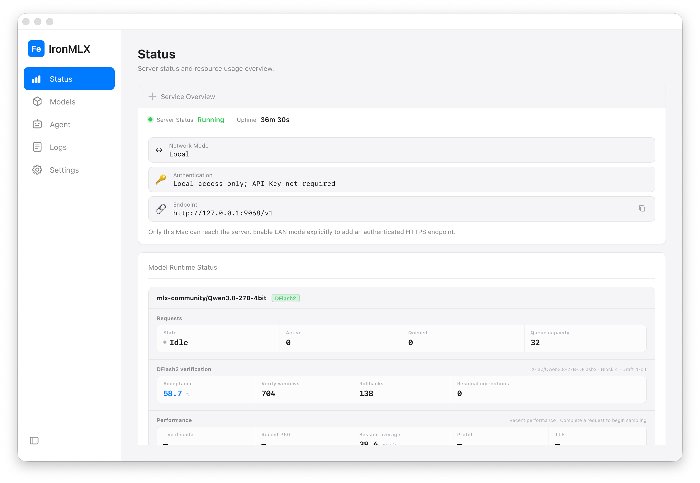

# IronMLX

[简体中文](README.zh-CN.md)

IronMLX is a local large-language-model inference App and service runtime for
Apple Silicon. It packages a Rust inference engine, MLX/Metal runtime, model
management Dashboard, and OpenAI/Anthropic-compatible HTTP APIs into a
self-contained macOS App.

The screenshot shows the local Dashboard with a running server, a loaded model,
and the DFlash2 runtime status. Runtime metrics vary by model and hardware.

Latest public release: [0.1.0-rc.1](https://github.com/apepkuss/ironmlx/releases/tag/v0.1.0-rc.1)

## Requirements

- Apple Silicon (`arm64`); Intel Macs are not supported;
- macOS 26.4 or later;

## Capabilities

- Discover models from Hugging Face and ModelScope with immutable-snapshot
  downloads, resumable transfers, and integrity verification;
- Support multiple model architectures, with coverage continuing to expand; see
  the [Supported model matrix](docs/supported-models.md);
- Provide standardized APIs compatible with mainstream clients, including
  OpenAI-compatible `/v1/chat/completions` and `/v1/responses`, plus Anthropic
  `/v1/messages`, with client-side function-call protocol support;
- Support synchronous responses, SSE streaming, Structured Outputs, and
  reasoning;
- Provide model discovery, health checks, and runtime status APIs, including
  `/healthz` and `/v1/models`;
- Support Agent Harnesses such as Hermes Agent and oh-my-pi, with integration
  coverage continuing to expand; see the
  [Hermes Agent integration guide](docs/hermes-agent.md) and
  [oh-my-pi integration guide](docs/oh-my-pi.md);
- High-throughput inference with continuous batching, paged KV/prefix caching,
  and Prompt Lookup;
- MTP and DFlash2 speculative decoding paths for compatible models;
- Multi-model loading, unloading, pinning, TTL, and memory protection;
- Support LLM/VLM and multimodal inference, depending on the model;
- Local redacted diagnostic export with no prompt, credential, or network upload;
- Document local-data, privacy, and model-rights boundaries;
- Loopback by default, with optional LAN mode using HTTPS and API keys.

## Install and run

Download the current Apple Silicon release candidate from the
[GitHub Release](https://github.com/apepkuss/ironmlx/releases/tag/v0.1.0-rc.1),
open the DMG, drag `IronMLX.app` onto the `Applications` folder shortcut, eject
the disk image, and launch IronMLX from Finder's Applications folder. If you
use the ZIP, extract it first and open the extracted App. Then use the
Dashboard to select and load a compatible model.

For API clients, the App listens on `http://127.0.0.1:9068` by default. See the
[HTTP API quick start](docs/api.md) for a first request.

Developers who need to build and run IronMLX from source should follow the
[Developer Guide](docs/developer-guide.md).

## Documentation

- [User Guide](docs/user-guide.md) — installation, model use, API clients,
  agent integrations, privacy, and troubleshooting.
- [Developer Guide](docs/developer-guide.md) — source builds, tests,
  contributions, architecture, and release validation.
- [Supported model matrix](docs/supported-models.md) — architectures and
  concrete versions recorded for this release candidate.

## License

IronMLX original source code is licensed under the Apache License, Version 2.0;
see [LICENSE](LICENSE) and [NOTICE](NOTICE). Third-party dependencies and
bundled assets remain under their respective licenses, as listed in
`THIRD_PARTY_NOTICES.md` and `THIRD_PARTY_LICENSES/`. Model weights are not
licensed or redistributed by IronMLX; users are responsible for the terms of
the upstream model repository.
