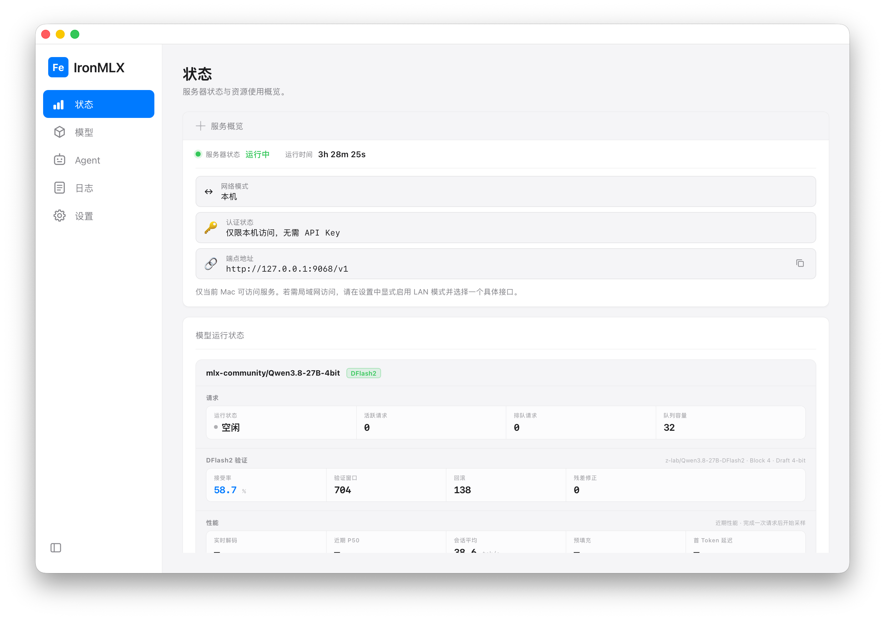

# IronMLX

[English](README.md)

IronMLX 是面向 Apple Silicon 的本地大语言模型推理 App 与服务运行时。它将
Rust 推理引擎、MLX/Metal 运行时、模型管理 Dashboard，以及 OpenAI/Anthropic
兼容 HTTP API 打包为一个自包含的 macOS App。

截图展示了本地 Dashboard、运行中的服务、已加载模型以及 DFlash2 运行状态。
运行时指标会因模型和硬件而变化。

当前公开版本：**0.1.0-rc.1**

这是候选发布版，不是稳定版；产品基础版本为 **0.1.0**。

## 系统要求

- Apple Silicon（arm64）；不支持 Intel Mac；
- macOS 26.4 或更高版本；

## 核心能力

- 本地模型搜索、不可变快照下载、断点续传与完整性校验；
- 多模型加载、卸载、固定、TTL 与内存保护；
- OpenAI `/v1/chat/completions`、`/v1/responses` 和 Anthropic `/v1/messages`，均支持客户端函数工具调用协议；
- 流式输出、连续批处理、分页 KV/前缀缓存、MTP 与 Prompt Lookup；
- Qwen3.8 reasoning/工具调用、匹配的 MTP 与独立 DFlash2 文本执行路径；
- 文本及受控 base64 图片输入；
- 本地脱敏诊断信息导出，不包含 prompt、凭据且不上传网络；
- 默认仅监听 loopback；可选 LAN 模式使用 HTTPS 与 API Key。

## 安装与首次运行

从 [GitHub Release](https://github.com/apepkuss/ironmlx/releases/tag/v0.1.0-rc.1)
下载当前 Apple Silicon 候选版，打开 DMG 或 ZIP 并启动 `IronMLX.app`，然后在
Dashboard 中选择并加载兼容的模型。

App 默认监听 `http://127.0.0.1:9068`。如需发送第一条 API 请求，请参阅
[HTTP API 快速开始](docs/zh-CN/api.md)。

需要从源码构建和运行 IronMLX 的开发者，请参阅[开发者指南](docs/zh-CN/developer-guide.md)。

## 文档

- [用户指南](docs/zh-CN/user-guide.md)：安装、模型使用、API 客户端、Agent 集成、隐私和故障排查；
- [开发者指南](docs/zh-CN/developer-guide.md)：源码构建、测试、贡献、架构和发布验收。
- [支持模型矩阵](docs/zh-CN/supported-models.md)：本候选发布版已记录的模型架构和具体版本。

## 许可证

IronMLX 原创源代码采用 Apache License 2.0，详见 [LICENSE](LICENSE) 和
[NOTICE](NOTICE)。第三方依赖和随 App 打包的资产仍分别受其自身许可证约束，
完整清单见 `THIRD_PARTY_NOTICES.md` 和 `THIRD_PARTY_LICENSES/`。模型权重不由
IronMLX 授权或再分发，用户自行承担上游模型仓库条款责任。
