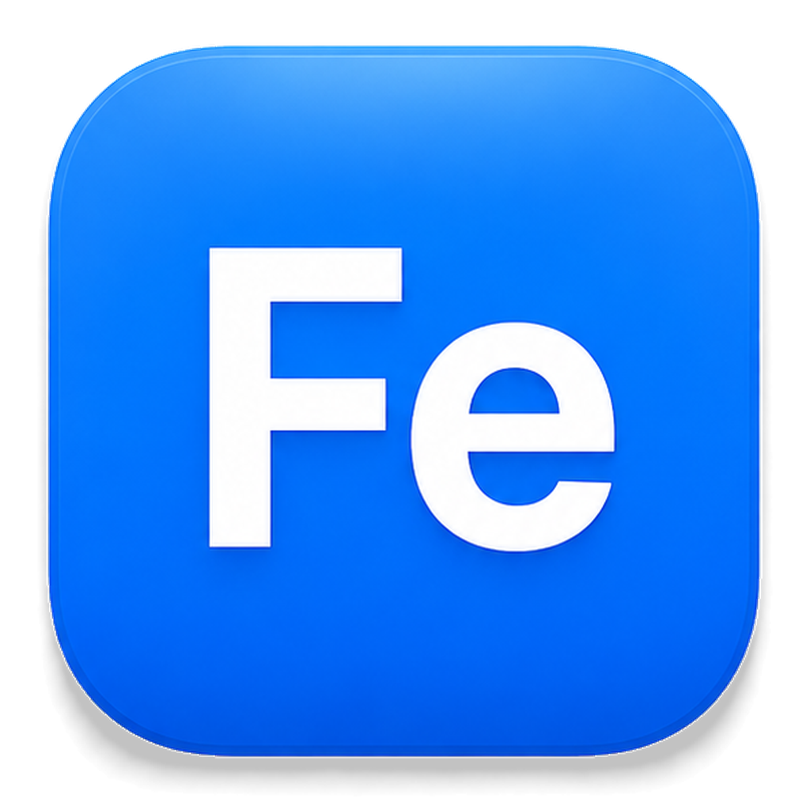

  

<h1 align="center">IronMLX</h1>

  
  
  

  <strong>私享 AI，尽在 Apple Silicon。</strong> 用本地 AI 模型服务你的 Agents。

  <a href="#安装与首次运行">安装</a> ·
  <a href="https://apepkuss.github.io/ironmlx/zh-Hans/docs/supported-models.html">支持的模型</a> ·
  <a href="https://apepkuss.github.io/ironmlx/zh-Hans/docs/api-reference.html">API 参考</a> ·
  <a href="https://apepkuss.github.io/ironmlx/zh-Hans/docs/">文档</a> ·
  <a href="https://apepkuss.github.io/ironmlx/zh-Hans/">官网</a>

  <a href="README.md" lang="en">🇺🇸 English</a> |
  🇨🇳 中文

## 系统要求

- Apple Silicon（arm64）；不支持 Intel Mac；
- macOS 26.4 或更高版本；

## 核心能力

- **图形界面** — 通过 Dashboard 可视化管理模型、查看服务状态与调整配置。

- **Agent 集成** — 支持 [Hermes Agent](docs/zh-CN/hermes-agent.md)、[oh-my-pi](docs/zh-CN/oh-my-pi.md) 和 [DSH CLI / Desktop](docs/zh-CN/dsh.md)。

- **多类模型** — 支持[文本与视觉](docs/zh-CN/text-vision-api.md)、[文本、图片与音频向量](docs/zh-CN/text-embeddings.md)、[语音合成](docs/zh-CN/audio-speech-api.md)、[图片生成](docs/zh-CN/image-generation-api.md)和[决策推理](docs/zh-CN/laya-systemone-api.md)。

- **模型管理** — 从 Hugging Face、ModelScope 下载模型，支持[本地导入](docs/zh-CN/user-guide.md#导入已有模型)与多模型管理。

- **API 兼容** — 兼容 [OpenAI 与 Anthropic API](docs/zh-CN/api-reference.md)，支持流式响应、工具调用协议和结构化输出。

- **推理优化** — 连续批处理与 KV 缓存；兼容模型支持 [MTP、DFlash2 或 Assistant](docs/zh-CN/supported-models.md) 加速。

- **隐私与诊断** — 默认仅本机访问，支持可选的[局域网认证](docs/zh-CN/security-boundary.md)和[本地脱敏诊断导出](docs/zh-CN/diagnostic-bundle.md)。

## 安装与首次运行

1. **下载** — 从 [GitHub Releases](https://github.com/apepkuss/ironmlx/releases) 获取 Apple Silicon 版 DMG 或 ZIP。
2. **安装并启动** — 使用 DMG 时，将 `IronMLX.app` 拖入 `Applications`，等待复制完成，推出磁盘映像，再从 Finder 的“应用程序”中启动；使用 ZIP 时，解压后打开 App。
3. **加载模型** — 在 Dashboard 中下载或导入[兼容模型](docs/zh-CN/supported-models.md)，然后加载。
4. **接入 Agent 或 API（可选）** — 按照 [Agent 配置](docs/zh-CN/user-guide.md#agent-配置)或 [API 快速开始](docs/zh-CN/developer-guide.md#api-快速开始)进行配置。App 默认服务地址为 `http://127.0.0.1:9068`。

> [!TIP]
> 完整配置说明见[用户指南](docs/zh-CN/user-guide.md#安装与启动)。

## 许可证

- **源码** — IronMLX 原创源代码采用 [Apache License 2.0](LICENSE)，版权与归属说明见 [NOTICE](NOTICE)。

- **第三方组件** — 第三方依赖和随 App 打包的资产遵循各自许可证，详见[第三方声明](THIRD_PARTY_NOTICES.md)和[许可证文本](THIRD_PARTY_LICENSES/)。

- **模型权重** — IronMLX 不授权或再分发模型权重；请遵守上游模型仓库的许可证及使用条款。
