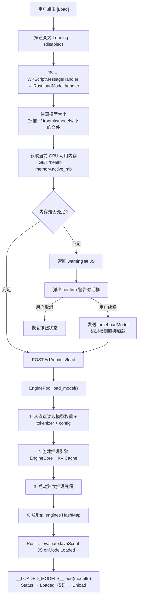
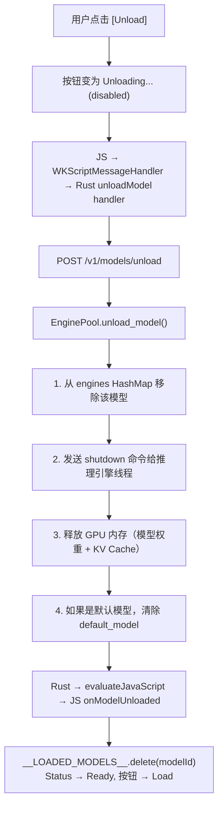
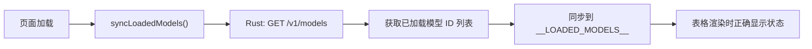

# 模型加载/卸载流程说明

## 加载模型流程

## 卸载模型流程

## 初始化同步

## 关键代码路径

| 组件 | 文件 | 说明 |
|------|------|------|
| 前端 JS | `ironmlx-app/src/dashboard2.html` | toggleModelLoad, loadModel, unloadModel, syncLoadedModels |
| Rust Bridge | `ironmlx-app/src/web_dashboard.rs` | loadModel/forceLoadModel/unloadModel/syncLoadedModels 消息处理 |
| 后端 API | `ironmlx/src/api/models.rs` | POST /v1/models/load, POST /v1/models/unload |
| 引擎池 | `ironmlx/src/engine_pool.rs` | EnginePool.load_model(), EnginePool.unload_model() |

## GPU 内存检测

加载前会进行内存预检：

1. **估算模型大小** — 扫描 `~/.ironmlx/models/` 下模型目录的文件总大小
2. **获取可用内存** — 通过 `/health` API 获取当前 `active_mb`，用总内存减去活跃内存
3. **比较** — 如果模型大小 > 可用内存，弹出警告（但不阻止加载）

注意：Apple Silicon 的统一内存管理较灵活，估算仅作参考。
