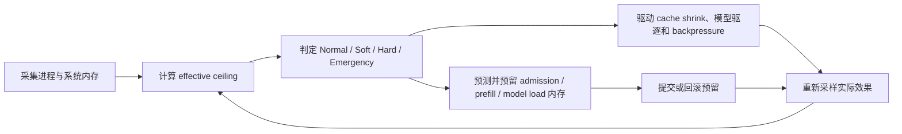

# 进程级动态内存安全闭环

## 概念

“进程级动态内存安全闭环”可以拆成四部分理解：

- **进程级**：统一核算同一 IronMLX 进程里的模型权重、KV、MLX cache、prefix cache、异步 store 队列等内存，而不是只看单个 Scheduler 或 Engine。
- **动态**：安全上限不是固定常量，而是根据 `phys_footprint`、系统 VM 状态和 Metal cap 持续重新计算。
- **内存安全**：在执行 prefill、加载模型等可能产生瞬时峰值的操作前先预测并预留；不安全时缩小任务或拒绝，避免先发生 OOM 再处理。
- **闭环**：压力信号不仅用于展示，还会触发实际动作；动作完成后继续采样，并根据滞回条件逐步恢复。

它与单纯增加内存指标的区别在于：观测结果会实际驱动 admission、prefill、缓存回收和模型生命周期。

## 工作流程



### 1. 持续采样

Governor 综合采集以下权威信号：

- 进程 `phys_footprint`。
- macOS free、active、inactive、wired VM 数据。
- MLX active/cache 使用量。
- Metal memory cap。

任何必要信号失效或采样陈旧时，Governor 采用 fail-safe 行为：暂停新的高风险 admission，而不是假定系统仍然安全。

### 2. 动态计算安全天花板

`effective_ceiling` 取多个约束中最保守的值：

```text
effective_ceiling = min(
    总内存 - 系统安全预留,
    当前占用 + 可用及可回收系统内存,
    Metal cap
)
```

因此，即使静态配置没有变化，系统可用内存或 Metal 限制发生变化时，IronMLX 的安全上限也会随之调整。

### 3. 判定压力水位

- `Normal`：允许正常 admission。
- `Soft`：暂停新的 admission，已有请求谨慎推进。
- `Hard`：加强 cache shrink，并尝试驱逐 idle 模型。
- `Emergency`：最大力度释放可回收资源，对外健康状态变为 `down`。

水位升级需要连续采样确认；Emergency 可以立即进入。恢复必须连续低于 recovery 水位，并按照 Emergency → Hard → Soft → Normal 逐级进行，避免临界点附近反复抖动。

### 4. 高峰操作前进行事务式保护

Prefill 和模型加载等操作遵循以下过程：

```text
预测峰值 → 原子预留 → 执行 → 提交
                       ↘ 失败则自动回滚
```

如果完整 prefill chunk 不安全，Scheduler 会计算更小的安全 chunk；如果最小 chunk 仍然不安全，则返回明确的内存压力错误，不执行已知不安全的操作。

### 5. 压力信号驱动实际动作

根据压力等级，闭环可以协调执行：

- 暂停新请求 admission。
- 清理可回收的 MLX cache。
- 缩小 Active KV hot window。
- 回收全局 prefix hot cache。
- 驱逐未被使用且未固定的模型。
- 对模型加载执行最多一次幂等 reclaim/retry。
- 对异步 SSD store 队列施加容量和 pending-byte backpressure。

动作执行后重新采样实际内存状态。只有内存持续恢复到安全范围，系统才会逐步重新开放 admission 和缓存热窗口。

## 一句话概括

进程级动态内存安全闭环让 IronMLX 持续感知整个进程还剩多少真实安全内存，在高峰操作发生前进行预测和预留，并用压力信号协调调度、缓存和模型生命周期，直到内存恢复后再逐步放开流量。
