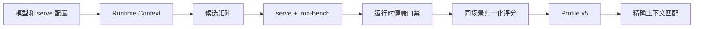

# Scheduler Profile v5

Scheduler profile v5 是显式离线校准机制。它不在请求热路径中自动调参，而是针对一个完整运行时上下文比较候选 scheduler 配置，生成只能由同一上下文加载的 profile。

## 运行边界

- schema version 为 `5`。
- profile store 位于 `~/.ironmlx/scheduler-profiles`，v5 使用独立的 `index-v5.json`；现有 `index.json` 保持不变。
- profile 文件名格式为 `{model}--{hardware}--{selection-profile}--{model-path-hash}--{runtime-context-hash}.json`。
- calibration 的长提示场景会按模型 chat template 计算 token 开销并保留 round-trip 余量，确保 prompt、模板和输出 token 总量不超过 `max_cache_cap`。
- 自动加载必须同时匹配规范化模型路径、hardware label、profile schema 和 runtime context fingerprint。
- 不按模型名回退，不读取旧 schema 默认值，也不跨上下文复用测量结果。
- 显式 CLI scheduler 参数仍可在 profile 加载后覆盖对应值。

## Runtime Context

以下因素会参与上下文指纹，因此任一因素变化都需要重新校准：

| 类别 | 因素 |
|---|---|
| 执行 | scheduler execution model |
| 模型 | architecture、模型内容 fingerprint |
| 权重 | quantization mode、权重 fingerprint |
| speculative | disabled、Qwen MTP、Gemma4 drafter、draft model fingerprint、draft tokens |
| KV | KV quantization、logical KV cap |
| prefix cache | enabled、block size、max pages、LRU/SSD budget |
| Active KV | enabled、resident token cap |
| 内存 | total/model memory limit |

模型 fingerprint 由本地模型配置及权重文件元数据和内容采样生成。draft model 使用独立 fingerprint，避免同名目录被错误复用。

## 默认校准矩阵

未显式传入候选时：

- 普通 decode 与 Gemma4 drafter：`b_max = 1, 2, 4`。
- Qwen MTP：`b_max = 1, 2`，避免把当前不适合的高 batch speculative 路径纳入默认选择。
- `prefill_chunk_size = 1024, 2048`。
- `decode_cadence_mid_chunk_cap = 128, 256`。
- `admission_deadline_ms = 5`，`admission_queue_max = 32`。
- prompt 默认覆盖约 1K、8K 和不超过 logical KV cap 的长上下文。
- concurrency 默认覆盖 `1, 2, 4, 8`。
- prefix cache 关闭时只测 cold；开启时分别测 cold 和 warm。

所有候选必须使用与 runtime context 相同的 `max_cache_cap`。运行顺序按 concurrency 分层并交替反转候选顺序，降低温度和运行顺序偏差。

## 测量与门禁

`iron-bench --format autotune-json` 在 benchmark 前后读取 `/healthz`，导出差量健康信息。以下情况会直接拒绝整个候选：

- benchmark 请求未完成。
- `memory_budget_ok=false` 或 runtime health 非 healthy。
- admission queue full 计数增加。
- memory budget exceeded 计数增加。
- Active KV degraded 或 swap error 计数增加。
- cold 场景观测到 cached tokens。
- speculative context 已启用，但所有测量都没有 draft token。
- 候选缺少其他候选覆盖的场景。

MTP drafted/accepted token、各阶段耗时和 cache commit/restore 数据会写入测量，当前用于路径有效性检查和诊断，不直接改变评分权重。

## 评分与输出

每个 `(prompt_len, max_new_tokens, concurrency, cache_state)` 场景内，先以该场景最优值归一化 TTFT p95、ITL p95、E2E p95 和 throughput，再应用 selection profile 的场景权重。不同 runtime context 的结果不能 merge。

校准产物包括：

- `runtime-context.json`
- `run-order.json`
- 每个 candidate/concurrency/cache-state 的原始 JSON 和日志
- `calibration.json`
- `selection.json` 与 `selection.txt`
- `scheduler-profile.json`

`serve` 和 App 的 profile 生成入口使用同一套 runtime 参数构造上下文。模型 MTP 配置、KV quant、prefix cache、Active KV、内存限制和模型级 max cache cap 都会传入 `scheduler-autotune calibrate`，避免“校准配置”和“实际服务配置”分离。
