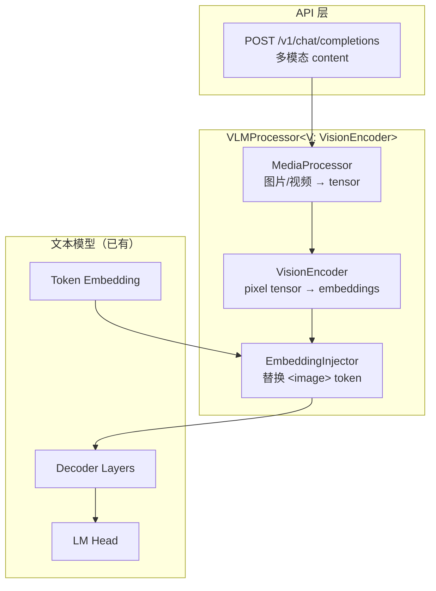
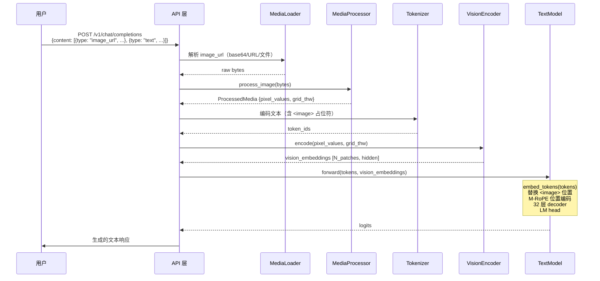
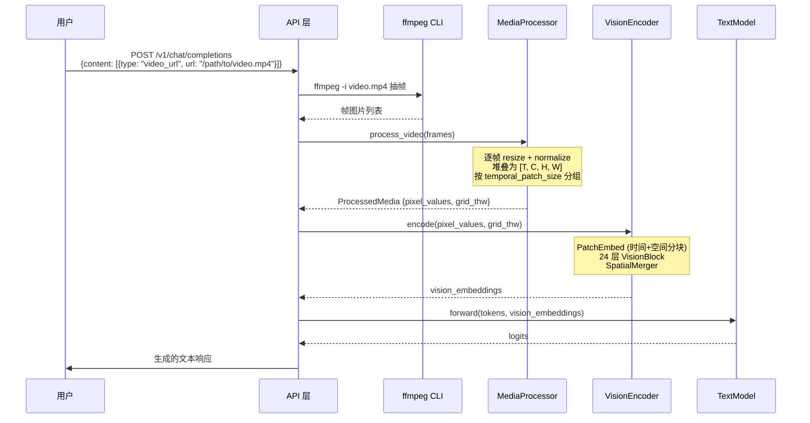
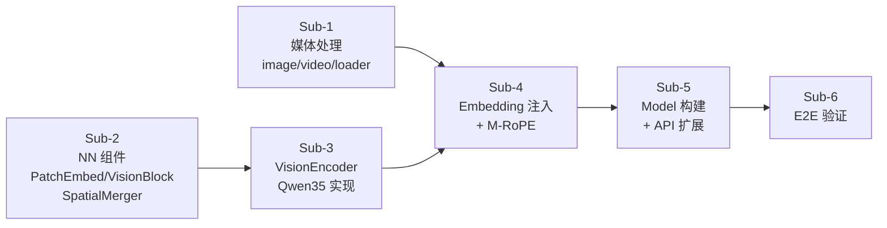

# Qwen3.5 VLM 视觉语言模型设计规格

> 日期：2026-03-17
> 阶段：Phase 9.2
> 范围：完整多模态（图片 + 视频），仅 Qwen3.5-VL 架构
> 方案：Processor trait 抽象（方案 3）

---

## 1. 目标

为 ironmlx 添加 VLM（视觉语言模型）推理能力。用户可通过 API 发送图片、视频和文本，模型返回多模态理解结果。

**成功标准：**
- Qwen3.5-VL-4B-4bit 端到端推理正确
- 支持单图/多图/视频输入
- API 兼容 OpenAI `image_url` 格式（base64 / URL / 本地文件路径）

---

## 2. 架构前提

**已验证的事实：**

1. **Qwen3.5 本身就是多模态模型**：`config.json` 的 `model_type` 为 `"qwen3_5"`，`architectures` 为 `["Qwen3_5ForConditionalGeneration"]`，且包含 `vision_config` 字段。文本骨干使用 GatedDeltaNet + 混合注意力（已在 Phase 9.1 实现）。

2. **Vision tower 权重包含在模型中**：`mlx-community/Qwen3.5-4B-4bit` 的 safetensors 已包含 `vision_tower.*` 前缀的权重（BF16，非量化）。无需额外下载或转换。

3. **model_type 检测策略**：`model_type` 始终为 `"qwen3_5"`，通过检测 `vision_config` 字段区分 VLM 和纯文本。`build_model_from_file()` 中：有 `vision_config` → `Qwen35VLModel`，无 → `Qwen35Model`。

4. **LayerNorm with bias 已存在**：`mlx/src/nn/norm.rs` 中的 `LayerNorm` 已支持 weight + bias，无需新增。

---

## 3. 架构总览



**核心设计决策：Processor trait 抽象**

```rust
/// 视觉编码器 trait
pub trait VisionEncoder: Send + Sync {
    fn encode(
        &self,
        pixel_values: &Array,
        grid_thw: &[(usize, usize, usize)],
        stream: &Stream,
    ) -> Result<Array>;
    fn output_dim(&self) -> usize;
}

/// 媒体处理器 trait
pub trait MediaProcessor: Send + Sync {
    fn process_image(&self, data: &[u8]) -> Result<ProcessedMedia>;
    fn process_video(&self, path: &str) -> Result<ProcessedMedia>;
}

/// 处理后的媒体数据
pub struct ProcessedMedia {
    pub pixel_values: Array,                     // [B, C, H, W]
    pub grid_thw: Vec<(usize, usize, usize)>,   // [(T, H_patches, W_patches)]
}

/// Qwen3.5 VLM 模型 — 组合 VisionEncoder + MediaProcessor + TextModel
pub struct Qwen35VLModel {
    text_model: Qwen35Model,
    vision_encoder: Qwen35VisionEncoder,          // 具体类型
    media_processor: Qwen35MediaProcessor,         // 具体类型
}
// 未来添加新 VLM 架构时，通过 VisionEncoder trait 复用视觉编码逻辑
```

未来添加新 VLM 架构（如 LLaVA、Pixtral）只需实现这两个 trait。

---

## 4. 模块设计

### 4.1 媒体输入处理（`mlx/src/media/`）

**职责：** 将原始图片/视频数据转为归一化 tensor。

```
mlx/src/media/
├── mod.rs           // MediaProcessor trait 定义 + ProcessedMedia
├── image.rs         // 图片处理：解码、缩放、归一化
├── video.rs         // 视频处理：ffmpeg CLI 抽帧
└── loader.rs        // 输入加载：base64 / URL / 文件路径
```

**图片处理流程：**
```
原始输入 → 解码（image crate）→ 缩放到目标分辨率 → 归一化 → MLX Array
```

- 解码：`image` crate 支持 JPEG/PNG/WebP/GIF
- 缩放：双线性插值，目标分辨率由模型配置决定
- 归一化：ImageNet 标准（mean=[0.485, 0.456, 0.406], std=[0.229, 0.224, 0.225]）
- 输出：`[B, C, H, W]` float32

**视频处理流程：**
```
视频文件 → ffmpeg CLI 抽帧 → 逐帧图片处理 → 堆叠为 [T, C, H, W]
```

- 调用 `ffmpeg -i input.mp4 -vf "select=..." -vsync vfr frame_%04d.png` 抽帧
- 帧数由 `temporal_patch_size` 决定（Qwen3.5 默认 2 帧一组）
- 抽帧结果写入临时目录，处理后清理
- 需要用户安装 `ffmpeg` CLI

**输入加载器：**

| 格式 | 识别方式 | 处理 |
|------|---------|------|
| base64 | `data:image/...;base64,` 前缀 | 解码 base64 → bytes |
| URL | `http://` 或 `https://` 前缀 | HTTP GET 下载 → bytes |
| 本地文件 | `file://` 前缀或无前缀路径 | 直接读取文件 |

**依赖：**
- `image` crate（图片解码/缩放）— 新增
- `base64` crate（base64 解码）— 新增
- `reqwest`（HTTP 下载，blocking）— 新增
- `ffmpeg` CLI（视频，运行时依赖）

### 4.2 Vision Encoder（`mlx/src/nn/vision/`）

**职责：** 将预处理后的像素 tensor 编码为语义 embedding。

```
mlx/src/nn/vision/
├── mod.rs               // VisionEncoder trait 定义
├── patch_embed.rs       // PatchEmbed：图像分块 + 线性投影
├── vision_block.rs      // VisionBlock：LayerNorm + Attention + MLP
├── spatial_merger.rs    // SpatialMerger：2×2 patch 合并 + 投影
└── qwen35_vision.rs     // Qwen3.5 具体实现
```

#### 4.2.1 PatchEmbed

将图像切成 patch 并投影到 hidden_dim。

```
输入：[B, C, H, W]  (C=3, H/W = 目标分辨率)
      ↓
Conv3D：kernel=[temporal_patch_size, patch_size, patch_size]
        即 [2, 16, 16]（Qwen3.5 配置）
        in_channels=3, out_channels=hidden_size(1024)
      ↓
输出：[B, num_patches, hidden_size]
      num_patches = T/tp × H/ps × W/ps
```

**Qwen3.5 参数：**
- `patch_size = 16`
- `temporal_patch_size = 2`
- `hidden_size = 1024`（视觉塔）
- `num_position_embeddings = 2304`

**实现：** 由于 mlx-c 没有 Conv3D op，手动实现 3D 卷积：

权重 shape 为 `[1024, 2, 16, 16, 3]`，即 `[out_ch, t_kernel, h_kernel, w_kernel, in_ch]`。

```rust
// 步骤 1：将 5D 权重分解为 temporal_patch_size 个 2D 卷积核
// weight: [1024, 2, 16, 16, 3] → 沿 dim=1 split
// w_t0: [1024, 16, 16, 3]  — 第 0 帧的 2D 卷积核
// w_t1: [1024, 16, 16, 3]  — 第 1 帧的 2D 卷积核

// 步骤 2：对每帧独立做 2D 卷积
// 输入 pixels: [B*T, 3, H, W] → 按帧分组为 [B, T, 3, H, W]
// frame_0 = pixels[:, 0, :, :, :]  → Conv2D with w_t0 → [B, 1024, H/16, W/16]
// frame_1 = pixels[:, 1, :, :, :]  → Conv2D with w_t1 → [B, 1024, H/16, W/16]

// 步骤 3：合并时间维度
// output = frame_0 + frame_1  (逐元素相加)
// → [B, 1024, H/16, W/16]
// → reshape 为 [B, num_patches, 1024]

// 步骤 4：加 bias
// output += bias  (broadcast [1024])
```

对于 Conv2D，同样由于 mlx-c 无原生支持，使用 `im2col + matmul` 实现：
- `im2col`：将每个 16×16 patch 展开为向量 `[16*16*3]`
- `matmul`：与权重 `[1024, 16*16*3]` 相乘
- 等价于 stride=16 的 2D 卷积

**位置编码：**
- 使用可学习的 `pos_embed.weight`：`[2304, 1024]`
- 根据 grid_thw 计算 2D 位置索引，通过 gather 获取对应的位置 embedding
- 加到 patch embedding 上

#### 4.2.2 VisionBlock

标准 ViT 编码器块，24 层。

```
x → LayerNorm → MultiheadAttention → + → LayerNorm → MLP → +
  └──────────────────────────────────┘  └──────────────────┘
```

**注意力：**
- 全局注意力（非因果），支持可选 padding mask
- `num_heads = 16`，`head_dim = 64`
- 合并的 QKV 投影：`qkv`（`[3072, 1024]`）→ split 为 Q/K/V
- 输出投影：`proj`（`[1024, 1024]`）
- 使用 bias

**MLP：**
- `linear_fc1`：`[4096, 1024]`（含 bias）— GELU 激活（`gelu_pytorch_tanh`）
- `linear_fc2`：`[1024, 4096]`（含 bias）

**归一化：**
- LayerNorm（非 RMSNorm），含 weight + bias

#### 4.2.3 SpatialMerger

将 2×2 相邻 patch 合并为 1 个，降低序列长度 4 倍。

```
输入：[B, H×W, 1024]  (例 32×32 = 1024 patches)
      ↓
重排：将 [H, W] 按 2×2 窗口分组
      [B, H/2, 2, W/2, 2, 1024] → [B, H/2×W/2, 4×1024]
      ↓
LayerNorm：归一化合并后的特征
      ↓
MLP：[4×1024, out_hidden_size]  两层（fc1 → fc2）
      fc1: [4096, 4096]（含 bias）
      fc2: [2560, 4096]（含 bias）
      ↓
输出：[B, H/2×W/2, 2560]  (投影到 LM hidden_size)
```

**Qwen3.5 参数：**
- `spatial_merge_size = 2`
- `hidden_size = 1024`（视觉塔）
- `out_hidden_size = 2560`（LM hidden_size）

#### 4.2.4 Qwen35VisionEncoder

组合 PatchEmbed + 24 个 VisionBlock + SpatialMerger。

```rust
pub struct Qwen35VisionEncoder {
    patch_embed: PatchEmbed,
    pos_embed: Array,                // [2304, 1024]
    blocks: Vec<VisionBlock>,        // 24 层
    merger: SpatialMerger,
}

impl VisionEncoder for Qwen35VisionEncoder {
    fn encode(&self, pixel_values: &Array, grid_thw: &[...], stream: &Stream) -> Result<Array> {
        // 1. Patch embedding + 位置编码
        let h = self.patch_embed.forward(pixel_values, stream)?;
        let pos = self.compute_position_ids(grid_thw, stream)?;
        let h = ops::add(&h, &pos, stream)?;

        // 2. 24 层 VisionBlock
        for block in &self.blocks {
            h = block.forward(&h, None, stream)?;
        }

        // 3. SpatialMerger（2×2 合并 + 投影到 LM dim）
        let h = self.merger.forward(&h, grid_thw, stream)?;

        Ok(h)  // [B, num_merged_patches, out_hidden_size]
    }

    fn output_dim(&self) -> usize { 2560 }
}
```

**权重前缀：** `vision_tower.`

### 4.3 Embedding 注入（`mlx/src/model/`）

**职责：** 将视觉 embedding 插入文本 token 序列中 `<image>` / `<video>` 占位符的位置。

**流程：**
```
1. 文本 token 序列：[BOS, "What", "is", , , ..., , "?"]
2. 文本 embedding：embed_tokens(tokens) → [B, L, hidden]
3. 视觉 embedding：vision_encoder.encode(pixels) → [B, N_patches, hidden]
4. 替换：找到  token 位置，用视觉 embedding 逐个替换
5. 结果：merged_embeddings [B, L', hidden]
```

**特殊 token ID（来自 config.json）：**
- `image_token_id = 248056`
- `video_token_id = 248057`
- `vision_start_token_id = 248053`
- `vision_end_token_id = 248054`

**实现位置：** 在 `Qwen35Model::forward()` 中增加 `input_embeddings: Option<&Array>` 参数。当提供 `input_embeddings` 时，跳过 `embed_tokens`，直接使用注入后的 embedding。

### 4.4 M-RoPE 多模态位置编码（`mlx/src/nn/attention.rs`）

**职责：** 为图像 token 和文本 token 分配不同的位置编码。

**工作原理：**

Qwen3.5 的 `rope_parameters` 包含 `mrope_section: [11, 11, 10]`，含义：
- RoPE 的旋转维度被分为 3 段：高度（11维）、宽度（11维）、时间（10维）
- 图像 token：高度/宽度维度用 2D 网格坐标，时间维度用帧索引
- 文本 token：三段都用相同的 1D 序列位置

**位置 ID 计算：**
```
文本 token 位置 ID：[pos, pos, pos]  (三段相同)
图像 token 位置 ID：[row, col, frame] (三段独立)

例如 2×2 patch 网格：
  patch(0,0) → [0, 0, 0]
  patch(0,1) → [0, 1, 0]
  patch(1,0) → [1, 0, 0]
  patch(1,1) → [1, 1, 0]
```

**实现方式：**

`fast::rope()` 只支持标量 offset，无法直接实现 M-RoPE。需要手动实现：

```rust
fn apply_mrope(
    x: &Array,                       // [B, n_heads, L, head_dim]
    position_ids: &Array,            // [3, L] — 三段位置 ID
    mrope_section: &[usize; 3],      // [11, 11, 10] — 每段维度数
    rope_base: f32,
    stream: &Stream,
) -> Result<Array> {
    // 将 head_dim 分为 3 段（每段 * 2 因为 cos/sin 成对）
    // section_dims = [22, 22, 20] (11*2, 11*2, 10*2)
    let section_dims: Vec<usize> = mrope_section.iter().map(|s| s * 2).collect();

    // 沿 head_dim 轴 split 为 3 段
    let x_sections = split_along_last_axis(x, &section_dims, stream)?;

    // 对每段分别应用 rope，使用各自的 position_ids
    let mut results = Vec::new();
    for (i, x_sec) in x_sections.iter().enumerate() {
        let pos = slice_row(position_ids, i, stream)?;  // [L]
        let rotated = apply_rope_with_positions(x_sec, &pos, rope_base, stream)?;
        results.push(rotated);
    }

    // 剩余维度（如果 head_dim > sum(section_dims)）直接传过
    // 拼接所有段
    concatenate_along_last_axis(&results, stream)
}
```

- 新增 `apply_rope_with_positions()` — 对单段维度应用 RoPE，接受 position array 而非 scalar offset
- 新增 `compute_mrope_position_ids()` — 根据 grid_thw 和 token 类型计算 `[3, L]` 位置 ID
- 仅 VLM 模式使用 M-RoPE，纯文本模式保持现有 `fast::rope()` + partial RoPE 不变
- 在 `Qwen35Attention::forward_with_cache()` 中增加 `position_ids: Option<&Array>` 参数，有值时走 M-RoPE 路径

### 4.5 API 扩展（`ironmlx/src/api/`）

**职责：** 扩展 OpenAI 兼容 API 以支持多模态输入。

**ChatMessage 多模态 content：**

```rust
/// 消息内容 — 可以是纯文本或多模态内容块列表
#[derive(Debug, Deserialize, Serialize, Clone)]
#[serde(untagged)]
pub enum MessageContent {
    /// 纯文本（向后兼容）
    Text(String),
    /// 多模态内容块列表
    Parts(Vec<ContentPart>),
}

#[derive(Debug, Deserialize, Serialize, Clone)]
#[serde(tag = "type")]
pub enum ContentPart {
    #[serde(rename = "text")]
    Text { text: String },
    #[serde(rename = "image_url")]
    ImageUrl { image_url: ImageUrlContent },
    #[serde(rename = "video_url")]
    VideoUrl { video_url: VideoUrlContent },
}

#[derive(Debug, Deserialize, Serialize, Clone)]
pub struct ImageUrlContent {
    pub url: String,  // base64 / http(s) URL / 本地路径
}

#[derive(Debug, Deserialize, Serialize, Clone)]
pub struct VideoUrlContent {
    pub url: String,  // 本地路径 或 URL
}
```

**ChatMessage 修改：**
```rust
pub struct ChatMessage {
    pub role: String,
    pub content: MessageContent,  // 从 String 改为 MessageContent
}
```

**向后兼容：** `#[serde(untagged)]` 确保纯文本 `"content": "hello"` 和多模态 `"content": [{"type": "text", ...}]` 都能正确反序列化。

**变更级联：**

`ChatMessage.content` 从 `String` 改为 `MessageContent` 会影响以下位置：

1. `ironmlx/src/api/types.rs` — `ChatMessage` 结构体定义
2. `ironmlx/src/api/models.rs` — `ChatMessage` → `CoreChatMessage` 转换逻辑（当前直接 clone `m.content`）
3. `mlx/src/generate/chat_template.rs` — `CoreChatMessage.content` 也需要从 `String` 改为 `MessageContent`，chat template 渲染时提取纯文本部分

处理策略：在 API 层将 `MessageContent` 拆分为文本和媒体两部分：

```rust
// API handler 中
let (text_content, media_items) = extract_content_parts(&msg.content);
// text_content: String（传给 chat template）
// media_items: Vec<MediaItem>（传给 vision encoder）
```

这样 `CoreChatMessage` 和 chat template 仍使用 `String`，仅 API 层处理多模态拆分。

### 4.6 Model 枚举扩展

**新增 VLM 变体：**

```rust
pub enum Model {
    Standard(LlamaModel),
    Qwen35(Qwen35Model),
    Qwen35VL(Qwen35VLModel),  // 新增
}

pub struct Qwen35VLModel {
    pub text_model: Qwen35Model,
    pub vision_encoder: Qwen35VisionEncoder,
    pub media_processor: Qwen35MediaProcessor,
}
```

**forward 签名策略：**

不修改现有 `Model::forward()` 签名（避免波及 `BatchGenerator`、`LlamaModel` 等）。改为在 `Qwen35VLModel` 上提供独立的 VLM 前向方法：

```rust
impl Qwen35VLModel {
    /// VLM 前向：先编码视觉 → 注入 embedding → 调用文本模型
    pub fn forward_vlm(
        &self,
        tokens: &Array,
        media: Option<&[ProcessedMedia]>,
        cache: &mut [(Option<Array>, Option<Array>)],
    ) -> Result<Array> {
        if let Some(media) = media {
            let vision_embs = self.vision_encoder.encode(...)?;
            let merged = self.inject_embeddings(tokens, &vision_embs)?;
            self.text_model.forward_with_embeddings(&merged, cache)
        } else {
            self.text_model.forward(tokens, cache, "causal", None)
        }
    }
}
```

`Model` 枚举的 `forward()` 保持 4 参数不变。VLM 路径通过 `Model::forward_vlm()` 分发：

```rust
impl Model {
    // 现有签名不变
    pub fn forward(&self, tokens, cache, mask_mode, mask) -> Result<Array>;

    // 新增：VLM 专用，仅 Qwen35VL 变体有效
    pub fn forward_vlm(&self, tokens, media, cache) -> Result<Array> {
        match self {
            Model::Qwen35VL(m) => m.forward_vlm(tokens, media, cache),
            _ => self.forward(tokens, cache, "causal", None),  // 忽略 media
        }
    }
}
```

**变更级联：**

- `BatchGenerator` 和 `stream_generate`：纯文本路径不变
- `EngineCore`：检测到 VLM 模型 + 媒体输入时调用 `forward_vlm`
- `Qwen35Model`：新增 `forward_with_embeddings(&self, embeddings, cache)` — 跳过 `embed_tokens`

**build_model_from_file 扩展：**

- 检测 config.json 中是否存在 `vision_config` 字段
- 有 → 构建 `Qwen35VLModel`（加载 vision_tower 权重）
- 无 → 构建 `Qwen35Model`（现有逻辑不变）

---

## 5. 数据流

### 5.1 图片推理完整流程



### 5.2 视频推理流程



---

## 6. 权重结构

Qwen3.5-VL safetensors 中的权重前缀：

```
vision_tower.patch_embed.proj.weight      [1024, 2, 16, 16, 3]  Conv3D
vision_tower.patch_embed.proj.bias        [1024]
vision_tower.pos_embed.weight             [2304, 1024]           位置编码
vision_tower.blocks.{i}.attn.qkv.weight   [3072, 1024]          QKV 合并投影
vision_tower.blocks.{i}.attn.qkv.bias     [3072]
vision_tower.blocks.{i}.attn.proj.weight  [1024, 1024]          输出投影
vision_tower.blocks.{i}.attn.proj.bias    [1024]
vision_tower.blocks.{i}.norm1.weight      [1024]                LayerNorm
vision_tower.blocks.{i}.norm1.bias        [1024]
vision_tower.blocks.{i}.norm2.weight      [1024]
vision_tower.blocks.{i}.norm2.bias        [1024]
vision_tower.blocks.{i}.mlp.linear_fc1.weight  [4096, 1024]
vision_tower.blocks.{i}.mlp.linear_fc1.bias    [4096]
vision_tower.blocks.{i}.mlp.linear_fc2.weight  [1024, 4096]
vision_tower.blocks.{i}.mlp.linear_fc2.bias    [1024]
vision_tower.merger.norm.weight           [1024]                Merger LayerNorm
vision_tower.merger.norm.bias             [1024]
vision_tower.merger.linear_fc1.weight     [4096, 4096]          Merger MLP
vision_tower.merger.linear_fc1.bias       [4096]
vision_tower.merger.linear_fc2.weight     [2560, 4096]
vision_tower.merger.linear_fc2.bias       [2560]
```

**注意：** 视觉塔权重通常为 BF16（非量化），文本模型权重为 4bit 量化。

**VisionConfig 结构体：**

```rust
#[derive(Debug, Deserialize)]
pub struct VisionConfig {
    pub hidden_size: usize,             // 1024
    pub num_heads: usize,               // 16
    pub depth: usize,                   // 24（VisionBlock 层数）
    pub patch_size: usize,              // 16
    pub temporal_patch_size: usize,     // 2
    pub spatial_merge_size: usize,      // 2
    pub in_channels: usize,            // 3
    pub intermediate_size: usize,       // 4096
    pub out_hidden_size: usize,         // 2560（投影到 LM dim）
    pub num_position_embeddings: usize, // 2304
    pub hidden_act: String,             // "gelu_pytorch_tanh"
}
```

`Qwen35Config` 新增字段：

```rust
pub struct Qwen35Config {
    // ...现有字段...
    pub vision_config: Option<VisionConfig>,  // 新增
    pub image_token_id: Option<i64>,          // 248056
    pub video_token_id: Option<i64>,          // 248057
    pub vision_start_token_id: Option<i64>,   // 248053
    pub vision_end_token_id: Option<i64>,     // 248054
}
```

---

## 7. Qwen35MediaProcessor 实现

**Qwen3.5 特有的图像预处理参数：**

```rust
pub struct Qwen35MediaProcessor {
    pub image_size: usize,           // 目标图像尺寸（从 config 推导）
    pub patch_size: usize,           // 16
    pub temporal_patch_size: usize,  // 2
    pub spatial_merge_size: usize,   // 2
    pub mean: [f32; 3],              // [0.485, 0.456, 0.406]
    pub std: [f32; 3],               // [0.229, 0.224, 0.225]
}
```

**图像尺寸策略：**
- Qwen3.5-VL 支持动态分辨率，输入图像不必缩放到固定尺寸
- 图像尺寸需要是 `patch_size × spatial_merge_size = 32` 的倍数
- 限制最大 token 数（避免显存溢出）
- 最小/最大分辨率由配置控制

**grid_thw 计算：**
```rust
fn compute_grid_thw(&self, height: usize, width: usize, is_video: bool, num_frames: usize) -> (usize, usize, usize) {
    let t = if is_video { num_frames / self.temporal_patch_size } else { 1 };
    let h = height / self.patch_size / self.spatial_merge_size;
    let w = width / self.patch_size / self.spatial_merge_size;
    (t, h, w)
}
```

---

## 8. 新增依赖

| crate | 用途 | 可选 |
|-------|------|------|
| `image` | 图片解码、缩放 | 必需 |
| `base64` | base64 解码 | 必需 |
| `reqwest` (blocking) | HTTP 下载图片/视频 URL | 必需 |
| `tempfile` | 视频抽帧临时目录 | 必需 |
| `ffmpeg` CLI | 视频抽帧 | 运行时（仅视频） |

---

## 9. 文件变更清单

### 新增文件

```
mlx/src/media/mod.rs                  // MediaProcessor trait + ProcessedMedia
mlx/src/media/image.rs                // 图片处理
mlx/src/media/video.rs                // 视频处理（ffmpeg CLI）
mlx/src/media/loader.rs               // 输入加载（base64/URL/文件）
mlx/src/nn/vision/mod.rs              // VisionEncoder trait
mlx/src/nn/vision/patch_embed.rs      // PatchEmbed
mlx/src/nn/vision/vision_block.rs     // VisionBlock
mlx/src/nn/vision/spatial_merger.rs   // SpatialMerger
mlx/src/nn/vision/qwen35_vision.rs   // Qwen35VisionEncoder
mlx/src/model/qwen35_vl.rs           // Qwen35VLModel
```

### 修改文件

```
mlx/src/lib.rs                        // 新增 pub mod media
mlx/src/nn/mod.rs                     // 新增 pub mod vision
mlx/src/model/mod.rs                  // Model 枚举新增 Qwen35VL 变体
mlx/src/model/config.rs               // 新增 VisionConfig 解析（见下方）
mlx/src/model/qwen35.rs               // forward() 新增 input_embeddings 参数
ironmlx/src/api/types.rs              // ChatMessage.content → MessageContent
ironmlx/src/api/models.rs             // 处理多模态请求
ironmlx/src/engine.rs                 // 引擎支持 VLM 推理
Cargo.toml                            // 新增 image, base64, reqwest, tempfile
```

---

## 10. 测试策略

| 层级 | 测试内容 | 方式 |
|------|---------|------|
| 单元 | MediaProcessor 图片解码/归一化 | 用测试图片验证输出 shape 和值范围 |
| 单元 | PatchEmbed 输出 shape | 构造固定输入验证 |
| 单元 | SpatialMerger 2×2 合并 | 验证序列长度缩减 4 倍 |
| 单元 | M-RoPE 位置 ID 计算 | 对比 Python 参考输出 |
| 集成 | VisionEncoder 端到端 | 加载权重，输入测试图片，验证输出 shape |
| 集成 | API 多模态请求解析 | serde 反序列化测试 |
| E2E | Qwen3.5-VL-4B-4bit 推理 | 发送图片 + 文本，验证输出有意义 |

---

## 11. 实施顺序



**6 个子任务，建议分 3 批执行：**

| 批次 | 子任务 | 依赖 |
|------|--------|------|
| 批次 1（并行） | Sub-1 媒体处理 + Sub-2 NN 组件 | 无 |
| 批次 2（并行） | Sub-3 VisionEncoder + Sub-4 Embedding 注入 | 批次 1 |
| 批次 3（顺序） | Sub-5 Model 构建 → Sub-6 E2E 验证 | 批次 2 |
