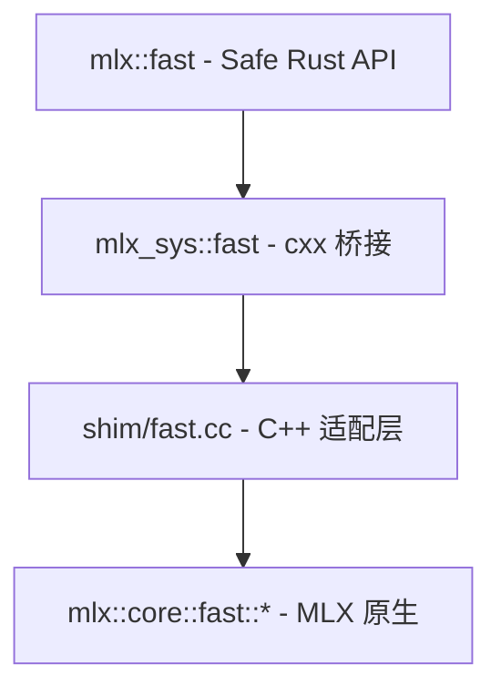

# cxx-mlx P2b · Fast Ops 设计文档

**日期**: 2026-05-04
**状态**: 已批准，待实施
**前置**: P0 / P1a / P1b1 / P1b2a / P1b2b / P2a 已完成
**作者**: 通过 brainstorming 与 Boss 协作产出

## 目标

为 `mlx::core::fast::*` 命名空间下的四类融合算子提供安全 Rust 绑定：

1. **`rms_norm`** — Root-mean-square normalization（LLaMA / Mistral 等模型用）
2. **`layer_norm`** — 经典 layer normalization（GPT-2 / BERT 等用）
3. **`rope`** — Rotary Position Embedding，含两种 offset 形态：
   - `int offset` — 单流 decode / 固定上下文 prefill
   - `array offset` — 变长批量推理（每条序列独立偏移）
4. **`scaled_dot_product_attention`** — 融合 SDPA，支持 causal / chunked_causal / 自定义 mask / sinks

这些是 LLM/VLM 推理的性能关键路径（融合 Metal kernel，非组合原语），必须直接桥接而非用 ops 拼装。

## 非目标

- `metal_kernel` / `cuda_kernel` / `precompiled_cuda_kernel`（自定义 kernel，需要 `std::function` / `std::variant` 桥接，复杂度高，独立子任务，留待后续）
- 训练相关（grad/vjp，全项目非目标）

## 架构总览

延续 P0–P2a 已确立的三层结构，`fast` 模块在三层各自落地：



### 各层职责

| 层 | 职责 | 文件 |
|----|------|------|
| **Shim (C++)** | 把 cxx 不能直接表达的 MLX C++ 特性（`std::optional` / 重载 / 默认参数 / `std::string`）抹平为 cxx 友好的 free function | `mlx-sys/shim/include/cxx_mlx_shim/fast.h`, `mlx-sys/shim/src/fast.cc` |
| **Bridge (cxx::bridge)** | 用 cxx DSL 声明 ABI 边界，build 时生成双侧胶水代码（自动捕获 C++ 异常 → `Result`） | `mlx-sys/src/bridge/fast.rs` |
| **Safe (Rust)** | Rust 风格 API：`Option<&Array>` / `Option<f32>` / `Result<Array>`；封装 unsafe 调用；裸指针生命周期由借用语义钉住 | `mlx/src/fast.rs` |

### 关键约束

- **不接受 stream 参数**：与 `mlx::ops` 现有所有算子一致，依赖 `set_default_stream` 全局控制（callsite 不再嵌套 stream 参数）
- **可选 array** 全部 Rust 端 `Option<&Array>` → FFI 端 `*const MlxArray`（nullptr=None） → C++ 端 `std::optional<array>`
- **可选 float** 用 `(bool has_value, f32 value)` 双参编码（cxx 不支持 `Option<f32>`）
- **可选 string**：使用空字符串 `""` 表示「未提供」（MLX `mask_mode` 默认值就是 `""`，语义对齐）

## Shim 层设计（`fast.h` + `fast.cc`）

### `cxx_mlx_shim/fast.h`

```cpp
#pragma once

#include <cstdint>
#include <memory>

#include "mlx/array.h"
#include "rust/cxx.h"

namespace cxx_mlx {

using MlxArray = mlx::core::array;

// rms_norm: weight=nullptr → std::nullopt
std::unique_ptr<MlxArray> fast_rms_norm(
    const MlxArray& x,
    const MlxArray* weight,
    float eps);

// layer_norm: weight=nullptr → no weight, bias=nullptr → no bias
std::unique_ptr<MlxArray> fast_layer_norm(
    const MlxArray& x,
    const MlxArray* weight,
    const MlxArray* bias,
    float eps);

// rope (int offset)
//   has_base=false → std::nullopt (MLX 内部回落到默认 base 处理逻辑)
//   freqs=nullptr → std::nullopt
std::unique_ptr<MlxArray> fast_rope(
    const MlxArray& x,
    int32_t dims,
    bool traditional,
    bool has_base,
    float base,
    float scale,
    int32_t offset,
    const MlxArray* freqs);

// rope (array offset) — 同上 base/freqs 处理；offset 改为引用 array
std::unique_ptr<MlxArray> fast_rope_with_array_offset(
    const MlxArray& x,
    int32_t dims,
    bool traditional,
    bool has_base,
    float base,
    float scale,
    const MlxArray& offset,
    const MlxArray* freqs);

// scaled_dot_product_attention
//   mask_mode: rust::Str → std::string  ("" 等价 MLX 默认值)
//   mask_arr=nullptr → std::nullopt
//   sinks=nullptr → std::nullopt
std::unique_ptr<MlxArray> fast_scaled_dot_product_attention(
    const MlxArray& queries,
    const MlxArray& keys,
    const MlxArray& values,
    float scale,
    rust::Str mask_mode,
    const MlxArray* mask_arr,
    const MlxArray* sinks);

}  // namespace cxx_mlx
```

### `shim/src/fast.cc`（关键模式）

```cpp
#include "cxx_mlx_shim/fast.h"
#include "mlx/fast.h"

namespace cxx_mlx {

namespace {
// pointer → optional<array>。array 拷贝廉价（refcount on array_desc_）。
inline std::optional<mlx::core::array> opt_arr(const MlxArray* p) {
  return p ? std::optional<mlx::core::array>(*p) : std::nullopt;
}

inline std::optional<float> opt_f(bool has, float v) {
  return has ? std::optional<float>(v) : std::nullopt;
}
}  // namespace

std::unique_ptr<MlxArray> fast_rms_norm(
    const MlxArray& x, const MlxArray* weight, float eps) {
  return std::make_unique<MlxArray>(
      mlx::core::fast::rms_norm(x, opt_arr(weight), eps));
}

std::unique_ptr<MlxArray> fast_layer_norm(
    const MlxArray& x, const MlxArray* weight, const MlxArray* bias, float eps) {
  return std::make_unique<MlxArray>(
      mlx::core::fast::layer_norm(x, opt_arr(weight), opt_arr(bias), eps));
}

std::unique_ptr<MlxArray> fast_rope(
    const MlxArray& x, int32_t dims, bool traditional,
    bool has_base, float base, float scale, int32_t offset,
    const MlxArray* freqs) {
  return std::make_unique<MlxArray>(
      mlx::core::fast::rope(
          x, dims, traditional, opt_f(has_base, base), scale, offset,
          opt_arr(freqs)));
}

std::unique_ptr<MlxArray> fast_rope_with_array_offset(
    const MlxArray& x, int32_t dims, bool traditional,
    bool has_base, float base, float scale, const MlxArray& offset,
    const MlxArray* freqs) {
  return std::make_unique<MlxArray>(
      mlx::core::fast::rope(
          x, dims, traditional, opt_f(has_base, base), scale, offset,
          opt_arr(freqs)));
}

std::unique_ptr<MlxArray> fast_scaled_dot_product_attention(
    const MlxArray& queries, const MlxArray& keys, const MlxArray& values,
    float scale, rust::Str mask_mode,
    const MlxArray* mask_arr, const MlxArray* sinks) {
  return std::make_unique<MlxArray>(
      mlx::core::fast::scaled_dot_product_attention(
          queries, keys, values, scale,
          std::string(mask_mode),
          opt_arr(mask_arr),
          opt_arr(sinks)));
}

}  // namespace cxx_mlx
```

### Shim 层设计要点

| 问题 | 处理 |
|------|------|
| `std::optional<array>` cxx 不支持 | shim 收 `*const MlxArray`，nullptr→nullopt；非空时 `*p` 廉价拷贝（共享 array_desc_） |
| `std::optional<float>` cxx 不支持 | `bool has_value + float value` 双参；shim 内部 `opt_f()` 助手组装 |
| `std::string` 入参 cxx 通过 `rust::Str` 对接 | shim 端 `std::string(mask_mode)` 拷贝（一次小字符串构造，可忽略） |
| MLX 抛异常 | shim **不** try/catch，让异常传播给 cxx；cxx 桥接 `Result<>` 自动捕获并转 Rust 错误 |
| 裸指针生命周期 | shim 仅在调用期立即解引用，不存储；安全契约由 Rust 端 `&Array` 借用语义保证 |
| 两个 rope 重载 | shim 两个不同名字 free function（`fast_rope` / `fast_rope_with_array_offset`）；C++ 端调用 MLX 同名重载，由参数类型决定 |

## Bridge 层设计（`mlx-sys/src/bridge/fast.rs`）

```rust
//! Bridge for MLX fast ops (fused Transformer kernels).
//!
//! Optional `array` arguments use raw `*const MlxArray` — same convention
//! as `async_eval_many` in the stream bridge. nullptr maps to MLX's
//! `std::optional<array>{std::nullopt}`. The Rust-side safe wrapper
//! converts `Option<&Array>` to a raw pointer at call time.
//!
//! Optional `float` arguments (rope's `base`) are encoded as a
//! `bool has_base` + `f32 base` pair to avoid raw float pointers across
//! cxx (which doesn't model `Option<f32>` directly).

#[allow(clippy::missing_safety_doc)]
#[cxx::bridge(namespace = "cxx_mlx")]
pub mod ffi {
    unsafe extern "C++" {
        include!("cxx_mlx_shim/fast.h");

        type MlxArray = crate::bridge::array::ffi::MlxArray;

        unsafe fn fast_rms_norm(
            x: &MlxArray,
            weight: *const MlxArray,
            eps: f32,
        ) -> Result<UniquePtr<MlxArray>>;

        unsafe fn fast_layer_norm(
            x: &MlxArray,
            weight: *const MlxArray,
            bias: *const MlxArray,
            eps: f32,
        ) -> Result<UniquePtr<MlxArray>>;

        unsafe fn fast_rope(
            x: &MlxArray,
            dims: i32,
            traditional: bool,
            has_base: bool,
            base: f32,
            scale: f32,
            offset: i32,
            freqs: *const MlxArray,
        ) -> Result<UniquePtr<MlxArray>>;

        unsafe fn fast_rope_with_array_offset(
            x: &MlxArray,
            dims: i32,
            traditional: bool,
            has_base: bool,
            base: f32,
            scale: f32,
            offset: &MlxArray,
            freqs: *const MlxArray,
        ) -> Result<UniquePtr<MlxArray>>;

        unsafe fn fast_scaled_dot_product_attention(
            queries: &MlxArray,
            keys: &MlxArray,
            values: &MlxArray,
            scale: f32,
            mask_mode: &str,
            mask_arr: *const MlxArray,
            sinks: *const MlxArray,
        ) -> Result<UniquePtr<MlxArray>>;
    }
}
```

### Bridge 层设计要点

| 项 | 说明 |
|----|------|
| 全部 `unsafe fn` | cxx 1.0：含原始指针的 `extern "C++"` 函数签名必须 `unsafe`；封装 `unsafe` 由安全层完成 |
| 跨桥接共享 `MlxArray` | `type MlxArray = crate::bridge::array::ffi::MlxArray;`（与 `transforms.rs` / `stream.rs` 同一写法） |
| `Result<UniquePtr<MlxArray>>` | cxx 自动捕获 MLX 抛出的 `std::exception`，转为 `cxx::Exception`；安全层 `.map_err(Error::from)` 转 `mlx::Error::Mlx` |
| `mask_mode: &str` | cxx 支持 `rust::Str` ↔ `&str` 零拷贝借用 |

## 安全层设计（`mlx/src/fast.rs`）

```rust
//! Fused MLX kernels for Transformer inference: rms_norm, layer_norm,
//! rope, scaled_dot_product_attention.
//!
//! These are MLX's `mlx::core::fast::*` ops — single fused Metal kernels,
//! not compositions of primitives. They are the performance-critical
//! primitives for LLM/VLM inference.
//!
//! Like all ops in this crate, fast ops queue work on the caller thread's
//! current default stream. Use [`crate::set_default_stream`] to override.

use crate::{Array, Error, Result};

/// Root-mean-square normalization with optional learned scale.
///
/// `weight=None` skips the scale step (pure normalization).
pub fn rms_norm(x: &Array, weight: Option<&Array>, eps: f32) -> Result<Array> {
    let w = weight.map_or(std::ptr::null(), |a| a.as_inner() as *const _);
    // SAFETY: w is null or a borrow of `weight: &Array` valid for this call.
    let raw = unsafe { mlx_sys::fast::ffi::fast_rms_norm(x.as_inner(), w, eps) }
        .map_err(Error::from)?;
    Ok(Array::from_inner(raw))
}

/// Layer normalization with optional learned scale and bias.
pub fn layer_norm(
    x: &Array,
    weight: Option<&Array>,
    bias: Option<&Array>,
    eps: f32,
) -> Result<Array> {
    let w = weight.map_or(std::ptr::null(), |a| a.as_inner() as *const _);
    let b = bias.map_or(std::ptr::null(), |a| a.as_inner() as *const _);
    // SAFETY: w/b each null or borrow of an &Array valid for this call.
    let raw = unsafe { mlx_sys::fast::ffi::fast_layer_norm(x.as_inner(), w, b, eps) }
        .map_err(Error::from)?;
    Ok(Array::from_inner(raw))
}

/// Rotary position embedding with a scalar offset (single-stream decode
/// or fixed-context prefill).
///
/// `base=None` requires `freqs=Some(_)` (precomputed frequencies);
/// `base=Some(_)` typically pairs with `freqs=None`. MLX validates the
/// combination and raises if both are missing.
pub fn rope(
    x: &Array,
    dims: i32,
    traditional: bool,
    base: Option<f32>,
    scale: f32,
    offset: i32,
    freqs: Option<&Array>,
) -> Result<Array> {
    let (has_base, base_val) = base.map_or((false, 0.0), |b| (true, b));
    let f = freqs.map_or(std::ptr::null(), |a| a.as_inner() as *const _);
    // SAFETY: f is null or borrow valid for this call.
    let raw = unsafe {
        mlx_sys::fast::ffi::fast_rope(
            x.as_inner(), dims, traditional, has_base, base_val, scale, offset, f,
        )
    }
    .map_err(Error::from)?;
    Ok(Array::from_inner(raw))
}

/// RoPE with per-batch-row offsets — for variable-length batched inference.
/// `offset` shape: `[batch]`, dtype `i32`.
pub fn rope_with_array_offset(
    x: &Array,
    dims: i32,
    traditional: bool,
    base: Option<f32>,
    scale: f32,
    offset: &Array,
    freqs: Option<&Array>,
) -> Result<Array> {
    let (has_base, base_val) = base.map_or((false, 0.0), |b| (true, b));
    let f = freqs.map_or(std::ptr::null(), |a| a.as_inner() as *const _);
    // SAFETY: f is null or borrow valid for this call.
    let raw = unsafe {
        mlx_sys::fast::ffi::fast_rope_with_array_offset(
            x.as_inner(), dims, traditional, has_base, base_val, scale,
            offset.as_inner(), f,
        )
    }
    .map_err(Error::from)?;
    Ok(Array::from_inner(raw))
}

/// Fused scaled dot-product attention: `softmax(Q @ K.T * scale + mask) @ V`.
///
/// `mask_mode`:
/// - `""` — no implicit mask (default if `mask_arr=None`)
/// - `"causal"` — standard causal mask
/// - `"chunked_causal"` — block-causal for chunked prefill
///
/// `mask_arr=Some(_)` supplies a custom additive mask (broadcastable).
/// `sinks=Some(_)` enables attention sinks (StreamingLLM-style).
pub fn scaled_dot_product_attention(
    queries: &Array,
    keys: &Array,
    values: &Array,
    scale: f32,
    mask_mode: &str,
    mask_arr: Option<&Array>,
    sinks: Option<&Array>,
) -> Result<Array> {
    let m = mask_arr.map_or(std::ptr::null(), |a| a.as_inner() as *const _);
    let s = sinks.map_or(std::ptr::null(), |a| a.as_inner() as *const _);
    // SAFETY: m/s each null or borrow valid for this call.
    let raw = unsafe {
        mlx_sys::fast::ffi::fast_scaled_dot_product_attention(
            queries.as_inner(), keys.as_inner(), values.as_inner(),
            scale, mask_mode, m, s,
        )
    }
    .map_err(Error::from)?;
    Ok(Array::from_inner(raw))
}
```

### lib.rs 改动

```rust
// mlx/src/lib.rs（追加）
pub mod fast;
pub use fast::{
    layer_norm, rms_norm, rope, rope_with_array_offset, scaled_dot_product_attention,
};
```

```rust
// mlx-sys/src/lib.rs（追加）
pub use bridge::fast;
```

```rust
// mlx-sys/src/bridge/mod.rs（追加）
pub mod fast;
```

### 安全层设计要点

| 项 | 说明 |
|----|------|
| `Option<&Array>` → 裸指针 | `map_or(null, |a| a.as_inner() as *const _)` 在调用现场转换；指针有效期被 `&Array` 借用钉住 |
| `Option<f32>` → `(bool, f32)` | rope 的 `base`：`None → (false, 0.0)`、`Some(b) → (true, b)`；shim 内部 `opt_f()` 还原 |
| 单 `unsafe` 块包住 FFI 调用 | unsafe 边界明确；安全契约由 `&Array` 借用语义 + `as_inner()` 返回稳定指针保证 |
| `from_inner` | 复用已有 `Array::from_inner`，不引入新构造路径 |
| 错误统一 `Error::from` | cxx::Exception → `Error::Mlx`（P1a 已映射） |

## 错误处理

继承 P1b 已建立的模式，**不在 Rust 端预先做形状/dtype 校验**：

| MLX 行为 | shim 行为 | cxx 桥接 | mlx 安全层 |
|----------|----------|----------|-----------|
| 抛 `std::runtime_error`（shape 不匹配 / dtype 错 / dims 超界等） | 不 catch，传播 | `Result<UniquePtr<MlxArray>>` 自动捕获 | `.map_err(Error::from)` → `Result<Array>` |
| 正常返回 array | 返回 `unique_ptr` | `Ok(UniquePtr)` | `Array::from_inner` |

理由：MLX 内部的形状检查比我们重新实现一遍更全面更准确；让 MLX 报错，我们如实转译。一致性参照 `mlx/src/ops/matmul.rs`。

## 测试策略

集成测试 `mlx/tests/p2b_fast.rs`，覆盖：

| 函数 | 测试用例 |
|------|---------|
| `rms_norm` | (1) 无 weight 的标准化；(2) 带 weight 缩放；(3) 已知输入的数值正确性（与 PyTorch/numpy 参考值比对） |
| `layer_norm` | (1) 无 weight/bias；(2) 全 weight+bias；(3) 数值正确性 |
| `rope` | (1) `base=Some(10000)` 标准用法；(2) `traditional=true` vs `false`；(3) `offset>0` 正确旋转；(4) `freqs=Some(_)` 替代 base |
| `rope_with_array_offset` | (1) `batch=2` 不同 offset；(2) shape `[batch]` 正确广播 |
| `sdpa` | (1) `mask_mode=""` 无掩码；(2) `mask_mode="causal"`；(3) `mask_arr=Some(_)` 自定义掩码；(4) 与 `softmax(Q@K.T)@V` 手动版本结果一致 |

**数值精度**：`f32` 的 1e-4 ~ 1e-3 容差比对（GPU kernel 的浮点重排对绝对精度的影响在此范围内）。

**边界测试**：
- `rope` 的 `base=None && freqs=None` → MLX 应当报错（验证错误传播链路）
- `sdpa` 的 `mask_mode="invalid_mode"` → MLX 应当报错

**参考实现**：MLX 自身的 `mlx/tests/test_fast.cpp` 作为预期行为基准。

## 文件结构总览

```text
cxx-mlx/
├── mlx-sys/
│   ├── build.rs                                 [改] cxx_build 加 fast.rs / fast.cc
│   ├── src/
│   │   ├── lib.rs                               [改] pub use bridge::fast;
│   │   └── bridge/
│   │       ├── mod.rs                           [改] pub mod fast;
│   │       └── fast.rs                          [新] cxx 桥接（5 个 unsafe FFI）
│   └── shim/
│       ├── include/cxx_mlx_shim/fast.h          [新] shim 头
│       └── src/fast.cc                          [新] shim 实现
└── mlx/
    ├── src/
    │   ├── lib.rs                               [改] pub mod fast; + re-exports
    │   └── fast.rs                              [新] 5 个安全函数
    └── tests/
        └── p2b_fast.rs                          [新] 集成测试
```

## 风险与缓解

| 风险 | 缓解 |
|------|------|
| MLX 升级改 `fast::*` 签名（如 sdpa 加新参数） | shim 是单一适配点，重抓即可；安全 API 通过 `Option` 加新可选参数零兼容代价 |
| 数值精度跨 GPU 与参考实现微差 | 测试用宽松容差（1e-3）；与 MLX C++ 测试套件 `test_fast.cpp` 对齐预期 |
| 裸指针误用（生命周期错） | 安全 API 包装层在调用现场从 `Option<&Array>` 取指针，借用期 = 调用期，无法悬垂 |
| `freqs` / `base` 组合错误 | 不在 Rust 端预校验，让 MLX 报错；测试覆盖错误传播 |

## 与后续工作的关系

- **P2c (io)** 紧随 P2b 实施；其 safetensors / GGUF 加载产出的 weight 数组直接喂给本期的 fast ops，构成完整的"加载 → 推理"链路
- **未来 LLM 推理示例**：本期完工后，`mlx::ops` + `mlx::fast` 已具备搭一个 mini-Transformer 推理 demo 的全部 ops；可以在 P2c 之后补一个端到端示例
