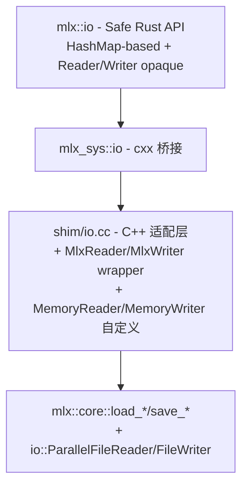

# cxx-mlx P2c · IO 设计文档

**日期**: 2026-05-05
**状态**: 已批准，待实施
**前置**: P0 / P1a / P1b1 / P1b2a / P1b2b / P2a / P2b 已完成
**作者**: 通过 brainstorming 与 Boss 协作产出

## 目标

为 MLX 的 IO 子系统提供完整的 Rust 安全绑定，覆盖 `mlx/io.h` 公开的全部 12 个公开函数 + `mlx/io/load.h` 的 Reader/Writer 抽象基类（B-lite：file 路径 + in-memory 双轨）。

### 范围（按 IO 完整性原则）

| API | 处理 |
|-----|------|
| `load_safetensors(file)` / `load_safetensors(stream)` | ✅ 双轨绑定 |
| `save_safetensors(file, ...)` / `save_safetensors(stream, ...)` | ✅ 双轨绑定 |
| `load_gguf(file)` | ✅ 文件路径绑定（上游无 stream 重载） |
| `save_gguf(file, ...)` | ✅ 文件路径绑定（上游无 stream 重载） |
| `load(file)` / `load(stream)` (npy) | ✅ 双轨绑定 |
| `save(file, array)` / `save(stream, array)` (npy) | ✅ 双轨绑定 |
| `io::Reader` / `io::Writer` 抽象基类 | ✅ B-lite：暴露 `MlxReader`/`MlxWriter` opaque type，仅文件路径 + 内存两种实现，不让 Rust 用户实现 trait callback |

### 非目标

- **B-full（Rust trait → C++ virtual interface）**：通过 cxx 让 Rust 用户实现自定义 `Reader`/`Writer` 实现。复杂度高（cxx 跨语言虚函数 + Pin + panic safety），无现成需求驱动设计取舍，留作未来扩展（不破坏 B-lite API）
- **量化算子**：P3 处理；P2c 只把量化 safetensors/gguf 作为普通张量加载返回（按 MLX 上游行为）
- **训练相关**：项目级非目标

## 设计原则

1. **完整性 > 简便**：MLX 公开的所有 IO 路径都要覆盖（save 即使不在当前推理 demo 必经路径上，也属基础设施）
2. **idiomatic Rust 类型**：`HashMap<String, Array>` 而非自定义 wrapper；`enum GGUFMetaData` 而非 tagged tuple
3. **opaque handle 模式**：`Reader`/`Writer` 是 opaque type，复用 P2a 已建立的 `Stream` opaque pattern
4. **builder 模式 for save**：避开 cxx 不支持 `rust::Slice<rust::String>` / `unordered_map` 等限制
5. **文件 + 内存覆盖 99% 实际场景**：不通过 Rust 实现自定义 IO

## 架构总览

延续 P0–P2b 三层结构：



### 各层职责

| 层 | 职责 | 文件 |
|----|------|------|
| **Shim (C++)** | 把 cxx 不能直接表达的 MLX C++ 特性（`unordered_map<string, array>`、`pair<map, map>`、`std::variant`、`std::shared_ptr<abstract base>`、abstract base classes）抹平为 cxx 友好的 free function + opaque class；提供 `MemoryReader`/`MemoryWriter` 自定义实现 | `mlx-sys/shim/include/cxx_mlx_shim/io.h`, `mlx-sys/shim/src/io.cc` |
| **Bridge (cxx::bridge)** | 用 cxx DSL 声明 ABI 边界，build 时生成双侧胶水代码 | `mlx-sys/src/bridge/io.rs` |
| **Safe (Rust)** | Rust 风格 API：`HashMap<String, Array>` / `Result<...>` / `enum GGUFMetaData`；`Reader`/`Writer` 类型 | `mlx/src/io.rs` |

### 关键约束

- **不接受 Stream 参数**：load 函数 MLX 都有 `StreamOrDevice s = {}` 默认参数；shim 全部不传，依赖 caller 线程默认 stream（与 P1b/P2b 一致）
- **`unordered_map<string, array>`**：shim opaque LoadResult 类，names + take_values 双 getter 配对返回；同一 LoadResult 实例的两次 query 中 unordered_map 遍历顺序天然一致（无中间插入即可保证）
- **`unordered_map<string, GGUFMetaData>` (variant)**：按 variant 子类型拆 3 组 names+values getter（array / string / string_list）；monostate 静默丢弃
- **`pair<map, map>`**：opaque LoadResult 内联（同上）
- **string list 嵌套 Vec**：load 端用 packed (concat + lengths) 表达；save 端用 begin/push/end 三步 builder
- **`shared_ptr<Reader/Writer>`**：shim 包装类 `MlxReader`/`MlxWriter` 持有 shared_ptr，Rust 端 `UniquePtr<MlxReader>`
- **save 方向**：opaque builder 模式，多次 `add_*` 调用 + 一次 save_*_file/writer 提交

## Shim 层设计（`io.h` + `io.cc`）

### `cxx_mlx_shim/io.h`

```cpp
#pragma once

#include <cstdint>
#include <memory>
#include <optional>
#include <string>
#include <utility>
#include <vector>

#include "mlx/io.h"
#include "mlx/io/load.h"
#include "rust/cxx.h"

namespace cxx_mlx {

using MlxArray = mlx::core::array;

// ===== Reader / Writer wrappers (opaque to cxx) =====

// 持有 shared_ptr<io::Reader>。MLX load_*(stream) 需要 shared_ptr。
class MlxReader {
 public:
  explicit MlxReader(std::shared_ptr<mlx::core::io::Reader> r) : ptr(std::move(r)) {}
  std::shared_ptr<mlx::core::io::Reader> ptr;
};

class MlxWriter {
 public:
  explicit MlxWriter(std::shared_ptr<mlx::core::io::Writer> w) : ptr(std::move(w)) {}
  std::shared_ptr<mlx::core::io::Writer> ptr;
};

// ===== Memory Reader / Writer (cxx_mlx 自定义) =====

class MemoryReader : public mlx::core::io::Reader {
 public:
  explicit MemoryReader(std::vector<uint8_t> bytes);

  bool is_open() const override { return true; }
  bool good() const override { return true; }
  size_t tell() override { return pos_; }
  void seek(int64_t off, std::ios_base::seekdir way = std::ios_base::beg) override;
  void read(char* data, size_t n) override;
  void read(char* data, size_t n, size_t offset) override;
  std::string label() const override { return "memory"; }

 private:
  std::vector<uint8_t> data_;
  size_t pos_ = 0;
};

class MemoryWriter : public mlx::core::io::Writer {
 public:
  MemoryWriter() = default;

  bool is_open() const override { return true; }
  bool good() const override { return true; }
  size_t tell() override { return data_.size(); }
  void seek(int64_t off, std::ios_base::seekdir way = std::ios_base::beg) override;
  void write(const char* data, size_t n) override;
  std::string label() const override { return "memory"; }

  std::vector<uint8_t> take_bytes() && { return std::move(data_); }

 private:
  std::vector<uint8_t> data_;
};

// ===== Reader / Writer 工厂 =====

std::unique_ptr<MlxReader> open_file_reader(rust::Str path);
std::unique_ptr<MlxReader> open_memory_reader(rust::Slice<const uint8_t> data);
std::unique_ptr<MlxWriter> create_file_writer(rust::Str path);
std::unique_ptr<MlxWriter> create_memory_writer();
// 仅 MemoryWriter 合法；FileWriter 抛 runtime_error。消费 writer：UniquePtr 按值
rust::Vec<uint8_t> writer_into_bytes(std::unique_ptr<MlxWriter> writer);

// ===== Load 结果类型（opaque）=====

class SafetensorsLoadResult {
 public:
  explicit SafetensorsLoadResult(mlx::core::SafetensorsLoad data) : inner_(std::move(data)) {}
  rust::Vec<rust::String> tensor_names() const;
  rust::Vec<std::unique_ptr<MlxArray>> take_tensor_values();  // 单次性消费
  rust::Vec<rust::String> metadata_names() const;
  rust::Vec<rust::String> metadata_values() const;

 private:
  mlx::core::SafetensorsLoad inner_;
};

class GGUFLoadResult {
 public:
  explicit GGUFLoadResult(mlx::core::GGUFLoad data) : inner_(std::move(data)) {}
  rust::Vec<rust::String> tensor_names() const;
  rust::Vec<std::unique_ptr<MlxArray>> take_tensor_values();
  // metadata 按 variant 类型拆（monostate 丢弃）
  rust::Vec<rust::String> array_meta_names() const;
  rust::Vec<std::unique_ptr<MlxArray>> take_array_meta_values();
  rust::Vec<rust::String> string_meta_names() const;
  rust::Vec<rust::String> string_meta_values() const;
  rust::Vec<rust::String> string_list_meta_names() const;
  rust::Vec<rust::String> string_list_meta_values_packed() const;  // 拼平的全部字符串
  rust::Vec<uint64_t> string_list_meta_lengths() const;            // 每个 list 的长度

 private:
  mlx::core::GGUFLoad inner_;
};

// ===== Save Builder（opaque）=====

class SafetensorsSaveBuilder {
 public:
  void add_tensor(rust::Str name, const MlxArray& array);
  void add_metadata(rust::Str key, rust::Str value);
  std::unordered_map<std::string, mlx::core::array> tensors;
  std::unordered_map<std::string, std::string> metadata;
};
std::unique_ptr<SafetensorsSaveBuilder> new_safetensors_save_builder();

class GGUFSaveBuilder {
 public:
  void add_tensor(rust::Str name, const MlxArray& array);
  void add_array_meta(rust::Str key, const MlxArray& array);
  void add_string_meta(rust::Str key, rust::Str value);
  // string list 用 begin/push/end 三步法
  void begin_string_list_meta(rust::Str key);
  void push_string_list_meta(rust::Str value);
  void end_string_list_meta();

  std::unordered_map<std::string, mlx::core::array> tensors;
  std::unordered_map<std::string, mlx::core::GGUFMetaData> metadata;

 private:
  std::optional<std::pair<std::string, std::vector<std::string>>> pending_list_;
};
std::unique_ptr<GGUFSaveBuilder> new_gguf_save_builder();

// ===== Top-level load/save APIs =====

// safetensors
std::unique_ptr<SafetensorsLoadResult> load_safetensors_file(rust::Str path);
std::unique_ptr<SafetensorsLoadResult> load_safetensors_reader(MlxReader& reader);
void save_safetensors_file(rust::Str path, const SafetensorsSaveBuilder& builder);
void save_safetensors_writer(MlxWriter& writer, const SafetensorsSaveBuilder& builder);

// gguf (file-only per upstream)
std::unique_ptr<GGUFLoadResult> load_gguf_file(rust::Str path);
void save_gguf_file(rust::Str path, const GGUFSaveBuilder& builder);

// npy (single-array)
std::unique_ptr<MlxArray> load_npy_file(rust::Str path);
std::unique_ptr<MlxArray> load_npy_reader(MlxReader& reader);
void save_npy_file(rust::Str path, const MlxArray& array);
void save_npy_writer(MlxWriter& writer, const MlxArray& array);

}  // namespace cxx_mlx
```

### `shim/src/io.cc` 关键实现片段

```cpp
#include "cxx_mlx_shim/io.h"

#include <cstring>
#include <stdexcept>

namespace cxx_mlx {

// ===== MemoryReader =====

MemoryReader::MemoryReader(std::vector<uint8_t> bytes) : data_(std::move(bytes)) {}

void MemoryReader::seek(int64_t off, std::ios_base::seekdir way) {
  if (way == std::ios_base::beg) pos_ = static_cast<size_t>(off);
  else if (way == std::ios_base::cur) pos_ = static_cast<size_t>(static_cast<int64_t>(pos_) + off);
  else if (way == std::ios_base::end) pos_ = static_cast<size_t>(static_cast<int64_t>(data_.size()) + off);
}

void MemoryReader::read(char* dst, size_t n) {
  if (pos_ + n > data_.size()) throw std::runtime_error("MemoryReader::read past end");
  std::memcpy(dst, data_.data() + pos_, n);
  pos_ += n;
}

void MemoryReader::read(char* dst, size_t n, size_t offset) {
  if (offset + n > data_.size()) throw std::runtime_error("MemoryReader::read(offset) past end");
  std::memcpy(dst, data_.data() + offset, n);
}

// ===== MemoryWriter =====
// 注意：MLX 的 save_safetensors 会 seek 回头部回填 metadata 偏移，所以
// MemoryWriter 必须实现真正的随机写入：tell 返回 pos_，seek 调整 pos_，
// write 在 pos_ 处覆盖（必要时 resize 扩容）+ 推进 pos_。

void MemoryWriter::seek(int64_t off, std::ios_base::seekdir way) {
  size_t new_pos;
  if (way == std::ios_base::beg) new_pos = static_cast<size_t>(off);
  else if (way == std::ios_base::cur) new_pos = static_cast<size_t>(static_cast<int64_t>(pos_) + off);
  else if (way == std::ios_base::end) new_pos = static_cast<size_t>(static_cast<int64_t>(data_.size()) + off);
  else throw std::runtime_error("MemoryWriter::seek: invalid seekdir");
  pos_ = new_pos;
}

void MemoryWriter::write(const char* src, size_t n) {
  if (pos_ + n > data_.size()) data_.resize(pos_ + n);
  std::memcpy(data_.data() + pos_, src, n);
  pos_ += n;
}

// ===== 工厂 =====

std::unique_ptr<MlxReader> open_file_reader(rust::Str path) {
  auto r = std::make_shared<mlx::core::io::ParallelFileReader>(std::string(path));
  if (!r->is_open()) throw std::runtime_error("failed to open file: " + std::string(path));
  return std::make_unique<MlxReader>(std::move(r));
}

std::unique_ptr<MlxReader> open_memory_reader(rust::Slice<const uint8_t> data) {
  auto r = std::make_shared<MemoryReader>(std::vector<uint8_t>(data.begin(), data.end()));
  return std::make_unique<MlxReader>(std::move(r));
}

std::unique_ptr<MlxWriter> create_file_writer(rust::Str path) {
  auto w = std::make_shared<mlx::core::io::FileWriter>(std::string(path));
  if (!w->is_open()) throw std::runtime_error("failed to create file: " + std::string(path));
  return std::make_unique<MlxWriter>(std::move(w));
}

std::unique_ptr<MlxWriter> create_memory_writer() {
  return std::make_unique<MlxWriter>(std::make_shared<MemoryWriter>());
}

rust::Vec<uint8_t> writer_into_bytes(std::unique_ptr<MlxWriter> w) {
  auto* mw = dynamic_cast<MemoryWriter*>(w->ptr.get());
  if (!mw) throw std::runtime_error("writer is not a memory writer");
  std::vector<uint8_t> bytes = std::move(*mw).take_bytes();
  rust::Vec<uint8_t> out;
  out.reserve(bytes.size());
  for (uint8_t b : bytes) out.push_back(b);
  return out;
}

// ===== load_safetensors =====

std::unique_ptr<SafetensorsLoadResult> load_safetensors_file(rust::Str path) {
  auto data = mlx::core::load_safetensors(std::string(path));
  return std::make_unique<SafetensorsLoadResult>(std::move(data));
}

std::unique_ptr<SafetensorsLoadResult> load_safetensors_reader(MlxReader& reader) {
  auto data = mlx::core::load_safetensors(reader.ptr);
  return std::make_unique<SafetensorsLoadResult>(std::move(data));
}

rust::Vec<rust::String> SafetensorsLoadResult::tensor_names() const {
  rust::Vec<rust::String> out;
  out.reserve(inner_.first.size());
  for (const auto& kv : inner_.first) out.push_back(rust::String(kv.first));
  return out;
}

// 注意：take 后 inner_.first 仍存在但 array 已 move-from。Rust 安全层只调一次 take。
rust::Vec<std::unique_ptr<MlxArray>> SafetensorsLoadResult::take_tensor_values() {
  rust::Vec<std::unique_ptr<MlxArray>> out;
  out.reserve(inner_.first.size());
  for (auto& kv : inner_.first) {
    out.push_back(std::make_unique<MlxArray>(std::move(kv.second)));
  }
  return out;
}

rust::Vec<rust::String> SafetensorsLoadResult::metadata_names() const {
  rust::Vec<rust::String> out;
  out.reserve(inner_.second.size());
  for (const auto& kv : inner_.second) out.push_back(rust::String(kv.first));
  return out;
}

rust::Vec<rust::String> SafetensorsLoadResult::metadata_values() const {
  rust::Vec<rust::String> out;
  out.reserve(inner_.second.size());
  for (const auto& kv : inner_.second) out.push_back(rust::String(kv.second));
  return out;
}

// ===== save_safetensors =====

void SafetensorsSaveBuilder::add_tensor(rust::Str name, const MlxArray& array) {
  tensors.emplace(std::string(name), array);  // array copy = refcount share
}

void SafetensorsSaveBuilder::add_metadata(rust::Str key, rust::Str value) {
  metadata.emplace(std::string(key), std::string(value));
}

std::unique_ptr<SafetensorsSaveBuilder> new_safetensors_save_builder() {
  return std::make_unique<SafetensorsSaveBuilder>();
}

void save_safetensors_file(rust::Str path, const SafetensorsSaveBuilder& b) {
  mlx::core::save_safetensors(std::string(path), b.tensors, b.metadata);
}

void save_safetensors_writer(MlxWriter& writer, const SafetensorsSaveBuilder& b) {
  mlx::core::save_safetensors(writer.ptr, b.tensors, b.metadata);
}

// ===== load_gguf =====

std::unique_ptr<GGUFLoadResult> load_gguf_file(rust::Str path) {
  auto data = mlx::core::load_gguf(std::string(path));
  return std::make_unique<GGUFLoadResult>(std::move(data));
}

rust::Vec<rust::String> GGUFLoadResult::tensor_names() const {
  rust::Vec<rust::String> out;
  for (const auto& kv : inner_.first) out.push_back(rust::String(kv.first));
  return out;
}

rust::Vec<std::unique_ptr<MlxArray>> GGUFLoadResult::take_tensor_values() {
  rust::Vec<std::unique_ptr<MlxArray>> out;
  for (auto& kv : inner_.first) {
    out.push_back(std::make_unique<MlxArray>(std::move(kv.second)));
  }
  return out;
}

// 按 variant 类型筛选 metadata
rust::Vec<rust::String> GGUFLoadResult::array_meta_names() const {
  rust::Vec<rust::String> out;
  for (const auto& kv : inner_.second) {
    if (std::holds_alternative<mlx::core::array>(kv.second)) {
      out.push_back(rust::String(kv.first));
    }
  }
  return out;
}

rust::Vec<std::unique_ptr<MlxArray>> GGUFLoadResult::take_array_meta_values() {
  rust::Vec<std::unique_ptr<MlxArray>> out;
  for (auto& kv : inner_.second) {
    if (std::holds_alternative<mlx::core::array>(kv.second)) {
      out.push_back(std::make_unique<MlxArray>(std::move(std::get<mlx::core::array>(kv.second))));
    }
  }
  return out;
}

// 类似 string_meta_names/values/string_list_meta_*

// ===== save_gguf =====

void GGUFSaveBuilder::add_tensor(rust::Str name, const MlxArray& array) {
  tensors.emplace(std::string(name), array);
}

void GGUFSaveBuilder::add_array_meta(rust::Str key, const MlxArray& array) {
  metadata.emplace(std::string(key), mlx::core::GGUFMetaData(array));
}

void GGUFSaveBuilder::add_string_meta(rust::Str key, rust::Str value) {
  metadata.emplace(std::string(key), mlx::core::GGUFMetaData(std::string(value)));
}

void GGUFSaveBuilder::begin_string_list_meta(rust::Str key) {
  if (pending_list_.has_value()) {
    throw std::runtime_error("begin_string_list_meta called without end_string_list_meta");
  }
  pending_list_ = std::make_pair(std::string(key), std::vector<std::string>{});
}

void GGUFSaveBuilder::push_string_list_meta(rust::Str value) {
  if (!pending_list_.has_value()) {
    throw std::runtime_error("push_string_list_meta called without begin_string_list_meta");
  }
  pending_list_->second.push_back(std::string(value));
}

void GGUFSaveBuilder::end_string_list_meta() {
  if (!pending_list_.has_value()) {
    throw std::runtime_error("end_string_list_meta called without begin_string_list_meta");
  }
  metadata.emplace(
      std::move(pending_list_->first),
      mlx::core::GGUFMetaData(std::move(pending_list_->second)));
  pending_list_.reset();
}

// ===== load/save_npy =====

std::unique_ptr<MlxArray> load_npy_file(rust::Str path) {
  return std::make_unique<MlxArray>(mlx::core::load(std::string(path)));
}

std::unique_ptr<MlxArray> load_npy_reader(MlxReader& reader) {
  return std::make_unique<MlxArray>(mlx::core::load(reader.ptr));
}

void save_npy_file(rust::Str path, const MlxArray& array) {
  mlx::core::save(std::string(path), array);
}

void save_npy_writer(MlxWriter& writer, const MlxArray& array) {
  mlx::core::save(writer.ptr, array);
}

}  // namespace cxx_mlx
```

### Shim 层设计要点

| 问题 | 处理 |
|------|------|
| `unordered_map<string, array>` cxx 不支持 | shim opaque LoadResult，names + take_values 双 getter；同一实例连续调用顺序天然一致 |
| `unordered_map<string, GGUFMetaData>` (variant) | 按 variant 子类型拆 3 组 names+values getter；monostate 静默丢弃 |
| `pair<map, map>` 返回值 | opaque LoadResult 内联 |
| string list 嵌套 Vec | load 端 packed (concat + lengths) ；save 端 begin/push/end 三步 |
| `shared_ptr<Reader/Writer>` cxx 不支持 | shim 包装类 `MlxReader/MlxWriter` 持有 shared_ptr |
| save 方向需要 `unordered_map` 输入 | builder 模式：opaque builder + 多次 add_* 调用 |
| `MemoryReader/MemoryWriter` MLX 未提供 | shim 自定义实现 `io::Reader/Writer` 接口 |
| MLX 抛异常 | shim **不** try/catch；cxx Result\<T\> 自动捕获 |
| `writer_into_bytes` 仅 memory writer 合法 | shim `dynamic_cast<MemoryWriter*>`；nullptr 抛 runtime_error |
| `take_*` 单次性消费 | shim 头文件注释明确；Rust 安全层只调一次 |

## Bridge 层设计（`mlx-sys/src/bridge/io.rs`）

```rust
//! Bridge for MLX IO (load/save: safetensors, gguf, npy + Reader/Writer streams).
//!
//! Map decomposition: shim returns opaque LoadResult types, Rust calls
//! parallel name/value getters and rebuilds HashMap on the safe layer.
//!
//! Save direction: opaque SaveBuilder accumulates entries via add_* calls;
//! single save_*_file/writer call commits.
//!
//! Reader/Writer: opaque MlxReader/MlxWriter wrap shared_ptr<io::Reader/Writer>.
//! B-lite = file + memory backends only; no Rust trait callbacks.

#[allow(clippy::missing_safety_doc, clippy::too_many_arguments)]
#[cxx::bridge(namespace = "cxx_mlx")]
pub mod ffi {
    unsafe extern "C++" {
        include!("cxx_mlx_shim/io.h");

        type MlxArray = crate::bridge::array::ffi::MlxArray;
        type MlxReader;
        type MlxWriter;
        type SafetensorsLoadResult;
        type GGUFLoadResult;
        type SafetensorsSaveBuilder;
        type GGUFSaveBuilder;

        // ===== Reader / Writer =====
        fn open_file_reader(path: &str) -> Result<UniquePtr<MlxReader>>;
        fn open_memory_reader(data: &[u8]) -> UniquePtr<MlxReader>;
        fn create_file_writer(path: &str) -> Result<UniquePtr<MlxWriter>>;
        fn create_memory_writer() -> UniquePtr<MlxWriter>;
        fn writer_into_bytes(writer: UniquePtr<MlxWriter>) -> Result<Vec<u8>>;

        // ===== safetensors =====
        fn load_safetensors_file(path: &str) -> Result<UniquePtr<SafetensorsLoadResult>>;
        fn load_safetensors_reader(reader: Pin<&mut MlxReader>) -> Result<UniquePtr<SafetensorsLoadResult>>;
        fn tensor_names(self: &SafetensorsLoadResult) -> Vec<String>;
        fn take_tensor_values(self: Pin<&mut SafetensorsLoadResult>) -> Vec<UniquePtr<MlxArray>>;
        fn metadata_names(self: &SafetensorsLoadResult) -> Vec<String>;
        fn metadata_values(self: &SafetensorsLoadResult) -> Vec<String>;

        fn new_safetensors_save_builder() -> UniquePtr<SafetensorsSaveBuilder>;
        fn add_tensor(self: Pin<&mut SafetensorsSaveBuilder>, name: &str, array: &MlxArray);
        fn add_metadata(self: Pin<&mut SafetensorsSaveBuilder>, key: &str, value: &str);
        fn save_safetensors_file(path: &str, builder: &SafetensorsSaveBuilder) -> Result<()>;
        fn save_safetensors_writer(writer: Pin<&mut MlxWriter>, builder: &SafetensorsSaveBuilder) -> Result<()>;

        // ===== GGUF =====
        fn load_gguf_file(path: &str) -> Result<UniquePtr<GGUFLoadResult>>;
        fn tensor_names(self: &GGUFLoadResult) -> Vec<String>;
        fn take_tensor_values(self: Pin<&mut GGUFLoadResult>) -> Vec<UniquePtr<MlxArray>>;
        fn array_meta_names(self: &GGUFLoadResult) -> Vec<String>;
        fn take_array_meta_values(self: Pin<&mut GGUFLoadResult>) -> Vec<UniquePtr<MlxArray>>;
        fn string_meta_names(self: &GGUFLoadResult) -> Vec<String>;
        fn string_meta_values(self: &GGUFLoadResult) -> Vec<String>;
        fn string_list_meta_names(self: &GGUFLoadResult) -> Vec<String>;
        fn string_list_meta_values_packed(self: &GGUFLoadResult) -> Vec<String>;
        fn string_list_meta_lengths(self: &GGUFLoadResult) -> Vec<u64>;

        fn new_gguf_save_builder() -> UniquePtr<GGUFSaveBuilder>;
        fn add_tensor(self: Pin<&mut GGUFSaveBuilder>, name: &str, array: &MlxArray);
        fn add_array_meta(self: Pin<&mut GGUFSaveBuilder>, key: &str, array: &MlxArray);
        fn add_string_meta(self: Pin<&mut GGUFSaveBuilder>, key: &str, value: &str);
        fn begin_string_list_meta(self: Pin<&mut GGUFSaveBuilder>, key: &str);
        fn push_string_list_meta(self: Pin<&mut GGUFSaveBuilder>, value: &str);
        fn end_string_list_meta(self: Pin<&mut GGUFSaveBuilder>);
        fn save_gguf_file(path: &str, builder: &GGUFSaveBuilder) -> Result<()>;

        // ===== npy =====
        fn load_npy_file(path: &str) -> Result<UniquePtr<MlxArray>>;
        fn load_npy_reader(reader: Pin<&mut MlxReader>) -> Result<UniquePtr<MlxArray>>;
        fn save_npy_file(path: &str, array: &MlxArray) -> Result<()>;
        fn save_npy_writer(writer: Pin<&mut MlxWriter>, array: &MlxArray) -> Result<()>;
    }
}
```

### Bridge 设计要点

| 项 | 说明 |
|----|------|
| 方法语法 `self: &T` / `self: Pin<&mut T>` | cxx 1.0 对 opaque type 的"方法"必须用此形式；纯 getter 用 `&self`，状态变更（take_*）用 Pin\<&mut> |
| 方法名重载 | `tensor_names`、`take_tensor_values` 在 SafetensorsLoadResult 和 GGUFLoadResult 上各自重载 — cxx 允许 |
| `Result<T>` 包装 | 所有可能抛异常的（文件 IO、格式损坏、`writer_into_bytes` 误用、builder 状态错误）都返回 `Result<T>` |
| `UniquePtr<MlxWriter>` 按值传给 `writer_into_bytes` | 消费 writer 语义，into_bytes 后不可再用 |
| 跨桥接共享 `MlxArray` | `type MlxArray = crate::bridge::array::ffi::MlxArray;` |

## 安全层设计（`mlx/src/io.rs`）

```rust
//! File and stream IO for MLX arrays.
//!
//! - safetensors: tensor + string metadata; file path or Reader/Writer
//! - gguf: tensor + variant metadata; file path only (upstream limitation)
//! - npy: single array; file path or Reader/Writer
//!
//! Reader / Writer are opaque handles wrapping MLX io::Reader/Writer.
//! Backends: file path + in-memory (B-lite). No Rust-implemented IO callbacks.

use std::collections::HashMap;
use std::pin::Pin;

use crate::{Array, Error, Result};

/// GGUF metadata value. Mirrors `mlx::core::GGUFMetaData` minus monostate
/// (the empty variant is silently dropped during load).
#[derive(Debug)]
pub enum GGUFMetaData {
    Array(Array),
    String(String),
    StringList(Vec<String>),
}

/// Opaque IO reader handle. Backed by file (`open_file`) or memory (`from_bytes`).
pub struct Reader(cxx::UniquePtr<mlx_sys::io::ffi::MlxReader>);

/// Opaque IO writer handle. Backed by file (`create_file`) or memory (`memory`).
/// Memory writers can be drained via [`Writer::into_bytes`].
pub struct Writer(cxx::UniquePtr<mlx_sys::io::ffi::MlxWriter>);

impl Reader {
    pub fn open_file(path: &str) -> Result<Self> {
        let inner = mlx_sys::io::ffi::open_file_reader(path).map_err(Error::from)?;
        Ok(Reader(inner))
    }

    pub fn from_bytes(bytes: &[u8]) -> Self {
        Reader(mlx_sys::io::ffi::open_memory_reader(bytes))
    }

    fn pin_mut(&mut self) -> Pin<&mut mlx_sys::io::ffi::MlxReader> {
        self.0.pin_mut()
    }
}

impl Writer {
    pub fn create_file(path: &str) -> Result<Self> {
        let inner = mlx_sys::io::ffi::create_file_writer(path).map_err(Error::from)?;
        Ok(Writer(inner))
    }

    pub fn memory() -> Self {
        Writer(mlx_sys::io::ffi::create_memory_writer())
    }

    /// Drain the in-memory buffer. Returns `Err` if this is a file writer.
    pub fn into_bytes(self) -> Result<Vec<u8>> {
        mlx_sys::io::ffi::writer_into_bytes(self.0).map_err(Error::from)
    }

    fn pin_mut(&mut self) -> Pin<&mut mlx_sys::io::ffi::MlxWriter> {
        self.0.pin_mut()
    }
}

// ===== safetensors =====

/// Load tensors + string metadata from a `.safetensors` file.
pub fn load_safetensors(
    path: &str,
) -> Result<(HashMap<String, Array>, HashMap<String, String>)> {
    let mut result = mlx_sys::io::ffi::load_safetensors_file(path).map_err(Error::from)?;
    Ok(safetensors_decompose(result.pin_mut()))
}

/// Load tensors + string metadata from a Reader.
pub fn load_safetensors_from_reader(
    reader: &mut Reader,
) -> Result<(HashMap<String, Array>, HashMap<String, String>)> {
    let mut result = mlx_sys::io::ffi::load_safetensors_reader(reader.pin_mut()).map_err(Error::from)?;
    Ok(safetensors_decompose(result.pin_mut()))
}

fn safetensors_decompose(
    mut result: Pin<&mut mlx_sys::io::ffi::SafetensorsLoadResult>,
) -> (HashMap<String, Array>, HashMap<String, String>) {
    let names = result.as_ref().tensor_names();
    let values = result.as_mut().take_tensor_values();
    let tensors: HashMap<_, _> = names.into_iter()
        .zip(values.into_iter().map(Array::from_inner))
        .collect();
    let meta_names = result.as_ref().metadata_names();
    let meta_values = result.as_ref().metadata_values();
    let metadata: HashMap<_, _> = meta_names.into_iter().zip(meta_values).collect();
    (tensors, metadata)
}

/// Save tensors + metadata to a `.safetensors` file.
pub fn save_safetensors(
    path: &str,
    tensors: &HashMap<String, Array>,
    metadata: &HashMap<String, String>,
) -> Result<()> {
    let builder = build_safetensors_builder(tensors, metadata);
    mlx_sys::io::ffi::save_safetensors_file(path, &builder).map_err(Error::from)
}

/// Save tensors + metadata to a Writer.
pub fn save_safetensors_to_writer(
    writer: &mut Writer,
    tensors: &HashMap<String, Array>,
    metadata: &HashMap<String, String>,
) -> Result<()> {
    let builder = build_safetensors_builder(tensors, metadata);
    mlx_sys::io::ffi::save_safetensors_writer(writer.pin_mut(), &builder).map_err(Error::from)
}

fn build_safetensors_builder(
    tensors: &HashMap<String, Array>,
    metadata: &HashMap<String, String>,
) -> cxx::UniquePtr<mlx_sys::io::ffi::SafetensorsSaveBuilder> {
    let mut builder = mlx_sys::io::ffi::new_safetensors_save_builder();
    for (name, array) in tensors {
        builder.pin_mut().add_tensor(name, array.as_inner());
    }
    for (key, value) in metadata {
        builder.pin_mut().add_metadata(key, value);
    }
    builder
}

// ===== GGUF =====

/// Load tensors + GGUF metadata from a `.gguf` file.
pub fn load_gguf(
    path: &str,
) -> Result<(HashMap<String, Array>, HashMap<String, GGUFMetaData>)> {
    let mut result = mlx_sys::io::ffi::load_gguf_file(path).map_err(Error::from)?;
    let result = result.pin_mut();
    Ok(gguf_decompose(result))
}

fn gguf_decompose(
    mut result: Pin<&mut mlx_sys::io::ffi::GGUFLoadResult>,
) -> (HashMap<String, Array>, HashMap<String, GGUFMetaData>) {
    // tensors
    let tensor_names = result.as_ref().tensor_names();
    let tensor_values = result.as_mut().take_tensor_values();
    let tensors: HashMap<_, _> = tensor_names.into_iter()
        .zip(tensor_values.into_iter().map(Array::from_inner))
        .collect();

    // metadata
    let mut metadata = HashMap::new();

    // array metadata
    let arr_names = result.as_ref().array_meta_names();
    let arr_values = result.as_mut().take_array_meta_values();
    for (name, arr) in arr_names.into_iter().zip(arr_values) {
        metadata.insert(name, GGUFMetaData::Array(Array::from_inner(arr)));
    }

    // string metadata
    let str_names = result.as_ref().string_meta_names();
    let str_values = result.as_ref().string_meta_values();
    for (name, value) in str_names.into_iter().zip(str_values) {
        metadata.insert(name, GGUFMetaData::String(value));
    }

    // string list metadata: 解 packed
    let list_names = result.as_ref().string_list_meta_names();
    let packed = result.as_ref().string_list_meta_values_packed();
    let lengths = result.as_ref().string_list_meta_lengths();
    let mut idx = 0;
    for (name, len) in list_names.into_iter().zip(lengths) {
        let len = len as usize;
        let strings: Vec<String> = packed[idx..idx + len].to_vec();
        idx += len;
        metadata.insert(name, GGUFMetaData::StringList(strings));
    }

    (tensors, metadata)
}

/// Save tensors + GGUF metadata to a `.gguf` file.
pub fn save_gguf(
    path: &str,
    tensors: &HashMap<String, Array>,
    metadata: &HashMap<String, GGUFMetaData>,
) -> Result<()> {
    let mut builder = mlx_sys::io::ffi::new_gguf_save_builder();
    for (name, array) in tensors {
        builder.pin_mut().add_tensor(name, array.as_inner());
    }
    for (key, value) in metadata {
        match value {
            GGUFMetaData::Array(a) => builder.pin_mut().add_array_meta(key, a.as_inner()),
            GGUFMetaData::String(s) => builder.pin_mut().add_string_meta(key, s),
            GGUFMetaData::StringList(items) => {
                builder.pin_mut().begin_string_list_meta(key);
                for item in items {
                    builder.pin_mut().push_string_list_meta(item);
                }
                builder.pin_mut().end_string_list_meta();
            }
        }
    }
    mlx_sys::io::ffi::save_gguf_file(path, &builder).map_err(Error::from)
}

// ===== npy =====

/// Load a single array from a `.npy` file.
pub fn load_npy(path: &str) -> Result<Array> {
    let inner = mlx_sys::io::ffi::load_npy_file(path).map_err(Error::from)?;
    Ok(Array::from_inner(inner))
}

/// Load a single array from a Reader (`.npy` format).
pub fn load_npy_from_reader(reader: &mut Reader) -> Result<Array> {
    let inner = mlx_sys::io::ffi::load_npy_reader(reader.pin_mut()).map_err(Error::from)?;
    Ok(Array::from_inner(inner))
}

/// Save a single array to a `.npy` file.
pub fn save_npy(path: &str, array: &Array) -> Result<()> {
    mlx_sys::io::ffi::save_npy_file(path, array.as_inner()).map_err(Error::from)
}

/// Save a single array to a Writer (`.npy` format).
pub fn save_npy_to_writer(writer: &mut Writer, array: &Array) -> Result<()> {
    mlx_sys::io::ffi::save_npy_writer(writer.pin_mut(), array.as_inner()).map_err(Error::from)
}
```

### lib.rs 改动

```rust
// mlx/src/lib.rs（追加）
pub mod io;
pub use io::{
    GGUFMetaData, Reader, Writer,
    load_gguf, load_npy, load_npy_from_reader, load_safetensors, load_safetensors_from_reader,
    save_gguf, save_npy, save_npy_to_writer, save_safetensors, save_safetensors_to_writer,
};
```

```rust
// mlx-sys/src/lib.rs（追加）
pub use bridge::io;

// mlx-sys/src/bridge/mod.rs（追加）
pub mod io;
```

### 安全层设计要点

| 项 | 说明 |
|----|------|
| `HashMap<String, Array>` 直接暴露 | 不引入 wrapper 类型，与 std 集成自然 |
| `enum GGUFMetaData` | 三种 variant；monostate 在 shim 层丢弃，不出现在 Rust 端 |
| `Reader`/`Writer` opaque type | 类似 P2a 的 Stream 模式；`pin_mut()` 私有方法供模块内部使用 |
| `Writer::into_bytes(self)` 消费语义 | 移动 self，into_bytes 后不可再用（编译期保证） |
| 解构辅助 fn `safetensors_decompose`/`gguf_decompose` | 共用 Pin\<&mut> 操作；避免 file 路径 / Reader 路径重复代码 |

## 错误处理

| 失败模式 | shim 行为 | cxx 桥接 | mlx 安全层 |
|----------|----------|----------|-----------|
| 文件打不开 | `throw runtime_error` | `Result<...>` 捕获 | `Error::from` → `Result::Err` |
| 文件格式损坏 | MLX 抛 `runtime_error` | 同上 | 同上 |
| `writer_into_bytes` 在 file writer 上调用 | shim `dynamic_cast` 失败抛 | 同上 | 同上 |
| MemoryReader 越界 read | shim 抛 `runtime_error` | 同上 | 同上 |
| GGUF builder 状态机错误（push 未 begin 等） | shim 抛 `runtime_error` | 同上 | 同上 |
| GGUF metadata 含 monostate | shim 静默丢弃（不抛） | 不出错 | metadata 中不出现该 key |

**不预先做 Rust 端校验**：MLX 内部对 safetensors/gguf/npy 格式校验完整。

## 测试策略

集成测试 `mlx/tests/p2c_io.rs`：

| 类别 | 测试用例 |
|------|---------|
| **safetensors round-trip** | (1) 文件路径：save 1 tensor + 元数据 → load → 张量值 + 元数据完全一致；(2) 内存：writer→bytes→reader 完整 round-trip |
| **gguf round-trip** | (1) 文件路径：tensor + 三类 metadata（array/string/string_list）全部往返一致 |
| **npy round-trip** | (1) 文件路径；(2) 内存 writer→reader |
| **Reader 错误路径** | (1) `open_file` 不存在路径返回 Err；(2) `from_bytes` 空数据可构造（不报错；后续 load 才会因数据不足报错） |
| **Writer 工厂 + into_bytes** | (1) memory writer 写入 → into_bytes 拿到一致字节；(2) file writer 调 into_bytes 返回 Err |
| **Edge cases** | (1) 空 tensor map save/load；(2) ≥ 100 tensor 顺序无误；(3) unicode 文件名 / key |
| **GGUF builder 状态机** | (1) 未 begin 就 push → Err；(2) 已 begin 又 begin → Err |
| **Top-level re-exports** | 通过 `mlx::load_safetensors` 调用验证 re-export |

**临时文件**：用 `tempfile` crate（dev-dependency）。

**dev-dependency 新增**：`tempfile = "3"`。

## 文件结构总览

```text
cxx-mlx/
├── mlx-sys/
│   ├── build.rs                                 [改] cxx_build 加 io.rs / io.cc
│   ├── src/
│   │   ├── lib.rs                               [改] pub use bridge::io;
│   │   └── bridge/
│   │       ├── mod.rs                           [改] pub mod io;
│   │       └── io.rs                            [新] cxx 桥接（~30 FFI）
│   └── shim/
│       ├── include/cxx_mlx_shim/io.h            [新] shim 头
│       └── src/io.cc                            [新] shim 实现 + Memory{Reader,Writer} + builder 类
└── mlx/
    ├── Cargo.toml                               [改] dev-dep tempfile = "3"
    ├── src/
    │   ├── lib.rs                               [改] pub mod io; + re-exports
    │   └── io.rs                                [新] 安全 API（14 公开函数 + 类型）
    └── tests/
        └── p2c_io.rs                            [新] 集成测试
```

## 风险与缓解

| 风险 | 缓解 |
|------|------|
| `unordered_map` 遍历顺序不保证 | shim 在同一 LoadResult 实例的连续 names + take_values 调用中，遍历同一 map 顺序天然一致；测试用 round-trip 保证语义正确 |
| `take_tensor_values` 后再调 `tensor_names` | shim 头注释明确 take 是单次性消费；Rust 安全层只调一次，私有 helper 函数包装 |
| `dynamic_cast<MemoryWriter*>` 在 RTTI 关闭时失败 | C++20 默认开 RTTI；mlx-sys build.rs 用 `-fvisibility=hidden` 但不影响 RTTI；测试 `file_writer.into_bytes` 必报 Err 即可验证 |
| `MemoryReader::seek/tell/read(offset)` 实现错误 | 单元测试三个 op 各覆盖 |
| GGUFMetaData `monostate` 静默丢弃 | doc comment 明确标注；可通过测试 round-trip 不带 monostate 的数据来验证（生成 monostate 的入口在上游 GGUF 文件，本端 save 永不产生） |
| Tempfile 测试在并行 test 中冲突 | 用 `tempfile::NamedTempFile` 每测试独立路径 |
| MLX 上游升级改 `SafetensorsLoad` / `GGUFLoad` 类型签名 | shim 是单一适配点，重抓即可；安全 API 的 HashMap 类型对上游变化稳定 |

## 与后续工作的关系

- **P3（量化算子）** 紧随 P2c 实施。P2c 加载量化 safetensors 时，量化张量按普通张量返回（packed uint32 weights + scales + biases 三个独立 array），命名约定如 `model.layers.0.mlp.gate_proj.weight` / `.scales` / `.biases`。P3 提供 `quantize` / `dequantize` / `quantized_matmul(x, w, scales, biases, group_size, bits)` 等算子消费这些 tensor。
- **未来扩展（不破坏 B-lite API）**：B-full（Rust trait 跨 cxx callback 实现 Reader/Writer）作为新增类型/工厂 fn 添加，不影响现有 `Reader::open_file` / `from_bytes` 等 API。
