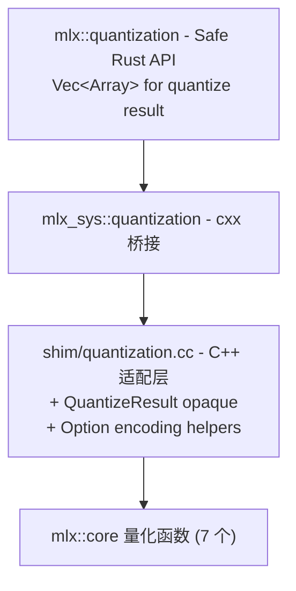

# cxx-mlx P3 · Quantization 设计文档

**日期**: 2026-05-05
**状态**: 已批准，待实施
**前置**: P0 / P1a / P1b1 / P1b2a / P1b2b / P2a / P2b / P2c 已完成
**作者**: 通过 brainstorming 与 Boss 协作产出

## 目标

为 MLX 量化（低精度）子系统提供完整的 Rust 安全绑定。覆盖 `mlx::core` 命名空间下与量化相关的全部 7 个公开函数：affine 量化（quantize / dequantize / quantized_matmul）、双量化 NVFP4（qqmm）、MoE 量化（gather_qmm）、FP8 数值格式转换（from_fp8 / to_fp8）。

## 范围（按基础设施完整性原则）

| API | 类别 | 处理 |
|-----|------|------|
| `quantize(w, group_size, bits, mode, global_scale)` | Tier 1 — 核心 | ✅ 必绑（返回 `vector<array>`） |
| `dequantize(w, scales, biases?, group_size, bits, mode, global_scale?, dtype?)` | Tier 1 — 核心 | ✅ 必绑 |
| `quantized_matmul(x, w, scales, biases?, transpose, group_size, bits, mode)` | Tier 1 — 推理工作主力 | ✅ 必绑 |
| `qqmm(x, w, w_scales?, group_size, bits, mode, global_scale_x?, global_scale_w?)` | Tier 2 — 双量化 NVFP4 | ✅ 必绑 |
| `gather_qmm(x, w, scales, biases?, lhs_indices?, rhs_indices?, transpose, group_size, bits, mode, sorted_indices)` | Tier 2 — MoE 量化 | ✅ 必绑 |
| `from_fp8(x, dtype)` | Tier 3 — FP8/E4M3 解码 | ✅ 必绑 |
| `to_fp8(x)` | Tier 3 — FP8/E4M3 编码 | ✅ 必绑 |

### 非目标

- **`gather_mm`**：非量化的 matmul 变体（gather pattern 但不带量化），属 ops 范畴。配对的 `gather_qmm` 已纳入 P3 但 `gather_mm` 留作后续 ops 补丁，避免 P3 范围越界
- **`block_masked_mm` / `segmented_mm` / `tensordot` / `addmm`**：其他 matmul 变体，同样不属于"量化"子系统
- **`mlx::core::random` 量化相关采样函数**：未来若有需要单独评估
- **量化感知训练（QAT）**：项目级非目标（无 grad/vjp）

## 设计原则

1. **完整性**：MLX 上游公开的所有量化函数都纳入；包括 FP8（同属"低精度数值表示"基础设施）
2. **idiomatic Rust 类型**：`Vec<Array>` 而非自定义 wrapper；`Option<i32>` / `Option<&Array>` 而非裸指针
3. **沿用既建模式**：cxx 编码模式直接复用 P2b（`Option<i32/f32>` → `(bool, value)`）和 P2c（`Vec<UniquePtr<T>>` → opaque + count + take_at）
4. **不偏向特定模型**：本设计不针对 gemma-4-e4b 或任何具体模型 —— 按 MLX 子系统完整性绑定，让后续模型加载自然 fit

## 架构总览

延续 P0–P2c 三层结构：



### 各层职责

| 层 | 职责 | 文件 |
|----|------|------|
| **Shim (C++)** | 把 cxx 不能直接表达的 MLX 类型抹平：`vector<array>` → opaque QuantizeResult；`std::optional<int/array/Dtype>` → 双参编码或 `*const`；`std::string` → `rust::Str` | `mlx-sys/shim/include/cxx_mlx_shim/quantization.h`, `mlx-sys/shim/src/quantization.cc` |
| **Bridge (cxx::bridge)** | 用 cxx DSL 声明 ABI 边界；free function 风格（与 P0–P2c 一致） | `mlx-sys/src/bridge/quantization.rs` |
| **Safe (Rust)** | Rust 风格 API：`Option<i32>` / `Option<&Array>` / `Option<Dtype>` / `&str` / `Result<Vec<Array>>` 等 idiomatic 类型 | `mlx/src/quantization.rs` |

### 关键约束

- **不接受 Stream 参数**：与 P1b/P2b/P2c 一致，依赖 caller 线程默认 stream
- **`Option<i32>`** → `(bool has_value, i32 value)` 双参编码（P2b rope 已建立）
- **`Option<&Array>`** → `*const MlxArray`（nullptr=None；P2b/P2c 已建立）
- **`Option<Dtype>`** → `(bool has_dtype, u8 dtype_repr)` 双参编码（dequantize 用，新模式但与 Option<i32> 同构）
- **`&str mode`** → `rust::Str`（P2b sdpa 已建立）
- **`std::vector<array>` 返回** → opaque `QuantizeResult` + `count()` + `take_at(idx)`，taken_ bitmap 防双取（P2c take_by_name 单次性消费契约）

## Shim 层设计（`quantization.h` + `quantization.cc`）

### `cxx_mlx_shim/quantization.h`

```cpp
#pragma once

#include <cstdint>
#include <memory>
#include <optional>
#include <string>
#include <vector>

#include "mlx/array.h"
#include "mlx/dtype.h"
#include "mlx/ops.h"
#include "rust/cxx.h"

namespace cxx_mlx {

using MlxArray = mlx::core::array;

// ===== QuantizeResult (opaque) =====
// MLX 的 quantize 返回 std::vector<array>，cxx 不支持 Vec<UniquePtr<T>>。
// 包装为 opaque 类，提供 count() + take_at(idx) 接口。take_at 用 taken_
// bitmap 防止重复取（与 P2c take_by_name 单次性消费契约一致）。
class QuantizeResult {
 public:
  explicit QuantizeResult(std::vector<mlx::core::array> data);
  size_t count() const { return arrays_.size(); }
  std::unique_ptr<MlxArray> take_at(size_t idx);

 private:
  std::vector<mlx::core::array> arrays_;
  std::vector<bool> taken_;
};

size_t quantize_result_count(const QuantizeResult& r);
std::unique_ptr<MlxArray> quantize_result_take_at(QuantizeResult& r, size_t idx);

// ===== 7 个量化函数 =====
// 可选参数编码:
//   Option<i32>   → (bool has_value, int32_t value)
//   Option<Dtype> → (bool has_dtype, uint8_t dtype_repr)
//   Option<&Array>→ const MlxArray* (nullptr = None)
//   &str mode     → rust::Str

std::unique_ptr<QuantizeResult> quantize(
    const MlxArray& w,
    bool has_group_size, int32_t group_size,
    bool has_bits, int32_t bits,
    rust::Str mode,
    const MlxArray* global_scale);

std::unique_ptr<MlxArray> dequantize(
    const MlxArray& w,
    const MlxArray& scales,
    const MlxArray* biases,
    bool has_group_size, int32_t group_size,
    bool has_bits, int32_t bits,
    rust::Str mode,
    const MlxArray* global_scale,
    bool has_dtype, uint8_t dtype_repr);

std::unique_ptr<MlxArray> quantized_matmul(
    const MlxArray& x,
    const MlxArray& w,
    const MlxArray& scales,
    const MlxArray* biases,
    bool transpose,
    bool has_group_size, int32_t group_size,
    bool has_bits, int32_t bits,
    rust::Str mode);

std::unique_ptr<MlxArray> qqmm(
    const MlxArray& x,
    const MlxArray& w,
    const MlxArray* w_scales,
    bool has_group_size, int32_t group_size,
    bool has_bits, int32_t bits,
    rust::Str mode,
    const MlxArray* global_scale_x,
    const MlxArray* global_scale_w);

std::unique_ptr<MlxArray> gather_qmm(
    const MlxArray& x,
    const MlxArray& w,
    const MlxArray& scales,
    const MlxArray* biases,
    const MlxArray* lhs_indices,
    const MlxArray* rhs_indices,
    bool transpose,
    bool has_group_size, int32_t group_size,
    bool has_bits, int32_t bits,
    rust::Str mode,
    bool sorted_indices);

std::unique_ptr<MlxArray> from_fp8(const MlxArray& x, uint8_t dtype_repr);
std::unique_ptr<MlxArray> to_fp8(const MlxArray& x);

}  // namespace cxx_mlx
```

### `shim/src/quantization.cc` 关键片段

```cpp
#include "cxx_mlx_shim/quantization.h"

#include <stdexcept>

namespace cxx_mlx {

namespace {
inline std::optional<mlx::core::array> opt_arr(const MlxArray* p) {
  return p ? std::optional<mlx::core::array>(*p) : std::nullopt;
}
inline std::optional<int> opt_i(bool has, int32_t v) {
  return has ? std::optional<int>(v) : std::nullopt;
}
inline std::optional<mlx::core::Dtype> opt_dtype(bool has, uint8_t v) {
  return has ? std::optional<mlx::core::Dtype>(static_cast<mlx::core::Dtype>(v))
             : std::nullopt;
}
}  // namespace

QuantizeResult::QuantizeResult(std::vector<mlx::core::array> data)
    : arrays_(std::move(data)), taken_(arrays_.size(), false) {}

std::unique_ptr<MlxArray> QuantizeResult::take_at(size_t idx) {
  if (idx >= arrays_.size()) {
    throw std::runtime_error("QuantizeResult::take_at: idx out of range");
  }
  if (taken_[idx]) {
    throw std::runtime_error("QuantizeResult::take_at: already taken at idx");
  }
  taken_[idx] = true;
  return std::make_unique<MlxArray>(std::move(arrays_[idx]));
}

size_t quantize_result_count(const QuantizeResult& r) { return r.count(); }
std::unique_ptr<MlxArray> quantize_result_take_at(QuantizeResult& r, size_t idx) {
  return r.take_at(idx);
}

std::unique_ptr<QuantizeResult> quantize(
    const MlxArray& w,
    bool has_group_size, int32_t group_size,
    bool has_bits, int32_t bits,
    rust::Str mode,
    const MlxArray* global_scale) {
  auto result = mlx::core::quantize(
      w,
      opt_i(has_group_size, group_size),
      opt_i(has_bits, bits),
      std::string(mode),
      opt_arr(global_scale));
  return std::make_unique<QuantizeResult>(std::move(result));
}

std::unique_ptr<MlxArray> dequantize(
    const MlxArray& w, const MlxArray& scales,
    const MlxArray* biases,
    bool has_group_size, int32_t group_size,
    bool has_bits, int32_t bits,
    rust::Str mode,
    const MlxArray* global_scale,
    bool has_dtype, uint8_t dtype_repr) {
  return std::make_unique<MlxArray>(mlx::core::dequantize(
      w, scales, opt_arr(biases),
      opt_i(has_group_size, group_size),
      opt_i(has_bits, bits),
      std::string(mode),
      opt_arr(global_scale),
      opt_dtype(has_dtype, dtype_repr)));
}

// quantized_matmul / qqmm / gather_qmm 同上模式

std::unique_ptr<MlxArray> from_fp8(const MlxArray& x, uint8_t dtype_repr) {
  return std::make_unique<MlxArray>(
      mlx::core::from_fp8(x, static_cast<mlx::core::Dtype>(dtype_repr)));
}
std::unique_ptr<MlxArray> to_fp8(const MlxArray& x) {
  return std::make_unique<MlxArray>(mlx::core::to_fp8(x));
}

}  // namespace cxx_mlx
```

### Shim 层设计要点

| 问题 | 处理 |
|------|------|
| `vector<array>` cxx 不支持 | opaque QuantizeResult + count() + take_at(idx) free function |
| `take_at` 双取保护 | taken_ bitmap，重复调用抛 `runtime_error`（与 P2c 单次性契约一致） |
| `Option<int>` cxx 不支持 | `(bool has_value, int32_t value)` 双参；shim 内部 `opt_i()` 还原 |
| `Option<&array>` cxx 不支持 | `*const MlxArray`（nullptr=None）；shim 内部 `opt_arr()` 还原 |
| `Option<Dtype>` cxx 不支持 | `(bool has_dtype, uint8_t dtype_repr)`；shim 内部 `opt_dtype()` 还原 |
| `std::string mode` 入参 | cxx 通过 `rust::Str` 对接，shim `std::string(mode)` 拷贝 |
| MLX 抛异常 | shim **不** try/catch；cxx Result\<T\> 自动捕获 |

## Bridge 层设计（`mlx-sys/src/bridge/quantization.rs`）

```rust
//! Bridge for MLX quantization subsystem.
//!
//! Quantize returns std::vector<array>, which cxx 1.0 doesn't support
//! as Vec<UniquePtr<T>>. Wrapped as opaque QuantizeResult with
//! count() + take_at(idx). Single-use semantics: take_at(idx) twice
//! throws (matches P2c take_by_name pattern).
//!
//! Optional encodings:
//! - Option<i32>   → (bool has_value, i32 value)  (P2b rope pattern)
//! - Option<Dtype> → (bool has_dtype, u8 dtype_repr)
//! - Option<&Array>→ *const MlxArray (nullptr = None)  (P2b/P2c pattern)
//! - &str mode     → rust::Str  (P2b sdpa pattern)

#[allow(clippy::missing_safety_doc, clippy::too_many_arguments)]
#[cxx::bridge(namespace = "cxx_mlx")]
pub mod ffi {
    unsafe extern "C++" {
        include!("cxx_mlx_shim/quantization.h");

        type MlxArray = crate::bridge::array::ffi::MlxArray;
        type QuantizeResult;

        // ===== quantize result accessors =====
        fn quantize_result_count(r: &QuantizeResult) -> usize;
        fn quantize_result_take_at(
            r: Pin<&mut QuantizeResult>,
            idx: usize,
        ) -> Result<UniquePtr<MlxArray>>;

        // ===== quantize =====
        unsafe fn quantize(
            w: &MlxArray,
            has_group_size: bool, group_size: i32,
            has_bits: bool, bits: i32,
            mode: &str,
            global_scale: *const MlxArray,
        ) -> Result<UniquePtr<QuantizeResult>>;

        // ===== dequantize =====
        unsafe fn dequantize(
            w: &MlxArray, scales: &MlxArray,
            biases: *const MlxArray,
            has_group_size: bool, group_size: i32,
            has_bits: bool, bits: i32,
            mode: &str,
            global_scale: *const MlxArray,
            has_dtype: bool, dtype_repr: u8,
        ) -> Result<UniquePtr<MlxArray>>;

        // ===== quantized_matmul =====
        unsafe fn quantized_matmul(
            x: &MlxArray, w: &MlxArray, scales: &MlxArray,
            biases: *const MlxArray,
            transpose: bool,
            has_group_size: bool, group_size: i32,
            has_bits: bool, bits: i32,
            mode: &str,
        ) -> Result<UniquePtr<MlxArray>>;

        // ===== qqmm =====
        unsafe fn qqmm(
            x: &MlxArray, w: &MlxArray,
            w_scales: *const MlxArray,
            has_group_size: bool, group_size: i32,
            has_bits: bool, bits: i32,
            mode: &str,
            global_scale_x: *const MlxArray,
            global_scale_w: *const MlxArray,
        ) -> Result<UniquePtr<MlxArray>>;

        // ===== gather_qmm =====
        unsafe fn gather_qmm(
            x: &MlxArray, w: &MlxArray, scales: &MlxArray,
            biases: *const MlxArray,
            lhs_indices: *const MlxArray,
            rhs_indices: *const MlxArray,
            transpose: bool,
            has_group_size: bool, group_size: i32,
            has_bits: bool, bits: i32,
            mode: &str,
            sorted_indices: bool,
        ) -> Result<UniquePtr<MlxArray>>;

        // ===== FP8 =====
        fn from_fp8(x: &MlxArray, dtype_repr: u8) -> Result<UniquePtr<MlxArray>>;
        fn to_fp8(x: &MlxArray) -> Result<UniquePtr<MlxArray>>;
    }
}
```

### Bridge 层设计要点

| 项 | 说明 |
|----|------|
| 全部 `unsafe fn`（含裸指针）| cxx 1.0 要求；安全契约由 mlx 安全层包装 |
| `Pin<&mut QuantizeResult>` for `take_at` | cxx opaque !Unpin 类型的状态变更操作 |
| `Result<UniquePtr<T>>` 包装 | 所有可能抛异常的函数都返回 `Result<T>` |
| 跨桥接共享 `MlxArray` | `type MlxArray = crate::bridge::array::ffi::MlxArray;` |

## 安全层设计（`mlx/src/quantization.rs`）

```rust
//! MLX low-precision subsystem: affine/NVFP4 quantization + FP8 conversion.
//!
//! Affine quantization (mode="affine"): pack high-precision weights into
//! lower-bit groups + per-group scale/bias. Used by mlx-lm 4-bit/8-bit
//! quantized models (e.g. .safetensors with `.scales` / `.biases` suffixed
//! tensor naming convention).
//!
//! NVFP4 mode (qqmm): both inputs may be quantized; scheme used by Nvidia
//! NVFP4 / MXFP4 hardware-accelerated formats.
//!
//! FP8 (E4M3): 8-bit floating-point format conversion. Distinct from integer
//! quantization but shares the "low-precision" subsystem framing.

use crate::{Array, Dtype, Error, Result};

/// Quantize a matrix along its last axis.
///
/// For `mode="affine"` (the default), the result is `[packed_weights, scales, biases]`
/// (3 arrays). Other modes may return a different number of arrays.
pub fn quantize(
    w: &Array,
    group_size: Option<i32>,
    bits: Option<i32>,
    mode: &str,
    global_scale: Option<&Array>,
) -> Result<Vec<Array>> {
    let (has_gs, gs) = group_size.map_or((false, 0), |v| (true, v));
    let (has_b, b) = bits.map_or((false, 0), |v| (true, v));
    let gscale = global_scale.map_or(std::ptr::null(), |a| a.as_inner() as *const _);
    // SAFETY: gscale is null or borrow of `global_scale: &Array` valid for this call.
    let mut result = unsafe {
        mlx_sys::quantization::ffi::quantize(
            w.as_inner(), has_gs, gs, has_b, b, mode, gscale,
        )
    }
    .map_err(Error::from)?;
    let count = mlx_sys::quantization::ffi::quantize_result_count(&result);
    let mut output = Vec::with_capacity(count);
    for i in 0..count {
        let arr_ptr = mlx_sys::quantization::ffi::quantize_result_take_at(
            result.pin_mut(),
            i,
        )
        .map_err(Error::from)?;
        output.push(Array::from_inner(arr_ptr));
    }
    Ok(output)
}

/// Inverse of `quantize`. Reconstructs the original-precision matrix.
pub fn dequantize(
    w: &Array,
    scales: &Array,
    biases: Option<&Array>,
    group_size: Option<i32>,
    bits: Option<i32>,
    mode: &str,
    global_scale: Option<&Array>,
    dtype: Option<Dtype>,
) -> Result<Array> {
    let b_ptr = biases.map_or(std::ptr::null(), |a| a.as_inner() as *const _);
    let (has_gs, gs) = group_size.map_or((false, 0), |v| (true, v));
    let (has_b, b) = bits.map_or((false, 0), |v| (true, v));
    let gscale = global_scale.map_or(std::ptr::null(), |a| a.as_inner() as *const _);
    let (has_dt, dt) = dtype.map_or((false, 0), |d| (true, d.as_u8()));
    // SAFETY: b_ptr/gscale each null or borrow of an &Array valid for this call.
    let inner = unsafe {
        mlx_sys::quantization::ffi::dequantize(
            w.as_inner(), scales.as_inner(), b_ptr,
            has_gs, gs, has_b, b, mode, gscale, has_dt, dt,
        )
    }
    .map_err(Error::from)?;
    Ok(Array::from_inner(inner))
}

/// Compute `x @ w` where `w` is a quantized matrix. The workhorse for
/// inference of quantized models.
pub fn quantized_matmul(
    x: &Array,
    w: &Array,
    scales: &Array,
    biases: Option<&Array>,
    transpose: bool,
    group_size: Option<i32>,
    bits: Option<i32>,
    mode: &str,
) -> Result<Array> {
    let b_ptr = biases.map_or(std::ptr::null(), |a| a.as_inner() as *const _);
    let (has_gs, gs) = group_size.map_or((false, 0), |v| (true, v));
    let (has_b, b) = bits.map_or((false, 0), |v| (true, v));
    // SAFETY: b_ptr is null or borrow valid for this call.
    let inner = unsafe {
        mlx_sys::quantization::ffi::quantized_matmul(
            x.as_inner(), w.as_inner(), scales.as_inner(), b_ptr,
            transpose, has_gs, gs, has_b, b, mode,
        )
    }
    .map_err(Error::from)?;
    Ok(Array::from_inner(inner))
}

/// Quantized-quantized matmul. Both x and w may be quantized; default
/// mode is `"nvfp4"`.
pub fn qqmm(
    x: &Array,
    w: &Array,
    w_scales: Option<&Array>,
    group_size: Option<i32>,
    bits: Option<i32>,
    mode: &str,
    global_scale_x: Option<&Array>,
    global_scale_w: Option<&Array>,
) -> Result<Array> {
    let ws = w_scales.map_or(std::ptr::null(), |a| a.as_inner() as *const _);
    let (has_gs, gs) = group_size.map_or((false, 0), |v| (true, v));
    let (has_b, b) = bits.map_or((false, 0), |v| (true, v));
    let gx = global_scale_x.map_or(std::ptr::null(), |a| a.as_inner() as *const _);
    let gw = global_scale_w.map_or(std::ptr::null(), |a| a.as_inner() as *const _);
    // SAFETY: ws/gx/gw each null or borrow valid for this call.
    let inner = unsafe {
        mlx_sys::quantization::ffi::qqmm(
            x.as_inner(), w.as_inner(), ws,
            has_gs, gs, has_b, b, mode, gx, gw,
        )
    }
    .map_err(Error::from)?;
    Ok(Array::from_inner(inner))
}

/// Quantized matmul with matrix-level gather (MoE / expert routing).
pub fn gather_qmm(
    x: &Array,
    w: &Array,
    scales: &Array,
    biases: Option<&Array>,
    lhs_indices: Option<&Array>,
    rhs_indices: Option<&Array>,
    transpose: bool,
    group_size: Option<i32>,
    bits: Option<i32>,
    mode: &str,
    sorted_indices: bool,
) -> Result<Array> {
    let b_ptr = biases.map_or(std::ptr::null(), |a| a.as_inner() as *const _);
    let li = lhs_indices.map_or(std::ptr::null(), |a| a.as_inner() as *const _);
    let ri = rhs_indices.map_or(std::ptr::null(), |a| a.as_inner() as *const _);
    let (has_gs, gs) = group_size.map_or((false, 0), |v| (true, v));
    let (has_b, b) = bits.map_or((false, 0), |v| (true, v));
    // SAFETY: b_ptr/li/ri each null or borrow valid for this call.
    let inner = unsafe {
        mlx_sys::quantization::ffi::gather_qmm(
            x.as_inner(), w.as_inner(), scales.as_inner(), b_ptr,
            li, ri, transpose, has_gs, gs, has_b, b, mode, sorted_indices,
        )
    }
    .map_err(Error::from)?;
    Ok(Array::from_inner(inner))
}

/// Convert an E4M3 float8 array to the given floating-point dtype.
pub fn from_fp8(x: &Array, dtype: Dtype) -> Result<Array> {
    let inner = mlx_sys::quantization::ffi::from_fp8(x.as_inner(), dtype.as_u8())
        .map_err(Error::from)?;
    Ok(Array::from_inner(inner))
}

/// Convert a floating-point matrix to E4M3 float8.
pub fn to_fp8(x: &Array) -> Result<Array> {
    let inner = mlx_sys::quantization::ffi::to_fp8(x.as_inner())
        .map_err(Error::from)?;
    Ok(Array::from_inner(inner))
}
```

### lib.rs 改动

```rust
// mlx/src/lib.rs（追加）
pub mod quantization;
pub use quantization::{
    dequantize, from_fp8, gather_qmm, qqmm, quantize, quantized_matmul, to_fp8,
};
```

```rust
// mlx-sys/src/lib.rs（追加）
pub use bridge::quantization;
```

```rust
// mlx-sys/src/bridge/mod.rs（追加）
pub mod quantization;
```

### 安全层设计要点

| 项 | 说明 |
|----|------|
| `Vec<Array>` 直接暴露 | 不引入 wrapper struct；调用方根据 mode 自行解释（"affine" 是 3 元素） |
| `Dtype::as_u8()` 用 P1a 已有方法 | 参考 `mlx/src/dtype.rs:31` |
| 单 `unsafe` 块包住 FFI 调用 | unsafe 边界明确，SAFETY 注释精确描述指针有效性 |
| `from_inner` / `as_inner` | 项目惯例 |
| 错误统一 `Error::from` | cxx::Exception → `Error::Mlx`（P1a 已映射） |

## 错误处理

继承 P1/P2 已建立的模式：

| 失败模式 | shim 行为 | cxx 桥接 | mlx 安全层 |
|----------|----------|----------|-----------|
| MLX 抛 `runtime_error`（dtype/shape 不匹配、mode 无效、bits 不支持等） | 不 catch，传播 | `Result<T>` 自动捕获 | `Error::from` → `Result::Err` |
| `quantize_result_take_at` 越界 / 重复取 | shim 抛 | 同上 | 同上 |
| 正常返回 array | 返回 `unique_ptr` | `Ok(UniquePtr)` | `Array::from_inner` |

不预先做 Rust 端校验。MLX 内部对量化参数（group_size 必须整除、bits 必须 2/3/4/6/8 等）已有完整校验。

## 测试策略

集成测试 `mlx/tests/p3_quantization.rs`：

| 函数 | 测试用例 |
|------|---------|
| `quantize` | (1) affine 4-bit 返回恰好 3 个 array；(2) `count()` 准确；(3) `take_at(idx)` 顺序消费正确；(4) `take_at` 重复同 idx 抛 Err |
| `dequantize` | (1) `quantize → dequantize` round-trip 数值近似（4-bit 容差 ~5e-2，8-bit ~5e-3） |
| `quantized_matmul` | (1) `quantized_matmul(x, packed, scales, biases)` 与 `x @ dequantize(...)` 在量化容差内一致；(2) `transpose=true` 默认行为验证形状 |
| `qqmm` | (1) NVFP4 默认 mode 形状不变 + 输出有限。如果 MLX Metal 后端不支持 NVFP4，停下来报告 BLOCKED |
| `gather_qmm` | (1) 简单 lhs/rhs indices 路径形状正确；(2) `sorted_indices=true` |
| `from_fp8`/`to_fp8` | (1) f32 → fp8 → f32 round-trip 在 E4M3 精度容差内（典型 ~1e-2，因 mantissa 仅 3-bit） |
| Top-level re-exports | 通过 `mlx::quantize` 调用验证 re-export |

**精度容差选择依据**：
- 4-bit affine 量化的 SQNR 约 20-30 dB，相对误差 ~3-10%；测试容差用 5e-2 (0.05) 安全
- 8-bit affine ~50 dB，相对误差 ~0.3%；测试容差 5e-3
- E4M3 FP8（4 exponent + 3 mantissa）相对误差 ~6-12%；测试容差 ~1e-1 安全

**输入构造**：测试用 `Array::from_slice` 构造 f32 矩阵（4×64 大小，足够 group_size=64 的 1 组），避免直接构造 packed uint32（dtype 由 quantize 输出决定）。

## 文件结构总览

```text
cxx-mlx/
├── mlx-sys/
│   ├── build.rs                                       [改] cxx_build 加 quantization.rs / .cc
│   ├── src/
│   │   ├── lib.rs                                     [改] pub use bridge::quantization;
│   │   └── bridge/
│   │       ├── mod.rs                                 [改] pub mod quantization;
│   │       └── quantization.rs                        [新] cxx 桥接（~9 个 FFI）
│   └── shim/
│       ├── include/cxx_mlx_shim/quantization.h        [新] shim 头
│       └── src/quantization.cc                        [新] shim 实现 + QuantizeResult + helpers
└── mlx/
    ├── src/
    │   ├── lib.rs                                     [改] pub mod quantization; + re-exports（在 Task 6）
    │   └── quantization.rs                            [新] 安全 API（7 公开函数）
    └── tests/
        └── p3_quantization.rs                         [新] 集成测试（~10 测试）
```

## 风险与缓解

| 风险 | 缓解 |
|------|------|
| `qqmm` 的 NVFP4 路径在 macOS Metal 后端可能未实现 | 测试用宽松检查（shape 不变 + 输出有限）；如 MLX 报"unsupported mode"或类似错误，停下来报告 BLOCKED |
| `gather_qmm` 的 MoE 路径可能在小 batch / Metal 后端有限制 | 同上 |
| `quantize` 返回的 `Vec<array>` 长度依赖 mode | doc comment 详细说明；测试只覆盖 "affine" mode 已知 3 数组的契约 |
| `from_fp8`/`to_fp8` 精度损失测试容差选择 | E4M3 mantissa 3-bit 决定典型误差 ~6-12%，容差 1e-1 安全 |
| MLX 上游量化 mode 字符串集合扩展 | shim 用 `std::string(mode)` 直传，新 mode 无需改桥接 |
| `take_at` 重复调用契约（与 P2c 一致） | shim 用 taken_ bitmap，违约抛 runtime_error；测试覆盖此路径 |

## 与后续工作的关系

- **P3 完成 = cxx-mlx 0.1 release 候选**：`mlx::ops` + `mlx::fast` + `mlx::io` + `mlx::quantization` 完整覆盖了 macOS 本地推理基础设施。可以加载 4-bit/8-bit safetensors 模型 + 拼 forward pass + async 调度。
- **后续 ops 补丁**：`gather_mm`、`block_masked_mm`、`segmented_mm` 等剩余 matmul 变体（与 P3 不冲突），按"完整性"原则可作为 P4+ 增量
- **量化路径文档**：建议未来补一篇用户指南，说明 mlx-lm 量化 safetensors 的张量命名约定（`.scales` / `.biases` 后缀）+ 加载 + quantized_matmul 的端到端样例
