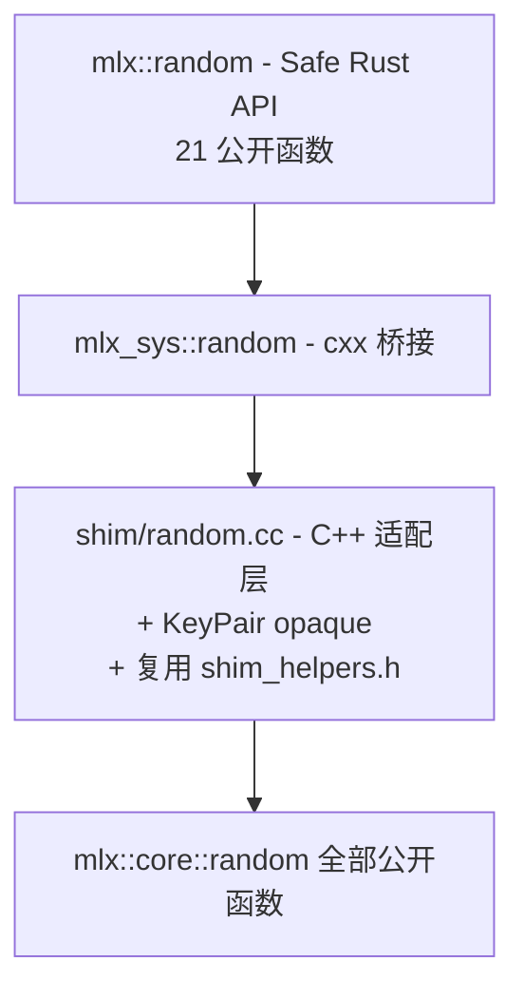

# cxx-mlx P4 · Random 设计文档

**日期**: 2026-05-05
**状态**: 已批准，待实施
**前置**: P0 / P1 / P2a / P2b / P2c / P3 已完成（main HEAD = `369ddc1`）
**作者**: 通过 brainstorming 与 Boss 协作产出

## 目标

为 MLX 随机数子系统提供完整的 Rust 安全绑定。覆盖 `mlx::core::random` 命名空间下全部公开函数（21 个 Rust 公开 fn 对应 13 个 MLX 上游 fn 含 overload 拆分）。

P4 完成后，**LLM 解码 loop 闭环**：用户可以在 MLX 计算图内完成 token 采样（`categorical(logits)`），无需 Rust 端独立 RNG。

## 范围（按基础设施完整性原则，全 surface 覆盖）

### Tier 1 — 状态管理（必备）

| MLX API | Rust API |
|---------|----------|
| `array key(uint64_t seed)` | `key(seed: u64) -> Result<Array>` |
| `void seed(uint64_t seed)` | `seed(seed: u64)` |
| `pair<array, array> split(array key)` | `split(&Array) -> Result<(Array, Array)>` |
| `array split(array key, int num)` | `split_n(&Array, num: i32) -> Result<Array>` |

### Tier 2 — 基本分布

| MLX API | Rust API |
|---------|----------|
| `bits(shape, width=4, key)` | `bits(shape, width, key)` |
| `uniform(low, high, shape, dtype, key)` | `uniform` |
| `uniform(shape, dtype, key)` (默认 0..1) | `uniform_default` |
| `normal(shape, dtype, loc?, scale?, key)` | `normal` |
| `randint(low, high, shape, dtype, key)` | `randint` |

### Tier 3 — 离散分布（含 token sampling 工作主力）

| MLX API | Rust API |
|---------|----------|
| `bernoulli(p, shape, key)` | `bernoulli` |
| `bernoulli(p, key)` (shape 从 p 推) | `bernoulli_default` |
| `categorical(logits, axis, key)` | `categorical` |
| `categorical(logits, axis, num_samples, key)` | `categorical_n` |
| `categorical(logits, axis, shape, key)` | `categorical_shaped` |

### Tier 4 — 特殊分布

| MLX API | Rust API |
|---------|----------|
| `truncated_normal(lower, upper, shape, dtype, key)` | `truncated_normal` |
| `truncated_normal(lower, upper, dtype, key)` (shape 从 broadcast) | `truncated_normal_default` |
| `gumbel(shape, dtype, key)` | `gumbel` |
| `laplace(shape, dtype, loc, scale, key)` | `laplace` |
| `multivariate_normal(mean, cov, shape, dtype, key)` | `multivariate_normal` |

### Tier 5 — 置换

| MLX API | Rust API |
|---------|----------|
| `permutation(array x, axis, key)` | `permutation` |
| `permutation(int n, key)` | `permutation_arange` |

**总计 21 个 Rust 公开函数**。

### 非目标

- **`KeySequence` class**：内部状态管理类。`key(seed)` + `seed(seed)` + 各 distribution 的 optional key 参数已覆盖用户面，无需暴露 class。
- **C++ 标量模板 overload**（`uniform<T,U>(low: T, high: U, ...)`）：cxx 不支持模板。Rust 用户用 `Array::from_slice(&[scalar], &[])` 构造标量 array。
- **`bernoulli(key)` 单 bool overload**：返回 1 个 bool 值的退化形式，YAGNI（用户可调 `bernoulli_default(0.5_array, key)` 等价）。

## 设计原则

1. **完整性**：MLX 上游公开的所有 random 函数都纳入；多个 overload 在 Rust 端拆为不同函数名（`categorical` / `_n` / `_shaped`）
2. **idiomatic Rust 类型**：`Option<&Array>` 而非裸指针；`(Array, Array)` 元组而非 opaque pair
3. **沿用既建模式**：cxx 编码模式直接复用 P2b/P2c/P3
4. **共享 helpers**：把 P3 已有的 `opt_arr` / `opt_i` / `opt_dtype` / `dtype_from_repr` 抽到共享 header（重构 + 新模块都用）

## 架构总览



### 各层职责

| 层 | 职责 | 文件 |
|----|------|------|
| **Shim (C++)** | 把 cxx 不能直接表达的 MLX 类型抹平：`pair<array, array>` → opaque KeyPair；`std::optional<array>` → `*const`；多 overload → 不同函数名 | `mlx-sys/shim/include/cxx_mlx_shim/random.h`, `mlx-sys/shim/src/random.cc` |
| **Bridge (cxx::bridge)** | cxx DSL 声明 ABI；free function 风格（与 P0–P3 一致） | `mlx-sys/src/bridge/random.rs` |
| **Safe (Rust)** | Rust 风格 API：`Option<&Array>` / `Option<Dtype>` / `Result<...>`；`(Array, Array)` 元组返回 | `mlx/src/random.rs` |

## 共享 Helpers 重构（Task 1 必做）

P3 `quantization.cc` 已有匿名 namespace 内的 helpers。P4 random 也需要全部 4 个。**重构方案**：

### 新增 `mlx-sys/shim/include/cxx_mlx_shim/shim_helpers.h`

```cpp
#pragma once

#include <optional>
#include "mlx/array.h"
#include "mlx/dtype.h"

namespace cxx_mlx::helpers {

// pointer → optional<array>。array 拷贝廉价（refcount on array_desc_）。
inline std::optional<mlx::core::array> opt_arr(
    const mlx::core::array* p) {
  return p ? std::optional<mlx::core::array>(*p) : std::nullopt;
}

inline std::optional<int> opt_i(bool has, int32_t v) {
  return has ? std::optional<int>(v) : std::nullopt;
}

// Dtype::Val → Dtype（含完整 14 case switch + throw 兜底）
inline mlx::core::Dtype dtype_from_repr(uint8_t v) {
  switch (static_cast<mlx::core::Dtype::Val>(v)) {
    case mlx::core::Dtype::Val::bool_:    return mlx::core::bool_;
    case mlx::core::Dtype::Val::uint8:    return mlx::core::uint8;
    case mlx::core::Dtype::Val::uint16:   return mlx::core::uint16;
    case mlx::core::Dtype::Val::uint32:   return mlx::core::uint32;
    case mlx::core::Dtype::Val::uint64:   return mlx::core::uint64;
    case mlx::core::Dtype::Val::int8:     return mlx::core::int8;
    case mlx::core::Dtype::Val::int16:    return mlx::core::int16;
    case mlx::core::Dtype::Val::int32:    return mlx::core::int32;
    case mlx::core::Dtype::Val::int64:    return mlx::core::int64;
    case mlx::core::Dtype::Val::float16:  return mlx::core::float16;
    case mlx::core::Dtype::Val::float32:  return mlx::core::float32;
    case mlx::core::Dtype::Val::float64:  return mlx::core::float64;
    case mlx::core::Dtype::Val::bfloat16: return mlx::core::bfloat16;
    case mlx::core::Dtype::Val::complex64:return mlx::core::complex64;
  }
  throw std::runtime_error("unknown Dtype::Val");
}

inline std::optional<mlx::core::Dtype> opt_dtype(bool has, uint8_t v) {
  if (!has) return std::nullopt;
  return dtype_from_repr(v);
}

}  // namespace cxx_mlx::helpers
```

### `quantization.cc` 改用 helpers

把 `quantization.cc` 中的匿名 namespace helpers 删除，文件顶部 `#include "cxx_mlx_shim/shim_helpers.h"` 然后在每个使用处加 `cxx_mlx::helpers::` 前缀（或在 `cxx_mlx` namespace 内 `using namespace cxx_mlx::helpers;`）。

### `random.cc` 直接使用

新写的 `random.cc` 也 include `shim_helpers.h` 同样使用。

## Shim 层设计（`random.h` + `random.cc`）

### `cxx_mlx_shim/random.h`（关键节选）

```cpp
#pragma once

#include <cstdint>
#include <memory>
#include "mlx/array.h"
#include "mlx/random.h"
#include "rust/cxx.h"

namespace cxx_mlx {

using MlxArray = mlx::core::array;

// ===== KeyPair (opaque) =====
// MLX 的 split(key) 返回 std::pair<array, array>；cxx 不支持 pair。
// 包装为 opaque 类，提供 take_first() + take_second() + taken_ bitmap 防双取
// （沿用 P3 QuantizeResult 模式）。
class KeyPair {
 public:
  KeyPair(mlx::core::array first, mlx::core::array second);
  std::unique_ptr<MlxArray> take_first();
  std::unique_ptr<MlxArray> take_second();

 private:
  mlx::core::array first_;
  mlx::core::array second_;
  bool first_taken_ = false;
  bool second_taken_ = false;
};

std::unique_ptr<MlxArray> key_pair_take_first(KeyPair& p);
std::unique_ptr<MlxArray> key_pair_take_second(KeyPair& p);

// ===== State management =====

std::unique_ptr<MlxArray> key(uint64_t seed);
void seed(uint64_t seed);
std::unique_ptr<KeyPair> split(const MlxArray& key);
std::unique_ptr<MlxArray> split_n(const MlxArray& key, int32_t num);

// ===== Distributions（21 个函数，详细签名略，遵循下面模式） =====
// 模式：
//   - 必传 array 用 const MlxArray& 引用
//   - 可选 array 用 const MlxArray*（nullptr=None）
//   - shape 用 rust::Slice<const int32_t>
//   - dtype 用 uint8_t dtype_repr，shim 用 helpers::dtype_from_repr 转换
//   - mode/string 用 rust::Str（本模块无）
//   - seed 用 uint64_t

// 例：uniform 全签名
std::unique_ptr<MlxArray> uniform(
    const MlxArray& low, const MlxArray& high,
    rust::Slice<const int32_t> shape,
    uint8_t dtype_repr,
    const MlxArray* key);

// 例：categorical_n 全签名
std::unique_ptr<MlxArray> categorical_n(
    const MlxArray& logits, int32_t axis, int32_t num_samples,
    const MlxArray* key);

// 例：normal 全签名（含 optional loc/scale）
std::unique_ptr<MlxArray> normal(
    rust::Slice<const int32_t> shape,
    uint8_t dtype_repr,
    const MlxArray* loc, const MlxArray* scale,
    const MlxArray* key);

// ... (其余 17 个函数遵循同模式)

}  // namespace cxx_mlx
```

### `shim/src/random.cc` 关键模式

```cpp
#include "cxx_mlx_shim/random.h"
#include "cxx_mlx_shim/shim_helpers.h"

#include <stdexcept>

namespace cxx_mlx {

using helpers::opt_arr;
using helpers::dtype_from_repr;

// KeyPair
KeyPair::KeyPair(mlx::core::array first, mlx::core::array second)
    : first_(std::move(first)), second_(std::move(second)) {}

std::unique_ptr<MlxArray> KeyPair::take_first() {
  if (first_taken_) throw std::runtime_error("KeyPair::take_first: already taken");
  first_taken_ = true;
  return std::make_unique<MlxArray>(std::move(first_));
}
std::unique_ptr<MlxArray> KeyPair::take_second() {
  if (second_taken_) throw std::runtime_error("KeyPair::take_second: already taken");
  second_taken_ = true;
  return std::make_unique<MlxArray>(std::move(second_));
}

std::unique_ptr<MlxArray> key_pair_take_first(KeyPair& p) { return p.take_first(); }
std::unique_ptr<MlxArray> key_pair_take_second(KeyPair& p) { return p.take_second(); }

// State
std::unique_ptr<MlxArray> key(uint64_t seed) {
  return std::make_unique<MlxArray>(mlx::core::random::key(seed));
}
void seed(uint64_t seed) { mlx::core::random::seed(seed); }

std::unique_ptr<KeyPair> split(const MlxArray& key) {
  auto p = mlx::core::random::split(key);
  return std::make_unique<KeyPair>(std::move(p.first), std::move(p.second));
}
std::unique_ptr<MlxArray> split_n(const MlxArray& key, int32_t num) {
  return std::make_unique<MlxArray>(mlx::core::random::split(key, num));
}

// Distributions（每个函数模式相同）
std::unique_ptr<MlxArray> uniform(
    const MlxArray& low, const MlxArray& high,
    rust::Slice<const int32_t> shape,
    uint8_t dtype_repr,
    const MlxArray* key) {
  std::vector<int> shape_vec(shape.begin(), shape.end());
  return std::make_unique<MlxArray>(mlx::core::random::uniform(
      low, high, shape_vec, dtype_from_repr(dtype_repr), opt_arr(key)));
}

// ... (其余 17 个函数遵循同模式)

}  // namespace cxx_mlx
```

## Bridge 层设计（`mlx-sys/src/bridge/random.rs`）

```rust
//! Bridge for MLX random subsystem.
//!
//! Multiple MLX overloads (categorical × 3, bernoulli × 2, truncated_normal × 2,
//! uniform × 2, permutation × 2) are bound as distinct function names on the
//! Rust side (categorical_n, categorical_shaped, etc.).
//!
//! KeyPair opaque wraps std::pair<array, array> from split(key). Single-use
//! semantics: take_first / take_second each callable once (taken_ bitmap).
//!
//! Optional encodings:
//! - Option<&Array>→ *const MlxArray (nullptr = None)
//! - Dtype → u8 dtype_repr (shim uses dtype_from_repr helper)

#[allow(clippy::missing_safety_doc, clippy::too_many_arguments)]
#[cxx::bridge(namespace = "cxx_mlx")]
pub mod ffi {
    unsafe extern "C++" {
        include!("cxx_mlx_shim/random.h");

        type MlxArray = crate::bridge::array::ffi::MlxArray;
        type KeyPair;

        // ===== KeyPair accessors =====
        fn key_pair_take_first(p: Pin<&mut KeyPair>) -> Result<UniquePtr<MlxArray>>;
        fn key_pair_take_second(p: Pin<&mut KeyPair>) -> Result<UniquePtr<MlxArray>>;

        // ===== State =====
        fn key(seed: u64) -> Result<UniquePtr<MlxArray>>;
        fn seed(seed: u64);  // void return
        fn split(key: &MlxArray) -> Result<UniquePtr<KeyPair>>;
        fn split_n(key: &MlxArray, num: i32) -> Result<UniquePtr<MlxArray>>;

        // ===== Distributions =====
        // bits
        unsafe fn bits(
            shape: &[i32], width: i32,
            key: *const MlxArray,
        ) -> Result<UniquePtr<MlxArray>>;

        // uniform × 2
        unsafe fn uniform(
            low: &MlxArray, high: &MlxArray,
            shape: &[i32], dtype_repr: u8,
            key: *const MlxArray,
        ) -> Result<UniquePtr<MlxArray>>;

        unsafe fn uniform_default(
            shape: &[i32], dtype_repr: u8,
            key: *const MlxArray,
        ) -> Result<UniquePtr<MlxArray>>;

        // normal
        unsafe fn normal(
            shape: &[i32], dtype_repr: u8,
            loc: *const MlxArray, scale: *const MlxArray,
            key: *const MlxArray,
        ) -> Result<UniquePtr<MlxArray>>;

        // randint
        unsafe fn randint(
            low: &MlxArray, high: &MlxArray,
            shape: &[i32], dtype_repr: u8,
            key: *const MlxArray,
        ) -> Result<UniquePtr<MlxArray>>;

        // bernoulli × 2
        unsafe fn bernoulli(
            p: &MlxArray, shape: &[i32],
            key: *const MlxArray,
        ) -> Result<UniquePtr<MlxArray>>;

        unsafe fn bernoulli_default(
            p: &MlxArray,
            key: *const MlxArray,
        ) -> Result<UniquePtr<MlxArray>>;

        // categorical × 3
        unsafe fn categorical(
            logits: &MlxArray, axis: i32,
            key: *const MlxArray,
        ) -> Result<UniquePtr<MlxArray>>;

        unsafe fn categorical_n(
            logits: &MlxArray, axis: i32, num_samples: i32,
            key: *const MlxArray,
        ) -> Result<UniquePtr<MlxArray>>;

        unsafe fn categorical_shaped(
            logits: &MlxArray, axis: i32, shape: &[i32],
            key: *const MlxArray,
        ) -> Result<UniquePtr<MlxArray>>;

        // truncated_normal × 2
        unsafe fn truncated_normal(
            lower: &MlxArray, upper: &MlxArray,
            shape: &[i32], dtype_repr: u8,
            key: *const MlxArray,
        ) -> Result<UniquePtr<MlxArray>>;

        unsafe fn truncated_normal_default(
            lower: &MlxArray, upper: &MlxArray,
            dtype_repr: u8,
            key: *const MlxArray,
        ) -> Result<UniquePtr<MlxArray>>;

        // gumbel
        unsafe fn gumbel(
            shape: &[i32], dtype_repr: u8,
            key: *const MlxArray,
        ) -> Result<UniquePtr<MlxArray>>;

        // laplace
        unsafe fn laplace(
            shape: &[i32], dtype_repr: u8,
            loc: f32, scale: f32,
            key: *const MlxArray,
        ) -> Result<UniquePtr<MlxArray>>;

        // multivariate_normal
        unsafe fn multivariate_normal(
            mean: &MlxArray, cov: &MlxArray,
            shape: &[i32], dtype_repr: u8,
            key: *const MlxArray,
        ) -> Result<UniquePtr<MlxArray>>;

        // permutation × 2
        unsafe fn permutation(
            x: &MlxArray, axis: i32,
            key: *const MlxArray,
        ) -> Result<UniquePtr<MlxArray>>;

        unsafe fn permutation_arange(
            n: i32,
            key: *const MlxArray,
        ) -> Result<UniquePtr<MlxArray>>;
    }
}
```

## 安全层设计（`mlx/src/random.rs`）

关键示例：

```rust
//! MLX random number generation (PRNG).
//!
//! Functional-style RNG: explicit `key(seed) -> Array` returns a PRNG key,
//! which is split via `split(&key)` (returns 2 sub-keys) or `split_n(&key, n)`
//! to get N sub-keys. All distribution functions accept `Option<&Array>` for
//! the key — None uses the global default (set via `seed(seed)`).
//!
//! For LLM token sampling, see [`categorical`] / [`categorical_n`] / [`categorical_shaped`].

use std::pin::Pin;
use crate::{Array, Dtype, Error, Result};

// ===== State =====

pub fn key(seed: u64) -> Result<Array> {
    let inner = mlx_sys::random::ffi::key(seed).map_err(Error::from)?;
    Ok(Array::from_inner(inner))
}

pub fn seed(seed: u64) {
    mlx_sys::random::ffi::seed(seed);
}

pub fn split(key: &Array) -> Result<(Array, Array)> {
    let mut pair = mlx_sys::random::ffi::split(key.as_inner()).map_err(Error::from)?;
    let first = mlx_sys::random::ffi::key_pair_take_first(pair.pin_mut())
        .map_err(Error::from)?;
    let second = mlx_sys::random::ffi::key_pair_take_second(pair.pin_mut())
        .map_err(Error::from)?;
    Ok((Array::from_inner(first), Array::from_inner(second)))
}

pub fn split_n(key: &Array, num: i32) -> Result<Array> {
    let inner = mlx_sys::random::ffi::split_n(key.as_inner(), num)
        .map_err(Error::from)?;
    Ok(Array::from_inner(inner))
}

// ===== Distributions（21 个函数，模式相同） =====

pub fn uniform(
    low: &Array, high: &Array,
    shape: &[i32], dtype: Dtype,
    key: Option<&Array>,
) -> Result<Array> {
    let k = key.map_or(std::ptr::null(), |a| a.as_inner() as *const _);
    // SAFETY: k is null or borrow of `key: &Array` valid for this call.
    let inner = unsafe {
        mlx_sys::random::ffi::uniform(
            low.as_inner(), high.as_inner(), shape, dtype.as_u8(), k,
        )
    }
    .map_err(Error::from)?;
    Ok(Array::from_inner(inner))
}

/// Sample 1 index per row from logits along `axis`. The canonical token
/// sampling op for LLM decoding.
pub fn categorical(
    logits: &Array, axis: i32,
    key: Option<&Array>,
) -> Result<Array> {
    let k = key.map_or(std::ptr::null(), |a| a.as_inner() as *const _);
    // SAFETY: k is null or borrow valid for this call.
    let inner = unsafe {
        mlx_sys::random::ffi::categorical(logits.as_inner(), axis, k)
    }
    .map_err(Error::from)?;
    Ok(Array::from_inner(inner))
}

// ... (其余 18 个 distribution 函数遵循同模式)
```

### lib.rs 改动

```rust
// mlx/src/lib.rs（追加）
pub mod random;
pub use random::{
    bernoulli, bernoulli_default, bits, categorical, categorical_n, categorical_shaped,
    gumbel, key, laplace, multivariate_normal, normal, permutation, permutation_arange,
    randint, seed, split, split_n, truncated_normal, truncated_normal_default,
    uniform, uniform_default,
};
```

## 错误处理

继承 P1/P2/P3 模式：MLX 抛 `runtime_error` → shim 不 catch → cxx `Result<T>` 自动捕获 → 安全层 `Error::from`。

`KeyPair` 的 `take_first`/`take_second` 各自防双取（taken_ bitmap），重复抛 `runtime_error`。

## 测试策略

集成测试 `mlx/tests/p4_random.rs`，全部用显式 `key(42)` 保证确定性。

| 类别 | 测试 |
|------|------|
| **State 管理** | (1) `key(42) == key(42)` 比特一致；(2) `split(k)` 返回 2 个非相同 array；(3) `split_n(k, 5)` 形状 `[5, ...]`；(4) `KeyPair::take_first` 第二次抛 Err |
| **基本分布** | (5) `uniform_default([100], dtype, key)` 全在 `[0, 1)`；(6) `normal([1000], f32, key)` 有限 + mean/std 大致；(7) `randint(0, 10, [100], key)` 值域正确 |
| **离散** | (8) `bernoulli(0.5, [100], key)` 仅 0/1；(9) `categorical(uniform_logits, -1, key)` 索引 in `[0, vocab)`；(10) `categorical_n(logits, -1, 5, key)` 形状 `[batch, 5]` |
| **特殊** | (11) `gumbel([10], key)` 有限；(12) `laplace([10], 0.0, 1.0, key)` 有限；(13) `truncated_normal(0_arr, 1_arr, [100], f32, key)` 全在 `[0, 1]` |
| **置换** | (14) `permutation_arange(10, key)` 是 `0..10` 的某个排列（`sorted(out) == [0..10]`） |
| **Determinism** | (15) `seed(42); uniform(...); seed(42); uniform(...)` 重复结果一致 |
| **Re-export** | (16) `mlx::categorical(...)` 顶层可达 |

预计 **~16 个集成测试**，分布在 6 个 task 中。

## 文件结构总览

```text
cxx-mlx/
├── mlx-sys/
│   ├── build.rs                                       [改] cxx_build 加 random.rs / .cc
│   ├── src/
│   │   ├── lib.rs                                     [改] pub use bridge::random;
│   │   └── bridge/
│   │       ├── mod.rs                                 [改] pub mod random;
│   │       └── random.rs                              [新] cxx 桥接（~22 个 FFI）
│   └── shim/
│       ├── include/cxx_mlx_shim/
│       │   ├── shim_helpers.h                         [新] 共享 helpers（opt_arr/opt_i/dtype_from_repr/opt_dtype）
│       │   └── random.h                               [新] shim 头
│       └── src/
│           ├── quantization.cc                        [改] 改用 shim_helpers.h
│           └── random.cc                              [新] shim 实现 + KeyPair
└── mlx/
    ├── src/
    │   ├── lib.rs                                     [改] pub mod random; + re-exports（在 Task 6）
    │   └── random.rs                                  [新] 安全 API（21 公开函数）
    └── tests/
        └── p4_random.rs                               [新] 集成测试（~15 测试）
```

## 风险与缓解

| 风险 | 缓解 |
|------|------|
| `shim_helpers.h` 重构破坏 P3 测试 | Task 1 同时完成 helpers 抽取 + quantization.cc 改用 include；P3 测试一并跑过通过 |
| 21 个函数体量大但模式重复 | 测试容差较宽（统计性质 + key 确定性）；每 task 都跑全套 fmt/clippy/build/workspace-test |
| `categorical` 三个 overload 二义性 | Rust 端拆 3 个独立 fn 名（`categorical` / `_n` / `_shaped`），shim 端各对应一个 free fn，避免运行时校验 |
| MLX 全局 `seed()` 影响测试隔离 | 测试统一传 `Some(key(42))`，避开默认 KeySequence；不调用全局 `seed()` 仅在专门 determinism 测试用 |
| 共享 helpers namespace 命名冲突 | helpers 放在 `cxx_mlx::helpers` 子 namespace，使用处 `using namespace cxx_mlx::helpers;` 或加前缀 |
| Rust 端 `(Array, Array)` 元组返回顺序 | shim 内部 `split.first` / `split.second` 直接对应 KeyPair 的 first/second，安全层文档说明 first/second 语义 |

## 与后续阶段关系

- **P4 完成 = 解码 loop 闭环**：用户可在 MLX 计算图内完成 token 采样（`categorical(logits)`），无需 Rust 端 RNG。
- **P5（ops 补漏）** 紧随：`gather_mm` / `tensordot` / `block_masked_mm` 等剩余 matmul 变体，按 P1b 模式增量。
- **P6（compile）**：Rust 闭包跨 cxx callback 桥接，复杂度高，需在 P5 之后专门设计。
