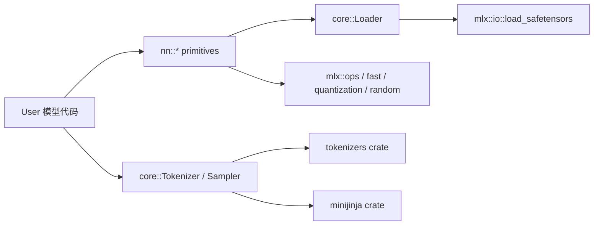

# ironmlx P1: 基础设施 — nn primitives + Loader + Tokenizer + Sampler 设计文档

**日期：** 2026-05-06
**作者：** Claude（与 Boss 协作）
**目标阶段：** ironmlx P1 — 模型推理的基础组件层

---

## 1. 目标与范围

P1 是 ironmlx 的"模型无关"基础设施，为 P2-P7 各阶段提供共享构件。

P1 完成后，应该可以：
- 从本地目录或 HF Hub 路径加载 4-bit / 6-bit / 8-bit / bf16 量化的 safetensors 模型权重
- 用 `nn::Linear` / `Embedding` / `RmsNorm` / `Mrope` / `Mlp` / `Attention` 等原语写出任意 transformer 模型，调 forward 即可推理
- 用 `tokenizers` crate 的 `Tokenizer` + 自带 `ChatTemplate` 处理输入 prompt
- 用 `Sampler` 完整支持 greedy / temperature / top-p / top-k / min-p / repetition penalty / freq+presence penalty 等采样策略

P1 **不**包含：
- KV cache（P2 处理）
- Qwen3.5 特殊算子（gated delta / gated full attention / MTP）— P3
- 模型组装 / generate loop — P4

### 1.1 已批准的决策

| # | 主题 | 决定 |
|---|---|---|
| Q1 | Linear / Embedding 多格式支持 | **C** — 单一 `Linear` 内部 enum auto-dispatch（Fp / Quant），`bits` 字段区分 4/6/8 |
| Q2 | 权重加载策略 | **A** — mmap + eager 全加载 |
| Q3 | Module trait 形态 | **B** — `Loader` + 每层 `from_loader(&Loader, prefix)` 静态构造，**不**抽象 `Module` trait |
| Q4 | Tokenizer | **A** — 薄包装 + 自带 `ChatTemplate`（minijinja 渲染） |
| Q5 | Sampler | **B** — 完整集 |
| Q6 | Forward 签名 | **A+C** — 每层 inherent method + 顶层 Model 统一 forward / generate |

---

## 2. 架构

P1 提供三个独立子层：



模块树：

```
ironmlx/src/
├── lib.rs
├── main.rs
├── cli/                          # 已存在，保持
├── core/
│   ├── mod.rs
│   ├── loader.rs                 # NEW (P1)
│   ├── tokenizer.rs              # NEW (P1)
│   ├── chat_template.rs          # NEW (P1)
│   └── sampler.rs                # NEW (P1)
├── nn/
│   ├── mod.rs                    # 重写（去掉 Module trait）
│   ├── linear.rs                 # NEW — enum dispatch
│   ├── embedding.rs              # NEW — enum dispatch
│   ├── norm.rs                   # NEW — RMSNorm + LayerNorm
│   ├── mrope.rs                  # NEW — multimodal RoPE
│   ├── mlp.rs                    # NEW — SwiGLU MLP（共享 building block）
│   └── attention.rs              # NEW — full attention via fast::sdpa
└── models/                       # 占位，P3+ 填充
```

---

## 3. 详细设计

### 3.1 `core::Loader`

```rust
pub struct Loader {
    /// All tensors loaded at construction (`mlx::io::load_safetensors` 已 mmap）.
    tensors: HashMap<String, Array>,
    /// Quantization metadata read from `config.json`.
    quant: Option<QuantMeta>,
    /// `tokenizer_config.json` decoded — for chat template, eos token, etc.
    tokenizer_config: TokenizerConfig,
    /// Top-level `config.json` as JSON value (model-specific fields are read by
    /// each model's config struct via serde).
    config_raw: serde_json::Value,
}

#[derive(Debug, Clone, Copy)]
pub struct QuantMeta {
    pub group_size: i32,    // 通常 64 / 128
    pub bits: i32,          // 4 / 6 / 8
    pub mode: QuantMode,    // affine 等
}

#[derive(Debug, Clone, Copy)]
pub enum QuantMode { Affine }

impl Loader {
    /// Open from a directory containing `config.json` + `tokenizer*.json`
    /// + `model.safetensors[.index.json]`.
    pub fn open(model_dir: &Path) -> Result<Self>;

    /// Resolve from HF Hub cache; supports `mlx-community/Qwen3.5-4B-MLX-4bit`.
    pub fn from_hf_repo(repo: &str) -> Result<Self>;

    /// Borrow a tensor by full key. Returns `Err` if key absent.
    pub fn tensor(&self, key: &str) -> Result<&Array>;

    /// Like `tensor`, but `None` if absent.
    pub fn tensor_opt(&self, key: &str) -> Option<&Array>;

    /// Whether a key is present.
    pub fn contains(&self, key: &str) -> bool;

    /// Quantization metadata if model is quantized.
    pub fn quant_meta(&self) -> Option<QuantMeta>;

    /// Parse model-specific config into a typed struct via serde.
    pub fn config<T: serde::de::DeserializeOwned>(&self) -> Result<T>;

    /// `tokenizer_config.json` accessor (for `eos_token_id` / chat template).
    pub fn tokenizer_config(&self) -> &TokenizerConfig;
}

#[derive(Debug, Deserialize)]
pub struct TokenizerConfig {
    #[serde(default)]
    pub chat_template: Option<String>,
    #[serde(default)]
    pub eos_token_id: Option<EosTokenId>,
    #[serde(default)]
    pub bos_token_id: Option<u32>,
    #[serde(default)]
    pub pad_token_id: Option<u32>,
}

/// `eos_token_id` may be int or list of ints in HF configs.
#[derive(Debug, Deserialize)]
#[serde(untagged)]
pub enum EosTokenId {
    Single(u32),
    Multi(Vec<u32>),
}
```

**Key 探测能力**：`contains` / `tensor_opt` 是 Linear / Embedding enum dispatch 的入口（探测 `.scales` 字段决定走 Quant 还是 Fp）。

**HF Hub 集成**：通过 `hf-hub` crate（已在 Cargo.toml）。模型路径解析顺序：
1. 字面是本地目录 → 直接 open
2. 形如 `org/repo` → 走 hf-hub 缓存（默认 `$HOME/.cache/huggingface/hub`，但 ironmlx 用 `$HOME/.ironmlx/models` 与 ironmlx 兼容）

### 3.2 `nn::Linear`（enum dispatch）

```rust
pub struct Linear {
    inner: LinearImpl,
}

enum LinearImpl {
    Fp {
        weight: Array,                  // [out, in], dtype 跟随权重
        bias: Option<Array>,
    },
    Quant {
        weight: Array,                  // packed
        scales: Array,
        biases: Option<Array>,          // affine 的 zero-point
        bias: Option<Array>,            // optional Linear bias
        group_size: i32,
        bits: i32,
    },
}

impl Linear {
    /// 加载时根据 `{prefix}.scales` 是否存在自动选 Fp / Quant 路径。
    pub fn from_loader(loader: &Loader, prefix: &str) -> Result<Self>;

    /// Forward: y = x @ W^T (+ bias)。
    pub fn forward(&self, x: &Array) -> Result<Array>;

    /// Stream-aware variant.
    pub fn forward_on(&self, x: &Array, target: impl Into<mlx::StreamOrDevice>) -> Result<Array>;
}
```

**Forward 路径：**

```rust
fn forward(&self, x: &Array) -> Result<Array> {
    match &self.inner {
        LinearImpl::Fp { weight, bias } => {
            // 标准 matmul：MLX 自动按 dtype 走 fast path（bf16/fp16/fp32）
            // 注意：HF 权重通常存为 [out, in]，需要 transpose 到 [in, out]，
            // 或调 quantized_matmul 时设 transpose=true（与 fp 对齐处理见 spec § 3.7）。
            let mut y = x.matmul(&weight.transpose()?)?;
            if let Some(b) = bias { y = &y + b; }
            Ok(y)
        }
        LinearImpl::Quant { weight, scales, biases, bias, group_size, bits } => {
            let mut y = mlx::ops::quantization::quantized_matmul(
                x, weight, scales, biases.as_ref(),
                /* transpose = */ true,
                *group_size, *bits,
            )?;
            if let Some(b) = bias { y = &y + b; }
            Ok(y)
        }
    }
}
```

**from_loader 探测：**

```rust
fn from_loader(loader: &Loader, prefix: &str) -> Result<Self> {
    let scales_key = format!("{prefix}.scales");
    let weight_key = format!("{prefix}.weight");
    let bias_key = format!("{prefix}.bias");

    let weight = loader.tensor(&weight_key)?.clone();
    let bias = loader.tensor_opt(&bias_key).cloned();

    if loader.contains(&scales_key) {
        let qmeta = loader.quant_meta().ok_or_else(|| anyhow!("scales present but no quant meta"))?;
        Ok(Linear { inner: LinearImpl::Quant {
            weight,
            scales:  loader.tensor(&scales_key)?.clone(),
            biases:  loader.tensor_opt(&format!("{prefix}.biases")).cloned(),
            bias,
            group_size: qmeta.group_size,
            bits:       qmeta.bits,
        }})
    } else {
        Ok(Linear { inner: LinearImpl::Fp { weight, bias }})
    }
}
```

### 3.3 `nn::Embedding`（同 enum dispatch 模式）

```rust
pub struct Embedding {
    inner: EmbeddingImpl,
}

enum EmbeddingImpl {
    Fp { weight: Array },               // [vocab, dim]
    Quant {
        weight: Array, scales: Array, biases: Option<Array>,
        group_size: i32, bits: i32,
    },
}

impl Embedding {
    pub fn from_loader(loader: &Loader, prefix: &str) -> Result<Self>;

    /// `tokens: [batch, seq]` of u32 → `[batch, seq, dim]`。
    pub fn forward(&self, tokens: &Array) -> Result<Array>;

    /// 共享权重时反向用作 lm_head（tied embedding）。
    pub fn as_output(&self, hidden: &Array) -> Result<Array>;
}
```

**Tied embedding**：Qwen3.5 配置 `tie_word_embeddings: true`。模型代码可以 `embed.as_output(hidden)` 复用 embedding 权重做 logits 投影。

### 3.4 `nn::RmsNorm`

```rust
pub struct RmsNorm {
    weight: Array,          // [dim]
    eps: f32,
}

impl RmsNorm {
    pub fn from_loader(loader: &Loader, prefix: &str, eps: f32) -> Result<Self>;
    pub fn forward(&self, x: &Array) -> Result<Array> {
        // 强制走 mlx::fast::rms_norm（融合 kernel）
        mlx::fast::rms_norm(x, &self.weight, self.eps)
    }
}
```

`LayerNorm` 同样思路（用 `mlx::fast::layer_norm`），仅在 vision encoder 等地方用到，作为 P1 一并提供。

### 3.5 `nn::Mrope` — 多模态 RoPE

Qwen3.5 用 MRoPE：

- `mrope_section: [11, 11, 10]` — 把 head_dim 切成三段（temporal / height / width）
- `mrope_interleaved: true` — interleaved 而非 split-half
- `partial_rotary_factor: 0.25` — 只前 25% dims 旋转
- `rope_theta: 10000000`

```rust
pub struct Mrope {
    /// 预计算的 inv_freqs（rotary frequencies），形状 [head_dim/2 * partial_factor]
    inv_freqs: Array,
    /// `mrope_section`，例如 `[11, 11, 10]`
    sections: SmallVec<[i32; 4]>,
    /// `partial_rotary_factor`
    partial: f32,
    /// 是否 interleaved
    interleaved: bool,
}

impl Mrope {
    pub fn new(head_dim: i32, theta: f32, partial: f32, sections: &[i32], interleaved: bool) -> Result<Self>;

    /// 给定 position_ids `[batch, 3, seq]`（temporal/height/width 三个流的 pos），
    /// 返回 `(cos, sin)` 用于 attention 中旋转 q/k。
    pub fn cos_sin(&self, position_ids: &Array) -> Result<(Array, Array)>;

    /// 应用旋转：`q_rotated = q * cos + rotate_half(q) * sin`
    pub fn apply(&self, q: &Array, cos: &Array, sin: &Array) -> Result<Array>;
}
```

**实现策略：** 复用 `mlx::fast::rope` 的成熟代码 不一定能覆盖 MRoPE 的 partial + interleaved + 三段 sections 语义。可能需要：
- 先用 `cos`/`sin` 显式计算（`arange` + 标量乘 + `cos` + `sin`）
- 后续在 P3 中视性能再决定是否扩展 cxx-mlx 的 `fast::rope` 接口或贡献到 MLX 上游

P1 阶段先用显式公式，可读性优先。

### 3.6 `nn::Mlp` — SwiGLU MLP

Qwen3.5 standard MLP（非 MoE 路径）：`y = down(silu(gate(x)) * up(x))`。

```rust
pub struct Mlp {
    gate: Linear,
    up: Linear,
    down: Linear,
}

impl Mlp {
    pub fn from_loader(loader: &Loader, prefix: &str) -> Result<Self>;
    pub fn forward(&self, x: &Array) -> Result<Array> {
        let gate = self.gate.forward(x)?;
        let up = self.up.forward(x)?;
        // silu(x) = x * sigmoid(x)
        let activated = (&gate * &gate.sigmoid()?) * &up;
        self.down.forward(&activated)
    }
}
```

### 3.7 `nn::Attention` — full attention via fused SDPA

仅覆盖 **standard full attention**（GQA 兼容）。Qwen3.5 的 gated full attention 和 gated delta SSM 在 P3 处理（`models/qwen3_5/` 内）。

```rust
pub struct Attention {
    q_proj: Linear,
    k_proj: Linear,
    v_proj: Linear,
    o_proj: Linear,
    num_heads: i32,
    num_kv_heads: i32,
    head_dim: i32,
    scale: f32,                 // 1.0 / sqrt(head_dim)
}

impl Attention {
    pub fn from_loader(loader: &Loader, prefix: &str, cfg: &AttnConfig) -> Result<Self>;

    pub fn forward(
        &self,
        x: &Array,
        cos: &Array, sin: &Array,
        mask: Option<&Array>,
        // KV cache 接口在 P2 加；P1 先 stateless prefill-only
    ) -> Result<Array> {
        // 1. project Q/K/V
        let q = self.q_proj.forward(x)?;
        let k = self.k_proj.forward(x)?;
        let v = self.v_proj.forward(x)?;
        // 2. reshape 成 [batch, heads, seq, head_dim]
        // 3. 应用 RoPE（cos/sin 由调用方算好）
        // 4. fused SDPA — 强制走 fast path
        let out = mlx::fast::scaled_dot_product_attention(&q, &k, &v, self.scale, mask)?;
        // 5. reshape 回 [batch, seq, hidden] + o_proj
        self.o_proj.forward(&out_reshaped)
    }
}
```

**P2 时**：扩展 forward 签名加 `cache: Option<&mut KvCache>`。

### 3.8 `core::Tokenizer` + `core::ChatTemplate`

```rust
pub struct Tokenizer {
    inner: tokenizers::Tokenizer,
    chat: ChatTemplate,
    eos_token_ids: Vec<u32>,    // 来自 tokenizer_config.json
}

impl Tokenizer {
    pub fn from_loader(loader: &Loader) -> Result<Self>;
    pub fn encode(&self, text: &str, add_special_tokens: bool) -> Result<Vec<u32>>;
    pub fn decode(&self, tokens: &[u32], skip_special: bool) -> Result<String>;
    pub fn eos_token_ids(&self) -> &[u32];
    pub fn apply_chat_template(&self, messages: &[Message], add_generation_prompt: bool) -> Result<String>;
}

#[derive(Debug, Clone, Serialize)]
pub struct Message {
    pub role: String,           // "user" / "assistant" / "system"
    pub content: String,
}

pub struct ChatTemplate {
    template: minijinja::Environment<'static>,
}

impl ChatTemplate {
    pub fn new(jinja_source: &str) -> Result<Self>;
    pub fn render(&self, messages: &[Message], add_generation_prompt: bool) -> Result<String>;
}
```

**minijinja 集成**：HF chat template 用 jinja2 子集（with `tojson` filter, `raise_exception` 等）。`minijinja` 默认覆盖 90%；可能需要注册自定义 `raise_exception` filter。

### 3.9 `core::Sampler` — 完整集

Q5=B 决定。完整管线：

```rust
pub struct Sampler {
    pub temperature: f32,                   // 0.0 = greedy
    pub top_k: Option<i32>,
    pub top_p: Option<f32>,
    pub min_p: Option<f32>,
    pub repetition_penalty: Option<f32>,
    pub frequency_penalty: Option<f32>,
    pub presence_penalty: Option<f32>,
    pub seed: u64,
    /// PRNG key 由 sampler 自管，每次 sample 后 split 出新 key。
    key: Cell<Array>,
}

impl Sampler {
    pub fn new(seed: u64) -> Result<Self>;

    /// `logits: [vocab]` 一维（已对最后 token 取过 logits）。
    /// `history: &[u32]` 用于 repetition / freq / presence penalty。
    pub fn sample(&self, logits: &Array, history: &[u32]) -> Result<u32>;
}
```

**采样管线（顺序）：**
1. Apply repetition penalty（按 history 中的 token 缩放对应 logit）
2. Apply frequency / presence penalty（按 history token 频率减 logit）
3. Apply temperature scaling（`logits / T`，T==0 跳过且变 greedy 路径）
4. Apply top-k（保留前 k 大，其余设 -inf）
5. Apply min-p（保留 ≥ `top1 * min_p` 的，其余设 -inf）
6. Apply top-p（softmax 后累积概率截断到 p）
7. **Greedy 路径**（T==0）：`argmax(logits)`
8. **Sample 路径**：`mlx::random::categorical(logits).num_samples(1).key(self.key).sample()`

**所有原语已在 cxx-mlx 中**：argmax / topk / softmax / cumsum / sort / categorical 等都已绑定（P5.5 / P5.6）。

### 3.10 测试策略

#### 单元测试（每个 nn 文件 `#[cfg(test)]`）

- `Linear::Fp` 与已知 `[2, 2]` 权重 forward 结果手算对比
- `Linear::Quant` 与 cxx-mlx P3 已有 `quantized_matmul` 测试模式对齐
- `RmsNorm` 与 PyTorch 参考值对比（容差 1e-5）
- `Mrope::cos_sin` 与显式公式对比
- `Sampler` 的 greedy / temperature / top-p / 各个 penalty 单独验证

#### 集成测试（`ironmlx/tests/`）

- `p1_loader.rs` — 加载 `Qwen3.5-4B-MLX-4bit`，断言关键 key 存在（`model.embed_tokens.weight`、`model.layers.0.self_attn.q_proj.weight`、`scales` 等）
- `p1_tokenizer.rs` — 编码/解码 round-trip，chat template 渲染对比
- `p1_attention_forward.rs` — 用真实 weights 跑一次 attention forward，shape 校验

#### CI gate

- 项目门禁全集：`cargo fmt` / nightly fmt --check / clippy -D warnings / build --release / test --release
- 测试覆盖率：单元 ≥ 80% 主要 forward 路径

---

## 4. 任务分解

7 个任务，按依赖顺序：

| # | 任务 | 主要文件 | 依赖 |
|---|---|---|---|
| 1 | `core::Loader` + `QuantMeta` + HF Hub 解析 | `core/loader.rs`、`core/mod.rs` | 无 |
| 2 | `nn::Linear`（fp/quant enum dispatch） | `nn/linear.rs` | T1 |
| 3 | `nn::Embedding` + tied output | `nn/embedding.rs` | T1 |
| 4 | `nn::RmsNorm` + `nn::LayerNorm` | `nn/norm.rs` | T1 |
| 5 | `nn::Mlp`（SwiGLU 共享构件） | `nn/mlp.rs` | T2 |
| 6 | `nn::Mrope`（多模态 RoPE）+ `nn::Attention`（fused SDPA） | `nn/mrope.rs`、`nn/attention.rs` | T2 |
| 7 | `core::Tokenizer` + `ChatTemplate` + `core::Sampler` | `core/tokenizer.rs`、`core/chat_template.rs`、`core/sampler.rs` | T1 |

T1 是基础，T2/T3/T4/T7 可并行（在 T1 完成后）。T5/T6 依赖 T2。

---

## 5. 风险与对策

| 风险 | 对策 |
|---|---|
| MRoPE 实现复杂度（partial + interleaved + sections） | P1 用显式公式（cos/sin from arange + scalar mul），可读性优先；P3 视性能决定优化 |
| jinja2 chat template 覆盖度（minijinja 子集） | 先实现 90% case；遇到不支持的 filter 单独 register；测试用真实 Qwen3.5 chat_template |
| HF Hub 路径与 ironmlx 历史目录共存 | Loader 优先尝试 `$HOME/.ironmlx/models/...`，再 fallback `$HOME/.cache/huggingface/...` |
| 4-bit safetensors 元数据解析 | `config.json.quantization` 字段解析；`.scales` / `.biases` 命名约定固定 |
| Sampler 多种 penalty 的算子组合性能 | 全部走 cxx-mlx 已绑定算子；hot path 用 `compile()` shapeless 编译 |
| Linear forward 的 transpose 开销 | fp 路径权重是 `[out, in]`，每次 forward `transpose` 会引入开销；评估是否在 from_loader 时一次性 transpose 缓存 |

---

## 6. 与后续阶段的关系

P1 完成后：
- **P2** — KV cache 由 `core::cache` 模块独立管理，`nn::Attention::forward` 扩展接受 `cache: Option<&mut KvCache>`
- **P3** — Qwen3.5 特殊算子（gated delta SSM / gated full attn / RMSNormGated / MTP）放入 `models/qwen3_5/`，复用 P1 的 `Linear` / `RmsNorm` / `Mrope`
- **P4** — Qwen3.5 Dense 模型组装：用 P1 的 building block + P3 的特殊算子组装 `Qwen35Model`
- **P5** — Qwen3.5 MoE 变体：独立 `models/qwen3_5_moe/`，复用 P1 但不复用 P3 的 dense 实现细节
- **P6** — Vision encoder：扩展 P1 `nn::LayerNorm` + 卷积层（vision encoder 有 patch embed conv），可能要给 cxx-mlx 加 `conv` 算子
- **P7** — benchmark CLI 在 P4 跑通后衡量 prefill / decode TPS

---
