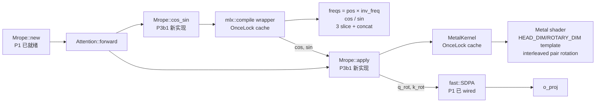

# ironmlx P3b1 — MRoPE Finish 设计

**目标：** 完成 P1 留下的 `Mrope::cos_sin` 与 `Mrope::apply` stub 实现，端到端解锁 `Attention::forward`，让 Qwen3.5 attention 块可真实运行并通过数值正确性验证。

**作用域：**
- `ironmlx/src/nn/mrope.rs` — 完整实现 `cos_sin` + `apply`
- `ironmlx/src/nn/attention.rs` — 去掉 forward 的占位 `Err`，wire 真实 cos_sin → apply → SDPA 链路
- `ironmlx/tests/fixtures/p3b1_mrope/` — mlx-lm 生成的 .npy fixture + 生成脚本
- `ironmlx/tests/p3b1_mrope.rs` — 集成测试（数值正确性 + 端到端 attention）

**依赖：**
- P1 — `Mrope::new`, `Attention` scaffolding
- P2 — `KVCache`（用于 decode 路径，但 P3b1 测试不必涵盖 cache，cache 已由 P2 验证）
- **P3a — `mlx::MetalKernel` + `DispatchBuilder` typestate（P3b1 重度依赖）**

---

## § 1 决策摘要

| 决策维度 | 选择 | 来源 |
|---|---|---|
| `cos_sin` 实现策略 | `mlx::compile` 包装多个 MLX 原语，跨层共享 | ChatGPT 提示"cos/sin 跨层复用"洞察 + Boss 性能优先 |
| sections 切分实现 | 3 次 slice + 1 次 concat 沿最后一维（C-A） | mlx::compile fuse 友好度最高 |
| `apply` 实现策略 | fused metal_kernel，4 inputs / 2 outputs 一次 dispatch | Boss 性能优先；省一半 launch overhead |
| Q+K 是否合并 dispatch | 合并（B 方案） | 32 launch / token vs 64 launch / token |
| `template_int` 范围 | `HEAD_DIM` + `ROTARY_DIM`（精准 b+ 方案） | ChatGPT 提示"MRoPE apply 是 memory-bound，rotate loop 才是关键"，runtime: B/seq/num_heads |
| 数值参考来源 | mlx-lm Python 生成 fixture .npy | 项目已唯一依赖 mlx-lm（P0 约束） |
| Attention.forward 解锁 | P3b1 范围内 | MRoPE 正确性的端到端验证手段 |

---

## § 2 架构



**热路径分析（per token, 32 layers）：**

| op | 频次 / token | 实现 | cost |
|---|---|---|---|
| `cos_sin` | 1（跨层共享） | mlx::compile | ~50µs（fused） |
| `apply` (Q + K) | 32（每层 1 次合并 dispatch） | metal_kernel | 32 × 10µs = ~320µs |
| **MRoPE 总开销** | | | **~370µs / token** |

按 100 tok/s 目标（10ms / token）下 attention 子模块预算 ~3ms / token，MRoPE 占 12% — 在预算内。

---

## § 3 详细设计

### 3.1 `cos_sin` 实现

**算法：** 给定 `position_ids: [3, B, S]`（temporal/height/width 三个 stream）和 `inv_freq: [rot_dim/2]`，计算 `(cos, sin)` 各形状 `[B, S, rot_dim/2]`。每个最后一维位置 `d` 由其所属 section 决定从哪个 stream 取 freq：

```
sections = [11, 11, 10]  # Qwen3.5
offsets  = [0, 11, 22, 32]  # cumulative

cos[b, t, d] where d ∈ [offsets[s], offsets[s+1]):
    cos[b, t, d] = cos(position_ids[s, b, t] * inv_freq[d])
```

**实现：** 用 `mlx::compile` 把多 op 流水线 fuse 成尽量少的 kernel。`OnceLock` 缓存编译结果，整 model 一次编译。

```rust
// ironmlx/src/nn/mrope.rs

use std::sync::OnceLock;

use mlx::compile::CompiledFn;
use mlx::ops::{concat, slice};
use mlx::{Array, Dtype, Result};

pub struct Mrope {
    inv_freq: Array,
    sections: SmallVec<[i32; 4]>,
    interleaved: bool,
    rot_dim: i32,
    head_dim: i32,
    cos_sin_compiled: OnceLock<CompiledFn>,
    apply_kernel: OnceLock<MetalKernel>,
}

impl Mrope {
    pub fn cos_sin(&self, position_ids: &Array) -> Result<(Array, Array)> {
        let f = self.cos_sin_compiled.get_or_init(|| {
            self.build_cos_sin_pipeline()
        });
        let mut outputs = f.invoke(&[position_ids.clone(), self.inv_freq.clone()])?;
        let cos = outputs.take_at(0)?;
        let sin = outputs.take_at(0)?;  // erase-and-shift
        Ok((cos, sin))
    }

    fn build_cos_sin_pipeline(&self) -> CompiledFn {
        // Capture sections offsets at compile time (model constants).
        let offsets: Vec<i32> = self.sections
            .iter()
            .scan(0_i32, |acc, &n| { let cur = *acc; *acc += n; Some(cur) })
            .chain(std::iter::once(self.sections.iter().sum()))
            .collect();  // e.g. [0, 11, 22, 32]
        let n_streams = self.sections.len() as i32;

        mlx::compile::compile(move |inputs: &[Array]| -> Result<Vec<Array>> {
            let pos = &inputs[0];        // [n_streams, B, S], i32
            let inv_freq = &inputs[1];   // [half], fp32

            // 1. broadcast multiply: pos[s,b,t] * inv_freq[d]
            //    pos -> [n_streams, B, S, 1]; inv_freq -> [1, 1, 1, half]
            let pos_f = pos.astype(Dtype::Float32)?;
            let pos_unsq = pos_f.expand_dims(-1)?;
            let inv_freq_unsq = inv_freq.reshape(&[1, 1, 1, -1])?;
            let freqs = (&pos_unsq * &inv_freq_unsq)?;  // [n_streams, B, S, half]

            // 2. cos / sin
            let cos_per_stream = freqs.cos()?;
            let sin_per_stream = freqs.sin()?;

            // 3. C-A: per-section slice along stream-axis + last-axis,
            //    then concat. Conceptually:
            //
            //        for s in 0..n_streams:
            //            seg_cos = cos_per_stream[s, :, :, offsets[s]..offsets[s+1]]
            //            seg_sin = sin_per_stream[s, :, :, offsets[s]..offsets[s+1]]
            //        cos = concat(seg_cos for s, axis=-1)   // [B, S, half]
            //        sin = concat(seg_sin for s, axis=-1)
            //
            // Concrete MLX API (slice + squeeze + concat) details left to
            // writing-plans / implementation; sections offsets are model
            // constants captured into the closure at compile time.

            Ok(vec![cos, sin])
        })
    }
}
```

**dtype 策略：**
- `position_ids`: `i32`（Qwen3.5 标准）
- 中间 `freqs`: `fp32`（trig 数值稳定性）
- 输出 `cos`/`sin`: `fp32`（caller 在 apply 内做 cast）

### 3.2 `apply` 实现

**接口：** 一次 dispatch 同时旋转 Q 和 K。

```rust
impl Mrope {
    pub fn apply(
        &self,
        q: &Array,    // [B, Hq, S, HEAD_DIM]
        k: &Array,    // [B, Hkv, S, HEAD_DIM]
        cos: &Array,  // [B, S, ROT_PAIRS], fp32
        sin: &Array,  // [B, S, ROT_PAIRS], fp32
    ) -> Result<(Array, Array)> {
        let kernel = self.apply_kernel.get_or_init(|| {
            self.build_apply_kernel().expect("apply kernel compiles")
        });

        let (b, hq, s, _) = (q.shape().get(0), q.shape().get(1), q.shape().get(2), ());
        let hkv = k.shape().get(1);
        // grid: cover (B*(Hq+Hkv)) × S × HEAD_DIM elements
        let grid_x = b * (hq + hkv);
        let grid_y = s;
        let grid_z = self.head_dim;
        // threadgroup: 1 thread per head_dim element; 1 work-item per (qk_head, t)
        let tg = (1, 1, self.head_dim);  // tuned later if needed

        let mut outputs = kernel
            .dispatch_builder()
            .inputs(&[q, k, cos, sin])
            .output_shapes(&[q.shape().clone(), k.shape().clone()])
            .output_dtypes(&[q.dtype(), k.dtype()])
            .grid(grid_x, grid_y, grid_z)
            .threadgroup(tg.0, tg.1, tg.2)
            .template_int("HEAD_DIM", self.head_dim)
            .template_int("ROTARY_DIM", self.rot_dim)
            .dispatch()?;

        let q_out = outputs.take_at(0)?;
        let k_out = outputs.take_at(0)?;  // erase-and-shift
        Ok((q_out, k_out))
    }
}
```

**Metal kernel source：**

```rust
fn build_apply_kernel(&self) -> Result<MetalKernel> {
    let src = r#"
constexpr uint ROT_PAIRS = ROTARY_DIM / 2;

uint qk_head = thread_position_in_grid.x;  // 0 .. B*(Hq+Hkv)
uint t       = thread_position_in_grid.y;  // 0 .. S
uint d       = thread_position_in_grid.z;  // 0 .. HEAD_DIM

uint Hq = q_shape[1], Hkv = k_shape[1];
uint S  = q_shape[2];
uint B  = q_shape[0];

// Decode (b, head_idx, is_q)
bool is_q = qk_head < B * Hq;
uint b, h;
if (is_q) {
    b = qk_head / Hq;
    h = qk_head % Hq;
} else {
    uint k_qk_head = qk_head - B * Hq;
    b = k_qk_head / Hkv;
    h = k_qk_head % Hkv;
}

// Index into the right input/output array
device const auto* in_arr  = is_q ? q  : k;
device       auto* out_arr = is_q ? q_out : k_out;
uint H = is_q ? Hq : Hkv;
uint stride_b = H * S * HEAD_DIM;
uint stride_h = S * HEAD_DIM;
uint stride_t = HEAD_DIM;
uint base = b * stride_b + h * stride_h + t * stride_t;

if (d < ROTARY_DIM) {
    // Interleaved layout: pair (2p, 2p+1) shares cos[p]/sin[p]
    uint p = d / 2;
    bool is_even = (d % 2) == 0;

    // Load self + pair element
    auto x_self = in_arr[base + d];
    auto x_pair = in_arr[base + (is_even ? d + 1 : d - 1)];

    // Load cos/sin (always fp32, broadcast on heads dim)
    uint cs_idx = b * S * ROT_PAIRS + t * ROT_PAIRS + p;
    float c = cos[cs_idx];
    float s = sin[cs_idx];

    // Rotate (compute in fp32 then cast to x dtype)
    float rotated = is_even
        ? (float(x_self) * c - float(x_pair) * s)
        : (float(x_pair) * s + float(x_self) * c);
    out_arr[base + d] = decltype(x_self)(rotated);
} else {
    // Pass-through tail (head_dim - rot_dim channels)
    out_arr[base + d] = in_arr[base + d];
}
"#;

    MetalKernel::builder("mrope_apply_qk")
        .inputs(&["q", "k", "cos", "sin"])
        .outputs(&["q_out", "k_out"])
        .source(src)
        .build()
}
```

### 3.3 Attention.forward 解锁

P1 留下：

```rust
pub fn forward(...) -> Result<Array> {
    // ... q, k, v projection + qk_norm ...
    // ... mrope.apply(q, ...) and mrope.apply(k, ...) — currently Err
    Err(anyhow!("Attention forward needs P3 MRoPE wiring"))
}
```

P3b1 改造：去掉末尾 `Err` 占位，替换 `Mrope::apply` 调用方式（从两次单 Q/K apply → 一次合并 apply）：

```rust
let (cos, sin) = self.mrope.cos_sin(position_ids)?;
let (q_rot, k_rot) = self.mrope.apply(&q, &k, &cos, &sin)?;
// ... existing fast::SDPA(q_rot, k_rot, v, ...) chain
```

> 注意：P1 的 Attention forward 旧代码可能已经 wire 了"分别 apply Q 和 K"的形式。P3b1 在 attention.rs 里改成"一次合并 apply"调用，与新 Mrope::apply 签名一致。

---

## § 4 测试策略

### 4.1 测试矩阵

| 测试 | 类别 | 验证内容 | Reference / Tolerance |
|---|---|---|---|
| `mrope_construction` (P1 已有) | unit | new() 参数计算正确 | self assert |
| `cos_sin_shape_dtype` | unit | 输出 shape `[B, S, rot_dim/2]`, dtype fp32 | self assert |
| `apply_shape_dtype` | unit | 输出与输入同 shape 同 dtype | self assert |
| `cos_sin_vs_mlx_lm_fixture` | integration | 数值与 mlx-lm reference 一致 | fp32, atol=1e-5 |
| `apply_vs_mlx_lm_fixture` | integration | 数值与 mlx-lm reference 一致 | bf16 atol=1e-3, fp32 atol=1e-5 |
| `partial_rotary_tail_unchanged` | boundary | apply 输出最后 (head_dim - rot_dim) 维 = 输入未旋转部分 | exact equality |
| `decode_seq_eq_one` | boundary | seq=1 cos_sin + apply 跑通 | shape + 数值 |
| `interleaved_pair_known_values` | boundary | 手工构造 input/cos/sin，验证 (even, odd) 旋转公式 | exact (fp32) |
| `gqa_q_k_different_heads` | boundary | Q 64 heads + K 8 heads 同 kernel 路径正确 | fixture compare |
| `attention_forward_e2e` | integration | 单层 Qwen3.5 Attention forward 输出与 mlx-lm 一致 | bf16 atol=1e-3 |

### 4.2 mlx-lm fixture 生成

`ironmlx/tests/fixtures/p3b1_mrope/gen_fixture.py`：

```python
# 1. 用 mlx-lm 加载 Qwen3.5-4B-MLX-4bit 的 layer 0 attention
# 2. 输入：固定的 hidden_state (B=1, S=8, hidden=4096)、position_ids
# 3. 在 attention forward 内部 hook 出：
#    - q, k (after q_proj/k_proj/q_norm/k_norm)
#    - cos, sin (from mrope)
#    - q_rot, k_rot (after mrope.apply)
#    - attn_output (after SDPA + o_proj)
# 4. 序列化成 .npy:
#    - input_q.npy, input_k.npy, input_cos.npy, input_sin.npy
#    - expected_cos.npy, expected_sin.npy (再独立计算一次 mrope.cos_sin 验证)
#    - expected_q_rot.npy, expected_k_rot.npy
#    - expected_attn_out.npy
# 5. 在脚本内 assert mlx_lm.__version__ == EXPECTED_VERSION
```

**fixture 文件大小估计：** Qwen3.5-4B `head_dim=256, num_q_heads=64, num_kv_heads=8, B=1, S=8`，bf16：
- q: `1 * 64 * 8 * 256 * 2B` = 256KB
- k: `1 * 8 * 8 * 256 * 2B` = 32KB
- cos/sin: `1 * 8 * 32 * 4B` = 1KB each
- expected_q_rot, expected_k_rot, expected_attn_out: 类似

总计约 **800KB**，可接受 commit 进 repo 作 fixture。

### 4.3 fixture 加载 helper

```rust
// ironmlx/tests/p3b1_mrope.rs
fn load_fixture(name: &str) -> Array {
    let path = format!("tests/fixtures/p3b1_mrope/{name}.npy");
    mlx::io::load(&path).expect("fixture loads")
}
```

依赖 `mlx::io::load_npy`（P2c 已实现）。

---

## § 5 风险

| 风险 | 缓解 |
|---|---|
| **Metal shader interleaved pair 几何写错**（even/odd 索引、cos/sin 符号） | 4.1 `interleaved_pair_known_values` 手工小数据测试提前发现 |
| **mlx::compile fusion 不到预期** | cos_sin 1次/forward，影响小；接受 fallback 的多 launch |
| **dtype mixed precision (cos/sin fp32 vs x bf16)** | kernel 内显式 `float(x) ... -> decltype(x)(rotated)` cast；测试覆盖 bf16 路径 |
| **mlx-lm fixture 与项目 mlx-lm 版本不一致** | 锁定 mlx-lm 版本到 P0 约束；fixture 生成脚本 `assert mlx_lm.__version__` |
| **GQA Hq != Hkv 同 kernel 处理** | grid first-dim 跨 Q+K 分区；fixture test (`gqa_q_k_different_heads`) 覆盖 |
| **MetalKernel 第一次编译延迟** | OnceLock 缓存；模型加载时 warm-up 触发首次编译 |

---

## § 6 实施任务划分（建议给 writing-plans）

| Task | 内容 | 文件 | 时间 |
|---|---|---|---|
| **T1** | `cos_sin` 实现 + `OnceLock<CompiledFn>` 缓存 + 单元测试 (shape/dtype) | `mrope.rs` | 1 天 |
| **T2** | `apply` Metal shader 编写 + `OnceLock<MetalKernel>` 缓存 + 单元测试 (shape/dtype) + boundary tests | `mrope.rs` | 2 天 |
| **T3** | `gen_fixture.py` 编写 + 生成 fixture .npy + 集成测试 (cos_sin / apply 数值正确性) | `tests/fixtures/`, `tests/p3b1_mrope.rs` | 1 天 |
| **T4** | `Attention::forward` 解锁 + 端到端集成测试 | `attention.rs`, `tests/p3b1_mrope.rs` | 1 天 |
| **合计** | | | **5 天** |

---

## § 7 后续依赖项（不在 P3b1 范围内）

P3b1 完成后解锁：
- **P3b2 — Gated Full Attention**：在标准 Attention 上叠 gate proj + sigmoid，复用 P3b1 完成的 `Attention::forward`
- **P4 — Qwen3.5 Dense E2E**：组装 32-layer Qwen3.5 Dense 模型；P3b1 的 attention 是基础组件
- **P3b3 — Gated Delta Net**：与 P3b1 无强依赖；P3a metal_kernel 是共同基础

---

## § 8 验收标准

P3b1 视为完成，当且仅当：

1. `cargo test --release -p ironmlx --lib mrope` 全部通过
2. `MLX_DIR=$HOME/.local/mlx cargo test --release -p ironmlx --test p3b1_mrope` 全部通过
3. `cargo +nightly fmt --check && cargo +nightly clippy --workspace --exclude ironmlx-app -- -D warnings && cargo build --release` clean
4. `attention_forward_e2e` 集成测试通过：单层 Qwen3.5 Attention forward 输出 vs mlx-lm，bf16 atol=1e-3
5. `Attention::forward` 不再有占位 `Err` return（grep 确认）
