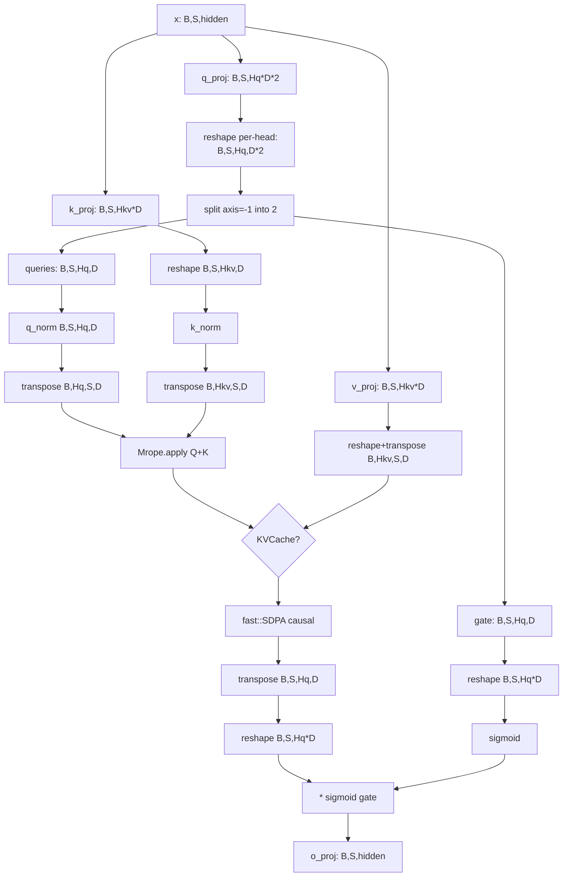

# ironmlx P3b2 — Gated Full Attention 设计

**目标：** 实现 Qwen3.5 / Qwen3-Next 唯一的 attention 路径 — gated full attention（即 mlx-lm 中的 `Qwen3NextAttention`，被 `qwen3_5.py` 直接 `as Attention` 引入）。新增 `nn::GatedAttention` 与 P1 `nn::Attention`（standard）并存。

**作用域：**
- 新增 `ironmlx/src/nn/gated_attention.rs` — `GatedAttention` + `GatedAttentionConfig` + `from_loader` + `forward` / `forward_on`
- 修改 `ironmlx/src/nn/mod.rs` — 暴露新模块
- 扩展 `ironmlx/tests/fixtures/p3b1_mrope/gen_fixture.py` 增加 gated attention 小规模 fixture（或新建 `tests/fixtures/p3b2_gated_attention/`，独立于 P3b1）
- 新增 `ironmlx/tests/p3b2_gated_attention.rs` 集成测试

**依赖：**
- P1 `Linear`, `RmsNorm`
- P2 `KVCache`
- P3b1 `Mrope::cos_sin` + `Mrope::apply`（已 production-grade）
- cxx-mlx `mlx::fast::scaled_dot_product_attention_on`

**P1 `nn::Attention`**（standard）保留不动。

---

## § 1 调研发现与决策摘要

### 关键背景（在 brainstorming 阶段确认）

通过对照 mlx-lm `qwen3_5.py:18` 与 `qwen3_next.py:82` 发现：

```python
# mlx-lm/mlx_lm/models/qwen3_5.py:18
from .qwen3_next import Qwen3NextAttention as Attention
```

**Qwen3.5 直接复用 Qwen3-Next 的 gated attention**，这意味着：

1. **Qwen3.5 = hybrid 模型**（不是纯 dense），与 Qwen3-Next 同架构 — `GatedDeltaNet` 与 `GatedFullAttention` 按 `full_attention_interval` 交替
2. **Qwen3.5 唯一的 attention 路径就是 gated full attention** — P1 实现的 standard `nn::Attention` 在 Qwen3.5 推理路径中**不会被调用**（它对应 legacy Qwen3 / Qwen2 等模型）
3. vllm-mlx 的 `qwen3_5_mllm.py` patch 也基于同一份 attention 代码 — confirmed canonical form

### 决策

| 决策维度 | 选择 | 来源 |
|---|---|---|
| 命名空间组织 | 新建 `nn::GatedAttention`（B 路线），保留 `nn::Attention` 不动 | Boss 选 B；DRY 损失换路径独立 |
| q_proj 布局 | 单一 q_proj 输出 `num_heads * head_dim * 2`，按 per-head reshape 后 split（mlx-lm 一致） | 与官方权重 layout 对齐 |
| Gate 应用位置 | SDPA 输出 reshape 回 `[B, S, Hq*D]` 后，乘 `sigmoid(gate)`，再过 o_proj | mlx-lm `qwen3_next.py:158` |
| Config 共用 | 新建 `GatedAttentionConfig`，与 `AttentionConfig` 独立 | 两者可能未来分化 |
| q/k_norm | 始终启用（不像 P1 Attention 把 has_qk_norm 设可选） | Qwen3.5 始终 has_qk_norm=true |
| 测试策略 | 小规模 fixture（B=1, S=4, Hq=4, Hkv=2, D=8）避免 1GB 权重 | weight 体量限制 |

---

## § 2 算法 / 数据流

与 P1 `Attention::forward` 唯一两处差异：

```
diff vs P1:
  q_proj 输出维度:   num_heads * head_dim         →  num_heads * head_dim * 2
  o_proj 输入:       sdpa_out.reshape(B,S,H*D)    →  sdpa_out.reshape(B,S,H*D) * sigmoid(gate)
```

完整数据流（参照 mlx-lm `Qwen3NextAttention.__call__`）：



**热路径分析**（per token, 32 layers，对照 P3b1 MRoPE 的 0.32ms / token）：

| op | 频次 / token | 估算 cost |
|---|---|---|
| q/k/v_proj | 32 × 3 | 大 matmul，~200µs / layer × 32 ≈ 6.4ms（共占大头） |
| reshape + split | 32 × 1 | view ops，~µs 级 |
| q_norm/k_norm | 32 × 2 | RMSNorm fused kernel，~5µs |
| Mrope.apply | 32 × 1 | 已知 ~10µs / dispatch |
| SDPA | 32 × 1 | ~50-100µs / layer |
| sigmoid + element-wise mul | 32 × 1 | ~5µs，可被 mlx::compile fuse |
| o_proj | 32 × 1 | matmul，~200µs / layer |

Gate 引入的 sigmoid + mul 开销 ≈ **160µs / token 总计**（占 attention 整体 < 5%），不构成性能瓶颈。

---

## § 3 详细设计

### 3.1 配置

```rust
// ironmlx/src/nn/gated_attention.rs
#[derive(Debug, Clone, Copy)]
pub struct GatedAttentionConfig {
    pub num_heads: i32,         // Q heads (Qwen3.5: 64)
    pub num_kv_heads: i32,      // K/V heads after GQA (Qwen3.5: 8)
    pub head_dim: i32,          // (Qwen3.5: 256)
    pub rms_norm_eps: f32,      // (Qwen3.5: 1e-6)
    pub attention_bias: bool,   // (Qwen3.5: false; Linear bias 字段)
}
```

> 不像 P1 `AttentionConfig`，`GatedAttentionConfig` 不需要 `has_qk_norm` — Qwen3.5 系列必须有 q/k_norm。

### 3.2 struct + from_loader

```rust
pub struct GatedAttention {
    q_proj: Linear,             // out_features = num_heads * head_dim * 2
    k_proj: Linear,             // out_features = num_kv_heads * head_dim
    v_proj: Linear,             // out_features = num_kv_heads * head_dim
    o_proj: Linear,             // in_features  = num_heads * head_dim
    q_norm: RmsNorm,
    k_norm: RmsNorm,
    cfg: GatedAttentionConfig,
    scale: f32,
}

impl GatedAttention {
    pub fn from_loader(loader: &Loader, prefix: &str, cfg: GatedAttentionConfig) -> Result<Self> {
        let q_proj = Linear::from_loader_with_bias(loader, &format!("{prefix}.q_proj"), cfg.attention_bias)?;
        let k_proj = Linear::from_loader_with_bias(loader, &format!("{prefix}.k_proj"), cfg.attention_bias)?;
        let v_proj = Linear::from_loader_with_bias(loader, &format!("{prefix}.v_proj"), cfg.attention_bias)?;
        let o_proj = Linear::from_loader_with_bias(loader, &format!("{prefix}.o_proj"), cfg.attention_bias)?;
        let q_norm = RmsNorm::from_loader(loader, &format!("{prefix}.q_norm"), cfg.rms_norm_eps)?;
        let k_norm = RmsNorm::from_loader(loader, &format!("{prefix}.k_norm"), cfg.rms_norm_eps)?;

        // Sanity: q_proj 输出维度必须是 2 × Hq × D
        let expected_q_out = (cfg.num_heads * cfg.head_dim * 2) as usize;
        if q_proj.out_features() != expected_q_out {
            return Err(anyhow!(
                "GatedAttention: q_proj out_features={} != expected {} (Hq={}, D={}, gated 2x)",
                q_proj.out_features(),
                expected_q_out,
                cfg.num_heads,
                cfg.head_dim
            ));
        }

        let scale = 1.0 / (cfg.head_dim as f32).sqrt();
        Ok(Self { q_proj, k_proj, v_proj, o_proj, q_norm, k_norm, cfg, scale })
    }

    pub fn config(&self) -> &GatedAttentionConfig {
        &self.cfg
    }
}
```

> **API 假设**: `Linear` 暴露 `out_features()` 与 `from_loader_with_bias`。implementation 阶段如 P1 `Linear` 现有 API 不同，相应调整（可能改为 `Linear::from_loader` 自动推断 bias，或在测试时手动构造）。

### 3.3 forward / forward_on

签名与 P1 `Attention::forward_on` 完全平行（drop-in replacement）：

```rust
pub fn forward(
    &self,
    x: &Array,
    mrope: &Mrope,
    cos: &Array,
    sin: &Array,
    mask: Option<&Array>,
    cache: Option<&mut KVCache>,
) -> Result<Array> {
    self.forward_on(x, mrope, cos, sin, mask, cache, ())
}

#[allow(clippy::too_many_arguments)]
pub fn forward_on(
    &self,
    x: &Array,                          // [B, S, hidden]
    mrope: &Mrope,
    cos: &Array,                        // [B, S, ROT_PAIRS] fp32（Mrope::cos_sin 输出）
    sin: &Array,                        // [B, S, ROT_PAIRS] fp32
    mask: Option<&Array>,
    cache: Option<&mut KVCache>,
    target: impl Into<StreamOrDevice>,
) -> Result<Array> {
    let _ = mask;  // currently always causal; explicit masks 待 P2 + 之后扩展
    let target = target.into();

    let dims = x.shape().as_slice();
    let batch = dims[0];
    let seq = dims[1];
    let h_q = self.cfg.num_heads;
    let h_kv = self.cfg.num_kv_heads;
    let d = self.cfg.head_dim;

    // Step 1: project Q (2×) and K, V
    let q_full = self.q_proj.forward_on(x, target)?;   // [B, S, Hq * D * 2]
    let k = self.k_proj.forward_on(x, target)?;        // [B, S, Hkv * D]
    let v = self.v_proj.forward_on(x, target)?;        // [B, S, Hkv * D]

    // Step 2: per-head reshape Q, then split last axis into queries + gate
    //   - reshape: [B, S, Hq, D*2]   ← per-head layout matches q_proj weight matrix rows
    //   - split:   2 × [B, S, Hq, D]
    let q_per_head = q_full.reshape_on((batch, seq, h_q, d * 2), target)?;
    // mlx::ops::split returns Vec<Array>; index 0 = queries, index 1 = gate
    let mut parts = mlx::ops::shape::split_on(&q_per_head, 2, -1, target)?;
    let gate_per_head = parts.pop().expect("split into 2 returned 1 element");
    let queries = parts.pop().expect("split into 2 returned 0 elements");

    // gate 不需要 norm/rope — flatten 到 [B, S, Hq * D] 留作 sigmoid 输入
    let gate_flat = gate_per_head.reshape_on((batch, seq, h_q * d), target)?;

    // Step 3: q_norm + transpose Q to SDPA layout [B, Hq, S, D]
    let queries = self.q_norm.forward_on(&queries, target)?;
    let queries = queries.transpose_axes_on(&[0, 2, 1, 3][..], target)?;

    // Step 4: reshape + k_norm + transpose K, V
    let k = k.reshape_on((batch, seq, h_kv, d), target)?;
    let k = self.k_norm.forward_on(&k, target)?;
    let k = k.transpose_axes_on(&[0, 2, 1, 3][..], target)?;

    let v = v.reshape_on((batch, seq, h_kv, d), target)?;
    let v = v.transpose_axes_on(&[0, 2, 1, 3][..], target)?;

    // Step 5: rotate Q + K via fused MetalKernel (P3b1)
    let (queries, k) = mrope.apply(&queries, &k, cos, sin)?;

    // Step 6: KV cache route + SDPA
    let (k_full, v_full) = match cache {
        Some(c) => c.update_and_fetch_on(&k, &v, target)?,
        None => (k, v),
    };
    let attn_out = mlx::fast::scaled_dot_product_attention_on(
        &queries, &k_full, &v_full, self.scale, "causal", None, None, target,
    )?;

    // Step 7: reshape attn output + apply gate + o_proj
    let attn_out = attn_out
        .transpose_axes_on(&[0, 2, 1, 3][..], target)?
        .reshape_on((batch, seq, h_q * d), target)?;

    // sigmoid(gate) - element-wise; output dtype = gate dtype (typically bf16)
    let gate_sig = sigmoid_on(&gate_flat, target)?;
    let gated = (&attn_out * &gate_sig)?;
    self.o_proj.forward_on(&gated, target)
}
```

> **API 待确认**：
> - `mlx::ops::shape::split_on(&arr, num_splits, axis, target) -> Result<Vec<Array>>` — implementation 阶段查 cxx-mlx `mlx/src/ops/shape.rs` 是否暴露；如缺失，fallback 用 `slice` 两次（`[0..D]` + `[D..2D]`）
> - `sigmoid_on` — 假定 cxx-mlx `mlx::ops::activation::sigmoid_on` 存在；如缺失，fallback `1 / (1 + (-x).exp())`

---

## § 4 测试策略

### 4.1 单元测试（在 `gated_attention.rs` 的 `#[cfg(test)] mod tests`）

| 测试 | 验证内容 |
|---|---|
| `gated_attention_construction` | from_loader 加载 6 个 weight tensor + scale 计算 |
| `forward_shape_and_dtype_fp32` | forward 输出 shape `[B, S, hidden]`, dtype fp32 |
| `forward_shape_and_dtype_bf16` | bf16 input → bf16 output 不丢精度 |
| `gate_split_per_head_layout` | 构造已知 q_proj weight，verify queries 取 q_proj 输出 [..., 0..D]、gate 取 [..., D..2D] per head（NOT flat split） |
| `gate_zero_then_sigmoid_half` | gate 全零 → sigmoid(0)=0.5 → output ≈ 0.5 × sdpa_out |

### 4.2 集成测试（`ironmlx/tests/p3b2_gated_attention.rs`）

| 测试 | Reference | Tolerance |
|---|---|---|
| `forward_matches_python_fixture` | Python 参考实现的端到端 GatedAttention output | bf16 atol=1e-3 |

### 4.3 Fixture 设计

**目标：** 避免 commit ~1GB Qwen3.5 真权重；使用小规模合成数据验证算法正确性。

**小规模配置**：B=1, S=4, Hq=4, Hkv=2, D=8, hidden = Hq*D = 32

**所需权重**（每个 < 5KB bf16）：
- `q_proj.weight` `[Hq*D*2, hidden] = [64, 32]`
- `k_proj.weight` `[Hkv*D, hidden] = [16, 32]`
- `v_proj.weight` `[Hkv*D, hidden] = [16, 32]`
- `o_proj.weight` `[hidden, Hq*D] = [32, 32]`
- `q_norm.weight` `[D] = [8]`
- `k_norm.weight` `[D] = [8]`

**输入**：
- `input_x.npy` `[1, 4, 32]` bf16 (random seed=44)
- `input_cos.npy`, `input_sin.npy` `[1, 4, 4]` fp32 (rot_dim=8 partial 1.0 → ROT_PAIRS=4)
- `input_position_ids.npy` `[3, 1, 4]` i32 (3 identical streams)

**Reference 输出**：
- `expected_gated_attn_out.npy` `[1, 4, 32]` bf16

**Fixture 总大小**估计：~3KB（远小于 P3b1 的 870KB）。

**生成器**：新建 `ironmlx/tests/fixtures/p3b2_gated_attention/gen_fixture.py`，独立于 P3b1 fixture。Python 端用一个 `reference_gated_attention(x, weights, cos, sin)` 函数完整复现算法（独立 re-impl，不调用 mlx-lm 的 patch 链）。

---

## § 5 风险

| 风险 | 缓解 |
|---|---|
| **gate split 错误**（flat 而非 per-head） | `gate_split_per_head_layout` 单测构造已知 weight 验证 |
| **`mlx::ops::shape::split_on` API 缺失** | 用 `slice_on` 两次 fallback（性能影响微小） |
| **`sigmoid_on` API 缺失** | 用 `(1 / (1 + (-x).exp_on(target)))` fallback |
| **bf16 sigmoid 精度** | atol=1e-3 容差留足 bf16 rounding |
| **Linear API 不匹配**（`out_features()`、`from_loader_with_bias`） | implementation 阶段查 P1 `Linear` 实际 API，调整 spec 的伪代码 |
| **per-head reshape 与 mlx-lm 顺序细节** | mlx-lm `qwen3_next.py:131-133` 是 `q_proj_output.reshape(B, L, num_heads, -1)` 然后 `mx.split(..., 2, axis=-1)`，我们按相同顺序 |
| **未来 P4 Qwen3.5 集成时 attention_bias 解析** | 当前默认 `attention_bias=false`（Qwen3.5 配置）；如未来加载真模型 config 解析需扩展 |

---

## § 6 实施任务划分（建议给 writing-plans）

| Task | 内容 | 时间 |
|---|---|---|
| **T1** | `gated_attention.rs`：struct + config + from_loader + 4-5 单元测试（construction/shape/split layout/gate=0 identity） | 1.5 天 |
| **T2** | `forward` body + Python fixture 生成器 + 1 集成测试（端到端 vs Python ref） | 1.5 天 |
| **合计** | | **3 天** |

---

## § 7 后续依赖

P3b2 完成后解锁：
- **P3b3 Gated Delta Net (SSM)**：与 GatedAttention 在 DecoderLayer 中交替（`full_attention_interval`），但实现独立，不依赖 P3b2
- **P4 Qwen3.5 Dense E2E**：`Qwen35Model::forward` 组装 32 层（gated_attn / gated_delta_net 交替）
- **P5 Qwen3.5 MoE**：复用 GatedAttention（同一 attention 结构，MLP 换为 SparseMoeBlock）
- **P6 Vision**：复用 GatedAttention，position_ids 三流不同时启用真 multi-stream MRoPE

---

## § 8 验收标准

1. `cargo test --release -p ironmlx --lib nn::gated_attention` — 5 单元测试全过
2. `MLX_DIR=$HOME/.local/mlx cargo test --release -p ironmlx --test p3b2_gated_attention` — 1 集成测试过（atol=1e-3）
3. P1 `nn::Attention` 完全不变（`git diff HEAD..p3b2_done -- ironmlx/src/nn/attention.rs` 为空）
4. `cargo +nightly fmt --check && cargo +nightly clippy --workspace --exclude ironmlx-app -- -D warnings && cargo build --release` 全清洁
5. `nn::GatedAttention` 在 `ironmlx::nn` 可见，`forward` 与 `forward_on` 签名与 P1 `Attention` 平行（drop-in replacement）
