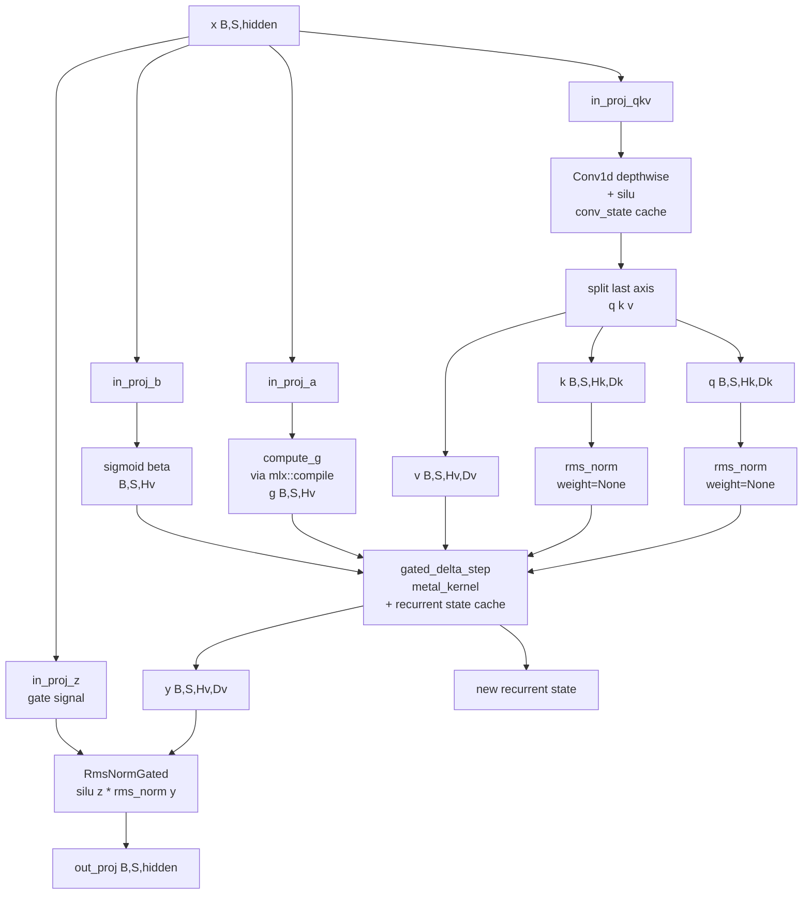

# ironmlx P3b3 — Gated Delta Net (SSM) 设计

**目标：** 实现 Qwen3.5 / Qwen3-Next 的"linear attention"分支 — `GatedDeltaNet`（与 GatedAttention 在 hybrid 模型中按 `full_attention_interval` 交替）。这是 ironmlx 第一个**业务级自定义 metal_kernel**（递归 SSM state + reduction），是 P3a `MetalKernel` typestate 的真正用武之地。

**作用域（跨两个 crate）：**
- **cxx-mlx**：补 `mlx::ops::conv1d` / `conv1d_on` 绑定（shim + bridge + safe wrapper）
- **ironmlx**：4 个新组件 + 1 个自定义 kernel
  - `ironmlx::nn::Conv1d`（depthwise 友好）
  - `ironmlx::nn::RmsNormGated`（`silu(z) * rms_norm(y)`，fp32 中间 + cast back）
  - `ironmlx::core::cache::GatedDeltaCache`（conv_state + recurrent_state）
  - `ironmlx::nn::GatedDeltaNet`（主模块）
  - `gated_delta_step` metal_kernel（2 变体：scalar gating × {no-mask, masked}）

**依赖：**
- P1 `nn::Linear`
- P2 `core::cache` 模块组织（GatedDeltaCache 与 KVCache 并列；统一容器留 P4）
- P3a `mlx::MetalKernel` + DispatchBuilder typestate
- P6 `mlx::compile`（用于 fused `compute_g`）
- cxx-mlx 已绑定 `mlx::fast::rms_norm`（含 `weight=None` 路径）
- cxx-mlx 已绑定 `mlx::ops::activation::silu_on`（如缺失则在 P3b3 内补；待 implementation 确认）

P1 / P3b1 / P3b2 已实现的标准 attention 路径（GatedAttention）保留不动；P3b3 是 hybrid 模型的另一分支。

---

## § 1 调研发现与决策摘要

### 关键背景

mlx-lm `models/qwen3_5.py:209-241`（`DecoderLayer`）：

```python
self.is_linear = (layer_idx + 1) % args.full_attention_interval != 0
if self.is_linear:
    self.linear_attn = GatedDeltaNet(args)
else:
    self.self_attn = Attention(args)  # = GatedAttention from qwen3_next
```

Qwen3.5 是 hybrid：每 `full_attention_interval` 层一个 GatedAttention，其余是 GatedDeltaNet。两条分支都不是标准 transformer attention。

`GatedDeltaNet` 算法（`mlx-lm/models/qwen3_5.py:131-205` + `models/gated_delta.py`）：

```
in_proj_qkv(x) → conv1d depthwise + silu → split q,k,v
in_proj_z(x) → z (output gate)
in_proj_a(x) → a (decay control)
in_proj_b(x) → b (forget control)

g = exp(-exp(A_log) * softplus(a + dt_bias))    # decay coefficients
beta = sigmoid(b)                                # write strength

# Recurrent SSM kernel (per token t):
state[t] = state[t-1] * g[t]
delta[t] = (v[t] - <state[t-1]*g, k[t]>) * beta[t]
state[t] = state[t] + outer(k[t], delta[t])
y[t] = sum(state[t] * q[t], axis=-1)            # B,Hv,Dv

out = RmsNormGated(y, z)                         # silu(z) * rms_norm(y)
out = out_proj(out)
```

state shape `[B, Hv, Dv, Dk]` — 巨大（Qwen3.5: 1 × 32 × 128 × 128 = 524K elements / batch / layer），fp32 累积。

### 决策

| 决策维度 | 选择 | 理由 |
|---|---|---|
| Kernel 变体 | scalar gating × {no-mask, masked} = 2 variants | Qwen3.5/Qwen3-Next 实际只用 scalar gating（`compute_g` 输出 `[B,T,Hv]`）；masked 留作变长 batching 钩子 |
| Conv1d 路径 | A — 补 cxx-mlx::ops::conv1d 安全绑定，再 ironmlx 包装 | 与 P5/P5.5 ops 一致地纳入 cxx-mlx 安全层；P5 MoE / P6 vision 可复用 |
| Template params | `InT, StT, Dk, Dv, Hk, Hv` 全 template | 与 mlx-lm 一致；Qwen3.5 模型加载触发一次 Metal 编译，后续推理走缓存 kernel |
| Mask 实现 | 字符串拼接生成 2 份 shader（`mask_clause` 替换），Rust 侧 2 个 `OnceLock<MetalKernel>` | mlx-lm 同模式；template_bool 内分支也可，但显式拼接更清晰 |
| `compute_g` 计算 | `mlx::compile`(`exp(-exp(A_log) * softplus(a + dt_bias))`) | 与 P3b1 cos_sin 同模式；模型生命周期内编译一次 |
| `beta = sigmoid(b)` | inline op | element-wise 单 op，无需独立 compile cell |
| Cache 设计 | 独立 `GatedDeltaCache { conv_state, recurrent_state }`；统一容器留 P4 | 单一职责；P4 model assembly 时再设计 layer cache enum/容器 |
| `RMSNormGated` | 独立 `nn::RmsNormGated` 层 | 与 nn::RmsNorm 并列，符合 P1 nn 建模约定 |
| Ops fallback | 不实现 | ironmlx inference-only；Python ref 已在 fixture 提供 |

---

## § 2 算法 / 数据流



热路径估算（per token, hybrid 16 SSM layers if interval=2）：

| op | 频次 / token (16 layers) | 估算 cost |
|---|---|---|
| `in_proj_qkv` + `in_proj_z/a/b` | 16 × 4 matmul | ~1ms (matmul 主导) |
| Conv1d depthwise | 16 × 1 | ~50µs (depthwise，小 kernel) |
| `compute_g` | 16 × 1 fused via compile | ~10-20µs |
| `gated_delta_step` kernel | 16 × 1 | ~30-50µs / layer × 16 ≈ 0.5-0.8ms |
| RmsNormGated + out_proj | 16 × 1 + 16 × 1 | ~250µs |
| **GatedDeltaNet 总开销 / token** | | **~2-2.5 ms** |

按 100 tok/s 目标（10ms / token），SSM 子模块占用 25%——在合理范围（hybrid 模型本来就是 SSM + Attention 两路并存）。

---

## § 3 详细设计

### 3.1 cxx-mlx `mlx::ops::conv1d` 绑定（P3b3 task 0）

#### 3.1.1 shim header `mlx-sys/shim/include/cxx_mlx_shim/conv.h`

```cpp
#pragma once
#include <cstdint>
#include <memory>
#include "mlx/array.h"

namespace cxx_mlx {

using MlxArray = mlx::core::array;

std::unique_ptr<MlxArray> ops_conv1d(
    const MlxArray& input,
    const MlxArray& weight,
    int32_t stride,
    int32_t padding,
    int32_t dilation,
    int32_t groups,
    bool has_target,
    bool is_device_only,
    uint8_t device_type,
    int32_t stream_index);

}  // namespace cxx_mlx
```

#### 3.1.2 shim impl `mlx-sys/shim/src/conv.cc`

调用 `mlx::core::conv1d(input, weight, stride, padding, dilation, groups, target)`。Stream 解码走 `cxx_mlx::helpers::decode_stream_or_device`。

#### 3.1.3 cxx::bridge `mlx-sys/src/bridge/conv.rs`

```rust
#[allow(clippy::missing_safety_doc, clippy::too_many_arguments)]
#[cxx::bridge(namespace = "cxx_mlx")]
pub mod ffi {
    unsafe extern "C++" {
        include!("cxx_mlx_shim/conv.h");
        type MlxArray = crate::bridge::array::ffi::MlxArray;

        unsafe fn ops_conv1d(
            input: &MlxArray,
            weight: &MlxArray,
            stride: i32,
            padding: i32,
            dilation: i32,
            groups: i32,
            has_target: bool,
            is_device_only: bool,
            device_type: u8,
            stream_index: i32,
        ) -> Result<UniquePtr<MlxArray>>;
    }
}
```

注册到 `mlx-sys/src/lib.rs` + `mlx-sys/build.rs` 编译列表。

#### 3.1.4 安全 wrapper `mlx/src/ops/conv.rs`

```rust
pub fn conv1d(input: &Array, weight: &Array, stride: i32, padding: i32, dilation: i32, groups: i32) -> Result<Array> {
    conv1d_on(input, weight, stride, padding, dilation, groups, ())
}

pub fn conv1d_on(input: &Array, weight: &Array, stride: i32, padding: i32, dilation: i32, groups: i32, target: impl Into<StreamOrDevice>) -> Result<Array> {
    let (has, dev_only, dev_t, idx) = target.into().encode();
    let inner = unsafe {
        mlx_sys::conv::ffi::ops_conv1d(input.as_inner(), weight.as_inner(), stride, padding, dilation, groups, has, dev_only, dev_t, idx)
    }
    .map_err(Error::from)?;
    Ok(Array::from_inner(inner))
}
```

re-export 到 `mlx::ops::conv1d` / `conv1d_on`。

#### 3.1.5 Smoke + 单元测试

- `mlx-sys/tests/sys_smoke.rs::conv1d_links` — 1×4×3 input + 4×3×2 weight 跑通
- `mlx/src/ops/conv.rs` 单元测试 — shape/dtype invariants

### 3.2 `ironmlx::nn::Conv1d`

```rust
// ironmlx/src/nn/conv.rs
#[derive(Debug, Clone, Copy)]
pub struct Conv1dConfig {
    pub in_channels: i32,
    pub out_channels: i32,
    pub kernel_size: i32,
    pub stride: i32,
    pub padding: i32,
    pub dilation: i32,
    pub groups: i32,    // depthwise = in_channels (per Qwen3.5 config)
}

pub struct Conv1d {
    weight: Array,        // [out_channels, in_channels/groups, kernel_size]
    bias: Option<Array>,  // [out_channels]
    cfg: Conv1dConfig,
}

impl Conv1d {
    pub fn from_loader(loader: &Loader, prefix: &str, cfg: Conv1dConfig) -> Result<Self>;
    pub fn forward_on(&self, x: &Array, target: impl Into<StreamOrDevice>) -> Result<Array> {
        let target = target.into();
        let mut y = mlx::ops::conv1d_on(x, &self.weight, self.cfg.stride, self.cfg.padding, self.cfg.dilation, self.cfg.groups, target)?;
        if let Some(b) = &self.bias {
            y = (&y + b)?;  // broadcast last axis
        }
        Ok(y)
    }
}
```

### 3.3 `ironmlx::nn::RmsNormGated`

```rust
// ironmlx/src/nn/norm.rs (extend existing file)
pub struct RmsNormGated { weight: Array, eps: f32 }

impl RmsNormGated {
    pub fn from_loader(loader, prefix, eps) -> Result<Self>;
    pub fn forward_on(&self, hidden: &Array, gate: Option<&Array>, target: impl Into<StreamOrDevice>) -> Result<Array> {
        let target = target.into();
        let x = mlx::fast::rms_norm_on(hidden, Some(&self.weight), self.eps, target)?;
        match gate {
            Some(g) => {
                // _precise_swiglu: silu(g) * x in fp32, cast back to hidden's dtype
                let g_f32 = mlx::ops::cast::astype(g, Dtype::Float32)?;
                let g_act = mlx::ops::activation::silu_on(&g_f32, target)?;
                let x_f32 = mlx::ops::cast::astype(&x, Dtype::Float32)?;
                let mul = (&g_act * &x_f32)?;
                mlx::ops::cast::astype(&mul, hidden.dtype())
            }
            None => mlx::ops::cast::astype(&x, hidden.dtype()),
        }
    }
}
```

> **API 待确认**（implementation 阶段）：`mlx::ops::activation::silu_on` 是否已暴露。若缺失，在 P3b3 内一并补上（应该已在 cxx-mlx P5 系列绑定）。

### 3.4 `ironmlx::core::cache::GatedDeltaCache`

```rust
// ironmlx/src/core/cache/gated_delta.rs
pub struct GatedDeltaCache {
    conv_state: Array,        // [B, kernel_size-1, conv_dim]
    recurrent_state: Array,   // [B, Hv, Dv, Dk] fp32
    offset: i32,
    cap: i32,
}

impl GatedDeltaCache {
    pub fn new_with_cap(
        b: i32, kernel_size: i32, conv_dim: i32,
        hv: i32, dv: i32, dk: i32,
        dtype: Dtype, cap: i32,
    ) -> Result<Self>;

    pub fn conv_state(&self) -> &Array;
    pub fn recurrent_state(&self) -> &Array;
    pub fn offset(&self) -> i32;
    pub fn cap(&self) -> i32;

    pub fn update_conv(&mut self, new_conv_state: Array);
    pub fn update_recurrent(&mut self, new_state: Array);
    pub fn advance(&mut self, n: i32) -> Result<()>;  // bumps offset; assert offset+n <= cap
}
```

`update_conv` 接收 caller 计算好的 sliding window（conv_input 末 `kernel_size - 1` tokens）。`update_recurrent` 接收 kernel 输出的 new state。`advance` 推进 offset，超过 cap 返回 `Err`。

### 3.5 `gated_delta_step` metal_kernel

完整 shader 源照搬 mlx-lm `models/gated_delta.py:_make_gated_delta_kernel` 的 source（已 production-grade）。Rust 侧两个 OnceLock kernel：

```rust
// ironmlx/src/nn/gated_delta_net.rs（kernel 私有 helper）
fn build_gated_delta_kernel(masked: bool) -> Result<MetalKernel> {
    let mask_clause = if masked { "mask[b_idx * T + t]" } else { "true" };

    // shader source — 见 mlx-lm/models/gated_delta.py:31-100
    let src = format!(r#"
        auto n = thread_position_in_grid.z;
        auto b_idx = n / Hv;
        auto hv_idx = n % Hv;
        auto hk_idx = hv_idx / (Hv / Hk);
        constexpr int n_per_t = Dk / 32;

        auto q_ = q + b_idx * T * Hk * Dk + hk_idx * Dk;
        auto k_ = k + b_idx * T * Hk * Dk + hk_idx * Dk;
        auto v_ = v + b_idx * T * Hv * Dv + hv_idx * Dv;
        y += b_idx * T * Hv * Dv + hv_idx * Dv;

        auto dk_idx = thread_position_in_threadgroup.x;
        auto dv_idx = thread_position_in_grid.y;

        auto i_state = state_in + (n * Dv + dv_idx) * Dk;
        auto o_state = state_out + (n * Dv + dv_idx) * Dk;

        float state[n_per_t];
        for (int i = 0; i < n_per_t; ++i) {{
          auto s_idx = n_per_t * dk_idx + i;
          state[i] = static_cast<float>(i_state[s_idx]);
        }}

        // g: [B, T, Hv]
        auto g_ = g + b_idx * T * Hv;
        auto beta_ = beta + b_idx * T * Hv;

        for (int t = 0; t < T; ++t) {{
          if ({mask_clause}) {{
            float kv_mem = 0.0f;
            for (int i = 0; i < n_per_t; ++i) {{
              auto s_idx = n_per_t * dk_idx + i;
              state[i] = state[i] * g_[hv_idx];
              kv_mem += state[i] * k_[s_idx];
            }}
            kv_mem = simd_sum(kv_mem);

            auto delta = (v_[dv_idx] - kv_mem) * beta_[hv_idx];

            float out = 0.0f;
            for (int i = 0; i < n_per_t; ++i) {{
              auto s_idx = n_per_t * dk_idx + i;
              state[i] = state[i] + k_[s_idx] * delta;
              out += state[i] * q_[s_idx];
            }}
            out = simd_sum(out);
            if (thread_index_in_simdgroup == 0) {{
              y[dv_idx] = static_cast<InT>(out);
            }}
          }} else {{
            y[dv_idx] = static_cast<InT>(0);
          }}
          q_ += Hk * Dk;
          k_ += Hk * Dk;
          v_ += Hv * Dv;
          y += Hv * Dv;
          g_ += Hv;
          beta_ += Hv;
        }}
        for (int i = 0; i < n_per_t; ++i) {{
          auto s_idx = n_per_t * dk_idx + i;
          o_state[s_idx] = static_cast<StT>(state[i]);
        }}
    "#);

    let mut builder = MetalKernel::builder(if masked { "ironmlx_gated_delta_masked" } else { "ironmlx_gated_delta" })
        .source(&src)
        .ensure_row_contiguous(true)
        .atomic_outputs(false);
    let inputs: &[&str] = if masked {
        &["q", "k", "v", "g", "beta", "state_in", "T", "mask"]
    } else {
        &["q", "k", "v", "g", "beta", "state_in", "T"]
    };
    builder = builder.inputs(inputs).outputs(&["y", "state_out"]);
    builder.build()
}
```

> **`T` 输入注意**：mlx-lm 把 `T`（seq length）作为 kernel input array（scalar i32）传入，shader 中可作为常量读取。我们的 P3a kernel API 是否支持 scalar i32 输入？implementation 阶段确认。如果不支持，需要把 T 作为 `template_int` —— 但 T 是动态的（每次 forward 不同），不能 template 化。Fallback：要么补 cxx-mlx 支持 i32 scalar input，要么把 T 通过 buffer 传入（[1] shape array）。

**Dispatch via P3a typestate**:

```rust
let mut outputs = kernel
    .dispatch_builder()
    .inputs(&[q, k, v, g, beta, state_in, /* T, mask if applicable */])
    .output_shapes(&[y_shape, state_shape])
    .output_dtypes(&[input_dtype, state_dtype])
    .grid(32, dv, b * hv)
    .threadgroup(32, 4, 1)
    .template_int("Dk", dk)
    .template_int("Dv", dv)
    .template_int("Hk", hk)
    .template_int("Hv", hv)
    .template_dtype("InT", input_dtype)
    .template_dtype("StT", state_dtype)
    .dispatch()?;
```

### 3.6 `ironmlx::nn::GatedDeltaNet` 主模块

```rust
// ironmlx/src/nn/gated_delta_net.rs
#[derive(Debug, Clone, Copy)]
pub struct GatedDeltaNetConfig {
    pub hidden_size: i32,
    pub num_v_heads: i32,
    pub num_k_heads: i32,
    pub head_k_dim: i32,
    pub head_v_dim: i32,
    pub conv_kernel_size: i32,
    pub rms_norm_eps: f32,
}

pub struct GatedDeltaNet {
    in_proj_qkv: Linear,
    in_proj_z: Linear,
    in_proj_b: Linear,
    in_proj_a: Linear,
    conv1d: Conv1d,
    norm: RmsNormGated,
    out_proj: Linear,
    a_log: Array,           // [num_v_heads]
    dt_bias: Array,         // [num_v_heads]
    cfg: GatedDeltaNetConfig,
    compute_g_compiled: OnceLock<CompiledFn>,
    kernel_no_mask: OnceLock<MetalKernel>,
    kernel_masked: OnceLock<MetalKernel>,
}
```

forward 7 步：
1. `in_proj_qkv(x)`, `in_proj_z(x)`, `in_proj_a(x)`, `in_proj_b(x)`
2. `conv1d.forward_on(qkv_input)` + silu —— qkv_input 由 conv_state（来自 cache）+ 当前 token 拼接而成；新 conv_state 写回 cache
3. split conv_out → q (`[B,S,Hk*Dk]`), k (`[B,S,Hk*Dk]`), v (`[B,S,Hv*Dv]`)
4. reshape 各 per-head + `rms_norm_on(weight=None)`
5. `compute_g(a_log, a, dt_bias)` via `OnceLock<CompiledFn>`
6. `beta = b.sigmoid_on(target)?`
7. dispatch `gated_delta_step` kernel（no-mask 或 masked variant），更新 `cache.recurrent_state`
8. `RmsNormGated(y, z)` → `out_proj`

输出 shape `[B, S, hidden]`。

---

## § 4 测试策略

### 4.1 单元测试

按 task 划分 13 个单元测试（详见 § 6 任务划分对应 Sub-task）。

### 4.2 集成测试

`ironmlx/tests/p3b3_gated_delta_net.rs`，1 个端到端测试 `gated_delta_net_matches_python_fixture`：

- Python fixture 小规模（B=1, S=4, Hk=2, Hv=4, Dk=8, Dv=8, hidden=32, conv_kernel=4）— 总大小 < 5KB
- 独立 Python 参考用 `gated_delta_ops` 风格的纯 ops 实现（不调用 mlx-lm 自身的 metal_kernel，避免循环验证）
- Tolerance: bf16/fp32 mixed atol = 1e-3
- 单 forward 4-token 序列，验证 conv_state 推进 + recurrent state 累积都正确

### 4.3 风险

| 风险 | 缓解 |
|---|---|
| 递归 state 数值漂移 | fp32 state buffer；4-token sequence fixture |
| conv_state 边界推入错误（cache 读写顺序）| `gated_delta_cache_advance` 单测 + 集成测试覆盖 |
| simd_sum + reduction 错误（warp-level cooperation） | `gated_delta_step_no_mask_simple` 手算单 token 单 head 比对 |
| Mask 路径 state 应不变 | 独立 `gated_delta_step_masked_zero_path` 单测 |
| GQA repeat (Hv > Hk) | shader 内 `hk_idx = hv_idx / (Hv/Hk)`；fixture Hv=4,Hk=2 验证 |
| `T` 动态参数传递 | implementation 阶段实测 P3a kernel 是否接受 i32 scalar input；如不支持回退方案见 § 3.5 |
| `mlx::ops::activation::silu_on` 缺失 | 在 cxx-mlx 内补绑定（小绑定，~30 行） |
| state buffer 体量大（524K elements / batch / layer） | fp32 累积避免 bf16 漂移；P4 KVCache cap 机制类比 |

---

## § 5 任务划分（建议给 writing-plans）

| Task | 内容 | 预计时间 |
|---|---|---|
| **T1** | cxx-mlx ops::conv1d 绑定（shim + bridge + safe wrapper + sys_smoke + mlx unit test） | 1 天 |
| **T2** | ironmlx::nn::Conv1d + 单元测试 | 0.5 天 |
| **T3** | ironmlx::nn::RmsNormGated + 单元测试（含 silu_on 路径） | 0.5 天 |
| **T4** | core::cache::GatedDeltaCache + 单元测试 | 0.5 天 |
| **T5** | gated_delta_step metal_kernel（2 变体）+ kernel-level 单测 | 2 天 |
| **T6** | nn::GatedDeltaNet 主模块（forward 7 步 + compute_g compile + dispatch）+ 单测 | 1.5 天 |
| **T7** | Python fixture 生成器 + 集成测试（4-token sequence vs Python ref） | 1 天 |
| **合计** | | **7 天** |

---

## § 6 验收标准

1. `cargo test --release -p mlx-sys --test sys_smoke conv1d` — conv1d 绑定 smoke 通过
2. `cargo test --release -p mlx --lib ops::conv` — conv1d 安全 wrapper 单测通过
3. `cargo test --release -p ironmlx --lib nn::conv` — Conv1d 单测通过
4. `cargo test --release -p ironmlx --lib nn::norm::tests::rms_norm_gated*` — RmsNormGated 单测通过
5. `cargo test --release -p ironmlx --lib core::cache::gated_delta` — GatedDeltaCache 单测通过
6. `cargo test --release -p ironmlx --lib nn::gated_delta_net` — kernel + 主模块单测通过
7. `MLX_DIR=$HOME/.local/mlx cargo test --release -p ironmlx --test p3b3_gated_delta_net` — 集成测试通过 (atol=1e-3)
8. `cargo +nightly fmt --check && cargo +nightly clippy ... -D warnings && cargo build --release` 全清洁
9. `nn::GatedDeltaNet` 与 `nn::GatedAttention` 构成 P4 hybrid 模型组装的两条 attention 路径

---

## § 7 后续依赖

P3b3 完成后解锁：
- **P3b4 MTP** — Multi-Token Prediction，独立模块，与 P3b3 无强依赖
- **P4 Qwen3.5 Dense E2E** — DecoderLayer 按 `is_linear` 选择 GatedDeltaNet 或 GatedAttention；统一 layer cache enum
- **P5 Qwen3.5 MoE** — 同 P4 的 attention 结构 + MLP 替换为 SparseMoeBlock
- **P6 Vision** — 复用 GatedAttention（multi-stream MRoPE 时）
