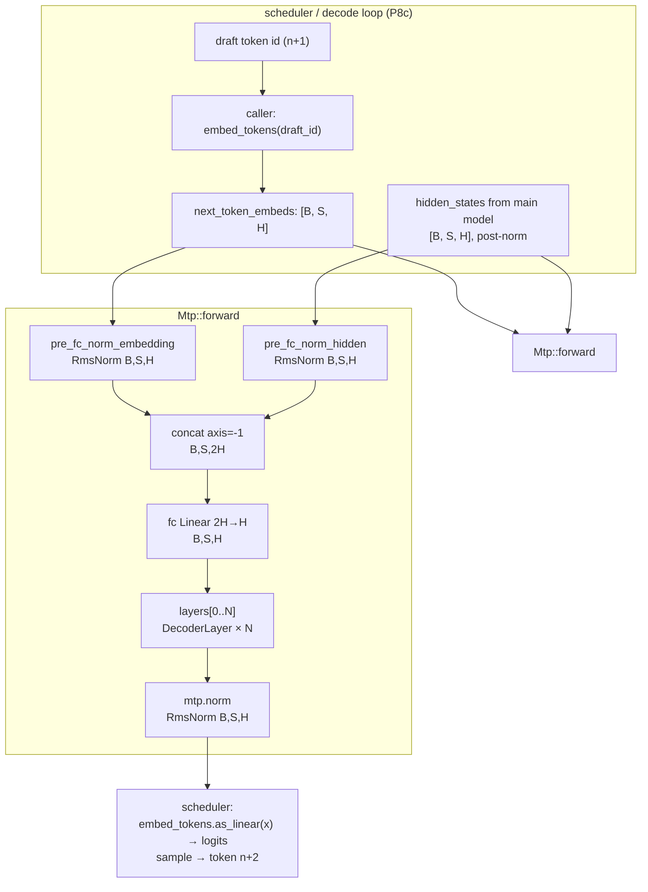
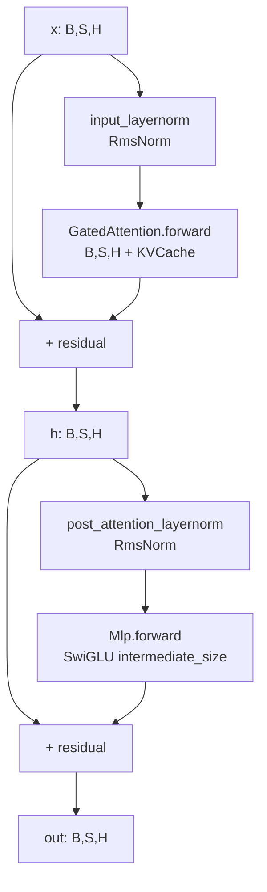

# ironmlx P3b4 — Multi-Token Prediction (MTP) 设计

**目标：** 实现 Qwen3.5 / Qwen3-Next 的 MTP（Multi-Token Prediction）head 推理路径 — `nn::Mtp` 模块负责"给定主模型 hidden state 与下一 token id，预测 n+2 token logits"。一并提前实现可被 P4 主模型复用的 `nn::DecoderLayer`（full-attention only）与 `core::cache::MtpCache`。

**作用域（model layer only — 不含 scheduler / speculative decoding loop）：**
- 新增 `ironmlx/src/nn/decoder_layer.rs` — `DecoderLayer` + `DecoderLayerConfig` + `from_loader` + `forward` / `forward_on`（仅 full-attention 路径，linear attention SSM 路径见 § 1.2 决策说明）
- 新增 `ironmlx/src/nn/mtp.rs` — `Mtp` + `MtpConfig` + `from_loader` + `from_components`（test seam）+ `forward` / `forward_on`
- 新增 `ironmlx/src/core/cache/mtp_cache.rs` — `MtpCache` 包装 `Vec<KVCache>`
- 修改 `ironmlx/src/nn/mod.rs` 与 `ironmlx/src/core/cache/mod.rs` — 暴露新模块
- 新增 `ironmlx/tests/fixtures/p3b4_mtp/gen_fixture.py` 与 `ironmlx/tests/p3b4_mtp.rs`

**依赖：**
- P1 `Linear`, `RmsNorm`, `Mlp`
- P2 `KVCache`
- P3b1 `Mrope::cos_sin` + `Mrope::apply`
- P3b2 `GatedAttention`（**non-negotiable** — DecoderLayer full-attention path 必须用 P3b2 GatedAttention）
- cxx-mlx `mlx::ops::concatenate`, `mlx::ops::cast::astype`

**显式排除（写入风险表，不留含糊）：**
- ❌ Qwen3-Next 的 `linear_attn` 路径 / GatedDeltaNet 路径 — DecoderLayer 暂只覆盖 full-attention layer，因为 MTP head 的 `layer_idx = fa_idx`（最后一个 full-attention 层），见 mlx-lm `qwen3_5.py:177` 与 vllm-mlx `qwen3_5_mtp.py:215`。SSM 路径在 P4 与 GatedDeltaNet 集成时再扩 DecoderLayer
- ❌ MoE / SparseMoeBlock — Qwen3.5 Dense MTP 路径不含 MoE；MoE MTP 留 P5
- ❌ 4-bit 量化加载 — vllm-mlx patch 显式 dequantize 到 BF16（quant 会破坏 MTP acceptance）；P3b4 直接读 BF16 weight
- ❌ Speculative decoding 循环 / scheduler / KV rollback / batched cache — 见 P8c
- ❌ Tied lm_head 解耦 / lm_head 自身 — caller 持 `Embedding` 引用并调用 `as_linear`，`Mtp::forward` 只返回 hidden state，不返回 logits

---

## § 1 调研发现与决策摘要

### 1.1 关键背景

通过 `/Volumes/Dev/vllm-mlx/vllm_mlx/patches/qwen3_5_mtp.py:204-216` 与 `/Volumes/Dev/mlx-lm/mlx_lm/models/qwen3_next.py:357-389` 确认：

```python
# vllm-mlx _MTPModule (qwen3_5_mtp.py:204):
class _MTPModule(nn.Module):
    pre_fc_norm_hidden:    RMSNorm(hidden_size, rms_norm_eps)
    pre_fc_norm_embedding: RMSNorm(hidden_size, rms_norm_eps)
    fc:                    Linear(hidden_size * 2, hidden_size, bias=False)
    layers:                [DecoderLayer(args, layer_idx=fa_idx) for _ in range(n_layers)]
    norm:                  RMSNorm(hidden_size, rms_norm_eps)

# mtp_forward (qwen3_5_mtp.py:369):
def mtp_forward(self, hidden_states, next_token_ids, cache=None, mtp_cache=None):
    input_embeds = self.model.embed_tokens(next_token_ids)
    e = self.mtp.pre_fc_norm_embedding(input_embeds)
    h = self.mtp.pre_fc_norm_hidden(hidden_states)
    x = self.mtp.fc(mx.concatenate([e, h], axis=-1))
    layer = self.mtp.layers[0]
    c = mtp_cache[0] if mtp_cache else None
    mask = create_attention_mask(x, c)
    x = layer(x, mask=mask, cache=c)
    x = self.mtp.norm(x)
    if self.args.tie_word_embeddings:
        return self.model.embed_tokens.as_linear(x)
    return self.lm_head(x)
```

**核心观察：**

1. **MTP head 的 layers 是普通 DecoderLayer**（与主模型 fa_idx 层完全同结构 — input_layernorm + GatedAttention + post_attention_layernorm + Mlp + 2 个 residual），用 `layer_idx=fa_idx` 构造，**保证落进 full-attention 分支**（`is_linear = (fa_idx + 1) % full_attention_interval != 0` 为 false）
2. **Mtp 内层数 N 配置驱动**，Qwen3.5 实际 checkpoint 是 N=1（vllm-mlx `num_mtp_layers=1`）；不要写死
3. **fc 维度** `2H → H`，无 bias
4. **3 个 RMSNorm**（pre_fc_norm_hidden, pre_fc_norm_embedding, norm）共享同一 `rms_norm_eps`，**形状 `[H]`**（与 Qwen3.5 输入 embedding 维度对齐）
5. **mlx-lm 删 MTP weight**（`qwen3_5.py:313` 与 `qwen3_next.py:455`）— 只在 vllm-mlx patch 中加载；ironmlx 模仿 vllm-mlx 路径
6. **MTP 不在主模型 forward 调用栈** — 它是一个**独立 head**，由 scheduler（P8c）按需触发；P3b4 暴露的 `Mtp::forward` 接受**主模型已算出的 post-norm hidden state**（即 mlx-lm `inner.norm(hidden_states)` 之后的值）

### 1.2 决策

| 决策维度 | 选择 | 来源 / 理由 |
|---|---|---|
| **是否提前实现 DecoderLayer** | ✅ 是 — A 路线 | Boss 选 A；DecoderLayer 是 P4 主模型的核心积木，提前实现可被 Mtp + P4 共用，避免重复 |
| **DecoderLayer 覆盖范围** | 仅 full-attention path | MTP head 的 layer_idx=fa_idx 永远走 full-attn；linear path 在 P4 与 GatedDeltaNet 集成时再扩枚举字段 |
| **MTP 层数 num_layers** | 配置字段，**默认 1**（与 Qwen3.5 checkpoint 一致） | vllm-mlx `num_mtp_layers=1`；写死会让未来切换 Qwen3-Next/Qwen3.6 失败 |
| **lm_head 是否归 Mtp 持有** | ❌ 不归 — 由 caller 持 `Embedding` 调 `as_linear` | tied lm_head 是 model-level 概念（embed_tokens 共用）；Mtp 不应重复持有 |
| **`Mtp::forward` 返回值** | 返回**经 mtp.norm 后的 hidden state**`[B, S, hidden]`，不返回 logits | 解耦 Mtp 与 lm_head；scheduler（P8c）取 hidden 后自行 sample / project |
| **mask 处理** | DecoderLayer 与 Mtp 都暴露 `mask: Option<&Array>` 参数；与 GatedAttention 一致透传 | 与 P3b2 GatedAttention 签名平行 |
| **MtpCache 包装** | `struct MtpCache(Vec<KVCache>)` + `new_with_cap(num_layers, cap, ...)` | cap-bounded 与 P2 KVCache 同源；num_layers 与 Mtp.layers.len() 必须一致 — 在 forward 入口校验 |
| **caller pre-embed** | `Mtp::forward(hidden_states, next_token_embeds, ..., mtp_cache)` 接受**已 embed 的 next_token vector**，不接受 token id | Embedding 由 caller 持有；Mtp 不应再持一份引用 |
| **Test seam** | `Mtp::from_components` + `DecoderLayer::from_components` 暴露 `pub + #[doc(hidden)]`，test 可直接构造（与 P3b3 `GatedDeltaNet::new` 同 pattern） | 单测不依赖 Loader |
| **Fixture 规模** | B=1, S=4, H=32, Hq=4, Hkv=2, D=8, intermediate_size=64, num_mtp_layers=1 | 沿用 P3b2/P3b3 mini-scale 风格；< 5KB 总 fixture 体积 |

---

## § 2 算法 / 数据流

### 2.1 整体（caller 视角）



### 2.2 DecoderLayer（积木块）



**对照 mlx-lm `qwen3_next.py:382-389`** — 完全一致（is_linear=false 分支）。

### 2.3 热路径分析

P3b4 的 Mtp 单次 forward（n_layers=1, S=1 decode 步）：

| op | 频次 | 估算 cost |
|---|---|---|
| pre_fc_norm × 2 | 2 | RMSNorm fused, ~10µs |
| concat axis=-1 | 1 | view-friendly, ~5µs |
| fc Linear 2H→H | 1 | matmul，~200µs（Qwen3.5 H=2048，与 q_proj 同量级）|
| DecoderLayer × 1 | 1 | ~6.5ms（与主模型一层 fa 同 cost） |
| mtp.norm | 1 | RMSNorm，~5µs |
| **小计** | | **~6.7ms / draft step** |

主模型 Qwen3.5 一次 decode（32 层）≈ 200ms。MTP 增量 ≈ 6.7ms / draft → 推测一次接受 ≈ 1.5× 加速（与论文 / vllm-mlx benchmark 一致）。

---

## § 3 详细设计

### 3.1 `nn::DecoderLayerConfig`

```rust
// ironmlx/src/nn/decoder_layer.rs
#[derive(Debug, Clone, Copy)]
pub struct DecoderLayerConfig {
    pub hidden_size: i32,          // Qwen3.5: 2048
    pub intermediate_size: i32,    // Qwen3.5: 5632
    pub num_heads: i32,            // Q heads
    pub num_kv_heads: i32,
    pub head_dim: i32,
    pub rms_norm_eps: f32,
    pub attention_bias: bool,      // 透传给 GatedAttentionConfig
}
```

> 与 P3b2 `GatedAttentionConfig` 字段对齐；`hidden_size` / `intermediate_size` 是 DecoderLayer 自己的字段（用于 RmsNorm / Mlp）。

### 3.2 `nn::DecoderLayer`

```rust
pub struct DecoderLayer {
    input_layernorm: RmsNorm,           // weight: [hidden_size]
    self_attn: GatedAttention,
    post_attention_layernorm: RmsNorm,  // weight: [hidden_size]
    mlp: Mlp,
    cfg: DecoderLayerConfig,
}

impl DecoderLayer {
    /// Production constructor.
    ///
    /// Reads (under prefix):
    ///   {prefix}.input_layernorm.weight             [hidden_size]
    ///   {prefix}.self_attn.{q,k,v,o}_proj.weight    (see GatedAttention)
    ///   {prefix}.self_attn.{q,k}_norm.weight        [head_dim]
    ///   {prefix}.post_attention_layernorm.weight    [hidden_size]
    ///   {prefix}.mlp.{gate,up,down}_proj.weight     (see Mlp)
    pub fn from_loader(loader: &Loader, prefix: &str, cfg: DecoderLayerConfig) -> Result<Self> {
        let input_layernorm = RmsNorm::from_loader(
            loader, &format!("{prefix}.input_layernorm"), cfg.rms_norm_eps,
        )?;
        let self_attn = GatedAttention::from_loader(
            loader,
            &format!("{prefix}.self_attn"),
            GatedAttentionConfig {
                num_heads: cfg.num_heads,
                num_kv_heads: cfg.num_kv_heads,
                head_dim: cfg.head_dim,
                rms_norm_eps: cfg.rms_norm_eps,
                attention_bias: cfg.attention_bias,
            },
        )?;
        let post_attention_layernorm = RmsNorm::from_loader(
            loader, &format!("{prefix}.post_attention_layernorm"), cfg.rms_norm_eps,
        )?;
        let mlp = Mlp::from_loader(loader, &format!("{prefix}.mlp"))?;

        // Sanity: Mlp output dim must match hidden_size
        if mlp.hidden_size() != cfg.hidden_size as usize {
            return Err(anyhow!(
                "DecoderLayer: mlp hidden_size mismatch: mlp={}, cfg={}",
                mlp.hidden_size(),
                cfg.hidden_size,
            ));
        }
        Ok(Self { input_layernorm, self_attn, post_attention_layernorm, mlp, cfg })
    }

    /// Test seam — accepts pre-built sub-modules.
    #[doc(hidden)]
    pub fn from_components(
        input_layernorm: RmsNorm,
        self_attn: GatedAttention,
        post_attention_layernorm: RmsNorm,
        mlp: Mlp,
        cfg: DecoderLayerConfig,
    ) -> Self {
        Self { input_layernorm, self_attn, post_attention_layernorm, mlp, cfg }
    }

    pub fn config(&self) -> &DecoderLayerConfig { &self.cfg }
}
```

> **API 假设**：P1 `Mlp` 暴露 `Mlp::hidden_size() -> usize`。如缺失则改 sanity 检查为读 down_proj.out_features。

### 3.3 DecoderLayer forward / forward_on

```rust
impl DecoderLayer {
    pub fn forward(
        &self,
        x: &Array,
        mrope: &Mrope,
        cos: &Array,
        sin: &Array,
        mask: Option<&Array>,
        cache: Option<&mut KVCache>,
    ) -> Result<Array> {
        self.forward_on(x, mrope, cos, sin, mask, cache, ())
    }

    /// Stream-targeted forward.
    ///
    /// `x: [B, S, hidden_size]` → `[B, S, hidden_size]`
    ///
    /// Computes:
    ///   r = self_attn(input_layernorm(x), mask, cache)
    ///   h = x + r
    ///   out = h + mlp(post_attention_layernorm(h))
    #[allow(clippy::too_many_arguments)]
    pub fn forward_on(
        &self,
        x: &Array,
        mrope: &Mrope,
        cos: &Array,
        sin: &Array,
        mask: Option<&Array>,
        cache: Option<&mut KVCache>,
        target: impl Into<StreamOrDevice>,
    ) -> Result<Array> {
        let target = target.into();

        let normed_in = self.input_layernorm.forward_on(x, target)?;
        let attn = self.self_attn.forward_on(&normed_in, mrope, cos, sin, mask, cache, target)?;
        let h = (x + &attn)?;

        let normed_post = self.post_attention_layernorm.forward_on(&h, target)?;
        let mlp_out = self.mlp.forward_on(&normed_post, target)?;
        (&h + &mlp_out)
    }
}
```

> **预校验** (在 forward_on 入口 — 与 P3b3 stability hardening 同 pattern)：
> - `x.ndim() == 3` 否则 anyhow!("DecoderLayer expects rank-3 input")
> - `x.shape()[2] == cfg.hidden_size` 否则 anyhow!

### 3.4 `core::cache::MtpCache`

```rust
// ironmlx/src/core/cache/mtp_cache.rs
use crate::core::cache::KVCache;
use crate::Result;
use mlx::Dtype;

/// KV caches for an MTP head's layers.
///
/// Wraps `Vec<KVCache>` with cap-bounded construction (mirrors P2 `KVCache::new_with_cap`)
/// and per-layer accessors. `num_layers` is fixed at construction and validated against
/// the consumer ([`crate::nn::Mtp`]) at forward time.
pub struct MtpCache {
    layers: Vec<KVCache>,
}

impl MtpCache {
    /// Construct caches for `num_layers` layers, each with capacity `cap`.
    ///
    /// `num_kv_heads`, `head_dim`, `dtype` are forwarded to per-layer
    /// [`KVCache::new_with_cap`].
    pub fn new_with_cap(
        num_layers: usize,
        cap: i32,
        num_kv_heads: i32,
        head_dim: i32,
        dtype: Dtype,
    ) -> Result<Self> {
        if num_layers == 0 {
            return Err(anyhow!("MtpCache::new_with_cap: num_layers must be > 0"));
        }
        let mut layers = Vec::with_capacity(num_layers);
        for _ in 0..num_layers {
            layers.push(KVCache::new_with_cap(cap, num_kv_heads, head_dim, dtype)?);
        }
        Ok(Self { layers })
    }

    pub fn num_layers(&self) -> usize { self.layers.len() }

    pub fn layer(&self, idx: usize) -> &KVCache {
        &self.layers[idx]
    }

    pub fn layer_mut(&mut self, idx: usize) -> &mut KVCache {
        &mut self.layers[idx]
    }

    /// Reset every contained KV cache to offset = 0 (mirrors P3b3 GatedDeltaCache::reset).
    pub fn reset(&mut self) {
        for c in &mut self.layers {
            c.reset();
        }
    }

    /// Returns the offset of layer 0; all layers share the same offset by invariant.
    pub fn offset(&self) -> i32 {
        self.layers.first().map(|c| c.offset()).unwrap_or(0)
    }
}
```

> **API 假设**：P2 `KVCache` 暴露 `new_with_cap`, `reset`, `offset`。如 `reset` 缺失则在 P3b4 实施时一并补 P2 KVCache（spec 风险表登记）。

### 3.5 `nn::MtpConfig`

```rust
// ironmlx/src/nn/mtp.rs
#[derive(Debug, Clone, Copy)]
pub struct MtpConfig {
    pub hidden_size: i32,
    pub num_mtp_layers: i32,        // Qwen3.5: 1 (default)
    pub layer: DecoderLayerConfig,  // 透传给每个 mtp.layers[i]
}
```

### 3.6 `nn::Mtp`

```rust
pub struct Mtp {
    pre_fc_norm_hidden: RmsNorm,    // weight: [hidden_size]
    pre_fc_norm_embedding: RmsNorm, // weight: [hidden_size]
    fc: Linear,                     // [2*hidden] -> [hidden]
    layers: Vec<DecoderLayer>,
    norm: RmsNorm,                  // weight: [hidden_size]
    cfg: MtpConfig,
}

impl Mtp {
    /// Production constructor: load from a project [`Loader`].
    ///
    /// Reads (under prefix `mtp.`):
    ///   pre_fc_norm_hidden.weight       [hidden_size]
    ///   pre_fc_norm_embedding.weight    [hidden_size]
    ///   fc.weight                       [hidden_size, 2*hidden_size]  (no bias)
    ///   layers.0.{...}                  (per DecoderLayer::from_loader)
    ///   ...
    ///   layers.{N-1}.{...}
    ///   norm.weight                     [hidden_size]
    pub fn from_loader(loader: &Loader, prefix: &str, cfg: MtpConfig) -> Result<Self> {
        let pre_fc_norm_hidden = RmsNorm::from_loader(
            loader, &format!("{prefix}.pre_fc_norm_hidden"), cfg.layer.rms_norm_eps,
        )?;
        let pre_fc_norm_embedding = RmsNorm::from_loader(
            loader, &format!("{prefix}.pre_fc_norm_embedding"), cfg.layer.rms_norm_eps,
        )?;
        let fc = Linear::from_loader(loader, &format!("{prefix}.fc"))?;
        let norm = RmsNorm::from_loader(
            loader, &format!("{prefix}.norm"), cfg.layer.rms_norm_eps,
        )?;

        let mut layers = Vec::with_capacity(cfg.num_mtp_layers as usize);
        for i in 0..cfg.num_mtp_layers {
            layers.push(DecoderLayer::from_loader(
                loader, &format!("{prefix}.layers.{i}"), cfg.layer,
            )?);
        }

        // Sanity: fc maps 2H -> H
        let expected_in  = (cfg.hidden_size * 2) as usize;
        let expected_out = cfg.hidden_size as usize;
        if fc.in_features() != expected_in || fc.out_features() != expected_out {
            return Err(anyhow!(
                "Mtp.fc: expected [{expected_in} -> {expected_out}], got [{} -> {}]",
                fc.in_features(), fc.out_features(),
            ));
        }
        Ok(Self {
            pre_fc_norm_hidden,
            pre_fc_norm_embedding,
            fc,
            layers,
            norm,
            cfg,
        })
    }

    /// Test seam — accept pre-built components.
    #[doc(hidden)]
    pub fn from_components(
        pre_fc_norm_hidden: RmsNorm,
        pre_fc_norm_embedding: RmsNorm,
        fc: Linear,
        layers: Vec<DecoderLayer>,
        norm: RmsNorm,
        cfg: MtpConfig,
    ) -> Self {
        Self { pre_fc_norm_hidden, pre_fc_norm_embedding, fc, layers, norm, cfg }
    }

    pub fn config(&self) -> &MtpConfig { &self.cfg }
    pub fn num_layers(&self) -> usize { self.layers.len() }
}
```

> **API 假设**：P1 `Linear` 暴露 `in_features()` 与 `out_features()`。P3b2 的 `q_proj.out_features()` 用法说明这条假设已成立。

### 3.7 `Mtp::forward` / `forward_on`

```rust
impl Mtp {
    pub fn forward(
        &self,
        hidden_states: &Array,
        next_token_embeds: &Array,
        mrope: &Mrope,
        cos: &Array,
        sin: &Array,
        mask: Option<&Array>,
        mtp_cache: Option<&mut MtpCache>,
    ) -> Result<Array> {
        self.forward_on(hidden_states, next_token_embeds, mrope, cos, sin, mask, mtp_cache, ())
    }

    /// Stream-targeted forward.
    ///
    /// Inputs:
    /// - `hidden_states`: post-norm hidden state from main model, `[B, S, hidden_size]`
    /// - `next_token_embeds`: caller-precomputed embedding of next token ids,
    ///   `[B, S, hidden_size]` (typically `embed_tokens(next_token_ids)`)
    /// - `cos`/`sin`: precomputed by [`Mrope::cos_sin`] (caller computes once per draft step)
    /// - `mask`: forwarded to each DecoderLayer (currently always-causal in GatedAttention)
    /// - `mtp_cache`: optional KV caches for the N MTP layers; if `Some`, must satisfy
    ///   `mtp_cache.num_layers() == self.num_layers()`
    ///
    /// Output: `[B, S, hidden_size]` — the post-`mtp.norm` hidden state. Caller projects
    /// to logits via `embed_tokens.as_linear(out)` (tied lm_head) and samples to obtain
    /// the predicted (n+2) token id.
    #[allow(clippy::too_many_arguments)]
    pub fn forward_on(
        &self,
        hidden_states: &Array,
        next_token_embeds: &Array,
        mrope: &Mrope,
        cos: &Array,
        sin: &Array,
        mask: Option<&Array>,
        mtp_cache: Option<&mut MtpCache>,
        target: impl Into<StreamOrDevice>,
    ) -> Result<Array> {
        let target = target.into();

        // Pre-flight validation (production-grade stability — explicit bounds > trust caller).
        self.validate_inputs(hidden_states, next_token_embeds, mtp_cache.as_deref())?;

        // Step 1: pre-FC norms on each input branch.
        let h = self.pre_fc_norm_hidden.forward_on(hidden_states, target)?;
        let e = self.pre_fc_norm_embedding.forward_on(next_token_embeds, target)?;

        // Step 2: concat along last axis: [B, S, 2H]
        let concat = mlx::ops::concatenate_on(&[&e, &h], -1, target)?;

        // Step 3: fc 2H -> H
        let mut x = self.fc.forward_on(&concat, target)?;

        // Step 4: feed through N DecoderLayers (sharing a per-layer KV cache when present).
        for (i, layer) in self.layers.iter().enumerate() {
            let layer_cache = mtp_cache.as_deref_mut().map(|mc| mc.layer_mut(i));
            x = layer.forward_on(&x, mrope, cos, sin, mask, layer_cache, target)?;
        }

        // Step 5: final norm.
        self.norm.forward_on(&x, target)
    }

    /// Validate input shapes and cache shape against `cfg`. Returns Err on first mismatch.
    fn validate_inputs(
        &self,
        hidden_states: &Array,
        next_token_embeds: &Array,
        mtp_cache: Option<&MtpCache>,
    ) -> Result<()> {
        if hidden_states.ndim() != 3 || next_token_embeds.ndim() != 3 {
            return Err(anyhow!(
                "Mtp::forward_on: hidden_states and next_token_embeds must be rank-3, got ranks {}/{}",
                hidden_states.ndim(), next_token_embeds.ndim(),
            ));
        }
        let hs = hidden_states.shape();
        let es = next_token_embeds.shape();
        let hs = hs.as_slice();
        let es = es.as_slice();
        if hs != es {
            return Err(anyhow!(
                "Mtp::forward_on: hidden_states {:?} and next_token_embeds {:?} must have identical shape",
                hs, es,
            ));
        }
        let h = self.cfg.hidden_size;
        if hs[2] != h {
            return Err(anyhow!(
                "Mtp::forward_on: last-axis must equal hidden_size {}, got {}",
                h, hs[2],
            ));
        }
        if let Some(c) = mtp_cache {
            if c.num_layers() != self.layers.len() {
                return Err(anyhow!(
                    "Mtp::forward_on: mtp_cache.num_layers() = {} but Mtp has {} layers",
                    c.num_layers(), self.layers.len(),
                ));
            }
        }
        Ok(())
    }
}
```

> **API 假设**：cxx-mlx 暴露 `mlx::ops::concatenate_on(arrays, axis, target)`；如缺失则用 `concat_on`/`stack` 等价替代或加 cxx-mlx 绑定（spec 风险表登记）。

---

## § 4 测试策略

### 4.1 DecoderLayer 单元测试（`#[cfg(test)] mod tests` in `decoder_layer.rs`）

| # | 测试 | 验证内容 |
|---|---|---|
| 1 | `decoder_layer_construction` | from_components 持有 5 个子模块，config 字段保留 |
| 2 | `forward_shape_and_dtype_fp32` | shape `[1, 4, H]`, dtype fp32 |
| 3 | `forward_shape_and_dtype_bf16` | bf16 input → bf16 output 不丢精度（atol 1e-3） |
| 4 | `forward_residual_paths` | 构造 attn 与 mlp 各自输出全 0 → out == x（验证 2 条 residual 链路独立） |

### 4.2 MtpCache 单元测试

| # | 测试 | 验证内容 |
|---|---|---|
| 1 | `mtp_cache_new_with_cap_layers` | num_layers=3 cap=128 → 3 个 KVCache, 每个 cap=128 |
| 2 | `mtp_cache_reset_resets_offsets` | advance + reset → offset 回 0 |

### 4.3 Mtp 单元测试

| # | 测试 | 验证内容 |
|---|---|---|
| 1 | `mtp_construction_components` | from_components 保留 5 个字段，num_layers 与 cfg 一致 |
| 2 | `forward_shape_and_dtype` | output `[B, S, H]`, dtype = hidden_states dtype（bf16）|
| 3 | `forward_validates_shape_mismatch` | hidden_states 与 next_token_embeds shape 不一致 → Err |
| 4 | `forward_validates_cache_layers_mismatch` | num_layers 不匹配 → Err |
| 5 | `forward_concat_layout` | 构造 fc weight 为 `[I, 0..H] = +1`, `[I, H..2H] = +2`，输入 e=ones, h=ones → fc 输出 = (+1)·e + (+2)·h = 3·ones（验证 concat 顺序为 `[e, h]`，与 mlx-lm `qwen3_5_mtp.py:380` 一致；e 在前，h 在后） |

### 4.4 集成测试（`ironmlx/tests/p3b4_mtp.rs`）

| # | 测试 | Reference | Tolerance |
|---|---|---|---|
| 1 | `mtp_forward_matches_python_fixture` | Python 端独立 re-impl Mtp（reuse pre_fc_norms + fc + DecoderLayer + norm，DecoderLayer 内部 reuse P3b2 reference_gated_attention + P1 reference_mlp） | bf16 atol=1e-3 |

### 4.5 Fixture 设计

**目标：** 与 P3b3 一致 — 小规模合成，独立 re-impl Python，避开 mlx-lm patch 链。

**配置**：B=1, S=4, H=32, Hq=4, Hkv=2, D=8, intermediate=64, num_mtp_layers=1, rms_norm_eps=1e-6, attention_bias=false

**所需权重**（每个 < 5KB bf16；P3b2 fixture 已含 GatedAttention 子集，可参考布局）：
- `mtp.pre_fc_norm_hidden.weight` `[32]`
- `mtp.pre_fc_norm_embedding.weight` `[32]`
- `mtp.fc.weight` `[32, 64]`
- `mtp.layers.0.input_layernorm.weight` `[32]`
- `mtp.layers.0.self_attn.{q,k,v,o}_proj.weight` (Hq*D*2=64, Hkv*D=16, …)
- `mtp.layers.0.self_attn.{q,k}_norm.weight` `[8]`
- `mtp.layers.0.post_attention_layernorm.weight` `[32]`
- `mtp.layers.0.mlp.{gate,up,down}_proj.weight` `[64,32], [64,32], [32,64]`
- `mtp.norm.weight` `[32]`

**输入**：
- `input_hidden.npy` `[1, 4, 32]` bf16
- `input_next_embeds.npy` `[1, 4, 32]` bf16
- `input_cos.npy`, `input_sin.npy` `[1, 4, 4]` fp32
- `input_position_ids.npy` `[3, 1, 4]` i32

**Reference 输出**：
- `expected_mtp_out.npy` `[1, 4, 32]` bf16

**Fixture 总大小**：~10KB

**生成器**：`ironmlx/tests/fixtures/p3b4_mtp/gen_fixture.py` — 不调 mlx-lm；用 `mx.core` 算子独立 re-impl，包含：
- `reference_rmsnorm(x, weight, eps)`
- `reference_gated_attention(x, weights, cos, sin, mask=causal)` （P3b2 fixture 已写过 — 可 import 或拷贝）
- `reference_mlp(x, weights)` — SwiGLU
- `reference_decoder_layer(x, weights, mrope_cos, mrope_sin)`
- `reference_mtp(hidden, next_embeds, weights, cos, sin)`

---

## § 5 风险

| 风险 | 缓解 |
|---|---|
| **caller 传错 hidden_states**（pre-norm vs post-norm） | spec § 3.7 明确要求 post-norm；validate_inputs 不能检查这个语义 — 在 doc 中显式声明，同时在 P4 主模型 forward 实现里以一致路径调用 |
| **`mlx::ops::concatenate_on` 缺失** | 检查 cxx-mlx `mlx/src/ops/`；如缺则在 P3b4 实施前置一个小补丁（priority increase to plan T0） |
| **`P2 KVCache::reset()` 缺失** | 实施时检查；如缺则在 T2 一并补 P2 cache（spec 列入 plan dependencies） |
| **`Linear::in_features()` 缺失** | P3b2 `out_features()` 已存在；`in_features()` 大概率也存在；如缺改用 weight.shape() 直读 |
| **fc concat 顺序错**（[h, e] vs [e, h]） | `forward_concat_layout` 单测专门验证（必须 [e, h]） |
| **DecoderLayer 与 P3b2 Attention API 不平行** | DecoderLayer.forward_on 签名与 P3b2 forward_on 完全一致（drop-in），单测 + 集成测试覆盖 |
| **未来扩 SSM 路径破坏 DecoderLayer 接口** | 当前 DecoderLayer 不带 is_linear 枚举；P4 集成时改为 enum AttentionPath { Full(GatedAttention), Linear(GatedDeltaNet) } — 是 additive change |
| **Python ref 与 Rust 实现漂移**（未来加新算子） | fixture 生成只用 mx.core 原始算子；不依赖 mlx-lm 的 patch 链 |
| **Mlp::hidden_size() / RmsNorm.weight().shape()[0] 不可获取** | 实施时如需 sanity check 但 API 缺失，用 down_proj.out_features() 替代；不阻塞主路径 |
| **MTP weight 在主 checkpoint 被剥离**（mlx-lm 行为） | P3b4 不涉及加载 mlx-lm 真权重；P4/P5 集成时处理。spec § 1.1 明确登记此现象 |
| **scheduler 层不存在** | 写入 P8c；本 spec 不实现 / 不暴露 scheduler API |

---

## § 6 实施任务划分（建议给 writing-plans）

| Task | 内容 | 时间 |
|---|---|---|
| **T1** | `decoder_layer.rs`：struct + DecoderLayerConfig + from_loader + from_components + forward + forward_on + 4 单元测试（construction / fp32 shape / bf16 shape / residual paths） | 1.5 天 |
| **T2** | `core::cache::mtp_cache.rs`：struct + new_with_cap + layer/layer_mut + num_layers + reset + offset + 2 单元测试 | 0.5 天 |
| **T3** | `mtp.rs`：struct + MtpConfig + from_loader + from_components + forward + forward_on + validate_inputs + 5 单元测试（construction / shape / shape mismatch / cache mismatch / concat layout） | 1.5 天 |
| **T4** | `tests/fixtures/p3b4_mtp/gen_fixture.py` + `tests/p3b4_mtp.rs` 集成测试（端到端 vs Python ref，atol=1e-3） | 1 天 |
| **合计** | | **4.5 天** |

> 各 Task 可在 subagent-driven-development 模式下独立实施；T2 不依赖 T1，可并行；T3 依赖 T1+T2；T4 依赖 T1+T2+T3。

---

## § 7 后续依赖

P3b4 完成后解锁：
- **P4 Qwen3.5 Dense E2E** — 复用 `nn::DecoderLayer`（full-attn 路径已实现）；P4 加 SSM 路径枚举 / Qwen35TextModel 装配 32 层
- **P5 Qwen3.5 MoE** — 复用 DecoderLayer，把 Mlp 替换为 SparseMoeBlock；MTP MoE 在 P5 集成时扩展（fc 之后接 MoE 而非 dense Mlp）
- **P8c Speculative decoding** — 调用 `Mtp::forward_on` 与 `MtpCache`；额外承担 batched cache + KV rollback + 接受率统计 + draft/verify/accept 循环

---

## § 8 验收标准

1. `cargo test --release -p ironmlx --lib nn::decoder_layer` — 4 单元测试全过
2. `cargo test --release -p ironmlx --lib core::cache::mtp_cache` — 2 单元测试全过
3. `cargo test --release -p ironmlx --lib nn::mtp` — 5 单元测试全过
4. `MLX_DIR=$HOME/.local/mlx cargo test --release -p ironmlx --test p3b4_mtp` — 1 集成测试过（atol=1e-3）
5. `cargo +nightly fmt --check && cargo +nightly clippy --workspace --exclude ironmlx-app -- -D warnings && cargo build --release` 全清洁
6. `nn::DecoderLayer`、`nn::Mtp`、`nn::MtpConfig`、`nn::DecoderLayerConfig`、`core::cache::MtpCache` 在公共 API 路径可见
7. P3b2 `nn::GatedAttention`、P1 `nn::Mlp`/`nn::Linear`/`nn::RmsNorm`、P2 `core::cache::KVCache` **完全不变** — 仅增量新增（如发现需补 reset 或 in_features 等 API，单独 commit 并在 PR 描述中标注）
