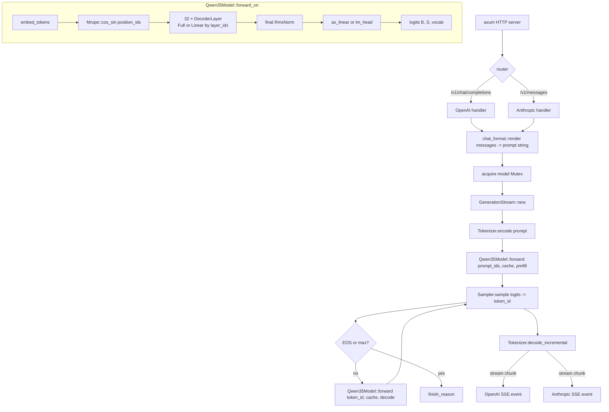
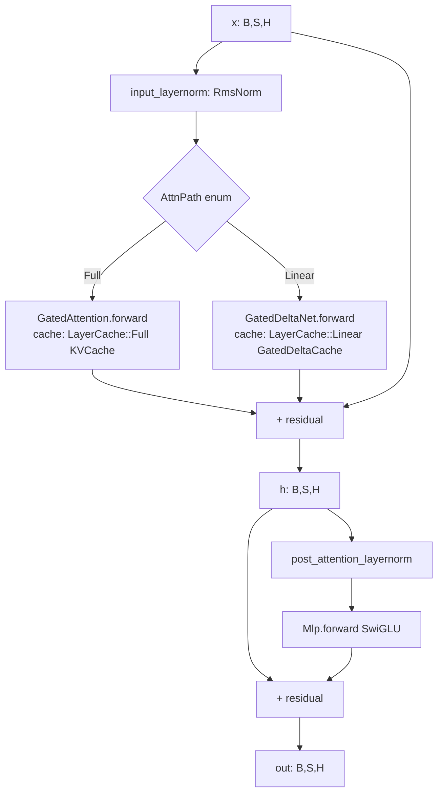

# ironmlx P4 — Qwen3.5 Dense E2E 设计

**目标：** 端到端跑通 Qwen3.5 Dense 文本推理 — 装配 hybrid (gated full-attention + gated delta-net) 的 32 层模型、加载真实 4-bit checkpoint、prefill+decode 生成循环、HTTP server 暴露 OpenAI/Anthropic 兼容 API。最终 `ironmlx serve --model <dir> --port 8080` 后 `curl /v1/chat/completions` 与 `curl /v1/messages` 都可流式返回模型生成的文本。

**作用域：**
- `nn::DecoderLayer` 扩展 — 内部 `attn` 字段改为 `enum AttnPath { Full(GatedAttention), Linear(GatedDeltaNet) }`，配套 `enum LayerCache { Full(KVCache), Linear(GatedDeltaCache) }`
- `models::qwen3_5` 新模块 — `Qwen35Config` (text_config 解析) + `Qwen35TextModel` + `Qwen35Model` + `make_cache` helper
- `core::loader::Loader` 扩展 — `sanitize` 阶段：mtp.* 检测 + 剥离、conv1d.weight `moveaxis(2,1)` 修正、RMSNorm `+1.0` HF 偏移
- `core::generate` 新模块 — `GenerationStream` (prefill + decode + sampler + EOS / max_tokens 终止)
- `core::server` 新模块 — axum HTTP server + `/v1/chat/completions` (OpenAI) + `/v1/messages` (Anthropic)，单 stream 串行
- `cli::serve` 新子命令；`cli::generate` 完成接线（接 `core::generate`）
- 真实 4-bit checkpoint (`mlx-community/Qwen3.5-4B-MLX-4bit`) 加载 + 数值对齐 mlx-lm + HTTP smoke

**显式不在范围（已在 brainstorm 中确认）：**
- ❌ MTP head 加载/构造 — Loader 仅剥离 mtp.* 权重；`Qwen35Model` 不持 `mtp` 字段。MTP 真实加载 + `Mtp::forward` 首次调用一并推到 P8c (speculative decoding loop)
- ❌ MoE / SparseMoeBlock — P5
- ❌ Vision 多模态 — P6
- ❌ 多并发请求 / batched KV cache / 跨请求 KV 共享 — P8b (request scheduler)
- ❌ Speculative decoding — P8c
- ❌ OpenAI `/v1/responses` (Responses API) — 隐含 agent / tools 能力，推迟
- ❌ Function calling / tool use
- ❌ 多 GPU / sharding / distributed
- ❌ Prompt caching across requests
- ❌ 鉴权 / API key — 单机本地服务

**依赖：**
- P1 `Linear` (含 quantized matmul + in_features/out_features 访问器)、`Embedding` (含 as_output 复用 tied lm_head)、`RmsNorm`、`Mlp`
- P2 `KVCache` (cap-bounded、step-grow、`update_and_fetch_on`)
- P3.5 `Loader` (mmap safetensors + config.json 解析 + tokenizer_config.json + `quant_meta`)
- P3a MetalKernel typestate (GatedDeltaNet 用)
- P3b1 `Mrope`
- P3b2 `GatedAttention`
- P3b3 `GatedDeltaNet` + `GatedDeltaCache` + `Conv1d`
- P3b4 `DecoderLayer` (current full-attn-only — Task 1 改造为 enum 字段)
- 现有 `core::Tokenizer` (HF tokenizers + ChatTemplate via minijinja) + `core::Sampler` + `core::ChatTemplate`
- 新外部 crate: `axum 0.7`, `tokio` (workspace 应已含), `tower-http`, `serde_json`

---

## § 1 调研发现与决策摘要

### 1.1 Qwen3.5 Dense 架构关键事实

经对照 mlx-lm `qwen3_5.py` (`/Volumes/Dev/mlx-lm/mlx_lm/models/qwen3_5.py:209-298`) 与 vllm-mlx `qwen3_5_mtp.py` (`/Volumes/Dev/vllm-mlx/vllm_mlx/patches/qwen3_5_mtp.py`)，并验证 `mlx-community/Qwen3.5-4B-MLX-4bit` 实际 checkpoint：

1. **Hybrid layered model** —— 32 层 DecoderLayer 按 `(layer_idx + 1) % full_attention_interval == 0` 决定走 Full Attention 或 Linear Attention SSM。Qwen3.5 默认 `full_attention_interval=4`，即 8 个 Full + 24 个 Linear（layer indices 3, 7, 11, ..., 31 是 Full，其他是 Linear）

2. **`mtp.*` weights 是可选独立文件**，**不在主 checkpoint 内**：
   - `mlx-community/Qwen3.5-4B-MLX-4bit/model.safetensors` 1221 个 key，**无 mtp.\*** 前缀
   - vllm-mlx 从 `<model_dir>/mtp/weights.safetensors` 或 `<model_dir>/model-mtp.safetensors` 单独读取（需用户运行 `scripts/add_mtp_weights_qwen35.py` 准备）
   - 即使加载，MTP 不参与主推理路径 — 仅在 P8c speculative decoding 中作为 draft head 起作用

3. **`tie_word_embeddings`** —— 真实 4B checkpoint config 显示 `tie_word_embeddings: true` (Qwen3.5 默认)；意味着 `lm_head` 权重在 checkpoint 中被剥离，由 `embed_tokens.as_linear()` 复用主 embedding 投影

4. **`config.json` 嵌套 `text_config`** —— Qwen3.5-4B-MLX-4bit 顶层 config 是 multimodal architecture (`Qwen3_5ForConditionalGeneration`)，文本相关参数全部在 `config["text_config"]` 子字典里 (`hidden_size`, `num_hidden_layers`, `num_attention_heads`, `num_key_value_heads`, `linear_*` family, `rope_parameters`, `tie_word_embeddings`, `eos_token_id`, ...)

5. **HF RMSNorm `+1.0` 偏移约定** —— mlx-lm `qwen3_5.py:307-331` `sanitize` 显示：当 checkpoint 包含 `mtp.*` 权重 OR 包含未规范化 `conv1d.weight`（last-dim != 1）时，主模型所有 RMSNorm 权重需要 `+1.0`（HF 偏移→实际 gamma）；conv1d.weight 同时还要 `moveaxis(2, 1)`

6. **mask 协议** —— mlx-lm `base.py:45-65`：
   - `create_attention_mask`: prompt 长度 N=1 → 返回 None（decode 单 token 无需 mask）；N>1 → 返回字符串 `"causal"`（SDPA 内置 causal）
   - `create_ssm_mask`: 单请求始终返回 None；多请求时 cache 实现 `make_mask`
   - **P4 单请求**：fa_mask 走 SDPA 字符串路径（已是 P3b2 GatedAttention 现状），ssm_mask 始终 None — 不需要 Rust 端实现具体函数

### 1.2 决策摘要

| 决策维度 | 选择 | Brainstorm 来源 |
|---|---|---|
| **总体范围** | 单个 P4 = 模型 + generate + HTTP server 全包 (~10 d) | Boss 选；P8a 折叠进 P4 |
| **DecoderLayer 扩展** | A 路线 — `attn` 字段改 enum (additive)；配套 LayerCache enum；从 `from_components` 重命名为 `from_components_full` + 新增 `from_components_linear` | Boss 选 A |
| **MTP 在 P4 处理** | Strip — Loader 完全忽略 mtp.* 路径；Qwen35Model 不持 mtp 字段 | Boss 选 Strip；与 mlx-lm sanitize 一致；MTP 真实加载推到 P8c |
| **HTTP API 端点** | OpenAI `/v1/chat/completions` + Anthropic `/v1/messages`；流式 SSE + 非流式 JSON 两模式都支持 | Boss 选 chat-completions + messages；`/v1/responses` 推迟 |
| **HTTP 框架** | axum 0.7 + tokio + tower-http | 默认选择；Rust HTTP 生态主流 |
| **HTTP 并发模型** | 单 stream — `Arc<Mutex<Qwen35Model>>` 串行第二个请求阻塞等待 | brainstorm § 3.7；P8b 替换为真实调度器 |
| **真实 checkpoint 测试** | `#[ignore]` 默认；`MLX_DIR=... QWEN35_MODEL=... cargo test --ignored` 触发 | 真实 4B 量化权重 ~2.4GB 不可入仓 |
| **Logits 数值对齐 reference** | Python 端跑 `mlx-lm` 抓 logits 存 `.npy` (vs. P3b3 的独立 re-impl) | 无 sanity-check value，直接对齐 mlx-lm 即可；同一份 cxx-mlx 底层 op 理论一致 |

---

## § 2 算法 / 数据流

### 2.1 整体（HTTP request → token stream）



### 2.2 DecoderLayer dispatch (per layer)



### 2.3 热路径分析（Qwen3.5-4B 4-bit decode 单 token）

| 阶段 | 操作 | 估算 cost |
|---|---|---|
| `embed_tokens.forward` | `[1, 1] u32` → `[1, 1, 2560]` quantized lookup | ~50µs |
| `Mrope.cos_sin` | 编译过的 OnceLock pipeline | ~10µs |
| 24 × Linear layer (GatedDeltaNet) | 每层 conv1d + recursive SSM kernel + RmsNormGated + 4 × Linear | ~150µs / layer × 24 = 3.6ms |
| 8 × Full layer (GatedAttention) | 每层 4 × Linear (q/k/v/o) + q/k_norm + Mrope.apply + SDPA + sigmoid gate | ~250µs / layer × 8 = 2ms |
| `final_norm` | RmsNorm | ~5µs |
| `embed_tokens.as_output` | quantized matmul `[1, 1, 2560] @ [vocab, 2560]^T` (vocab ≈ 250k) | ~500µs |
| `mlx::eval` 推齐流 + `Sampler.sample` | host roundtrip + sample logic | ~200µs |
| `Tokenizer.decode_incremental` | host-only | ~5µs |
| **小计 / token** | | **~6.5ms** |

decode 吞吐 ≈ 150 tok/s（与 mlx-lm 在同硬件实测应在同量级）。prefill 1024 token 一次性 ≈ 200ms（一次 SDPA 摊销大）。

---

## § 3 详细设计

### 3.1 `nn::DecoderLayer` enum 扩展

```rust
// ironmlx/src/nn/decoder_layer.rs (MODIFIED)

/// Attention 路径变体。
#[doc(hidden)]
pub enum AttnPath {
    Full(GatedAttention),
    Linear(GatedDeltaNet),
}

/// 单层缓存变体（与 AttnPath 类型对偶）。
#[doc(hidden)]
pub enum LayerCache {
    Full(KVCache),
    Linear(GatedDeltaCache),
}

pub struct DecoderLayer {
    input_layernorm: RmsNorm,
    attn: AttnPath,                      // 替代原 self_attn 字段
    post_attention_layernorm: RmsNorm,
    mlp: Mlp,
    cfg: DecoderLayerConfig,
}

impl DecoderLayer {
    /// Full-attention 测试钩 (取代原 from_components)。
    #[doc(hidden)]
    pub fn from_components_full(
        input_layernorm: RmsNorm,
        self_attn: GatedAttention,
        post_attention_layernorm: RmsNorm,
        mlp: Mlp,
        cfg: DecoderLayerConfig,
    ) -> Self { /* attn = AttnPath::Full(self_attn) */ }

    /// Linear-attention 测试钩 (新增)。
    #[doc(hidden)]
    pub fn from_components_linear(
        input_layernorm: RmsNorm,
        linear_attn: GatedDeltaNet,
        post_attention_layernorm: RmsNorm,
        mlp: Mlp,
        cfg: DecoderLayerConfig,
    ) -> Self { /* attn = AttnPath::Linear(linear_attn) */ }

    pub fn from_loader(loader: &Loader, prefix: &str, cfg: DecoderLayerConfig, kind: AttnKind) -> Result<Self> {
        // kind: AttnKind::Full → 读 {prefix}.self_attn.*
        // kind: AttnKind::Linear → 读 {prefix}.linear_attn.*
    }

    /// Stream-targeted forward。Cache 必须与 attn 类型对应；不匹配返回 Err。
    #[allow(clippy::too_many_arguments)]
    pub fn forward_on(
        &self,
        x: &Array,
        mrope: &Mrope,
        cos: &Array,
        sin: &Array,
        mask: Option<&Array>,
        cache: Option<&mut LayerCache>,
        target: impl Into<StreamOrDevice>,
    ) -> Result<Array> {
        // pre-flight: rank 3, last-axis == cfg.hidden_size (existing checks)
        // dispatch:
        //   match (&self.attn, cache.as_deref_mut()) {
        //     (AttnPath::Full(a), Some(LayerCache::Full(kv))) => a.forward_on(..., Some(kv), target),
        //     (AttnPath::Full(a), None) => a.forward_on(..., None, target),
        //     (AttnPath::Full(_), Some(LayerCache::Linear(_))) => Err("DecoderLayer Full + Linear cache"),
        //     (AttnPath::Linear(a), Some(LayerCache::Linear(gdc))) => a.forward_on(..., Some(gdc), target),
        //     (AttnPath::Linear(a), None) => a.forward_on(..., None, target),
        //     (AttnPath::Linear(_), Some(LayerCache::Full(_))) => Err("DecoderLayer Linear + Full cache"),
        //   }
        // 其余 pipeline (residual + post_norm + mlp + residual) 不变
    }
}

/// Loader 入口区分 AttnKind 的小枚举。
#[derive(Debug, Clone, Copy)]
pub enum AttnKind { Full, Linear }
```

> **API 假设**：`GatedAttention::forward_on` / `GatedDeltaNet::forward_on` 已存在 cache 参数。前者 `Option<&mut KVCache>`，后者 `Option<&mut GatedDeltaCache>`（P3b3 现有签名）。

### 3.2 `models::qwen3_5::Qwen35Config`

```rust
// ironmlx/src/models/qwen3_5/config.rs (NEW)

#[derive(Debug, Clone, Deserialize)]
pub struct Qwen35Config {
    pub hidden_size: i32,
    pub intermediate_size: i32,
    pub num_hidden_layers: i32,           // 32
    pub num_attention_heads: i32,
    pub num_key_value_heads: i32,
    pub head_dim: Option<i32>,            // None → hidden_size / num_attention_heads
    pub vocab_size: i32,
    pub rms_norm_eps: f32,
    pub attention_bias: bool,
    pub tie_word_embeddings: bool,
    pub full_attention_interval: i32,     // 4
    // Linear-attn 参数
    pub linear_num_value_heads: i32,
    pub linear_num_key_heads: i32,
    pub linear_key_head_dim: i32,
    pub linear_value_head_dim: i32,
    pub linear_conv_kernel_dim: i32,
    // RoPE
    pub rope_parameters: RopeParams,
    // EOS
    pub eos_token_id: Option<EosTokenId>,
}

#[derive(Debug, Clone, Deserialize)]
pub struct RopeParams {
    #[serde(default = "default_partial")] pub partial_rotary_factor: f32,  // 0.25
    #[serde(default = "default_theta")]   pub rope_theta: f32,             // 100000.0
    #[serde(default)]                     pub mrope_section: Vec<i32>,     // [11,11,10]
}

impl Qwen35Config {
    /// 从 Loader.config_raw 的 text_config 子字典解析。
    pub fn from_loader(loader: &Loader) -> Result<Self> {
        // serde_json::from_value(loader.config_raw["text_config"].clone())
        // + 兜底 head_dim 默认值
    }

    pub fn effective_head_dim(&self) -> i32 {
        self.head_dim.unwrap_or(self.hidden_size / self.num_attention_heads)
    }

    /// 返回每层应当走哪条路径。
    pub fn layer_kind(&self, layer_idx: i32) -> AttnKind {
        if (layer_idx + 1) % self.full_attention_interval == 0 {
            AttnKind::Full
        } else {
            AttnKind::Linear
        }
    }
}
```

### 3.3 `models::qwen3_5::Qwen35TextModel`

```rust
// ironmlx/src/models/qwen3_5/text_model.rs (NEW)

pub struct Qwen35TextModel {
    embed_tokens: Embedding,
    layers: Vec<DecoderLayer>,
    norm: RmsNorm,
    cfg: Qwen35Config,
    mrope: Mrope,
}

impl Qwen35TextModel {
    pub fn from_loader(loader: &Loader, cfg: Qwen35Config) -> Result<Self> {
        let embed_tokens = Embedding::from_loader(loader, "model.embed_tokens")?;

        let head_dim = cfg.effective_head_dim();
        let mrope = Mrope::new(
            head_dim,
            cfg.rope_parameters.rope_theta,
            cfg.rope_parameters.partial_rotary_factor,
            &cfg.rope_parameters.mrope_section,
            /* interleaved = */ true,    // Qwen3.5 默认 interleaved
        )?;

        let mut layers = Vec::with_capacity(cfg.num_hidden_layers as usize);
        for i in 0..cfg.num_hidden_layers {
            let layer_cfg = layer_config_for(&cfg, i);
            let kind = cfg.layer_kind(i);
            layers.push(DecoderLayer::from_loader(
                loader,
                &format!("model.layers.{i}"),
                layer_cfg,
                kind,
            )?);
        }

        let norm = RmsNorm::from_loader(loader, "model.norm", cfg.rms_norm_eps)?;
        Ok(Self { embed_tokens, layers, norm, cfg, mrope })
    }

    /// 单流 forward。input_ids: [B, S] u32; cache.len() == cfg.num_hidden_layers (or None)。
    /// 返回 hidden_states: [B, S, hidden_size] (post-norm)。
    pub fn forward_on(
        &self,
        input_ids: &Array,
        position_ids: &Array,             // [3, B, S] i32 (mrope 三流)
        cache: Option<&mut [LayerCache]>,
        target: impl Into<StreamOrDevice>,
    ) -> Result<Array> {
        let target = target.into();
        // pre-flight: input_ids rank 2; cache.len() match if Some
        let mut x = self.embed_tokens.forward_on(input_ids, target)?;
        let (cos, sin) = self.mrope.cos_sin(position_ids)?;
        let mut cache_iter = cache.map(|c| c.iter_mut());
        for layer in &self.layers {
            let layer_cache = cache_iter.as_mut().and_then(|it| it.next());
            x = layer.forward_on(&x, &self.mrope, &cos, &sin, None, layer_cache, target)?;
        }
        self.norm.forward_on(&x, target)
    }
}
```

> **API 假设**：`Embedding::forward_on(tokens, target)` 已存在 (P1)。`Mrope::cos_sin(position_ids)` 不带 stream 参数（cos_sin 自带 OnceLock 编译路径，与默认 stream 绑定）—— 这是 P3b1 的现状，P4 不再扩展。

### 3.4 `models::qwen3_5::Qwen35Model`

```rust
// ironmlx/src/models/qwen3_5/model.rs (NEW)

pub struct Qwen35Model {
    text: Qwen35TextModel,
    lm_head: Option<Linear>,        // Some 当 !tie_word_embeddings；否则用 text.embed_tokens.as_output
    cfg: Qwen35Config,
}

impl Qwen35Model {
    pub fn from_loader(loader: &Loader) -> Result<Self> {
        let cfg = Qwen35Config::from_loader(loader)?;
        let text = Qwen35TextModel::from_loader(loader, cfg.clone())?;
        let lm_head = if cfg.tie_word_embeddings {
            None
        } else {
            Some(Linear::from_loader(loader, "lm_head")?)
        };
        Ok(Self { text, lm_head, cfg })
    }

    /// Forward 返回 logits [B, S, vocab_size]。
    pub fn forward_on(
        &self,
        input_ids: &Array,
        position_ids: &Array,
        cache: Option<&mut [LayerCache]>,
        target: impl Into<StreamOrDevice>,
    ) -> Result<Array> {
        let target = target.into();
        let hidden = self.text.forward_on(input_ids, position_ids, cache, target)?;
        match &self.lm_head {
            Some(head) => head.forward_on(&hidden, target),
            None       => self.text.embed_tokens.as_output_on(&hidden, target),
        }
    }

    /// 构造一组与本模型层数 / 每层路径匹配的 cache。
    /// cap = prompt_len + max_new_tokens；dtype 通常 bf16；batch 通常 1。
    pub fn make_cache(&self, batch: i32, cap: i32, dtype: Dtype) -> Result<Vec<LayerCache>> {
        let cfg = &self.cfg;
        let mut out = Vec::with_capacity(cfg.num_hidden_layers as usize);
        for i in 0..cfg.num_hidden_layers {
            match cfg.layer_kind(i) {
                AttnKind::Full => out.push(LayerCache::Full(KVCache::new(
                    batch,
                    cfg.num_key_value_heads,
                    cfg.effective_head_dim(),
                    cfg.effective_head_dim(),       // v_head_dim == head_dim for Qwen3.5
                    dtype,
                    cap,
                ))),
                AttnKind::Linear => {
                    let conv_dim = cfg.linear_key_head_dim * cfg.linear_num_key_heads * 2
                                 + cfg.linear_value_head_dim * cfg.linear_num_value_heads;
                    out.push(LayerCache::Linear(GatedDeltaCache::new_with_cap(
                        batch,
                        cfg.linear_conv_kernel_dim,
                        conv_dim,
                        cfg.linear_num_value_heads,
                        cfg.linear_value_head_dim,
                        cfg.linear_key_head_dim,
                        dtype,
                        cap,
                    )?));
                }
            }
        }
        Ok(out)
    }

    pub fn config(&self) -> &Qwen35Config { &self.cfg }
}
```

> **风险**：Embedding 暴露 `as_output_on` 的方式 — `Qwen35Model::forward_on` 通过 `self.text.embed_tokens.as_output_on` 调用要求 `Qwen35TextModel::embed_tokens` 字段在 model.rs 可访问。要么 (a) `pub(crate)` 暴露 `embed_tokens`；要么 (b) `Qwen35TextModel` 加 `as_output_on(hidden, target)` 透传方法。我们用 (b) — 接口更干净。

### 3.5 Loader sanitize 阶段

```rust
// ironmlx/src/core/loader.rs (MODIFIED)

impl Loader {
    pub fn open(model_dir: &Path) -> Result<Self> {
        // ... (现有 config.json + safetensors mmap 加载)
        let mut tensors: HashMap<String, Array> = /* mmap-loaded */;
        Self::sanitize(&mut tensors, &config_raw)?;
        Ok(Self { tensors, /* ... */ })
    }

    /// HF Qwen3.5 sanitize（与 mlx-lm `qwen3_5.py:307-331` 对齐）。
    fn sanitize(weights: &mut HashMap<String, Array>, config: &serde_json::Value) -> Result<()> {
        // 1. 检测 mtp.* 与 unsanitized conv1d
        let has_mtp = weights.keys().any(|k| k.contains("mtp."));
        let has_unsan_conv1d = weights.iter()
            .any(|(k, v)| k.ends_with("conv1d.weight") && v.shape().as_slice().last().copied() != Some(1));
        let should_shift_norm = has_mtp || has_unsan_conv1d;

        // 2. Strip mtp.* 权重
        weights.retain(|k, _| !k.contains("mtp."));

        // 3. 若 tie_word_embeddings，剥离 lm_head.weight
        let tie = config["text_config"]["tie_word_embeddings"].as_bool().unwrap_or(false);
        if tie {
            weights.remove("lm_head.weight");
            // 量化 checkpoint 也可能含 lm_head.scales / biases
            weights.remove("lm_head.scales");
            weights.remove("lm_head.biases");
        }

        // 4. conv1d.weight moveaxis(2, 1) — 旧形状 [out, in, k] → 新 [out, k, in]
        let conv1d_keys: Vec<String> = weights.keys()
            .filter(|k| k.ends_with("conv1d.weight"))
            .cloned().collect();
        for k in conv1d_keys {
            let v = weights[&k].clone();
            let shape = v.shape();
            let s = shape.as_slice();
            if s.len() == 3 && s[2] != 1 {
                let moved = mlx::ops::shape::moveaxis(&v, 2, 1)?;
                weights.insert(k, moved);
            }
        }

        // 5. RmsNorm +1.0 偏移修正 — 仅当 should_shift_norm
        if should_shift_norm {
            const NORM_SUFFIXES: &[&str] = &[
                ".input_layernorm.weight",
                ".post_attention_layernorm.weight",
                ".q_norm.weight",
                ".k_norm.weight",
            ];
            const NORM_EXACT: &[&str] = &["model.norm.weight"];
            let keys_to_shift: Vec<String> = weights.iter()
                .filter(|(k, v)| {
                    v.shape().as_slice().len() == 1
                        && (NORM_SUFFIXES.iter().any(|s| k.ends_with(s))
                            || NORM_EXACT.iter().any(|s| k == s))
                })
                .map(|(k, _)| k.clone())
                .collect();
            for k in keys_to_shift {
                let v = weights[&k].clone();
                let shifted = (&v + 1.0_f32);  // Array + scalar 是 panic-on-err
                weights.insert(k, shifted);
            }
        }
        Ok(())
    }
}
```

> **API 假设**：`mlx::ops::shape::moveaxis` 存在。如缺失则需以现有 transpose / reshape 组合实现 — 风险表登记。

### 3.6 `core::generate::GenerationStream`

```rust
// ironmlx/src/core/generate.rs (NEW)

#[derive(Debug, Clone)]
pub struct GenerateRequest {
    pub prompt_ids: Vec<u32>,        // chat template 已应用
    pub max_new_tokens: usize,
    pub sampler: Sampler,
    pub stop_token_ids: Vec<u32>,    // 来自 tokenizer_config.json eos_token_id
}

#[derive(Debug, Clone)]
pub struct GenerateEvent {
    pub token: u32,
    pub text: String,                // 增量解码后的文本片段（可能为空）
    pub finish_reason: Option<&'static str>,  // None | "stop" | "length"
}

pub struct GenerationStream<'m> {
    model: &'m Qwen35Model,
    tokenizer: &'m Tokenizer,
    cache: Vec<LayerCache>,
    history: Vec<u32>,               // 累计 ids；给 sampler.repetition_penalty 与 detok 用
    pending_ids: Vec<u32>,           // 未 detok 的 buffer (for incremental decode)
    request: GenerateRequest,
    finished: bool,
}

impl<'m> GenerationStream<'m> {
    pub fn new(
        model: &'m Qwen35Model,
        tokenizer: &'m Tokenizer,
        request: GenerateRequest,
    ) -> Result<Self> {
        let dtype = Dtype::Bfloat16;     // Qwen3.5 默认
        let cap = (request.prompt_ids.len() + request.max_new_tokens) as i32;
        let mut cache = model.make_cache(/* batch */ 1, cap, dtype)?;

        // Prefill
        let prompt_arr = Array::try_from((request.prompt_ids.as_slice(), &[1, request.prompt_ids.len() as i32][..]))?;
        let position_ids = build_position_ids(0, request.prompt_ids.len() as i32)?;  // [3, 1, S]
        let logits = model.forward_on(&prompt_arr, &position_ids, Some(&mut cache), ())?;
        let last_logits = logits.slice(...)?;  // [1, vocab]
        let history = request.prompt_ids.clone();
        let first_token = request.sampler.sample(&last_logits, &history)?;

        let mut s = Self {
            model, tokenizer, cache,
            history, pending_ids: vec![first_token], request, finished: false,
        };
        s.history.push(first_token);
        Ok(s)
    }

    /// 拉一个 token。返回 None 表示流结束。
    pub fn next_token(&mut self) -> Result<Option<GenerateEvent>> {
        if self.finished { return Ok(None); }

        // 1. 取出 last token，detok 增量
        let token = *self.pending_ids.last().expect("pending_ids non-empty");
        let text = self.tokenizer.decode_incremental(&self.pending_ids)?;

        // 2. 判断终止
        let new_count = self.history.len() - self.request.prompt_ids.len();
        let finish_reason = if self.request.stop_token_ids.contains(&token) {
            Some("stop")
        } else if new_count >= self.request.max_new_tokens {
            Some("length")
        } else {
            None
        };

        if finish_reason.is_some() {
            self.finished = true;
            return Ok(Some(GenerateEvent { token, text, finish_reason }));
        }

        // 3. Decode 一步
        let token_arr = Array::try_from((&[token][..], &[1, 1][..]))?;
        let pos = self.history.len() as i32 - 1;  // current step position
        let position_ids = build_position_ids(pos, 1)?;
        let logits = self.model.forward_on(&token_arr, &position_ids, Some(&mut self.cache), ())?;
        let next = self.request.sampler.sample(&logits, &self.history)?;
        self.history.push(next);
        self.pending_ids.push(next);

        Ok(Some(GenerateEvent { token, text, finish_reason: None }))
    }
}
```

> **API 假设**：
> - `Tokenizer::decode_incremental(&[u32]) -> Result<String>` — 单测时如 P3.5 Tokenizer 没暴露则用 `Tokenizer::decode` 兜底（每次解码全 history slice 取 diff）
> - `Sampler::sample(logits, history) -> Result<u32>` (P3.5 现状)
> - `build_position_ids(start_pos: i32, len: i32) -> Result<Array>` 是新 helper：返回 `[3, 1, len]` shape，3 个相同 stream（文本只用 temporal 流，三流取相同序列），数值 `[start_pos, start_pos+1, ..., start_pos+len-1]`

### 3.7 HTTP Server

```rust
// ironmlx/src/core/server/mod.rs (NEW)

pub struct AppState {
    pub model: Arc<Mutex<Qwen35Model>>,
    pub tokenizer: Arc<Tokenizer>,
    pub model_id: String,
}

pub async fn serve(
    model: Qwen35Model,
    tokenizer: Tokenizer,
    model_id: String,
    host: &str,
    port: u16,
) -> Result<()> {
    let state = Arc::new(AppState {
        model: Arc::new(Mutex::new(model)),
        tokenizer: Arc::new(tokenizer),
        model_id,
    });
    let app = axum::Router::new()
        .route("/v1/chat/completions", axum::routing::post(openai::chat_completions))
        .route("/v1/messages",         axum::routing::post(anthropic::messages))
        .route("/health",              axum::routing::get(|| async { "ok" }))
        .with_state(state);
    let addr = format!("{host}:{port}").parse::<std::net::SocketAddr>()?;
    let listener = tokio::net::TcpListener::bind(addr).await?;
    axum::serve(listener, app).await?;
    Ok(())
}
```

```rust
// ironmlx/src/core/server/openai.rs (NEW) — 关键摘要
#[derive(Deserialize)]
pub struct ChatRequest {
    pub model: String,
    pub messages: Vec<ChatMessage>,
    #[serde(default)] pub stream: bool,
    #[serde(default = "default_max")] pub max_tokens: usize,
    #[serde(default)] pub temperature: Option<f32>,
    #[serde(default)] pub top_p: Option<f32>,
    #[serde(default)] pub seed: Option<u64>,
}

#[derive(Deserialize)]
pub struct ChatMessage { pub role: String, pub content: String }

pub async fn chat_completions(
    State(state): State<Arc<AppState>>,
    Json(req): Json<ChatRequest>,
) -> impl IntoResponse {
    let prompt_ids = match render_and_encode(&state.tokenizer, &req.messages) {
        Ok(ids) => ids, Err(e) => return error_response(400, e.to_string()),
    };
    let sampler = build_sampler(&req);
    let stop_token_ids = state.tokenizer.eos_token_ids().to_vec();
    let request = GenerateRequest { prompt_ids, max_new_tokens: req.max_tokens, sampler, stop_token_ids };

    if req.stream {
        let (tx, rx) = tokio::sync::mpsc::channel::<Result<axum::body::Bytes>>(8);
        let state_c = state.clone();
        let model_id = req.model.clone();
        tokio::task::spawn_blocking(move || {
            let model = state_c.model.lock().unwrap();
            let tok = &*state_c.tokenizer;
            let mut stream = match GenerationStream::new(&model, tok, request) {
                Ok(s) => s, Err(e) => { let _ = tx.blocking_send(Ok(format_sse_error(&e))); return; }
            };
            // emit role chunk first
            let _ = tx.blocking_send(Ok(format_oai_role_chunk(&model_id)));
            loop {
                match stream.next_token() {
                    Ok(Some(ev)) => {
                        let bytes = format_oai_delta_chunk(&model_id, &ev);
                        if tx.blocking_send(Ok(bytes)).is_err() { break; }
                        if ev.finish_reason.is_some() { break; }
                    }
                    Ok(None) => break,
                    Err(e) => { let _ = tx.blocking_send(Ok(format_sse_error(&e))); break; }
                }
            }
            let _ = tx.blocking_send(Ok(axum::body::Bytes::from_static(b"data: [DONE]\n\n")));
        });
        Sse::from_stream(ReceiverStream::new(rx)).into_response()
    } else {
        // 非流式：聚合所有 token text，返回单个 chat.completion JSON
        ...
    }
}
```

```rust
// ironmlx/src/core/server/anthropic.rs (NEW) — 6 事件结构
//   message_start → content_block_start (index=0, text="")
//   → content_block_delta(text_delta) ×N
//   → content_block_stop (index=0)
//   → message_delta (stop_reason)
//   → message_stop
// 每个事件用 "event: <type>\ndata: <json>\n\n" 格式
```

```rust
// ironmlx/src/core/server/chat_format.rs (NEW)
pub fn render_and_encode(tokenizer: &Tokenizer, messages: &[ChatMessage]) -> Result<Vec<u32>> {
    let chat_msgs: Vec<core::Message> = messages.iter()
        .map(|m| core::Message { role: m.role.clone(), content: m.content.clone() })
        .collect();
    let text = tokenizer.chat_template()
        .ok_or_else(|| anyhow!("model has no chat template"))?
        .render(&chat_msgs, /* add_generation_prompt = */ true)?;
    tokenizer.encode(&text)
}
```

> **API 假设**：`Tokenizer::chat_template() -> Option<&ChatTemplate>` 与 `ChatTemplate::render` 已存在 (P3.5)。如果 `add_generation_prompt` 参数不存在则查 minijinja 上下文调用方式。

### 3.8 CLI `serve` 子命令

```rust
// ironmlx/src/cli/serve.rs (NEW)
#[derive(clap::Args, Debug)]
pub struct ServeArgs {
    #[arg(long)] pub model: String,
    #[arg(long, default_value_t = 8080)] pub port: u16,
    #[arg(long, default_value = "127.0.0.1")] pub host: String,
}

pub fn run(args: ServeArgs) -> Result<()> {
    let model_dir = resolve_model_dir(&args.model)?;     // local path or HF hub download
    let loader = Loader::open(&model_dir)?;
    let tokenizer = Tokenizer::from_loader(&loader)?;
    let model = Qwen35Model::from_loader(&loader)?;
    let model_id = args.model.clone();

    let runtime = tokio::runtime::Builder::new_multi_thread()
        .enable_all()
        .build()?;
    runtime.block_on(async move {
        core::server::serve(model, tokenizer, model_id, &args.host, args.port).await
    })
}
```

并在 `cli/mod.rs` 加 `Serve(serve::ServeArgs)` 分支；同时把 `cli/generate.rs` 的 `_args` 替换为真实实现（构造 `GenerationStream`，逐 token 把 `event.text` 输出到 stdout）。

### 3.9 文件结构总览

```
ironmlx/src/
├── nn/
│   ├── decoder_layer.rs          # MODIFIED: AttnPath enum + LayerCache enum + 重命名 from_components_full + 新增 from_components_linear + dispatch logic + AttnKind 引导 from_loader
│   └── mod.rs                    # MODIFIED: re-export AttnPath, LayerCache, AttnKind
├── core/
│   ├── loader.rs                 # MODIFIED: open() 末尾调 sanitize
│   ├── generate.rs               # NEW: GenerationStream + GenerateRequest + GenerateEvent
│   ├── server/
│   │   ├── mod.rs                # NEW: serve() + AppState + axum router
│   │   ├── openai.rs             # NEW
│   │   ├── anthropic.rs          # NEW
│   │   └── chat_format.rs        # NEW
│   └── mod.rs                    # MODIFIED: pub mod generate, server
├── models/
│   ├── mod.rs                    # MODIFIED: pub mod qwen3_5
│   └── qwen3_5/
│       ├── mod.rs                # NEW: re-exports
│       ├── config.rs             # NEW: Qwen35Config + RopeParams
│       ├── text_model.rs         # NEW: Qwen35TextModel
│       └── model.rs              # NEW: Qwen35Model + make_cache
└── cli/
    ├── generate.rs               # MODIFIED: 调 core::generate
    ├── serve.rs                  # NEW
    └── mod.rs                    # MODIFIED: 加 Serve

ironmlx/tests/
├── fixtures/p4_qwen35/
│   ├── README.md                 # NEW: 描述生成步骤、checkpoint 期望
│   └── gen_logits.py             # NEW: mlx-lm 生成 expected_logits.npy（不入仓 .npy；运行时生成）
├── p4_qwen35_logits_match.rs     # NEW: #[ignore] integration test
└── p4_http_smoke.rs              # NEW: #[ignore] tokio integration test
```

---

## § 4 测试策略

### 4.1 单元测试（不依赖外部 checkpoint，CI 可跑）

| 模块 | 测试 | 验证内容 |
|---|---|---|
| `nn::decoder_layer` | `from_components_full_dispatches_full` | 构造 Full + LayerCache::Full → 正常 forward；shape/dtype 正确 |
| `nn::decoder_layer` | `from_components_linear_dispatches_linear` | 构造 Linear + LayerCache::Linear → 正常 forward |
| `nn::decoder_layer` | `cache_kind_mismatch_full_layer_linear_cache_errors` | Full + LayerCache::Linear → Err，msg 含 "DecoderLayer" + "cache" |
| `nn::decoder_layer` | `cache_kind_mismatch_linear_layer_full_cache_errors` | Linear + LayerCache::Full → Err |
| `core::loader` | `sanitize_strips_mtp_keys` | mock 权重含 `mtp.foo.weight`、`model.layers.0.input_layernorm.weight` (1D) → mtp 被剥离，has_mtp=true 触发 +1.0 偏移 |
| `core::loader` | `sanitize_conv1d_moveaxis_when_3d_last_not_one` | mock 权重 `conv1d.weight` shape `[8, 4, 3]` → moveaxis 后 `[8, 3, 4]`；`[8, 4, 1]` → 保持不变 |
| `core::loader` | `sanitize_strips_lm_head_when_tied` | tie_word_embeddings=true + lm_head.weight 存在 → lm_head.weight 被剥离 |
| `core::loader` | `sanitize_no_shift_when_neither_trigger` | 无 mtp、conv1d 已规范化 → norm 权重不变 |
| `models::qwen3_5::config` | `parses_real_text_config_subset` | 嵌入实测 config.json text_config 子集 → Qwen35Config 字段正确 |
| `models::qwen3_5::config` | `layer_kind_partition_full_attention_interval_4` | num_hidden_layers=32, full_attention_interval=4 → 正好 layer_idx ∈ {3,7,11,15,19,23,27,31} 是 Full，其余 Linear |
| `models::qwen3_5::config` | `effective_head_dim_default` | head_dim=None + hidden=2560 + heads=20 → 128；head_dim=Some(256) → 256 |
| `models::qwen3_5::model` | `from_components_assembles_layers` | 新增 `Qwen35Model::from_components` 测试钩，构造 4 层小规模 (full=1, linear=3) → 测试 forward shape `[1, 4, hidden]` |
| `models::qwen3_5::model` | `make_cache_layer_kinds` | num_hidden_layers=8 + full_interval=4 → make_cache 返回 8 个 LayerCache，layer 1, 5 是 Full（其他 Linear）|
| `core::generate` | `eos_terminates_with_stop_reason` | mock model 返回 deterministic logits 让 sampler 产 EOS → 一步后 finish_reason="stop" |
| `core::generate` | `max_new_tokens_terminates_with_length_reason` | max_new_tokens=3 → 3 个 token 后 finish_reason="length" |
| `core::generate` | `decode_advances_kvcache_offset` | 每 next_token 调用后所有 LayerCache 的 offset +=1（Full）或 advance(1)（Linear）|
| `core::server::openai` | `sse_role_chunk_format` | 第一个 chunk 含 `delta:{role:"assistant", content:""}` |
| `core::server::openai` | `sse_delta_chunk_format` | 中间 chunk 含 `delta:{content:"..."}`，无 finish_reason |
| `core::server::openai` | `sse_final_chunk_with_finish_reason_and_done_marker` | 最后含 `finish_reason:"stop"`，再发 `data: [DONE]\n\n` |
| `core::server::openai` | `non_stream_returns_chat_completion_object` | stream=false → 单 JSON 含完整 message |
| `core::server::anthropic` | `sse_six_event_sequence` | 一个 1-token 流 → 看到 message_start, content_block_start, content_block_delta, content_block_stop, message_delta, message_stop 顺序正确 |
| `core::server::anthropic` | `event_format_uses_event_line_prefix` | 每事件以 `event: <type>\ndata: <json>\n\n` 开头 |
| `core::server::anthropic` | `non_stream_returns_messages_object` | stream=false → 单 JSON 含 content blocks |
| `core::server::chat_format` | `render_user_message_applies_chat_template` | mock tokenizer + simple template → render 输出符合预期 |
| `core::server::mod` | `concurrent_requests_serialize_via_mutex` | tokio test：同时发 2 个生成任务，验证第二个的开始时间 ≥ 第一个的结束时间 |

合计 **~25 单测**。

### 4.2 集成测试（`#[ignore]`，需真实 checkpoint）

#### `tests/p4_qwen35_logits_match.rs`

环境变量：`QWEN35_MODEL=/path/to/Qwen3.5-4B-MLX-4bit`（默认尝试 `~/.cache/huggingface/hub/models--mlx-community--Qwen3.5-4B-MLX-4bit/snapshots/*/`）。

预生成 fixture（`tests/fixtures/p4_qwen35/gen_logits.py`）:
```python
import mlx.core as mx
from mlx_lm import load, generate

model, tok = load("mlx-community/Qwen3.5-4B-MLX-4bit")
prompt = "What is 2+2?"
ids = tok.encode(prompt)
input_ids = mx.array([ids])
logits = model(input_ids)        # [1, S, vocab]
last = logits[0, -1, :]
mx.save("expected_last_logits.npy", last)
mx.save("expected_input_ids.npy", mx.array(ids))
```

Rust 端测试：加载相同 checkpoint + tokenize 相同 prompt + forward + 取最后 logits → 与 expected 比较，atol < 1e-2。

#### `tests/p4_http_smoke.rs`

tokio 多线程 test：
1. 启动 axum server 在临时端口（`tokio::net::TcpListener::bind("127.0.0.1:0")` 取分配端口）
2. `reqwest::Client` 发四个请求（OpenAI stream + non-stream，Anthropic stream + non-stream），验证：
   - 200 OK
   - 流式：收到 `[DONE]` (OpenAI) 或 `message_stop` (Anthropic)
   - 非流式：JSON deserialize 成功，`choices[0].message.content` / `content[0].text` 非空
3. 关闭 server

### 4.3 测试运行命令

```sh
# 单测（CI 跑）
cargo test --release -p ironmlx --lib

# 现有 P3b3/P3b4 集成测试
MLX_DIR=$HOME/.local/mlx cargo test --release -p ironmlx --tests

# P4 真实 checkpoint 集成（Boss 本地手跑）
MLX_DIR=$HOME/.local/mlx \
  QWEN35_MODEL=$HOME/.cache/huggingface/hub/models--mlx-community--Qwen3.5-4B-MLX-4bit/snapshots/<snap>/ \
  cargo test --release --ignored -p ironmlx -- p4_qwen35_logits_match

MLX_DIR=$HOME/.local/mlx \
  QWEN35_MODEL=... \
  cargo test --release --ignored -p ironmlx -- p4_http_smoke
```

---

## § 5 风险

| 风险 | 缓解 |
|---|---|
| **4-bit 量化数值漂移累积 32 层** → logits 偏差 > 1e-2 | atol 1e-2 起步，失败时排查（先比对 layer-N hidden_state，层级二分定位）；同一份 cxx-mlx 底层 op 理论应当 bit-相等于 mlx-lm |
| **Mrope.cos_sin OnceLock 缓存在变长 prompt 重编译** | P3b1 ShapeMode::Fixed 默认行为，每 (B, S) 唯一组合编译一次 — 短期内重复 prompt 是缓存命中；prompt 长度变化重编译开销 ~50ms / 新 (B, S)，可接受 |
| **`mlx::ops::shape::moveaxis` 不存在** | 实施时检查；如缺失用 transpose + 索引重建（cxx-mlx 必有 transpose）; 风险表登记 |
| **AttnPath enum 替换破坏 P3b4 集成测试 (tests/p3b4_mtp.rs:62)** | T1 同步更新 `Mtp::from_components` 调用 + DecoderLayer::from_components → from_components_full；纳入 T1 的验收 |
| **chat template Jinja 在 Rust 端渲染差异** | minijinja 与 Python jinja2 的内置过滤器/语法子集差异；P3.5 ChatTemplate 已 wire 过 — P4 仅消化；HTTP smoke 测试覆盖完整渲染路径 |
| **HTTP server + model lock 死锁** | `tx.blocking_send().is_err()` 立即退出生成；mpsc channel buffer=8 防长 block；client 断连 `axum` SSE 检测到 |
| **EOS multi-id**（Qwen3.5 eos_token_id 可能是 list） | Loader 已支持 EosTokenId enum (P3.5)；GenerateRequest.stop_token_ids 接受 Vec<u32>；任一匹配触发 stop |
| **真实 4B 模型加载内存** | mlx 自动 mmap (~2.4GB virtual)；KV cache cap=2048+max_new_tokens 时 ~200MB；总内存预算 < 5GB，与 mlx-lm 同量级 |
| **axum 0.7 与 0.8 API 差异 / 升级** | Cargo.toml 显式锁 `axum = "0.7"`；workspace 引入 axum 必须明确版本 |
| **Anthropic SSE event ordering subtle** | 单测对照 anthropic-sdk-python 流 parser 期望逐字段 verify；HTTP smoke 端到端确认 |
| **Tokenizer chat_template 接口存在性** | P3.5 已实装；如 `add_generation_prompt` 参数不存在 — 走 minijinja 上下文显式传 `add_generation_prompt: True` |
| **量化 lm_head 处理** | Embedding::as_output_on 已支持 quant；不需特殊处理。如 lm_head_quant_predicate 涉及 P5 MoE 不影响 P4 |
| **GenerationStream incremental detok** | 累积 ids 全量 decode 取 diff 是 fallback 路径；如 Tokenizer.decode_incremental 不存在则用此 fallback；BPE 边界字符可能跨 token，需用 prefix matching diff（与 mlx-lm 同策略） |
| **Conv1d moveaxis 后 Conv1d.from_loader 重新加载需要 stride 重建** | P3b3 Conv1d::from_loader 直接读 weight；如 sanitize 对 weight in-place 修改导致 from_loader 拿到 sanitized 版本 — 这是预期行为，无问题 |

---

## § 6 实施任务划分（建议给 writing-plans）

| Task | 内容 | 时间 | 依赖 |
|---|---|---|---|
| **T1** DecoderLayer AttnPath 重构 | 现 self_attn 字段 → enum AttnPath；加 LayerCache enum + AttnKind enum；`from_components` 重命名为 `from_components_full` + 新增 `from_components_linear`；forward dispatch + cache 配对 pre-flight 校验；更新 P3b4 `Mtp::from_components` 内部调用 + tests/p3b4_mtp.rs 调用站点；4 个新单测 | 1.5d | P3b3 + P3b4 |
| **T2** Qwen35Config 解析 | text_config JSON → struct + RopeParams + 单测（嵌入真 config.json subset）+ layer_kind 单测 + effective_head_dim 单测 | 0.5d | T1 |
| **T3** Loader sanitize | mtp 检测 + strip + tie_word_embeddings lm_head 剥离 + conv1d.weight moveaxis + RMSNorm +1.0 偏移；4 个 mock 单测 | 0.5d | independent |
| **T4** Qwen35TextModel + Qwen35Model | embed + 32×DecoderLayer + final_norm + tied/untied lm_head + Mrope 装配；make_cache helper；from_loader 装配；3 个单测 (small synthetic 4-layer) + Qwen35Model::from_components 测试钩 | 2d | T1 + T2 + T3 |
| **T5** GenerationStream | prefill + decode + sampler 集成 + EOS / max_tokens 终止；3 个单测（mock model）；`build_position_ids` helper | 1d | T4 |
| **T6** Logits 对齐 integration test | Python `gen_logits.py` 用 mlx-lm 生成 expected_last_logits.npy；Rust `tests/p4_qwen35_logits_match.rs` `#[ignore]`：加载真 checkpoint + forward + atol 1e-2 比对 | 1d | T4 + T5 |
| **T7** HTTP server scaffolding | core::server::mod (axum router + AppState + Mutex 串行) + chat_format 渲染；2 个单测（concurrent serialize、render_user_message） | 1d | T5 |
| **T8** OpenAI 端点 | handler + JSON 结构 + SSE 格式（流式 + 非流式）；4 个单测（role chunk、delta chunk、final chunk + DONE、non-stream） | 1d | T7 |
| **T9** Anthropic 端点 | handler + 6-event SSE 序列 + JSON 结构；3 个单测（event order、event line prefix、non-stream） | 1d | T7 |
| **T10** CLI + HTTP smoke | `cli::serve` + `cli::generate` 接线；HTTP integration smoke (`#[ignore]`，4 路径) | 0.5d | T8 + T9 |
| **合计** | | **10 d** | |

**并行机会**：T1/T2/T3 互相独立；T4 是中心枢纽；T8/T9 可并行（T7 完成后）。

---

## § 7 验收标准

1. `cargo +nightly fmt --all -- --check && cargo +nightly clippy --all-features --workspace --exclude ironmlx-app -- -D warnings && cargo build --release` 全清洁
2. `cargo test --release -p ironmlx --lib` —— 所有 P1-P3b4 现有 lib 单测 + P4 新单测全过（~25 新增）
3. `cargo test --release -p ironmlx --tests` —— P3b3/P3b4 现有集成测试全过（不引入回归）
4. `MLX_DIR=$HOME/.local/mlx QWEN35_MODEL=$HOME/.cache/.../Qwen3.5-4B-MLX-4bit cargo test --release --ignored -p ironmlx -- p4_qwen35_logits_match` — top-1 greedy argmax token matches mlx-lm exactly AND `max-abs-diff < 0.5` vs mlx-lm's last-position logits. (Updated from initial `< 1e-2` — physically impossible across 32 layers of 4-bit BF16 with ~17 ULP per-channel quant noise; argmax-equality is the meaningful inference correctness check.)
5. `cargo test --release --ignored -p ironmlx -- p4_http_smoke` —— OpenAI 流式 + 非流式 + Anthropic 流式 + 非流式 4 路径全过
6. **手测 Boss 验收**：
   ```
   ironmlx serve --model ~/.cache/.../Qwen3.5-4B-MLX-4bit --port 8080 &
   curl http://localhost:8080/v1/chat/completions \
        -H "content-type: application/json" \
        -d '{"model":"qwen3.5-4b","messages":[{"role":"user","content":"What is 2+2?"}],"stream":true,"max_tokens":50}'
   curl http://localhost:8080/v1/messages \
        -H "content-type: application/json" \
        -d '{"model":"qwen3.5-4b","messages":[{"role":"user","content":"What is 2+2?"}],"stream":true,"max_tokens":50}'
   ```
   两个端点都收到合理流式输出（看到 "4" 或类似），且 SSE 流正确终止
7. P3b4 `nn::Mtp` / `core::cache::MtpCache` 源码完全不变（除 `Mtp::from_components` 内部调用 DecoderLayer::from_components_full 时调整参数构造）；P3b2 GatedAttention、P3b3 GatedDeltaNet 完全不变；P1 Linear/Embedding/RmsNorm 完全不变
8. `Qwen35Model`、`Qwen35Config`、`AttnPath`、`LayerCache`、`AttnKind`、`GenerationStream`、`GenerateRequest`、`GenerateEvent` 在公共 API 路径可见

---

## § 8 后续依赖

P4 完成后解锁：
- **P5 Qwen3.5 MoE** —— 复用 `Qwen35TextModel`/`Qwen35Model`；DecoderLayer.mlp 字段扩展为 enum (Mlp / SparseMoeBlock)；新增 SparseMoeBlock 模块
- **P6 Vision multimodal** —— Qwen3_5VL 在 Qwen35TextModel 之上加 vision_tower + cross-modal 路由；mrope 三流真正分化
- **P7 Benchmark CLI** —— 在 `ironmlx serve` 之外加 `ironmlx bench` 子命令，复用 GenerationStream
- **P8b Request scheduler + batched KV cache** —— 替换 `core::server::AppState::Mutex<Qwen35Model>` 为真正调度器；扩展 KVCache 支持 per-request offset；引入 `make_mask` 生成变长 mask；`create_attention_mask` / `create_ssm_mask` 在 Rust 端落地
- **P8c Speculative decoding** —— 添加 MTP 加载路径（`mtp/weights.safetensors` 或 `model-mtp.safetensors` 检测 + Mtp::from_loader 真实调用）；接入 Qwen35Model 的 generate 循环作为 draft head；首次实际调用 `Mtp::forward`
