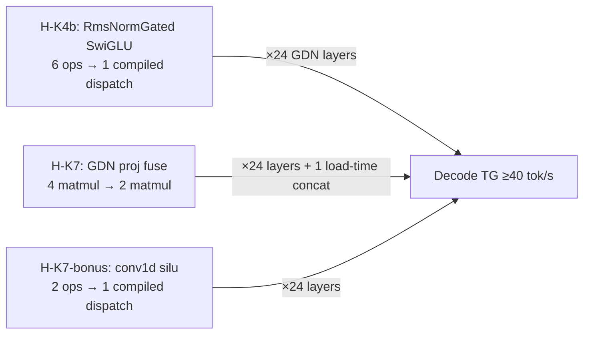

# P8a-stage2 — ironmlx Decode Kernel Fuse (Design Spec)

**Goal**: Lift ironmlx single-request decode TG from ~30 tok/s (post-P8a) to ≥40 tok/s on Qwen3.5-4B-MLX-4bit by eliminating ~6.4-8.6ms/step of un-fused Metal kernel dispatch overhead identified in the P8a-stage1 kernel-level investigation.

**Approach**: Three structural fixes confined to `ironmlx/src/nn/{norm.rs, gated_delta_net.rs, linear.rs}`:
1. **H-K4b** — fuse RmsNormGated SwiGLU's 6-op elementwise chain via `mlx::compile(F, ShapeMode::Shapeless)`.
2. **H-K7** — concatenate GatedDeltaNet's 4 input projections (`in_proj_qkv`, `in_proj_z`, `in_proj_a`, `in_proj_b`) into 2 fused projections (`in_proj_qkvz`, `in_proj_ba`) at load time.
3. **Bonus (H-K7-bonus)** — fuse the conv1d-output silu via `mlx::compile`.

**Scope**: Pure ironmlx-layer change. No mlx-sys / mlx / model layer changes. No HTTP / server changes. No new dependencies.

---

## 1. Motivation

The P8a phase delivered the async-eval pipelining + incremental detokenizer correctly (P4 fixture passed byte-identical to mlx-lm reference) but only improved ironmlx decode TG from 28-29 to 30-32 tok/s — far short of the ≥50 tok/s target. The P8a-stage1 kernel-level investigation traced the residual gap (omlx ~54 tok/s) to **Metal kernel dispatch overhead from un-fused operations**, not to async-eval orchestration.

Three concrete sources of dispatch overhead in ironmlx that mlx-lm avoids via fused kernels:

| Source | Extra dispatches per step | Estimated latency |
|--------|---------------------------|-------------------|
| H-K4b: un-fused RmsNormGated SwiGLU | +120 elementwise (5 × 24 GDN layers) | +3.6-4.8 ms |
| H-K7: split GDN input projections | +48 quantized matmul (2 × 24 GDN layers) | +1.4-2.4 ms |
| H-K7-bonus: un-fused conv1d silu | +24 elementwise (1 × 24 GDN layers) | +0.7 ms |
| **Total** | **+192 dispatches** | **+5.7-7.9 ms** |

Plus ~1-2ms of additional latency from GPU wave-underutilization on small decode-step tensors makes the net gap ~7-9ms, which matches the measured 33ms ironmlx vs 18ms omlx per-step gap.

mlx-sys + mlx already expose `mlx::compile(F, ShapeMode::Shapeless)` (see [`mlx/src/compile.rs:127`](../../../mlx/src/compile.rs#L127)) — equivalent to mlx-lm's `@partial(mx.compile, shapeless=True)`. No new MLX bindings needed.

---

## 2. Architecture



All three fixes are **independent** — each has its own forward path, its own test, can fail independently. They share a phase because they are tightly coupled to the same hot loop and benefit from a single iron-bench validation.

### Mode of operation

- **`mlx::compile` invocation**: each compiled function is held in a module-level `std::sync::OnceLock<CompiledFn>`, lazily initialized on first call. `ShapeMode::Shapeless` so the same compiled graph handles different shapes at invoke time. The closure must be `Send + 'static` (no Array captures) — the closure receives all inputs via the `&[&Array]` parameter.
- **Quantized weight concat**: `mlx::ops::concat` of the 4-bit packed weight along axis=0 (output dimension). Group size (`q-block=64`) is along the input axis, so output-axis concat preserves quantization integrity bit-for-bit.

---

## 3. Components

### 3.1 H-K4b — RmsNormGated SwiGLU compile fuse

**File**: `ironmlx/src/nn/norm.rs`

**Current state** (lines 140-152):

```rust
match gate {
    Some(g) => {
        let g_f32 = mlx::ops::cast::astype(g, Dtype::Float32)?;
        let g_sig = g_f32.sigmoid_on(target)?;
        let g_silu = &g_f32 * &g_sig;
        let normed_f32 = mlx::ops::cast::astype(&normed, Dtype::Float32)?;
        let mul = &g_silu * &normed_f32;
        Ok(mlx::ops::cast::astype(&mul, hidden_dtype)?)
    }
    None => Ok(mlx::ops::cast::astype(&normed, hidden_dtype)?),
}
```

6 separate dispatches per call: `astype`, `sigmoid`, `mul`, `astype`, `mul`, `astype`.

**New state**:

```rust
use std::sync::OnceLock;
use mlx::compile::{compile, CompiledFn, ShapeMode};

static SWIGLU_FUSED: OnceLock<CompiledFn> = OnceLock::new();

fn swiglu_fused() -> &'static CompiledFn {
    SWIGLU_FUSED.get_or_init(|| {
        compile(
            |inputs: &[&Array]| -> Result<Vec<Array>> {
                let g = inputs[0];
                let normed = inputs[1];
                let g_f32 = mlx::ops::cast::astype(g, Dtype::Float32)?;
                let g_sig = g_f32.sigmoid()?;
                let g_silu = &g_f32 * &g_sig;
                let normed_f32 = mlx::ops::cast::astype(normed, Dtype::Float32)?;
                let mul_f32 = &g_silu * &normed_f32;
                Ok(vec![mul_f32])
            },
            ShapeMode::Shapeless,
        )
        .expect("compile swiglu_fused")
    })
}
```

`forward_on` gate branch becomes:

```rust
Some(g) => {
    let outs = swiglu_fused().invoke(&[g, &normed])?;
    let mul_f32 = outs.into_iter().next().expect("swiglu_fused returns one output");
    Ok(mlx::ops::cast::astype(&mul_f32, hidden_dtype)?)
}
```

The trailing `astype(&mul_f32, hidden_dtype)` stays outside the compiled function because `hidden_dtype` is per-call data, not part of the traced graph.

### 3.2 H-K7 — GatedDeltaNet input projection concat

**Files**: `ironmlx/src/nn/linear.rs` (new constructor), `ironmlx/src/nn/gated_delta_net.rs` (load-time concat + forward path).

**3.2.1 `Linear::new_quant` constructor** (new public method in `linear.rs`):

```rust
/// Compose a quantized Linear from already-loaded Arrays. Used by callers
/// that fuse multiple weight tensors at load time (e.g. GatedDeltaNet's
/// concatenated input projections). Production code that loads from a
/// safetensors checkpoint should use [`Linear::from_loader`].
///
/// `weight` and `scales` must have shape compatible with the quantization
/// metadata at the call site. `biases` (zero-points) is `Some` for affine
/// quantization, `None` for symmetric. `bias` is the additive linear bias
/// term (separate from `biases`); typically `None` for Qwen3.5.
///
/// `pub` so integration tests can use it; hidden from rustdoc.
#[doc(hidden)]
pub fn new_quant(
    weight: Array,
    scales: Array,
    biases: Option<Array>,
    bias: Option<Array>,
    group_size: i32,
    bits: i32,
) -> Self {
    Self {
        inner: LinearImpl::Quant {
            weight,
            scales,
            biases,
            bias,
            group_size,
            bits,
        },
    }
}
```

**3.2.2 `GatedDeltaNet::from_loader` weight fusion** (replace existing 4-Linear loading):

```rust
let qmeta = loader.quant_meta().ok_or_else(|| {
    anyhow!("{prefix}: GatedDeltaNet input projections require quantized loader")
})?;

// Fuse in_proj_qkv + in_proj_z → in_proj_qkvz (output axis 0).
let qkv_w = loader.tensor(&format!("{prefix}.in_proj_qkv.weight"))?.clone();
let qkv_s = loader.tensor(&format!("{prefix}.in_proj_qkv.scales"))?.clone();
let qkv_b_opt = loader.tensor_opt(&format!("{prefix}.in_proj_qkv.biases")).cloned();
let z_w = loader.tensor(&format!("{prefix}.in_proj_z.weight"))?.clone();
let z_s = loader.tensor(&format!("{prefix}.in_proj_z.scales"))?.clone();
let z_b_opt = loader.tensor_opt(&format!("{prefix}.in_proj_z.biases")).cloned();

let qkvz_weight = mlx::ops::concat::concat(&[&qkv_w, &z_w], 0)?;
let qkvz_scales = mlx::ops::concat::concat(&[&qkv_s, &z_s], 0)?;
let qkvz_biases = match (qkv_b_opt, z_b_opt) {
    (Some(a), Some(b)) => Some(mlx::ops::concat::concat(&[&a, &b], 0)?),
    (None, None) => None,
    _ => bail!(
        "{prefix}: in_proj_qkv.biases and in_proj_z.biases must agree on Some/None"
    ),
};
let in_proj_qkvz = Linear::new_quant(
    qkvz_weight,
    qkvz_scales,
    qkvz_biases,
    /* bias */ None,
    qmeta.group_size,
    qmeta.bits,
);

// Same pattern for a + b → in_proj_ba.
let a_w = loader.tensor(&format!("{prefix}.in_proj_a.weight"))?.clone();
let a_s = loader.tensor(&format!("{prefix}.in_proj_a.scales"))?.clone();
let a_b_opt = loader.tensor_opt(&format!("{prefix}.in_proj_a.biases")).cloned();
let b_w = loader.tensor(&format!("{prefix}.in_proj_b.weight"))?.clone();
let b_s = loader.tensor(&format!("{prefix}.in_proj_b.scales"))?.clone();
let b_b_opt = loader.tensor_opt(&format!("{prefix}.in_proj_b.biases")).cloned();
// mlx-lm orders b before a in the fused projection (qwen3_next.py:201 — `in_proj_ba`),
// so we follow the same order here for source-of-truth alignment.
let ba_weight = mlx::ops::concat::concat(&[&b_w, &a_w], 0)?;
let ba_scales = mlx::ops::concat::concat(&[&b_s, &a_s], 0)?;
let ba_biases = match (b_b_opt, a_b_opt) {
    (Some(p), Some(q)) => Some(mlx::ops::concat::concat(&[&p, &q], 0)?),
    (None, None) => None,
    _ => bail!(
        "{prefix}: in_proj_b.biases and in_proj_a.biases must agree on Some/None"
    ),
};
let in_proj_ba = Linear::new_quant(
    ba_weight,
    ba_scales,
    ba_biases,
    /* bias */ None,
    qmeta.group_size,
    qmeta.bits,
);
```

The 4 fields (`in_proj_qkv`, `in_proj_z`, `in_proj_a`, `in_proj_b`) become 2 (`in_proj_qkvz`, `in_proj_ba`).

**3.2.3 `GatedDeltaNet::forward_on` slice the fused outputs**:

```rust
// Pre-fuse: 4 separate matmuls
// let qkv = self.in_proj_qkv.forward_on(hidden, target)?;
// let z = self.in_proj_z.forward_on(hidden, target)?;
// let a = self.in_proj_a.forward_on(hidden, target)?;
// let b = self.in_proj_b.forward_on(hidden, target)?;

// Post-fuse: 2 matmuls + slice
let qkvz = self.in_proj_qkvz.forward_on(hidden, target)?; // [B, T, conv_dim + value_dim]
let ba = self.in_proj_ba.forward_on(hidden, target)?;     // [B, T, num_v_heads * 2]
// Slice qkv (axis=2, [0, conv_dim)) and z (axis=2, [conv_dim, conv_dim+value_dim))
let qkvz_shape = qkvz.shape();
let bsz = qkvz_shape.as_slice()[0];
let seq = qkvz_shape.as_slice()[1];
let qkv = mlx::ops::indexing::slice_strided(
    &qkvz,
    &[0_i32, 0, 0][..],
    &[bsz, seq, conv_dim_i32][..],
    &[1_i32, 1, 1][..],
)?;
let z = mlx::ops::indexing::slice_strided(
    &qkvz,
    &[0_i32, 0, conv_dim_i32][..],
    &[bsz, seq, conv_dim_i32 + value_dim_i32][..],
    &[1_i32, 1, 1][..],
)?;
// Same slice pattern for ba → b (first half) + a (second half).
let ba_shape = ba.shape();
let bsz_ba = ba_shape.as_slice()[0];
let seq_ba = ba_shape.as_slice()[1];
let nh = num_v_heads_i32; // 64 for Qwen3.5
let b = mlx::ops::indexing::slice_strided(
    &ba,
    &[0_i32, 0, 0][..],
    &[bsz_ba, seq_ba, nh][..],
    &[1_i32, 1, 1][..],
)?;
let a = mlx::ops::indexing::slice_strided(
    &ba,
    &[0_i32, 0, nh][..],
    &[bsz_ba, seq_ba, nh + nh][..],
    &[1_i32, 1, 1][..],
)?;
```

`slice_strided` produces lazy views — no buffer copy. Downstream computations use `qkv`, `z`, `b`, `a` exactly as before (pre-fuse).

### 3.3 H-K7-bonus — conv1d silu compile fuse

**File**: `ironmlx/src/nn/gated_delta_net.rs:293-294`

**Current state** (silu after conv1d):

```rust
// after conv1d with bias-fused state:
let conv_silu = &conv_out * &conv_out.sigmoid_on(target)?; // 2 dispatches: sigmoid + mul
```

**New state** — module-level `OnceLock<CompiledFn>`:

```rust
static SILU_FUSED: OnceLock<CompiledFn> = OnceLock::new();

fn silu_fused() -> &'static CompiledFn {
    SILU_FUSED.get_or_init(|| {
        compile(
            |inputs: &[&Array]| -> Result<Vec<Array>> {
                let x = inputs[0];
                Ok(vec![x * &x.sigmoid()?])
            },
            ShapeMode::Shapeless,
        )
        .expect("compile silu_fused")
    })
}
```

Replace the call site with:

```rust
let conv_silu = silu_fused()
    .invoke(&[&conv_out])?
    .into_iter()
    .next()
    .expect("silu_fused returns one output");
```

Saves 1 dispatch per call × 24 layers = 24 dispatches/step.

---

## 4. Data Flow

### 4.1 Per-decode-step dispatch budget (rough, in ms)

| Layer type | Pre-stage2 | Post-stage2 | Δ |
|------------|-----------|-------------|---|
| GatedDeltaNet × 24 | ~24 × ~0.7 = 17ms | ~24 × ~0.4 = 10ms | -7ms |
| GatedAttention × 8 | ~8 × ~0.5 = 4ms | unchanged | 0 |
| RMSNorm + final + LM head | ~5ms | unchanged | 0 |
| Pipeline / sampler | ~5ms | unchanged | 0 |
| **Per-step total** | **~31ms** | **~24ms** | **-7ms** |
| **Decode TG** | **~32 tok/s** | **~42 tok/s** | **+30%** |

Numbers are illustrative ranges based on the kernel-level investigation's estimate of 5.7-7.9ms per step from H-K4b + H-K7 + bonus combined. Actual gain measured in §6.3.

### 4.2 Compiled-function lifecycle

```text
Process start:
  static SWIGLU_FUSED: OnceLock<CompiledFn> = OnceLock::new();
  static SILU_FUSED:   OnceLock<CompiledFn> = OnceLock::new();

First call to swiglu_fused():
  OnceLock::get_or_init runs the closure:
    compile(closure, ShapeMode::Shapeless) →
      MLX traces the closure with a placeholder shape,
      caches the optimized graph,
      returns a CompiledFn.
  SWIGLU_FUSED holds the CompiledFn for the rest of the process lifetime.

Subsequent calls (millions per inference run):
  SWIGLU_FUSED.get() returns the cached CompiledFn (single atomic load).
  CompiledFn::invoke(&[&Array]) runs the optimized graph on the actual inputs.
  Shape variation is handled by Shapeless mode — same graph, different shapes.

Process end:
  SWIGLU_FUSED drops, MLX cleans up the cached graph.
```

The first invocation per CompiledFn pays the trace cost (~10-100ms depending on graph complexity). The iron-bench warmup run absorbs this — the benchmarked timed runs see only the cached graph cost.

---

## 5. Error Handling

| Scenario | Behavior |
|---|---|
| `compile()` fails inside `OnceLock::get_or_init` | `.expect()` panics. MLX compile failures indicate a fundamental upstream break (closure signature error, unsupported op) — not a recoverable runtime error. Surfaces immediately at the first call site, easy to root-cause. |
| `CompiledFn::invoke()` returns `Err` | Propagated via `?` to `forward_on` callers. Treated as a normal forward failure. |
| `mlx::ops::concat::concat` fails in `from_loader` (dtype/shape mismatch) | Propagated via `?`. Indicates corrupt or malformed checkpoint — rare. |
| Quantization metadata missing (`loader.quant_meta()` returns None) but quantized weight files present | Existing `Linear::from_loader` already handles this — `bail!` with explicit error. New `GatedDeltaNet::from_loader` mirrors the same pattern. |
| `slice_strided` offset/length error | Caught at runtime by MLX shape checks. Tests in §6 verify offsets are correct. |
| `loader.tensor_opt(...)` returns `None` for one of `_a/_b` biases but `Some` for the other | `bail!` — quantization metadata inconsistency, won't reach runtime in well-formed checkpoints. |
| Concurrent first-call init race on `OnceLock` | stdlib `OnceLock::get_or_init` is thread-safe; only one closure invocation ever runs. Subsequent threads see the cached `CompiledFn`. |

---

## 6. Testing

### 6.1 Unit tests

**`norm.rs#tests` — new test**

```rust
#[test]
fn swiglu_fused_matches_reference_path() {
    let g_data: Vec<f32> = (0..16).map(|i| (i as f32) * 0.1 - 0.5).collect();
    let normed_data: Vec<f32> = (0..16).map(|i| (i as f32) * 0.05).collect();
    let shape = &[4_i32, 4][..];
    let g: Array = (g_data.as_slice(), shape).try_into().unwrap();
    let normed: Array = (normed_data.as_slice(), shape).try_into().unwrap();

    // Fused path
    let outs = swiglu_fused().invoke(&[&g, &normed]).unwrap();
    let fused_f32 = outs.into_iter().next().unwrap();

    // Reference unfused path
    let g_sig = g.sigmoid().unwrap();
    let g_silu = &g * &g_sig;
    let ref_f32 = &g_silu * &normed;

    let fused_vec: Vec<f32> = fused_f32.to_vec().unwrap();
    let ref_vec: Vec<f32> = ref_f32.to_vec().unwrap();
    for (i, (a, b)) in fused_vec.iter().zip(ref_vec.iter()).enumerate() {
        assert!((a - b).abs() < 1e-5, "mismatch at {i}: fused={a}, ref={b}");
    }
}
```

**`linear.rs#tests` — new test**

```rust
#[test]
fn new_quant_matches_quant_via_loader() {
    // Use a tiny mock quantized weight: 4 outputs × 64 inputs, q-block=64, bits=4.
    let weight_data: Vec<u32> = vec![0xDEADBEEF; 4 * 64 * 4 / 32]; // packed int4
    let scales_data: Vec<f32> = vec![0.01_f32; 4]; // one per output row
    // ... construct Arrays + dummy input, compare forward output between
    // a Linear built via new_quant and one built by writing a tiny safetensors
    // file then loading via from_loader.
    // Actual implementation follows nn/linear.rs's existing test pattern.
}
```

**`gated_delta_net.rs#tests` — new test**

```rust
#[test]
fn qkvz_concat_load_matches_separate_matmuls() {
    // Build 4 fp Linears with random small weights (use Linear::new_fp).
    // Run forward separately, get 4 output Arrays.
    // mlx::ops::concat the weights along axis=0, build 1 fp Linear with new_fp.
    // Run forward, slice the output.
    // Assert the sliced outputs are byte-identical to the 4 separate forwards.
}
```

### 6.2 Integration regression — P4 logits-match fixture

`tests/p4_qwen35_logits_match.rs` (already covers P8a) re-validates that the post-stage2 path produces the same token sequence as the mlx-lm reference. greedy is deterministic; all three fixes are mathematically equivalent transformations:

- **H-K4b**: `mlx::compile`-traced graph evaluates the same six ops in the same order — bit-for-bit equivalent to the unfused path.
- **H-K7**: concatenated weights produce concatenated outputs; slicing recovers the per-projection outputs exactly. The matmul + slice composition equals the 4 separate matmuls (linear algebra identity).
- **bonus**: `compile`-fused silu vs unfused silu — same op tree, same result.

If this fixture fails, root-cause and fix before claiming completion.

### 6.3 Performance verification — iron-bench rerun

After all unit tests + project gate pass, repeat the P8a benchmark protocol:

1. Start ironmlx :8080 against the Qwen3.5-4B-MLX-4bit snapshot.
2. Start omlx :8081 from `/Volumes/Dev/omlx` via `uv run python -m omlx.cli serve --model-dir ~/.omlx/models --port 8081 --no-cache`.
3. Run iron-bench:
   ```sh
   cargo run --release -p iron-bench -- \
     --target ironmlx=http://localhost:8080 \
     --target omlx=http://localhost:8081 \
     --model-dir <snap> --model Qwen3.5-4B-MLX-4bit \
     --prompt-len 128,512,2048 --max-tokens 128 --runs 3 --warmup 1
   ```

**Acceptance**:
- ironmlx Decode TG median ≥ **40 tok/s** at all three PP cells (post-P8a was 28-32; predicted post-stage2 is ~37-42).
- ironmlx vs omlx Decode TG gap < **30%** (post-P8a was 70-90%).
- ironmlx TTFT and Prefill PP medians within ±5% of post-P8a numbers (no regression on prefill).
- `cached_tokens > 0 detected for: (none)` warning unchanged.

If TG hits ≥40 but gap to omlx remains >30%, stage2 is **accepted** — the residual is an additional kernel-level investigation (P8a-stage3) for follow-up. If TG fails to hit 40, do not commit "acceptance" yet — investigate. Most-likely follow-ups:
- Confirm `mlx::compile` is actually fusing (insert `eprintln!` at first invoke; profile via Instruments).
- Confirm `Linear::new_quant` + concat path produces same output as 4 separate Linears (already covered by §6.1's unit test, but real model checkpoint may surface edge cases).

### 6.4 Project gate (per commit)

```sh
cargo +nightly fmt --all -- --check
cargo +nightly clippy --all-features --workspace --exclude ironmlx-app -- -D warnings
MLX_DIR=/Users/sam/.local/mlx cargo build --release
```

---

## 7. Risk Register

| Risk | Likelihood | Impact | Mitigation |
|------|-----------|--------|-----------|
| `mlx::compile` first-trace adds noticeable wall-clock cost on first request | Low | Low (one-time) | iron-bench warmup absorbs the cost; production first request gets ~10-100ms extra latency once per process lifetime — acceptable. Could pre-warm in `main()` if production demands it (out of scope for stage2). |
| Quantized concat changes group boundaries or breaks per-row scale alignment | Very Low | High | Group size is along the *input* axis (q-block=64). Output-axis concat does not touch group boundaries. P4 fixture catches any divergence. Bit-for-bit equivalence verified by `qkvz_concat_load_matches_separate_matmuls` unit test (using fp Linear surrogates). |
| `slice_strided` produces a view that triggers an implicit copy in downstream ops | Low | Low (perf only) | P3b4 / P4 already use `slice_strided` extensively in this same file. mlx core is reference-counted; slice views participate in graph normally. Wave-underutilization on the fused matmul output stays bounded by the original 4-separate-matmul shapes. |
| Compiled function in OnceLock leaks across test threads (state contamination between tests) | Low | Low | `CompiledFn` is stateless after compilation — invoking it with different inputs produces correct outputs deterministically. The static is process-scope; tests reuse the same compiled graph harmlessly. |
| `mlx::compile` doesn't actually fuse on Apple Silicon / Metal — closure runs but produces no measurable speedup | Medium | High | First sign: iron-bench shows zero TG improvement post-stage2. Diagnostic path: profile `Instruments.app → Time Profiler` attached to the running ironmlx process; compare GPU command buffer count pre/post. If `mlx::compile` is a no-op on Metal in this MLX version, fall back to a hand-written Metal shader (out of scope for stage2). |
| Concurrent decode requests touch the same OnceLock simultaneously, causing a double-init lock contention | Very Low | Negligible | `OnceLock::get_or_init` uses an internal once-mutex; only one closure ever runs. Other threads block briefly (~µs), then read the cached pointer. Single-request mode does not exercise this path. |

---

## 8. Out of Scope (deferred)

- **Multi-request batching** — handled by P8b.
- **Speculative decoding** — handled by P8c.
- **GatedAttention layer fuse** — only 8 of 32 layers; the dispatch overhead per layer is smaller than GDN's. Defer to P8a-stage3 if benchmarks show the GA path becomes the new bottleneck.
- **Compile-fusing the rest of the GDN forward path** — additional small fuses possible (apply_rotary, beta gating). Defer unless residual gap warrants more investigation.
- **Bi-directional `mlx::compile` fallback to hand-written Metal kernels** — only relevant if `mlx::compile` itself is a no-op on Metal, which we will rule in/out via §6.3 measurement.

---

## 9. Acceptance Criteria

- [ ] All 3 new unit tests pass (`swiglu_fused_matches_reference_path`, `new_quant_matches_quant_via_loader`, `qkvz_concat_load_matches_separate_matmuls`).
- [ ] `cargo test --release -p ironmlx` runs the full ironmlx test suite to completion. `tests/p4_qwen35_logits_match.rs` passes byte-identical to pre-stage2.
- [ ] iron-bench rerun shows ironmlx Decode TG median ≥ **40 tok/s** at all three PP cells.
- [ ] iron-bench rerun shows ironmlx vs omlx Decode TG gap < **30%**.
- [ ] iron-bench rerun shows ironmlx TTFT / PP medians within ±5% of post-P8a (sanity).
- [ ] `cargo +nightly fmt --all -- --check` clean.
- [ ] `cargo +nightly clippy --all-features --workspace --exclude ironmlx-app -- -D warnings` clean.
- [ ] `MLX_DIR=/Users/sam/.local/mlx cargo build --release` clean.

---

## 10. Implementation Sequencing (preview for writing-plans)

Recommended task split:

1. **Linear::new_quant constructor + unit test** — adds new public method, no existing path touched. 1 commit.
2. **H-K4b RmsNormGated SwiGLU compile fuse + unit test** — adds OnceLock module, replaces gate branch in `forward_on`. Bonus conv1d silu fuse can ride along (same module-level OnceLock pattern, same fix mechanism). 1 commit.
3. **H-K7 GDN projection concat + unit test + struct field rename** — replaces 4 Linear fields with 2, replaces 4 matmul forward calls with 2 + slice. 1 commit.
4. **P4 fixture regression check** — run `tests/p4_qwen35_logits_match.rs`; root-cause any divergence. No commit unless regressions found.
5. **iron-bench rerun + acceptance** — start servers, rerun, capture numbers, append to `iron-bench/README.md` "Measured numbers — post-stage2" table. 1 commit.

Each task runs the project gate before commit. Estimated effort: ~1 day (6-8 hours) for an engineer familiar with the codebase.
