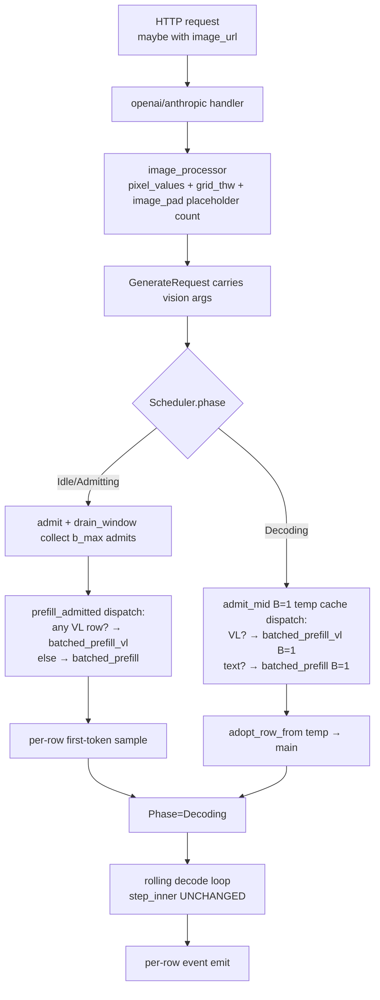

# B1-p2.4 VL B>1 Batched Serving — Design

**Status:** Draft (brainstormed 2026-05-15)
**Owner:** ironmlx
**Parent program:** B1-p2 batched serving (5-phase decomposition, see [B1-p2.1 §0](2026-05-12-b1-p2-1-batched-prefill-design.md))
**Branch target:** `ironmlx-b1-p2-4-batched-vl` (cut from `ironmlx-b1-p2-3-continuous-batching` head `be93eaa` post-3c-3 close-out)

## 0. Program context

B1-p2 5-phase decomposition status after 3c-3:

| Sub-spec | Scope | Status |
| --- | --- | --- |
| B1-p2.1 | Static batched prefill (text) | ✅ DONE |
| B1-p2.2 | Static batched decode + KV hand-off | ✅ DONE |
| B1-p2.3 | Continuous batching | ✅ DONE (3a/3b-1..4/3c-1..3) |
| 3c+/3d/3e | Throughput tuning (chunked prefill / admission queue / async sample) | Backlog |
| **B1-p2.4** | **VL B>1 batched serving** | **This spec** |
| B1-p2.5 | Production hardening (OOM safety, fairness) | Future |

Per Boss decision 2026-05-15 (brainstorm transcript): 3c+/3d/3e are **deferred** — they are throughput optimizations on top of an already-correct continuous-batching foundation; they do not gate "Qwen3.5 VL complete" and can be revisited post-B1-p2.4 based on observed perf.

## 1. Motivation

After 3c-3, the SchedulerActor handles text requests with continuous batching (mid-batch admit/evict via `admit_mid` + rolling decode loop). **VL requests still fall back to `GenerationStream` (B=1, no batching).** See [openai.rs:368](../../../ironmlx/src/core/server/openai.rs#L368) (`has_images → GS`) and [anthropic.rs:194](../../../ironmlx/src/core/server/anthropic.rs#L194).

The fallback exists because:
1. `Qwen35Model::forward_vl` is documented "single-stream B=1" ([model.rs:273](../../../ironmlx/src/models/qwen3_5/model.rs#L273))
2. `Qwen35Model::batched_prefill` is text-only ([model.rs:326](../../../ironmlx/src/models/qwen3_5/model.rs#L326))
3. `cross_modal::replace_image_tokens` asserts `B=1` ([cross_modal.rs:36-44](../../../ironmlx/src/models/qwen3_5/cross_modal.rs#L36))
4. `build_position_ids_vl` is single-stream

This sub-spec removes the fallback by extending each layer to support mixed-batch (text + VL) processing through the existing batched prefill / continuous batching infrastructure. The Decode path (`Scheduler::step_inner`) is **modality-agnostic** by construction — no changes there.

## 2. Goals

- **G1.** `Qwen35Model::batched_prefill_vl`: new public API accepting per-row `pixel_values + grid_thw`, runs one transformer forward over `[B, S_max]` mixed text/VL, returns `[B, 1, vocab]` last-position logits.
- **G2.** `cross_modal::replace_image_tokens`: remove B=1 guard; support `[B, S, H]` text_embeds + concatenated `vision_embeds` with per-row image scatter.
- **G3.** `core::generate::build_position_ids_vl_batched`: new helper producing MRoPE `[3, B, S_max]` for mixed text/VL rows.
- **G4.** `Scheduler::admit_mid` + `Scheduler::prefill_admitted`: internal dispatch to `batched_prefill_vl` when any row has `pixel_values.is_some()`.
- **G5.** `RequestState`: carry `pixel_values + image_grid_thw + image_spatial_merge_size + image_token_id` from `GenerateRequest`.
- **G6.** HTTP handlers (OpenAI / Anthropic): remove `has_images → GS` fallback. Long-prompt fallback retained (sunsets in 3c+).
- **G7.** Numerical contract: B=N mixed prefill bit-identical (argmax) and max-abs logits diff `< 1e-3` vs per-stream `GenerationStream`. Same standard as B1-p2.1.

## 3. Non-goals

- **NG1.** Vision encoder batching (concat `pixel_values` across rows → single ViT forward). Per-row sequential calls in B1-p2.4; concat optimization is future scope. Justification: vision encoder is prefill-once-per-request, ~50-100ms per image — same order as text prefill, not the bottleneck.
- **NG2.** VL admit_mid stall reduction (chunked vision encoder). 3c+ scope.
- **NG3.** Long VL prompt fallback removal. Long prompts still fall back to GS path; 3c+ chunked-prefill closes this.
- **NG4.** Audio / Video modalities. Separate stages.
- **NG5.** Production OOM safety / admission backpressure for VL request burst. B1-p2.5 scope.

## 4. Architecture

### 4.1 High-level data flow



### 4.2 Critical invariant — Decode path unchanged

After prefill, VL row's generated tokens are pure text. MRoPE at decode time:
- During decode, `build_decode_position_ids(per_row_pos)` emits `[3, B, 1]` where all three streams use the same per-row position counter.
- For a VL row, `per_row_pos = prompt_len + generated_count` — same as text row.
- The three MRoPE streams synchronize to `sequence_position` after the image region (this is the model's design — image grid h/w/t are positional within image, but post-image text resumes flat sequence position).

**Conclusion**: `Scheduler::step_inner`, `build_per_row_decode_mask`, `build_decode_position_ids` need **no changes**. Cache writes/reads via `KVCache::offsets()` + `adopt_row_from` are dtype/shape-agnostic — VL row K/V is bit-equivalent to text K/V at the cache boundary.

### 4.3 Module breakdown

#### 4.3.1 `RequestState` field extension ([core/scheduler.rs:79](../../../ironmlx/src/core/scheduler.rs#L79))

```rust
pub struct RequestState {
    // ... existing fields (id, row_idx, prompt_ids, generated_tokens,
    //     max_new_tokens, stop_token_ids, sampler, real_len, finished,
    //     finish_reason) UNCHANGED ...

    // ─── B1-p2.4 NEW ───
    /// Vision input — cloned from `GenerateRequest::pixel_values` at admit.
    /// `None` for text-only rows. `Array` clone is mlx reference-counted.
    pub pixel_values: Option<Array>,
    /// Per-image grid (temporal, height, width). Same len as image count.
    pub image_grid_thw: Option<Vec<(i32, i32, i32)>>,
    /// Spatial merge factor for image patches → embedding rows.
    pub image_spatial_merge_size: i32,
    /// Tokenizer id of `<|image_pad|>` placeholder.
    pub image_token_id: i32,
}
```

`Scheduler::admit` clones these 4 fields from `GenerateRequest` into `RequestState`. No change to `admit`'s public signature.

#### 4.3.2 `Qwen35Model::batched_prefill_vl` ([models/qwen3_5/model.rs](../../../ironmlx/src/models/qwen3_5/model.rs))

```rust
/// VL-capable batched prefill. Single transformer forward over [B, S_max]
/// right-padded mixed text/VL prompts. Each row may independently carry
/// pixel_values + grid_thw (vision row) or have both None (text row).
///
/// Vision encoder is run per-row (sequential) inside this function; the
/// resulting per-row vision_embeds are concatenated along axis 0 and
/// scattered into image_pad positions across the whole batch via
/// `replace_image_tokens` (which is modified in B1-p2.4 to accept B>1).
///
/// Returns [B, 1, vocab] last-position logits (per-row, sliced via
/// `slice_last_and_project` with last_positions = per_row_lens - 1).
#[allow(clippy::too_many_arguments)]
pub fn batched_prefill_vl(
    &self,
    input_ids: &Array,                              // [B, S_max] right-padded
    position_ids: &Array,                           // [3, B, S_max] MRoPE
    attention_mask: &Array,                         // [B, 1, S_max, S_max] additive bf16
    linear_attention_mask: &Array,                  // [B, S_max] bool
    per_row_lens: &[i32],                           // real prompt lens
    per_row_pixel_values: &[Option<&Array>],        // None for text rows
    per_row_grid_thw: &[Option<&[(i32, i32, i32)]>],
    image_token_id: i32,
    cache: Option<&mut [LayerCache]>,
    target: impl Into<StreamOrDevice>,
) -> Result<Array>
```

**Implementation steps:**

1. `let mut hidden = text.embed_on(input_ids, target)?` → `[B, S_max, H]`
2. Per-row vision encoder (only for VL rows):
   ```rust
   let mut all_vision_embeds: Vec<Array> = Vec::new();
   for i in 0..B {
       if let (Some(pv), Some(grids)) = (per_row_pixel_values[i], per_row_grid_thw[i]) {
           let ve = self.compute_vision_embeds(pv, grids, target)?;
           all_vision_embeds.push(ve);
       }
   }
   ```
3. If any vision_embeds, concat axis 0:
   ```rust
   let vision_embeds_concat = if all_vision_embeds.is_empty() {
       None
   } else {
       Some(mlx::ops::concatenate(&all_vision_embeds, 0)?)  // [sum_N, H]
   };
   ```
4. If `vision_embeds_concat.is_some()`, scatter into hidden:
   ```rust
   hidden = cross_modal::replace_image_tokens(&hidden, input_ids, &vec, image_token_id)?;
   ```
5. `text.forward_post_embedding_on(hidden, position_ids, cache, Some(attention_mask), Some(linear_attention_mask), Some(per_row_lens), target)` → `[B, S_max, H]`
6. `slice_last_and_project(&hidden, Some(&per_row_last_positions), target)` → `[B, 1, vocab]`

**Numerical contract:** for row `i`, `out[i, :]` matches `forward_vl(prompt_i_alone)` to within `max_abs_diff < 1e-3` and greedy argmax bit-identical. Verified by `tests/b1_p2_4_batched_vl.rs`.

#### 4.3.3 `cross_modal::replace_image_tokens` — remove B=1 guard ([cross_modal.rs:21](../../../ironmlx/src/models/qwen3_5/cross_modal.rs#L21))

**Current** (B=1):
```rust
if b != 1 {
    return Err(anyhow!("replace_image_tokens currently supports B=1 only..."));
}
```

**B1-p2.4**: remove the guard. The host-side flat scan already iterates `b * s` positions in row-major order:
```rust
let img_count = ids_flat.iter().filter(|&&id| id == image_token_id).count();
// ↑ counts across all B rows, in row-major order
```

`vat` (flat layout `[B * S * hidden]`) is written by the same row-major loop:
```rust
for (pos, &token_id) in ids_flat.iter().enumerate() {
    if token_id == image_token_id {
        // pos = b_row * S + s_col flat index — correct for B>1
        vat[pos * hidden_usize ..].copy_from_slice(&ve_flat[k * hidden_usize ..]);
        k += 1;
    }
}
```

**Invariant**: per-row `pixel_values` must be ordered such that their concatenated `vision_embeds` rows align with the row-major scan of `input_ids` across the batch. I.e., row 0's images come before row 1's images in `vision_embeds_concat`. This is enforced by step 2-3 of `batched_prefill_vl` (per-row iteration in batch order).

`bool` mask, `where_` op, and `astype` all already broadcast across B — no change needed.

Add B>1 tests (B=2 with 1 image each, B=2 with 0+2 images, mixed text+VL).

#### 4.3.4 `core::generate::build_position_ids_vl_batched`

```rust
/// Build MRoPE [3, B, max_len] for mixed text/VL batch prefill (right-padded).
///
/// Per row:
/// - If `per_row_grid_thw[i] is Some(grids)`: invoke existing
///   `build_position_ids_vl(prompt_ids_i, grids, image_token_id, merge_size)`
///   returning [3, L_i] for this row, then pad columns L_i..max_len with 0s.
/// - If `per_row_grid_thw[i] is None`: synthesize [3, L_i] as triple-replicated
///   `0..L_i` (text row degraded MRoPE), pad to max_len.
///
/// Stack along axis 1 → [3, B, max_len].
pub fn build_position_ids_vl_batched(
    per_row_prompt_ids: &[&[i32]],
    per_row_grid_thw: &[Option<&[(i32, i32, i32)]>],
    image_token_id: i32,
    image_spatial_merge_size: i32,
    max_len: i32,
) -> Result<Array>
```

Reuses existing single-stream `build_position_ids_vl` per row, then stacks. Pad columns get position 0 (same convention as `build_position_ids_batched`).

#### 4.3.5 `Scheduler::admit_mid` dispatch ([core/scheduler.rs:759](../../../ironmlx/src/core/scheduler.rs#L759))

`admit_mid_inner` step 5 (the `model.batched_prefill` call) dispatches based on `state.pixel_values.is_some()`:

```rust
let logits = if state.pixel_values.is_some() {
    let per_row_pv: Vec<Option<&Array>> = vec![state.pixel_values.as_ref()];
    let per_row_grids: Vec<Option<&[(i32, i32, i32)]>> = vec![state.image_grid_thw.as_deref()];
    model.batched_prefill_vl(
        &input_ids, &position_ids, &attention_mask,
        &linear_attention_mask, &[prompt_len],
        &per_row_pv, &per_row_grids,
        state.image_token_id,
        Some(&mut temp_cache),
        (),
    )?
} else {
    model.batched_prefill(/* existing args */)?
};
```

Also: when VL, `position_ids` is built via `build_position_ids_vl_batched(&[prompt_ids], &[Some(grids)], image_token_id, merge_size, prompt_len)` rather than `build_position_ids_batched`.

`admit_mid`'s public signature unchanged. Rollback semantics (evict on inner Err) unchanged.

#### 4.3.6 `Scheduler::prefill_admitted` dispatch ([core/scheduler.rs:373](../../../ironmlx/src/core/scheduler.rs#L373))

`prefill_admitted_inner` dispatches based on `any slot has pixel_values`:

```rust
let any_vl = self.slots.iter().any(|s| {
    s.as_ref().is_some_and(|r| r.pixel_values.is_some())
});

let logits = if any_vl {
    // Build per-row vision args (Option-wrapped per slot)
    let per_row_pv: Vec<Option<&Array>> = self.slots.iter()
        .map(|s| s.as_ref().and_then(|r| r.pixel_values.as_ref()))
        .collect();
    let per_row_grids: Vec<Option<&[(i32, i32, i32)]>> = self.slots.iter()
        .map(|s| s.as_ref().and_then(|r| r.image_grid_thw.as_deref()))
        .collect();
    // Pull tokenizer-defined constants from the first VL row. All
    // VL rows in a single Scheduler instance share the same tokenizer
    // (one model per Scheduler), so these are constant across slots.
    let (img_token_id, merge_size) = self.slots.iter()
        .find_map(|s| s.as_ref().filter(|r| r.pixel_values.is_some())
            .map(|r| (r.image_token_id, r.image_spatial_merge_size)))
        .expect("any_vl == true implies at least one slot has pixel_values");

    // Use VL-aware position builder
    let position_ids = build_position_ids_vl_batched(
        &per_row_prompt_ids_i32,
        &per_row_grids,
        img_token_id,
        merge_size,
        max_len,
    )?;

    model.batched_prefill_vl(
        &input_ids, &position_ids, &attention_mask,
        &linear_attention_mask, &prompt_lens,
        &per_row_pv, &per_row_grids,
        img_token_id,
        Some(cache_ref),
        (),
    )?
} else {
    // Existing text-only path: batched_prefill + build_position_ids_batched
    model.batched_prefill(/* existing args */)?
};
```

#### 4.3.7 HTTP handler fallback removal

**openai.rs** ([line 368](../../../ironmlx/src/core/server/openai.rs#L368)):

```rust
// BEFORE
let has_images = request.pixel_values.is_some();
let use_scheduler =
    !has_images && (state.prefill_chunk_size == 0 || prompt_len <= state.prefill_chunk_size);

// AFTER (B1-p2.4)
// has_images no longer disqualifies Scheduler path. Long-prompt fallback retained.
let use_scheduler = state.prefill_chunk_size == 0 || prompt_len <= state.prefill_chunk_size;
```

Also remove the `COMPAT(3b-2)` comment ("VL fallback to GS sunsets in B1-p2.4"). Add a close-out NOTE referencing B1-p2.4.

**anthropic.rs**: identical change at [line 194](../../../ironmlx/src/core/server/anthropic.rs#L194). (Anthropic VL has its own separate concerns — see `anthropic.rs:186` returning `pixel_values: None`. This spec assumes Anthropic image content path is already wired and just routes through Scheduler now.)

### 4.4 Edge cases

| Case | Handling |
| --- | --- |
| B=4 全 text (no VL row) | `any_vl == false` → existing `batched_prefill` path. Zero overhead. |
| B=4 全 VL, varying image counts per row | `per_row_pv[i]`各 Some；vision_embeds_concat 长度 = sum(N_i)。input_ids row-major scan 顺序与 concat 顺序一致。 |
| Mixed (e.g., 2 VL + 2 text) | text rows: `per_row_pv[i] = None` → skipped in vision encoder loop and replace_image_tokens scatter. |
| VL row with 0 images (degraded VL → text) | `per_row_grids` 为 `Some(empty)` 还是 `None`? **决策**: 在 HTTP handler 层把空 image list 归一化为 `pixel_values = None`，treat as text row. RequestState 不存 `Some(empty Vec)`。 |
| VL prompt 完全是 image 无 text suffix | `last_position = prompt_len - 1` 仍 valid（指向最后一个 image_pad），但 sample 此处会得到怪 token。**决策**: 接受此行为 — chat template 总是 append text suffix（`<\|im_end\|>` 等）；自然 prompt 会有 text。Test 不覆盖纯 image prompt。 |
| Vision encoder OOM / shape error | `compute_vision_embeds` 返回 `Err` → `batched_prefill_vl` 上抛 → `prefill_admitted_inner` / `admit_mid_inner` 上抛 → `prefill_admitted` 设 `poisoned` / `admit_mid` rollback via evict. 已有 mechanism。 |
| dtype mismatch text vs vision | `replace_image_tokens` 内已有 `astype(vat, text_embeds.dtype())`. 全 bf16 path. |
| Long VL prompt | 当前 prefill_chunk_size 阈值仍 trigger long-prompt fallback (GS path)；VL 长 prompt 与 text 长 prompt 同质降级。3c+ 时统一去除。 |

### 4.5 Acceptance gate

`tests/b1_p2_4_batched_vl.rs` (NEW, ~450 LOC):

| Scenario | 通过条件 |
| --- | --- |
| **S1: B=2 VL bit-id** | 2 prompts (`prompt_A + img_A`, `prompt_B + img_B`) 同时跑 `batched_prefill_vl`。每 row argmax 与对应 B=1 GS baseline 一致；max-abs logits diff per row `< 1e-3`. |
| **S2: Mixed B=2 (1 VL + 1 text)** | Row 0 = `"hello"` (text), Row 1 = `"caption: <image>"` (VL). 每 row argmax + diff per S1 标准. |
| **S3: Mid-batch admit VL** | Step 1: admit 2 text rows (B=2 text), drive 5 decode steps. Step 2: `admit_mid` VL request. Verify: VL row 第一 token + 后续 decode bit-id 与 B=1 GS；active text rows decode tokens 无退化. |
| **S4: Multi-image VL row in batch** | B=2: row 0 has 2 images, row 1 has 1 image. Each row bit-id vs B=1 GS. Verifies vision_embeds concat ordering invariant. |
| **S5: Regression sweep** | 12 现有 suite (P6.3/P6.6/P6.7/B1-p2.1/B1-p2.2/B1-p2.3b-1..4/B1-p2.3c-1..3) + S1-S4 全 PASS. |

`replace_image_tokens` 单元测试新增 3 个 (cross_modal.rs):
- `replaces_image_placeholders_b2_each_one_image`
- `replaces_image_placeholders_b2_mixed_text_vl`
- `replaces_image_placeholders_b2_row1_multi_image`

`build_position_ids_vl_batched` 单元测试新增 2 个 (generate.rs):
- `position_ids_vl_batched_mixed_text_vl_matches_per_stream`
- `position_ids_vl_batched_b2_each_one_image_matches_per_stream`

`batched_prefill_vl` unit tests in `model.rs` cfg(test):
- `batched_prefill_vl_text_only_matches_batched_prefill` (degraded path equivalence)
- `batched_prefill_vl_b1_matches_forward_vl` (B=1 should equal forward_vl)

### 4.6 Risks

| Risk | Severity | Mitigation |
| --- | --- | --- |
| **R1: vision_embeds concat order mismatch** with input_ids row-major scan | High (silent corruption) | Unit test `replaces_image_placeholders_b2_each_one_image`: row 0 image marker=7.0, row 1 image marker=13.0; verify post-scatter values at correct positions. Plus integration S4 (multi-image per row). |
| **R2: MRoPE per-stream values diverge** between per-row build vs batched build | High (silent logits diff) | Unit test `position_ids_vl_batched_mixed_text_vl_matches_per_stream`: build per-row `[3, L_i]`, then build batched `[3, B, max_len]`, slice batched per row, assert equal per column for `col < L_i`. |
| **R3: vision encoder sequential cost** in batched prefill (4 row × 100ms = 400ms added to TTFT) | Medium | Phase 1 acceptable (no perf regression on text-only path); concat vision encoder optimization deferred (see NG1). |
| **R4: `replace_image_tokens` host-side scan** scales with `B × S`. At B=4 PP=2048 = 8192 i32 reads. | Low | Existing CPU-side scan is already in hot path for B=1; B=4 is 4× — still negligible vs forward time. No change. |
| **R5: VL row last_position falls on image_pad token** (degenerate prompt) | Low | Documented as out-of-scope (chat template always appends text suffix). Test does not cover. |
| **R6: cache contents poisoning across VL/text mid-admit** | Low | `KVCache::adopt_row_from` is dtype/shape-agnostic; 3c-1/3c-2 already verified per-row offset divergence. VL row's K/V is interchangeable with text row's K/V at the cache abstraction. |
| **R7: vision_config absent in dense-only model** (Qwen3.5 text-only variant) | Low | Code path gated by `request.pixel_values.is_some()` — text-only model never enters VL branch. |
| **R8: `compute_vision_embeds` not thread-safe across rows** (if model state has hidden mutation) | Low | Per-row calls are sequential within one `batched_prefill_vl` invocation, not parallel. Sequential is safe. |

### 4.7 Out of scope (deferred)

- **Vision encoder batching** — concat per-row `pixel_values` into a single `[total_N, T, C, H, W]` tensor, one ViT forward. Future task.
- **VL admit_mid stall chunked** — 3c+ scope, deferred to backlog.
- **Long VL prompt fallback removal** — 3c+ scope.
- **Video / audio modalities** — separate stages.
- **Per-request vision_config override** — current model carries one vision_config; per-request override is future.
- **OpenAI streaming for VL** — should work via existing `serve_via_scheduler_stream` path once VL routes through Scheduler. Not separately tested in S1-S5 (covered by S2 if streaming endpoint is invoked).
- **Anthropic VL handler** — currently passes `pixel_values: None` ([anthropic.rs:186](../../../ironmlx/src/core/server/anthropic.rs#L186)). Wiring Anthropic image content parsing is a separate concern; this spec assumes the existing path stays and just removes the GS fallback if/when pixel_values arrives.

## 5. Module/file change summary

| File | Change | LoC est |
| --- | --- | --- |
| `core/scheduler.rs` | +4 fields in `RequestState`; admit clones them; admit_mid_inner + prefill_admitted_inner dispatch | +80 |
| `models/qwen3_5/model.rs` | +`batched_prefill_vl` method (~100 LoC); +2 unit tests | +160 |
| `models/qwen3_5/cross_modal.rs` | remove B=1 guard; +3 unit tests for B>1 | +60 |
| `core/generate.rs` | +`build_position_ids_vl_batched`; +2 unit tests | +90 |
| `core/server/openai.rs` | remove `has_images` from `use_scheduler` predicate; update COMPAT comment | +5 |
| `core/server/anthropic.rs` | identical | +5 |
| `tests/b1_p2_4_batched_vl.rs` (NEW) | 4 integration scenarios + B=1 GS baseline harness | +450 |
| `tests/fixtures/p6_qwen35_vl/diff_reports/b1_p2_4_closeout/report.md` (NEW) | close-out template | +120 |

Total: ~970 LoC. Comparable to B1-p2.1 (batched prefill, ~3-4d) but slightly larger due to vision module integration. Estimated **5-7 d** including 12-suite regression sweep.

## 6. Plan decomposition

Tentative 5 tasks (final plan in `docs/superpowers/plans/2026-05-15-b1-p2-4-batched-vl.md`):

1. **T1**: `cross_modal::replace_image_tokens` B>1 + unit tests (smallest, unblocks everything)
2. **T2**: `build_position_ids_vl_batched` + unit tests
3. **T3**: `Qwen35Model::batched_prefill_vl` + B=1 / text-only equivalence unit tests
4. **T4**: `Scheduler` field extension + `admit_mid` / `prefill_admitted` dispatch + HTTP handler fallback removal
5. **T5**: 4 integration scenarios + 12-suite regression sweep + close-out report

Subagent driving — T1/T2/T3 mechanical (sonnet); T4 cross-file judgment (opus or sonnet); T5 scaffolding + sweep (sonnet).

## 7. Test fixtures + reference

- Reuse P6.3 / P6.6 fixtures in `ironmlx/tests/fixtures/p6_qwen35_vl/` (image_0=dog scene, image_1=tennis scene from COCO val2017 already present).
- `~/.venvs/mlxvlm-ref/bin/python` for B=1 GS baseline reference where needed.
- Baseline shape: per-prompt B=1 GS forward; B=N batched_prefill_vl forward; compare per row last logits + first sampled token.

## 8. Linked artifacts

- [B1-p2.1 batched prefill spec](2026-05-12-b1-p2-1-batched-prefill-design.md) — text path foundation
- [P6 VL umbrella spec](2026-05-10-p6-vl-design.md) — VL B=1 implementation
- [P6.6 multi-image spec](2026-05-11-p6-6-multi-image-design.md) — per-row multi-image already shipping
- [B1-p2.3c-3 continuous batching spec](2026-05-14-b1-p2-3c-3-continuous-batching-design.md) — admit_mid / prefill_admitted entrypoints this spec extends
- [3c-3 close-out report](../../../ironmlx/tests/fixtures/p6_qwen35_vl/diff_reports/b1_p2_3c_3_closeout/report.md)
- [3c-3 perf baseline](../../../ironmlx/tests/fixtures/p6_qwen35_vl/diff_reports/b1_p2_3c_3_perf_baseline/report.md)
