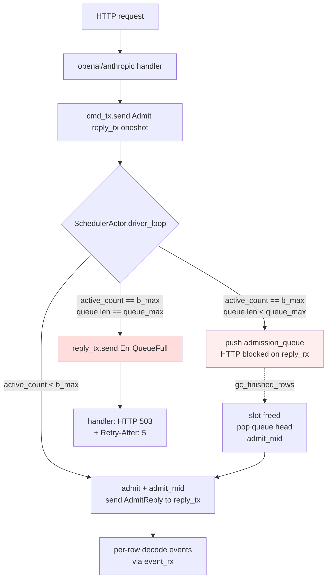
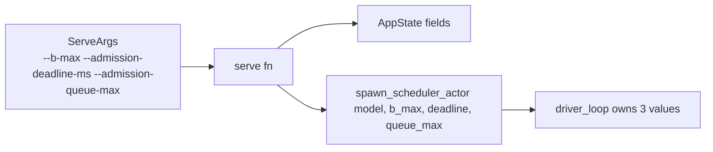

# B1-p2.3d Admission Queue + Config Exposure — Design

**Status:** Draft (brainstormed 2026-05-16)
**Owner:** ironmlx
**Parent program:** B1-p2 batched serving (see [B1-p2.1 §0](2026-05-12-b1-p2-1-batched-prefill-design.md))
**Branch target:** `ironmlx-b1-p2-3d-admission-queue` (cut from `ironmlx-b1-p2-4-batched-vl` head `65d1f5f` post B1-p2.4 close-out)

## 0. Program context

B1-p2 5-phase decomposition status after B1-p2.4:

| Sub-spec | Status |
| --- | --- |
| B1-p2.1 batched prefill | ✅ DONE |
| B1-p2.2 batched decode | ✅ DONE |
| B1-p2.3a/b1..4/c1..3 continuous batching | ✅ DONE |
| 3c+ admit_mid chunked prefill | Backlog |
| **3d admission queue + config exposure** | **This spec** |
| 3e per-row async sampler | Backlog |
| B1-p2.4 batched VL | ✅ DONE |
| B1-p2.5 production hardening | Future |

Per Boss decision 2026-05-16 (post-B1-p2.4 push): 3d is the **single highest-impact throughput task** because the 3c-3 perf baseline showed c=4 PP=512 TTFT 9.2s is dominated by `b_max=4` batch-boundary lockstep — not anything 3c+ or 3e can fix. 3d removes that ceiling.

## 1. Motivation

After B1-p2.4 the server has:
- `b_max=4` hardcoded ([core/server/mod.rs:54](../../../ironmlx/src/core/server/mod.rs#L54))
- `ADMISSION_DEADLINE=5ms` hardcoded ([core/server/scheduler_actor.rs:38](../../../ironmlx/src/core/server/scheduler_actor.rs#L38))
- `c > b_max` admissions are rejected outright: `Scheduler::admit_mid` returns `Err("scheduler full: no row available (b_max=4)")` → handler propagates as HTTP 400.

Observed in [3c-3 perf baseline](../../../ironmlx/tests/fixtures/p6_qwen35_vl/diff_reports/b1_p2_3c_3_perf_baseline/report.md): iron-bench v2 with `--concurrent 8` (= 2× b_max) failed fast with `HTTP 400 Bad Request — admit failed: scheduler full`. This is the wrong production behavior: bursts of legitimate concurrent traffic shouldn't be turned away when slots will free up in the normal decode pipeline.

3d replaces the reject path with a FIFO admission queue: requests beyond `b_max` block in the queue until `gc_finished_rows` frees a slot. The queue has a bounded capacity (`admission_queue_max`, default 32); overflow returns `HTTP 503 Service Unavailable` (semantically correct for a server resource limit, vs. the prior 400 which implied client-side fault). All three knobs (`b_max`, `admission_deadline_ms`, `admission_queue_max`) become CLI flags + AppState fields.

## 2. Goals

- **G1.** Replace `Err("scheduler full")` reject path in `Scheduler::admit_mid` / driver_loop's saturate path with FIFO `admission_queue: VecDeque<PendingAdmit>` inside `driver_loop`. Push when full; drain when slots free up.
- **G2.** Bound queue at `admission_queue_max` (default 32). Overflow returns `HTTP 503` with `Retry-After: 5` header.
- **G3.** Expose `b_max` / `admission_deadline_ms` / `admission_queue_max` as `ServeArgs` CLI flags + `AppState` fields + `spawn_scheduler_actor` parameters.
- **G4.** Add test-observable atomic counters `queue_depth_peak: AtomicUsize` and `queue_rejected: AtomicU64` to `SchedulerActorHandle` (same pattern as existing `admit_count` / `batch_count` / `saturate_triggered`).
- **G5.** Numerical / functional regression: 12-suite regression sweep PASS with defaults (`b_max=4 / 5ms / 32`) matching pre-3d baseline. No decode-path changes.

## 3. Non-goals

- **NG1.** Preemption (kick active row → re-queue). Active rows always run to completion. Future task.
- **NG2.** HTTP client cancellation propagation (axum disconnect → cancel admit). Current behavior: oneshot reply is silently dropped; admit proceeds to completion if it was already enqueued, events stream to a dead channel. 3e+ scope.
- **NG3.** Per-request priority / SLA / fair-share. FIFO only.
- **NG4.** Queue persistence across server restart. In-memory only.
- **NG5.** Dynamic `b_max` adjustment at runtime. Set once at server boot.
- **NG6.** Concurrent prefill (multiple admit_mid in parallel). Existing serial behavior preserved (admit_mid + adopt is sub-microsecond after model.lock).

## 4. Architecture

### 4.1 High-level flow



### 4.2 driver_loop state extension

Current `driver_loop` ([scheduler_actor.rs:126](../../../ironmlx/src/core/server/scheduler_actor.rs#L126)) owns:
- `sched: Scheduler`
- `event_txs: HashMap<RequestId, mpsc::UnboundedSender<StepEvent>>`

3d adds:
- `admission_queue: VecDeque<PendingAdmit>`
- `admission_queue_max: usize` (from spawn arg)

Where `PendingAdmit` is a private struct:

```rust
struct PendingAdmit {
    request: GenerateRequest,
    reply_tx: oneshot::Sender<Result<AdmitReply>>,
}
```

The queue is **driver_loop-local** — never observed across actor instances; lifetime matches the driver task. No need for `Arc<Mutex<_>>`.

### 4.3 Admission paths

There are 4 places where admit currently happens:

1. **Outer 'outer first admit** ([scheduler_actor.rs:140](../../../ironmlx/src/core/server/scheduler_actor.rs#L140)) — `handle_admit(first_cmd)`. Queue path: if Scheduler is in `Phase::Finished` and queue non-empty, immediately pop queue head. Else accept first admit normally. *Note: at outer Idle, queue is always empty (just transitioned from Finished); this path doesn't need queue logic.*

2. **drain_window** ([scheduler_actor.rs:336](../../../ironmlx/src/core/server/scheduler_actor.rs#L336)) — during admission window, more admits arrive via `cmd_rx`. Currently checks `active_count >= b_max` to break. Queue path: when `active_count >= b_max`, instead of breaking, push to admission_queue (still bounded by `queue_max`); only break on deadline or queue full.

3. **rolling decode loop Admit branch** ([scheduler_actor.rs:264](../../../ironmlx/src/core/server/scheduler_actor.rs#L264)) — `handle_admit_mid(cmd, sched, ...)`. Queue path: if `sched.admit_mid()` would return Err("scheduler full") — i.e., `active_count() >= b_max` — push to queue instead.

4. **rolling decode loop after gc_finished_rows** ([scheduler_actor.rs:289](../../../ironmlx/src/core/server/scheduler_actor.rs#L289)) — `gc_finished_rows` frees one or more slots. Queue path: after gc, drain queue head(s) via `handle_admit_mid` while `active_count < b_max && !queue.is_empty()`.

### 4.4 `Scheduler::admit_mid` Err semantics

Current Err variants:
- "scheduler full: no row available (b_max=N)" — queue-handled by driver_loop, never reaches handler
- Other Errs (cache dtype mismatch, prefill OOM, prompt empty, etc.) — still reach handler as 400

3d does **not** change `Scheduler::admit_mid`'s logic — only the call sites in `driver_loop` consume the "scheduler full" Err and convert to queue push. The Err variant stays for any direct callers (tests).

### 4.5 Config flow



**Defaults** (must match pre-3d behavior exactly):
- `b_max`: 4
- `admission_deadline_ms`: 5
- `admission_queue_max`: 32

`ADMISSION_DEADLINE` const at scheduler_actor.rs:38 → removed; deadline now flows as `Duration::from_millis(admission_deadline_ms)` parameter.

### 4.6 SchedulerActorHandle extension

Current fields:
```rust
pub struct SchedulerActorHandle {
    pub cmd_tx: mpsc::Sender<SchedulerCommand>,
    pub admit_count: Arc<AtomicU64>,
    pub batch_count: Arc<AtomicU64>,
    pub saturate_triggered: Arc<AtomicU64>,
}
```

3d adds:
```rust
    pub queue_depth_peak: Arc<AtomicUsize>,  // peak queue.len() observed
    pub queue_rejected: Arc<AtomicU64>,       // overflow events (queue_max hit)
```

`queue_depth_peak` updated by `fetch_max` after every push; `queue_rejected` incremented after every overflow Err send.

### 4.7 HTTP handler differentiation

Current handler in `openai.rs` / `anthropic.rs` propagates any `admit_mid` Err as HTTP 400. 3d distinguishes:

```rust
match reply {
    Ok(admit_reply) => /* stream events */,
    Err(e) if e.to_string().contains("admission queue full") => {
        // 503 Service Unavailable + Retry-After header
        Response::builder()
            .status(StatusCode::SERVICE_UNAVAILABLE)
            .header("Retry-After", "5")
            .body(...)
    }
    Err(e) => /* 400 (other errors) */,
}
```

The string-match is fragile but acceptable for 3d. A future refactor (3e/3.5) introduces a typed `SchedulerError` enum.

## 5. Module/file change summary

| File | Change | Est LoC |
| --- | --- | --- |
| `core/server/scheduler_actor.rs` | `admission_queue: VecDeque<PendingAdmit>` + queue push/drain logic + 2 atomic counters + `ADMISSION_DEADLINE` const → parameter | +180 |
| `core/server/mod.rs` | `AppState` +3 fields; `serve()` +3 params | +20 |
| `cli/serve.rs` | `ServeArgs` +3 `#[arg]`; pass through to `serve()` | +20 |
| `core/server/openai.rs` | Err type-discrimination → 503 vs 400 | +20 |
| `core/server/anthropic.rs` | Same | +20 |
| `tests/b1_p2_3d_admission_queue.rs` (NEW) | 5 integration scenarios | +400 |
| `tests/fixtures/.../b1_p2_3d_closeout/report.md` (NEW) | Close-out template | +120 |

Total ~780 LoC. Estimated 3-4 d.

## 6. Plan decomposition

Tentative 5 tasks (final plan: `docs/superpowers/plans/2026-05-16-b1-p2-3d-admission-queue.md`):

1. **T1**: `driver_loop` `admission_queue` state + push-on-full + drain-on-slot-free (largest, sonnet)
2. **T2**: `spawn_scheduler_actor` signature extension + atomic counters + 2 lib tests
3. **T3**: CLI flag + AppState plumbing
4. **T4**: HTTP handler 503 differentiation (openai + anthropic)
5. **T5**: 5 integration scenarios + 12-suite regression sweep + close-out

## 7. Acceptance gate

`tests/b1_p2_3d_admission_queue.rs` (NEW):

| Scenario | 通过条件 |
| --- | --- |
| **S1: queue drains FIFO at b_max=2 c=4** | admit 4 requests in batch (max_new=5 each); all 4 complete; `queue_depth_peak >= 2` |
| **S2: queue overflow → 503** | b_max=2, queue_max=3, admit 6 requests; first 5 succeed; 6th HTTP 503 with Retry-After=5 header |
| **S3: admission_deadline_ms config** | `--admission-deadline-ms 10` → drain_window uses 10ms (observable via timing — drain window can absorb 9ms-spaced admits but not 11ms) |
| **S4: b_max config** | `--b-max 8` → 8 concurrent admits within window all enter same batch (`queue_depth_peak == 0`) |
| **S5: regression — iron-bench c=8 b_max=4** | iron-bench v2 `--concurrent 8 --duration 15` PASS with queue active (no HTTP 4xx); aggregate throughput improves vs c=4 baseline |
| **R: 12-suite regression sweep** | All existing suites PASS with defaults (b_max=4, deadline=5ms, queue_max=32) — exact pre-3d behavior preserved |

Unit tests in `scheduler_actor.rs` cfg(test):
- `admission_queue_push_when_full`
- `admission_queue_drain_after_gc`
- `admission_queue_overflow_returns_err`

## 8. Edge cases

| Case | Handling |
| --- | --- |
| Queue has element when `cmd_rx` closes (shutdown) | Drain all queue elements with `Err("scheduler shutting down")` reply, then exit driver_loop |
| First admit (outer Idle) when queue is empty | No-op — outer Idle invariant: just left Finished phase which already drained queue |
| Queue push when `Phase::Finished` is about to flip to Idle | Race: gc_finished_rows transitions to Finished; queue drain check happens before evict_all in the same iteration → drain triggers `prefill_admitted` for fresh batch from queue, NOT outer 'outer reset. Need careful loop logic. |
| Decode-stuck row (model bug) holds slot forever | Out of scope (NG: no preemption, no timeout). Future task. |
| Queue depth metric race | `fetch_max` is atomic; no ordering concern beyond eventual consistency for diagnostics |
| `admission_queue_max = 0` config | Queue disabled — behaves like pre-3d (immediate reject). Test verifies this degraded mode. |

## 9. Risks

| Risk | Severity | Mitigation |
| --- | --- | --- |
| **R1: Queue-fed admit during Finished→Idle transition** | High | Move queue-drain attempt **before** outer evict_all-then-Idle decision. If queue non-empty after gc clears all rows, treat as "new batch" within rolling loop: prefill_admitted + continue rolling, do NOT exit to outer 'outer. Test: S1 covers this path. |
| **R2: oneshot reply_tx dropped while queued (HTTP disconnect)** | Medium | Spec NG2 — 3d does not propagate cancel. When admit_mid eventually runs and tries to send AdmitReply, the oneshot Sender::send returns Err — caller silently drops; events flow into a dropped UnboundedReceiver. No crash, no leak (UnboundedSender's mem reclaimed at next decode step's gc_finished_rows when row finishes). Risk: wasted compute on a disconnected client. 3e fixes. |
| **R3: Error string-match for "admission queue full" → 503** | Low | Fragile but acceptable for 3d. Document in close-out. 3e/3.5 introduces typed `SchedulerError` enum. |
| **R4: AppState breaking change in serve() signature** | Low | Only callers: `cli/serve.rs::run()` (internal). 3 fields added with default fallthrough in CLI flag declarations preserves external CLI compatibility (existing invocations without new flags still work). |
| **R5: Pre-3d test that observed HTTP 400 on saturate breaks** | Medium | If any 12-suite regression test asserts on "scheduler full" 400 response, that's a behavior change. Grep regression tests; either delete the assertion (text path no longer reaches reject) or migrate to 503 assertion at queue overflow. |
| **R6: `queue_max=32` default too small under burst** | Low | Configurable. Documented in close-out as a tunable. Future production deployment can raise via flag. |
| **R7: Drain loop livelock if admit_mid keeps Err'ing on adopt** | Low | admit_mid_inner rollback semantics (3c-3) already handle this: on Err, evict the orphan slot. Queue drain treats Err same as queue overflow — reply Err to caller and continue (don't re-enqueue). |

## 10. Out of scope (deferred)

- Preemption / row eviction policy
- HTTP cancellation propagation
- Priority queues / SLA / fair-share
- Persistent queue (durable across restarts)
- Dynamic `b_max` resize
- Typed `SchedulerError` enum (string-match acceptable for 3d)

## 11. Linked artifacts

- [3c-3 design](2026-05-14-b1-p2-3c-3-continuous-batching-design.md)
- [3c-3 close-out](../../../ironmlx/tests/fixtures/p6_qwen35_vl/diff_reports/b1_p2_3c_3_closeout/report.md)
- [3c-3 perf baseline](../../../ironmlx/tests/fixtures/p6_qwen35_vl/diff_reports/b1_p2_3c_3_perf_baseline/report.md)
- [B1-p2.4 close-out](../../../ironmlx/tests/fixtures/p6_qwen35_vl/diff_reports/b1_p2_4_closeout/report.md)
- [iron-bench v2 design](2026-05-15-iron-bench-v2-concurrent-design.md)
