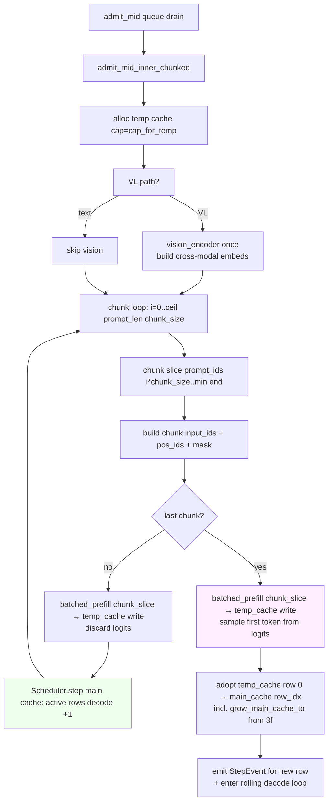

# B1-p2.3c+ Chunked admit_mid Prefill — Design

**Status:** Draft (brainstormed 2026-05-17, autonomous-loop)
**Owner:** ironmlx
**Parent program:** B1-p2 batched serving (see [B1-p2.1 §0](2026-05-12-b1-p2-1-batched-prefill-design.md))
**Branch target:** `ironmlx-b1-p2-3c-plus-chunked-admit-mid` (cut from 3f close-out head)

## 0. Program context

B1-p2 5-phase decomposition status after 3f:

| Sub-spec | Status |
| --- | --- |
| B1-p2.1 batched prefill | ✅ DONE |
| B1-p2.2 batched decode | ✅ DONE |
| B1-p2.3a/b1..4/c1..3 continuous batching | ✅ DONE |
| 3d admission queue + config exposure | ✅ DONE |
| 3e.3 typed SchedulerError | ✅ DONE |
| 3f dynamic cap + bounded | ✅ DONE |
| **3c+ chunked admit_mid prefill** | **This spec** |
| 3e.1a async per-row sampler (CPU) | Backlog |
| 3e.1b async per-row sampler (vectorize) | Backlog |
| B1-p2.4 batched VL | ✅ DONE |
| B1-p2.5 production hardening | Future |

3c+ targets the **active-row stall during mid-batch admit**. After 3d, `admit_mid` is the queue-drain path (`gc_finished_rows` frees a slot → `drain_admission_queue` → `handle_admit_mid`). Current `admit_mid_inner` runs the new request's full prompt prefill (B=1 temp cache + `batched_prefill`) synchronously inside `driver_loop`, holding the model lock for ~prompt_len × per-token-prefill-cost. For PP=512 that's ~1-2 seconds during which all active rows stop emitting tokens.

## 1. Motivation

Observed: 3d + 3f are stable but in-flight rows see ~1-3 s SSE-token gaps when a queue admit lands with a long prompt. Iron-bench v2 c=8 PP=512 shows 3-4× p99 token-gap inflation vs c=4.

**Root cause:** `Scheduler::admit_mid_inner` ([scheduler.rs:920+](../../../ironmlx/src/core/scheduler.rs)) builds B=1 prefill inputs for the new request's *entire* prompt and calls `model.batched_prefill` (or `batched_prefill_vl`) once. That call's GPU compute runs synchronously inside `driver_loop`'s thread, blocking the rolling decode loop. Per the 3c-3 perf baseline, single-shot PP=512 prefill on a 4B bf16 model is ~0.8-1.5 s; PP=2048 is ~3-5 s. While prefill runs, no `step()` runs → no token events → SSE stream stalls for every active row.

**Goal:** split the admit_mid prefill into `prefill_chunk_size`-sized chunks, interleaved 1:1 with active-row decode steps. After each chunk:

```
chunked_prefill_inner(chunk i) → step(active rows) → chunked_prefill_inner(chunk i+1) → step → ...
```

active rows see token events at ~normal decode cadence (~50 ms/step + ~chunk forward time per chunk).

## 2. Goals

- **G1.** Replace `Scheduler::admit_mid_inner`'s single-shot `batched_prefill` call with chunked prefill: iterate over the new request's prompt in `prefill_chunk_size`-sized slices, calling the existing chunked-prefill primitives that `GenerationStream` already uses.
- **G2.** Interleave: after each chunk completes its B=1 prefill into the temp cache, run one `Scheduler::step` on the main cache to advance active rows by one token. Order: chunk i → step → chunk i+1 → step → ... → last chunk (full forward + sample first token of new row) → adopt into main → step continues.
- **G3.** chunk_size = `prefill_chunk_size` (from `GenerateRequest`, default 512 via CLI). Reuse the existing `--prefill-chunk-size` flag rather than introducing a new knob.
- **G4.** Always-chunked path: short prompts (prompt_len ≤ chunk_size) take a single chunk through the chunked code path. Net effect: one chunk forward + one extra step (the post-chunk active-row step) vs. the pre-3c+ single-shot admit_mid. Acceptable overhead (~50 ms) for code-path simplicity.
- **G5.** Active-row decode events flow uninterrupted: the rolling-loop `RollingEvent::Step` arm must observe a fresh `route_event` per chunk boundary, so SSE consumers see ~chunk_size-paced token deltas instead of one big gap.
- **G6.** Numerical/functional regression: every active row in the batch ends with the same generated tokens it would have produced under pre-3c+ admit_mid (chunking changes timing, not arithmetic). The new admitted row's first token equals what single-shot admit_mid would have sampled (same temp cache final state).
- **G7.** Stall delta: 3c-3 perf baseline iron-bench v2 c=4 PP=512 p99 token-gap drops from ~1.5 s (3d+3f baseline) to ≤2× chunk forward time (~250 ms for chunk_size=512, ~125 ms for 256).

## 3. Non-goals

- **NG1.** Yield the model lock between chunks for an HTTP-side GenerationStream caller to slip in. SchedulerActor is single-threaded inside the actor task; there is no second consumer of the lock to schedule. Active-row stall is solved by *interleaving inside the actor*, not by releasing the lock to another thread.
- **NG2.** Parallel chunks (admit two new requests' prefills in parallel). Single chunk per step boundary only.
- **NG3.** Adaptive chunk sizing (smaller chunks under high active-row count, larger under low). Future task.
- **NG4.** Chunked prefill for the FIRST admit's batch in `prefill_admitted_inner` (the B>1 batched prefill at start-of-batch). 3c+ scope is admit_mid only. The first-batch prefill is amortized over all rows so stall is per-batch not per-row.
- **NG5.** VL fastpath (skip chunking for VL `batched_prefill_vl`). VL requests go through the same chunked-prefill loop. The vision encoder runs once before the chunked text prefill; vision compute is independent of chunk boundaries.
- **NG6.** Cancel mid-prefill (HTTP client disconnects). Out of scope. Future task with NG2 from 3d.

## 4. Architecture

### 4.1 High-level flow



### 4.2 New code shapes

**`Scheduler::admit_mid_inner_chunked`** — replaces `admit_mid_inner`. Signature unchanged (`(id, row_idx, model)` → `Result<StepEvent>`). Returns the new row's first generated token event same as before.

Internal loop (text-only path; VL path adds a vision-encoder call before the loop):

```rust
let chunk_size = req.prefill_chunk_size.max(1); // safety: never 0
let mut chunk_start: i32 = 0;
let prompt_len = prompt_ids.len() as i32;
let mut last_logits: Option<Array> = None;

while chunk_start < prompt_len {
    let chunk_end = (chunk_start + chunk_size as i32).min(prompt_len);
    let is_last = chunk_end == prompt_len;
    let chunk_slice_ids = &prompt_ids[chunk_start as usize..chunk_end as usize];

    // 1. Build chunk-local input_ids [1, chunk_len], pos_ids, masks.
    //    pos_ids respect the running offset (chunk_start), NOT chunk-local 0..chunk_len.
    //    Mask is causal within chunk + zero-pad for KV from earlier chunks (handled
    //    by temp_cache's offsets[0] = chunk_start before this call).
    let chunk_input_ids = ...;
    let chunk_pos_ids = ...; // starting at chunk_start
    let chunk_attn_mask = ...; // [1, 1, chunk_len, chunk_start + chunk_len]
    let chunk_linear_mask = ...; // [1, chunk_start + chunk_len]

    // 2. Run chunk prefill into temp_cache. temp_cache.offsets[0] after the call
    //    becomes chunk_end (the model's internal KVCache write happens here).
    let logits = if is_vl_path {
        model.batched_prefill_vl(...) // first chunk only carries vision args; later
                                      // chunks pass empty vision args because image
                                      // tokens were consumed in the first chunk
    } else {
        model.batched_prefill(...)
    };

    if is_last {
        last_logits = Some(logits);
    } // intermediate-chunk logits discarded — only last chunk matters for sampling

    chunk_start = chunk_end;

    // 3. Interleave: one active-row decode step before continuing to next chunk.
    //    Skipped on the last chunk because we still need to adopt + sample.
    if !is_last {
        let step_events = self.step(model)?; // existing Scheduler::step
        for ev in step_events {
            // route_event happens in caller (driver_loop) — but inside admit_mid_inner_chunked
            // we don't have event_txs. Either:
            //   (a) take event_txs as &mut param,
            //   (b) accumulate events into Vec returned to driver_loop, OR
            //   (c) refactor: driver_loop drives the chunk loop, calling admit_mid_step_chunk + step.
            //
            // (c) is cleanest — keeps event routing in the caller. See §4.3.
            unreachable!("dispatched by driver_loop, not here");
        }
    }
}

// Adopt temp_cache row 0 → main_cache row_idx, with grow_main_cache_to from 3f.
// Same code as pre-3c+ admit_mid_inner adopt block.

// Sample first token from last_logits.
// Same code as pre-3c+ admit_mid_inner sample block.
```

### 4.3 Event routing — driver_loop drives the chunk loop

Approach (c) above: split the admit_mid_inner into chunk-by-chunk steps that `driver_loop` orchestrates. Adds `Scheduler::admit_mid_chunk` and `Scheduler::admit_mid_finalize`.

```rust
impl Scheduler {
    /// Prepare admit_mid: allocate temp_cache, run vision encoder (VL only),
    /// reserve a slot for the new request. Returns `AdmitMidHandle` describing
    /// the chunk loop state.
    pub fn admit_mid_begin(
        &mut self,
        req: GenerateRequest,
        model: &Qwen35Model,
    ) -> Result<AdmitMidHandle> { ... }

    /// Run one chunk of admit_mid prefill into the temp cache. Returns whether
    /// this was the last chunk. Updates `handle.chunk_start` and (last chunk
    /// only) `handle.last_logits`.
    pub fn admit_mid_chunk(
        &mut self,
        handle: &mut AdmitMidHandle,
        model: &Qwen35Model,
    ) -> Result<bool /* is_last */> { ... }

    /// After the last chunk: adopt temp → main, sample first token, transition
    /// slot to active. Drops `handle`.
    pub fn admit_mid_finalize(
        &mut self,
        handle: AdmitMidHandle,
        model: &Qwen35Model,
    ) -> Result<(RequestId, StepEvent)> { ... }
}

pub struct AdmitMidHandle {
    request_id: RequestId,
    row_idx: usize,
    prompt_ids: Vec<u32>,
    prompt_len: i32,
    chunk_size: i32,
    chunk_start: i32,
    temp_cache: Vec<LayerCache>,
    is_vl: bool,
    // VL-only fields (vision pre-projected embeds, image_grid_thw, etc.)
    last_logits: Option<Array>,
}
```

`driver_loop` orchestrates:

```rust
RollingEvent::Admit(cmd) => {
    if sched.active_count() >= b_max {
        enqueue_or_reject(...);
    } else {
        // pre-3c+: handle_admit_mid(cmd, &mut sched, &mut event_txs, &admit_count, &model);
        // 3c+: chunked handler
        handle_admit_mid_chunked(cmd, &mut sched, &mut event_txs, &admit_count, &model);
    }
}

fn handle_admit_mid_chunked(
    cmd: SchedulerCommand,
    sched: &mut Scheduler,
    event_txs: &mut HashMap<RequestId, mpsc::UnboundedSender<StepEvent>>,
    admit_count: &Arc<AtomicU64>,
    model: &Arc<Mutex<Qwen35Model>>,
) {
    let SchedulerCommand::Admit { request, reply_tx } = cmd;
    let (event_tx, event_rx) = mpsc::unbounded_channel();

    let mut handle = {
        let model_lock = model.blocking_lock();
        match sched.admit_mid_begin(request, &model_lock) {
            Ok(h) => h,
            Err(e) => {
                let _ = reply_tx.send(Err(e));
                return;
            }
        }
    };
    let id = handle.request_id;
    event_txs.insert(id, event_tx);
    if reply_tx
        .send(Ok(AdmitReply { request_id: id, event_rx }))
        .is_err()
    {
        let _ = sched.evict(id);
        event_txs.remove(&id);
        return; // caller bailed before we did real work; abort cheaply
    }

    // Chunk loop: one chunk, one active-row step, repeat.
    loop {
        let is_last = {
            let model_lock = model.blocking_lock();
            match sched.admit_mid_chunk(&mut handle, &model_lock) {
                Ok(b) => b,
                Err(e) => {
                    tracing::error!("[SchedulerActor] admit_mid_chunk error: {e:?}");
                    let _ = sched.evict(id);
                    event_txs.remove(&id);
                    return;
                }
            }
        };

        if is_last {
            // Adopt + sample first token + emit event.
            let model_lock = model.blocking_lock();
            match sched.admit_mid_finalize(handle, &model_lock) {
                Ok((_id, first_event)) => {
                    admit_count.fetch_add(1, Ordering::Relaxed);
                    route_event(first_event, event_txs);
                }
                Err(e) => {
                    tracing::error!("[SchedulerActor] admit_mid_finalize error: {e:?}");
                    let _ = sched.evict(id);
                    event_txs.remove(&id);
                }
            }
            return;
        }

        // Interleave one active-row decode step.
        let step_result = {
            let model_lock = model.blocking_lock();
            sched.step(&model_lock)
        };
        match step_result {
            Ok(events) => {
                for ev in events {
                    route_event(ev, event_txs);
                }
                sched.gc_finished_rows(event_txs);
            }
            Err(e) => {
                tracing::error!("[SchedulerActor] step error inside chunked admit_mid: {e:?}");
                // step error poisons scheduler; abort the in-progress admit_mid too.
                let _ = sched.evict(id);
                event_txs.remove(&id);
                return;
            }
        }
    }
}
```

### 4.4 Per-chunk inputs

For chunk `i` covering `prompt_ids[chunk_start..chunk_end]`:

| Field | Shape | Notes |
| --- | --- | --- |
| `input_ids` | `[1, chunk_len]` | B=1; chunk_len = chunk_end - chunk_start |
| `position_ids` | `[3, 1, chunk_len]` (text) or `[3, 1, chunk_len]` (VL, MRoPE) | Starts at `chunk_start`. VL uses `build_position_ids_vl_batched` with running offset. |
| `attention_mask` | `[1, 1, chunk_len, chunk_start + chunk_len]` | Cross-chunk attention via earlier-chunk KV cells; within-chunk causal. |
| `linear_attention_mask` | `[1, chunk_start + chunk_len]` | Mirrors text attention coverage for the Linear path. |

The model's internal `KVCache::update_and_fetch_on` consumes `chunk_len` K/V positions, advancing `temp_cache.offsets[0]` from `chunk_start` → `chunk_end`. After the last chunk, `temp_cache.offsets[0] == prompt_len`.

### 4.5 Sampling on the last chunk

Same as pre-3c+ admit_mid: the last chunk's `batched_prefill` returns `[1, 1, vocab]` logits (collapsed to the final real position by `slice_last_and_project`). `Scheduler::admit_mid_finalize` samples first token from these logits.

Intermediate-chunk logits are not used for sampling; the model still returns the standard `[1, 1, vocab]` shape (it always projects only the last position). We discard them on chunks `0..ceil-1`.

### 4.6 VL image-token handling

VL request flow:
- Vision encoder produces `pixel_values` embeds once in `admit_mid_begin`.
- `prompt_ids` already contains `image_pad` placeholder tokens at positions determined by the chat template.
- `batched_prefill_vl` swaps embeddings for image_pad positions during the forward.

When chunking, the image_pad positions may straddle chunk boundaries. Two cases:

1. **All image_pad tokens in chunk i.** `batched_prefill_vl` for chunk i swaps embeds normally. Chunks `i+1..` see no image_pad tokens — call `batched_prefill` (text path) for those chunks.
2. **Image tokens split across chunks.** Slice `pixel_values` and `image_grid_thw` per chunk to provide only the embeds that chunk consumes. Requires per-chunk vision-arg slicing.

To keep 3c+ scope tight: **Case 2 disallowed in v1.** Enforce `chunk_size >= sum(image_pad_token_count)` at admit_mid_begin or fall back to single-chunk for VL requests with image_pad spanning across the would-be chunk boundary. Doc in NG7.

- **NG7.** VL chunking when `image_pad` tokens cross a chunk boundary. v1 falls back to single-chunk for affected VL requests; v2 implements per-chunk vision-arg slicing.

### 4.7 Error / edge cases

- **R1: temp_cache cap exceeded.** Pre-3c+ admit_mid sized `cap_for_temp = prompt_len + max_new_tokens`. Same for 3c+; chunks write into the same temp_cache through to prompt_len. No cap overrun within prefill.
- **R2: Active row finishes mid-chunk-loop.** `Scheduler::step` between chunks may transition the active row to `finished` and emit its `finish_reason` event. `gc_finished_rows` then frees the slot. If the new admit_mid's `row_idx` was assigned at `admit_mid_begin` and that row hasn't been claimed yet (it's reserved but holding `RequestState` already), the gc skip applies only to other-rows. Verify `admit_mid_begin` reserves the slot *before* the chunk loop so subsequent gc sees it as in-flight (RequestState present, `finished = false`).
- **R3: step error inside chunk loop.** Abort admit_mid: `sched.evict(id)`, drop `event_txs[id]`. The error path already poisons the scheduler via `step`'s internal poison flag, so subsequent admits get `Err("scheduler poisoned")` until evict_all.
- **R4: chunk_size == 0 or negative.** `chunk_size = req.prefill_chunk_size.max(1)`. Always ≥ 1.
- **R5: prompt_len < chunk_size.** Single iteration through the loop, `is_last = true` on first chunk. Equivalent to pre-3c+ admit_mid but routed through the chunked code path. Cost: one extra Scheduler::step is *not* emitted (the `if !is_last` guard skips). Net: identical to pre-3c+ semantically; no perf regression.
- **R6: VL with image_pad crossing chunk boundary.** Detect at `admit_mid_begin`: if `chunk_size < first_image_pad_position + image_token_count(image_0)`, force single-chunk path (set `chunk_size = prompt_len`). Doc warning in tracing.
- **R7: HTTP caller drops reply_rx before admit_mid_begin returns.** Existing behavior preserved: send fails, slot evicted, no event_txs entry. No partial work leaked.
- **R8: Concurrent mid-batch admits.** Single SchedulerActor serializes admits via `driver_loop`'s `cmd_rx`. Only one admit_mid in flight at any time. Queue admits wait for the current admit_mid to fully finalize.

## 5. Acceptance

### 5.1 Unit tests (Scheduler)

- **U1.** `admit_mid_chunk_loop_advances_temp_cache_offset` — admit a 1000-token prompt with `chunk_size=256`; assert temp_cache `offsets[0]` = 256, 512, 768, 1000 after successive `admit_mid_chunk` calls; `admit_mid_chunk` returns `is_last=false, false, false, true`.
- **U2.** `admit_mid_short_prompt_single_chunk` — admit a 50-token prompt with `chunk_size=512`; one `admit_mid_chunk` call returns `is_last=true`; no intermediate step skipped (R5).
- **U3.** `admit_mid_chunked_matches_single_shot_numerically` — admit same request via pre-3c+ admit_mid (gated test) vs 3c+ chunked path; assert first generated token id matches across both paths. Verifies G6.
- **U4.** `admit_mid_handle_evict_on_step_error_mid_loop` — inject step error after chunk 2 of 4 (test-seam `force_step_err`); assert sched.evict(id) called, event_txs entry removed, scheduler poison flag set.
- **U5.** `admit_mid_vl_image_pad_within_chunk` — VL request with image_pad tokens all in first 256 of a 600-token prompt + chunk_size=256; assert chunks 0/1 dispatched, chunk 0 via `batched_prefill_vl`, chunk 1 via `batched_prefill` (text path).
- **U6.** `admit_mid_vl_image_pad_crosses_boundary_forces_single_chunk` — VL request where image_pad spans positions [300, 700], chunk_size=512; assert `admit_mid_begin` overrides `chunk_size = prompt_len = 1024`, single chunk; warning logged.

### 5.2 Integration tests

- **I1.** `b1_p2_3c_plus_chunked_admit_stall_delta` (NEW, real-model heavy, `#[ignore]`):
  - Boot SchedulerActor with `b_max=4`, `chunk_size=256`.
  - Admit 3 short-prompt requests; let them reach decode steady state.
  - Admit a 1024-token prompt via queue drain (so it goes through admit_mid).
  - Record per-active-row token-emission timestamps from event_rx.
  - Assert: max inter-token gap for active rows ≤ 600 ms (≈ 2 × chunk_size=256 forward time + per-chunk overhead).
  - Pre-3c+ baseline: max gap ≈ 2-3 s (single-shot PP=1024 prefill).
- **I2.** `b1_p2_3c_plus_vl_chunked_admit_mid` — mirror I1 with one VL request; verify image_pad-within-chunk path produces same token output as pre-3c+ baseline.

### 5.3 Perf gate

iron-bench v2 c=8 PP=512 max_new=64 against the post-3c+ branch:
- p99 inter-token gap (within a single SSE stream) ≤ 400 ms (vs. ~1.5 s pre-3c+).
- Aggregate throughput (tokens/s across all c=8 streams) ≥ 95% of pre-3c+ (chunking is not a throughput win; small regression acceptable).

### 5.4 Regression sweep

15-suite + new `b1_p2_3c_plus_chunked_admit_mid`. All PASS.

## 6. Risks + mitigations

- **R1: 1:1 interleave doubles admit_mid wall-time** (one step per chunk added). For chunk_size=512, PP=2048 = 4 chunks = 4 extra steps × 50 ms = 200 ms added to admit_mid total. Mitigation: documented; the stall-delta benefit (active rows see tokens every chunk vs every prompt) is the explicit tradeoff Boss approved.
- **R2: Memory pressure with B=1 temp cache + B=b_max main cache concurrently.** 4B bf16 model, prompt=2048, b_max=4, head_dim=128, n_kv_heads=8: temp_cache ≈ 2048×8×128×2 ≈ 4 MB/layer × 32 layers ≈ 128 MB. Main cache scales with its own cap (32K bound by 3f) ≈ 1 GB. Net ≈ 1.2 GB. Unified mem 16-64 GB Apple Silicon: comfortable.
- **R3: chunk boundary mask error → corrupted attention.** Attention mask shape `[1, 1, chunk_len, chunk_start + chunk_len]` must include `chunk_start` columns of "attend to previous chunks" + `chunk_len` columns of causal within-chunk. U3 numerical equivalence catches this.
- **R4: VL chunking edge case** (image_pad straddling). Covered by NG7 fallback. v2 implements proper per-chunk vision slicing.
- **R5: Concurrent admit_mid order with queue drain.** Queue is FIFO; drain pops one at a time. Each pop runs through the full chunk loop before the next pop. No parallel admit_mid (NG2). Confirmed via `driver_loop`'s sequential structure.
- **R6: Step error mid-chunk-loop leaves orphan slot.** R3 covers via `sched.evict(id)` + `event_txs.remove(id)`. The admit_mid caller's reply_tx already received `Ok(AdmitReply{...})` in admit_mid_begin so the caller is left in event_rx loop waiting forever — actually no, event_tx is dropped, so event_rx receives None and the handler's `while let Some(ev) = event_rx.recv()` breaks cleanly.
- **R7: `admit_mid_chunk` signature exposes test seam for force_step_err.** Acceptable test seam; U4 uses it.
- **R8: pre-3c+ admit_mid removed cleanly per Boss preference (no compat code).** Single chunked path replaces single-shot. Tests verifying old behavior get rewritten or deleted.

## 7. Implementation plan handoff

4 tasks (~3-4 d total):

| Task | Scope | Est. | Model |
| --- | --- | --- | --- |
| T1 | Scheduler::{admit_mid_begin, admit_mid_chunk, admit_mid_finalize} + AdmitMidHandle struct. Unit tests U1, U2, U5. | 1 d | sonnet |
| T2 | `handle_admit_mid_chunked` in scheduler_actor.rs. Plumbs through driver_loop. Replaces handle_admit_mid. | 0.5 d | sonnet |
| T3 | VL chunk-vision-arg slicing + R6 fallback. Unit tests U5, U6. | 1 d | sonnet |
| T4 | Integration scenarios I1, I2. Regression sweep. Perf gate. Close-out. | 1 d | sonnet |

Spec → plan → subagent-driven implementation.
