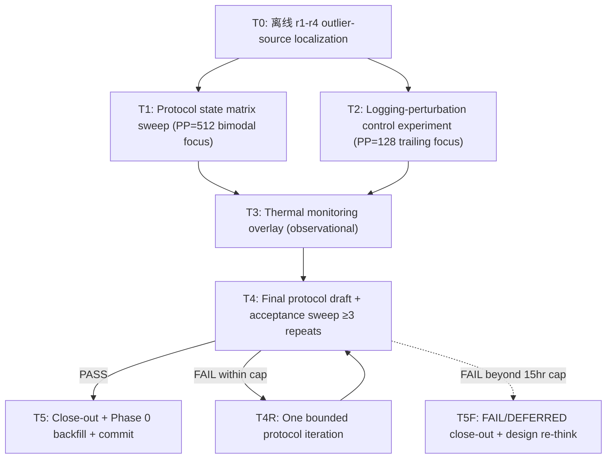

# P5h+2.b — PP=128/512 Production Envelope Protocol Fix: Design

**Status:** Draft for Codex review. NOT yet committed (per `[feedback-review-spec-before-commit]`).
**Date:** 2026-05-24.
**Branch:** `ironmlx-p5h+2-a-pp512-measurement` HEAD `f821585` (P5i.c Phase 0 measure-only closed).
**Predecessor close-outs:** `docs/p5i-c-phase-0-close-out.md` (γ-lite — § 7 #4 hard gate FAIL/DEFERRED).
**Codex review input:** `reports/p5h+2-b-codex-review-questions.md` (gitignored; § 7 documents decisions).

---

## § 1 Background + motivation

P5i.c Phase 0 closed measure-only (γ-lite) per Codex round-2 because spec § 7 #4 (ironmlx production `pp_tps` envelope ≤ ±2% per PP) FAILED at both target PPs:

- PP=128: envelope 11.98% — within-sweep CI dominated by reproducible last-2-rows trailing outliers (r1 + r4 both: 740/707 / 881/640 after typical ≥950)
- PP=512: envelope 11.88% — between-sweep half-range dominated by bimodal spawn clusters ("fast" {r1=1590, r4=1394} vs "slow" {r2=1278, r3=1263})

Phase 1 implementation is BLOCKED on this envelope; Phase 1 brainstorm allowed in parallel because tier-1 ranking is clean (`gather_qmm_gate_up` matches P5h+1 within ±2pp).

P5h+2.b = the protocol-fix task that unblocks Phase 1 implementation acceptance + completes Phase 0 measurement quality.

## § 2 Goals + non-goals

### Goals

1. Achieve ironmlx production `pp_tps` envelope ≤ ±2% per PP on ≥3 fresh-spawn repeats at PP=128 and PP=512 under a final protocol.
2. Explicitly state — per Codex hard binding — whether PP=128 trailing outliers and PP=512 bimodal medians are **explained** (root cause identified) or **eliminated by protocol** (or both).
3. Investigate PP=128 and PP=512 mechanisms independently (Codex Q11 — do NOT force one explanation).
4. Backfill Phase 0 close-out § 1 #4 + ranking snapshot envelope numbers on completion.
5. Emit reusable harness / iron-bench / instrumentation primitives for future PP / Lane B measurement work (Q9 B — generalize, do not build a permanent framework).

### Non-goals

1. **NOT relaxing the ±2% gate** (Codex Q4 D). No ±5% relaxation; no per-PP tiering.
2. **NOT pure-trim mitigation**. Trim-only solutions without mechanism understanding are rejected.
3. **NOT changing ironmlx production server behavior structurally**. Only `--p5h-profile`-gated low-overhead instrumentation may be added.
4. **NOT making fan curve / system performance mode an acceptance dependency**. Thermal monitoring is observational only.
5. **NOT building a permanent measurement framework**. P5h+2.a + Phase 0 infra is the baseline; this task extends, not rebuilds.
6. **NOT Phase 1 implementation work**. Phase 1 brainstorm parallel-OK; Phase 1 spec/plan gated on P5h+2.b close per Codex Q8 C.

## § 3 Hard constraints (Codex Q4 + Q5 + Q11 must-emphasize)

These constraints MUST be enforced in plan + implementation:

### § 3.1 Strict ±2% envelope per PP (Q4 D)

Final acceptance is `MAX(within-sweep CI95 half-width, between-sweep half-range) ≤ 2.0%` per PP=128 and PP=512 on ≥3 fresh-spawn repeats. Predeclared outlier exclusion rules (Codex round-1 pattern) may apply, but the gate threshold is non-negotiable.

### § 3.2 Independent per-PP mechanism investigation (Q5 + Q11)

PP=128 trailing-outlier investigation and PP=512 bimodal-cluster investigation are tracked as separate hypothesis chains. Even if one mitigation lands for both, the close-out doc must document each PP's mechanism / mitigation independently. Codex Q11: "do NOT force PP=128 + PP=512 into one mechanism" — applies to both spec and execution.

### § 3.3 No structural production-path changes (Q3 B)

Permitted changes:
- New / extended Rust test harnesses (`ironmlx/tests/`)
- `iron-bench` CLI surface additions or extensions
- `--p5h-profile`-gated low-overhead server-side instrumentation (e.g. monotonic-ns timestamps on request lifecycle events)
- Python tooling (`tools/p5h_aggregator/*`, `tools/p5i_c_*`)

NOT permitted:
- Changes to `ironmlx serve` default behavior or admission/scheduling logic
- Fan curve / system performance mode changes as acceptance dependency
- Changes to MLX backend or model code

## § 4 Architecture

T0 is purely offline analysis of existing Phase 0 r1-r4 data — outputs the hypothesis ranking that drives T1 + T2 emphasis. T1 + T2 run in sequence per `[feedback-serial-perf-experiments]` (one GPU experiment at a time). T3 overlays thermal monitoring on top of T1+T2 spawn runs (re-uses GPU work; no additional standalone runs). T4 is the validation gate.

### § 4.1 Reused infrastructure (no changes)

- **`ironmlx/tests/p5i_c_phase_0_capture.rs`** — env-var driven capture harness (commit `c3d92e1`); P5h+2.b extends env vars for protocol experiments but does NOT mutate the harness for non-P5h+2.b needs
- **`tools/p5h_aggregator/multi_repeat.py`** — per-substep CI95 (probe mode) + production root extraction (commit `2535c34`); reused for any probe-mode validation
- **`tools/p5i_c_pp_tps_envelope.py`** — `MAX(within, between)` envelope + vs-comparator delta (commit `2535c34`); reused as the acceptance gate
- **`tools/p5h_aggregator/aggregator.py`** + **`schema_validator.py`** + **`roi_ranking.py`** — P5h T5 / P5h+1 infra
- **`docs/p5h+2-a-pp512-protocol.md`** + **`[project-p5h-2a-findings]`** — methodology baseline (RUNS=15, monolithic ≥300s preheat, M5 Max `--runs 1100` calibration)

### § 4.2 Extended / new components

- **`tools/p5h_2b_t0_outlier_source.py`** (NEW) — offline analyzer; joins existing per-cell `bench.csv` (`run_idx`, `ttft_ms`, `pp_tps`) with server `[p5h-profile]` log root span via request_id (probe-mode) or warmup-aware ordinal match (production-mode). Outputs per-run client_overhead + server_root_inclusive_us decomposition + verdict per PP.
- **`ironmlx/tests/p5i_c_phase_0_capture.rs` extensions** (modify):
  - New env var `P5I_C_SERVER_LIFECYCLE` ∈:
    - `phase0_current` — current P5i.c behavior: one dedicated preheat server spawn is killed, then each PP measurement cell gets a fresh server spawn.
    - `same_spawn_cross_pp` — P5h+2.a-compatible candidate: one server spawn per repeat, monolithic preheat in that same spawn, then measure PPs in `P5I_C_PP_ORDER`, then kill.
    - `same_spawn_per_pp` — one server spawn per PP per repeat, monolithic preheat in that same spawn, measure that PP only, then kill.
  - New env var `P5I_C_PP_ORDER` ∈ {`128,512` (default), `512,128`}
  - New env var `P5I_C_LOGGING_MODE` ∈ {`default_profile` (current info-level `[p5h-profile]` logs), `quiet_acceptance` (`RUST_LOG=error`, no root-log decomposition), `buffered_profile` (info-level logs through a buffered sink)}
  - `meta.json` schema additions: server lifecycle + PP order + logging mode + warmup count + server spawn/health/preheat/measurement/kill Unix timestamps.
  - `iron-bench` optional `--capture-run-timestamps` extension: append `run_start_unix_ns` and `run_end_unix_ns` columns to CSV. Flag off keeps current CSV byte-identical. P5h+2.b runs use it so thermal overlay can align by wall clock; timestamps are not derived from `ttft_ms`.
- **`tools/p5h_2b_thermal_overlay.py`** (NEW) — parses `powermetrics` JSON output (`--samplers smc,gpu_power,thermal -i 1000 --format json`) + joins to iron-bench per-run `run_start_unix_ns` / `run_end_unix_ns`; outputs whether outlier runs correlate with thermal spikes / fan rev-up events.
- **`tools/p5h_2b_protocol_experiment.py`** (NEW) — driver: given an experiment matrix row (SERVER_LIFECYCLE, PP_ORDER, LOGGING_MODE, REPEATS, PPS), invokes the extended harness across the cells, runs envelope analysis, emits per-experiment verdict JSON.
- **`docs/p5h+2-b-protocol.md`** (NEW; will be committed) — final protocol documentation (after T4 acceptance).
- **`docs/p5h+2-b-close-out.md`** (NEW; will be committed) — close-out narrative.
- **Phase 0 backfill edits** (modify): `docs/p5i-c-phase-0-close-out.md` § 1 #4 + § 3 + `docs/p5i-c-phase-0-ranking-snapshot.md` envelope section.

## § 5 Tasks (6 main tasks + 1 FAIL fallback; respects `[feedback-task-breakdown-bounded]` ≤ 7)

### § 5.1 T0 — Offline outlier-source localization (~1.5 hr; no GPU)

**Goal**: Per Codex experiment priority #1 — locate whether PP=128 + PP=512 outliers originate client-side (iron-bench / HTTP / network) or server-side (ironmlx scheduler / MLX / system state).

**Inputs**: existing `/tmp/p5i-c-phase-0-r{1..4}-pp{128,512}-{probe,production}/{bench.csv,server.log,meta.json}`

**Method**: For each per-run row in `bench.csv`:
- Probe-mode cell: join via `request_id` column to server log root span; extract `server_root_inclusive_us` per run
- Production-mode cell: join by **warmup-aware request ordinal** to extract `server_root_inclusive_us` per measured row:
  - Parse CSV with `csv.DictReader` so blank trailing lines are ignored.
  - Read `warmup_count` from `meta.json`. For legacy Phase 0 cells whose `meta.json` lacks this field, infer `warmup_count=1` for `mode=production` and `warmup_count=0` for `mode=probe`, and mark the row as `legacy_warmup_inferred=true`.
  - Parse root spans from `server.log` in emission order.
  - Require `len(root_spans) == warmup_count + measured_row_count`; otherwise mark cell `inconclusive` and fail T0 hard enough to prevent false decomposition.
  - Drop the first `warmup_count` root spans, then ordinal-join remaining roots to measured CSV rows.
  - Verify each joined root has the expected mono-PP prompt token family for that cell; mismatch is `inconclusive`.
- Compute `client_overhead = (ttft_ms × 1000) − server_root_inclusive_us` per run

**Outputs**: `reports/p5h+2-b-t0-outlier-source.md` (gitignored) containing:
- Per-PP per-run table: `run_idx`, `pp_tps`, `ttft_ms`, `server_root_inclusive_us`, `client_overhead_us`, `is_outlier_flag`
- Per-PP verdict: `client_side` / `server_side` / `cross` / `inconclusive`
- Hypothesis ranking for T1 + T2 prioritization

**No commit** (gitignored doc; no code committed at T0).

### § 5.2 T1 — Protocol state matrix sweep (~5 hr GPU; serial per `[feedback-serial-perf-experiments]`)

**Goal**: Per Codex experiment priority #2 — investigate PP=512 bimodal pattern via protocol state variations.

**Minimal experiment matrix** (4 experiments × 3 repeats each):

| Exp ID | PP order | Server lifecycle | Logging mode | Purpose |
|---|---|---|---|---|
| `phase0_current` | 128→512 | `phase0_current` | `default_profile` | Reproduce current failure state: separate preheat spawn, then fresh measurement server per PP |
| `same_spawn_cross_pp` | 128→512 | `same_spawn_cross_pp` | `default_profile` | Test P5h+2.a-compatible lifecycle: preheat and both PP measurements in the same server spawn |
| `order_swap_same_spawn` | 512→128 | `same_spawn_cross_pp` | `default_profile` | Isolate PP order effect under the same server lifecycle |
| `same_spawn_per_pp` | (single PP per spawn) | `same_spawn_per_pp` | `default_profile` | Isolate each PP while preserving same-spawn preheat before measurement |

**Implementation**: T1 implements `P5I_C_*` env var extensions in capture harness (§ 4.2 list), then runs each experiment via `tools/p5h_2b_protocol_experiment.py`.

**Outputs**:
- `/tmp/p5h+2-b-t1-{exp_id}-r{1..3}/` normalized repeat artifacts. Every experiment must include per-PP `bench.csv` files for envelope input. If a lifecycle uses one shared server spawn for both PPs, the directory stores one shared `server.log` plus per-PP bench/meta subdirectories; if it uses per-PP spawns, each PP subdirectory stores its own `server.log`.
- `/tmp/p5h+2-b-t1-{exp_id}-envelope.json` per-experiment envelope
- T1 verdict appended to outlier-source doc: which experiment(s) eliminate / shift PP=512 bimodal pattern?

**No commit** (gitignored data; harness changes committed only at T4 if part of final protocol).

### § 5.3 T2 — Logging-perturbation control experiment (~2-3 hr GPU; serial)

**Goal**: Per Codex experiment priority #3 — test whether PP=128 trailing outliers are logging / HTTP jitter artifacts.

**3 experiments × 3 repeats × PP=128 only**:

| Exp ID | Logging mode | Description |
|---|---|---|
| `log_default` | `default_profile` | production baseline with full `--features p5h-profile` emission; root-log decomposition available |
| `log_quiet` | `quiet_acceptance` | `RUST_LOG=error`; pp_tps acceptance only, no root-log decomposition |
| `log_buffered` | `buffered_profile` | info-level `[p5h-profile]` emission through buffered sink; root-log decomposition available after flush |

PP=512 not in T2 scope (bimodal cluster doesn't match logging-perturbation hypothesis profile per T0 expected verdict).

If `quiet_acceptance` is the only mode that passes the PP=128 envelope, final protocol may use it for pp_tps acceptance, but mechanism decomposition must come from a paired `default_profile` or `buffered_profile` diagnostic sweep. Quiet acceptance data alone cannot claim server/client root-cause decomposition because root logs are intentionally absent.

**Outputs**:
- `/tmp/p5h+2-b-t2-{exp_id}-r{1..3}-pp128/` per-cell artifacts
- `/tmp/p5h+2-b-t2-{exp_id}-envelope.json` per-experiment envelope
- T2 verdict: does PP=128 trailing-outlier pattern disappear in any logging variant?

**No commit**.

### § 5.4 T3 — Thermal monitoring overlay (~2 hr; piggybacks on T1+T2 GPU work)

**Goal**: Per Codex experiment priority #4 (last; observational only) — record `powermetrics` time series alongside T1 + T2 sweeps; correlate with outlier timestamps. Thermal evidence is informational; NOT a verdict input per § 3.3.

**Method**:
- During each T1/T2 experiment spawn, run in parallel: `powermetrics --samplers smc,gpu_power,thermal -i 1000 --format json > /tmp/p5h+2-b-t3-{exp}-thermal.json`
- After cell completes, `tools/p5h_2b_thermal_overlay.py` joins powermetrics timestamps to iron-bench per-run `run_start_unix_ns` / `run_end_unix_ns` columns and server lifecycle timestamps from `meta.json`
- Outputs: per-experiment thermal alignment — do outlier runs coincide with thermal spikes / fan rev-up events?

**Outputs**: `/tmp/p5h+2-b-t3-thermal-overlay-{exp}.json` + summary appended to outlier-source doc.

**No commit**.

### § 5.5 T4 — Final protocol draft + acceptance sweep (~3-4 hr GPU)

**Goal**: Synthesize T0-T3 findings into a final protocol; validate via ≥3 fresh-spawn repeats on PP=128 + PP=512 under that protocol; gate on envelope ≤ ±2%.

**Steps**:

1. **T4.1 Predeclared exclusion rules**: Write any outlier-exclusion rules BEFORE looking at validation sweep data (Codex round-1 pattern). Rules locked in `docs/p5h+2-b-protocol.md` draft.
2. **T4.2 Final protocol draft**: Codify decisions from T1+T2 (e.g. final server lifecycle, PP order, logging mode, RUNS per PP, outlier exclusion rules). Document mechanism statement per § 3.2 (explained vs eliminated per PP).
3. **T4.3 Acceptance sweep**: Run ≥3 fresh-spawn ironmlx production repeats × PP=128 + PP=512 under final protocol. If a protocol variant from T1 PASS shifts the topology, use that variant.
4. **T4.4 Envelope verification**: Run `tools/p5i_c_pp_tps_envelope.py` on acceptance sweep data. Verdict: PASS / FAIL.
5. **T4.5 If PASS**: proceed to T5.
6. **T4.6 If FAIL + budget remaining**: run at most 1 additional bounded iteration (`T4R`) with a predeclared protocol adjustment.
7. **T4.7 If FAIL beyond 15hr cap or after T4R**: proceed to T5F FAIL/DEFERRED close-out; escalate to Boss + Codex for design re-think. Do not silently extend GPU work.

**Outputs**:
- `docs/p5h+2-b-protocol.md` (committed at T5 only if PASS; uncommitted draft during T4)
- `/tmp/p5h+2-b-t4-acceptance-pp{128,512}-envelope.json`

### § 5.6 T5 — PASS close-out + Phase 0 backfill + commit (~1-1.5 hr; no GPU)

**Goal**: Document outcome, backfill Phase 0, commit deliverables.

**Files**:
- `docs/p5h+2-b-protocol.md` (NEW; committed)
- `docs/p5h+2-b-close-out.md` (NEW; committed; per `[feedback-no-empty-commits]` close-out doc pattern)
- `docs/p5i-c-phase-0-close-out.md` (MODIFY; backfill § 1 #4 from FAIL/DEFERRED → PASS + new ironmlx envelope numbers; update vs-omlx wording only if comparator data is rerun or recomputed with a clearly preserved caveat)
- `docs/p5i-c-phase-0-ranking-snapshot.md` (MODIFY; backfill envelope section)
- `ironmlx/tests/p5i_c_phase_0_capture.rs` (MODIFY; committed env var extensions used by final protocol)
- `tools/p5h_2b_t0_outlier_source.py` (NEW; committed)
- `tools/p5h_2b_thermal_overlay.py` (NEW; committed)
- `tools/p5h_2b_protocol_experiment.py` (NEW; committed)
- `/Users/xin/.claude/projects/-Users-xin-workspace-ironmlx-backend/memory/project_p5h_2b_findings.md` (NEW; outside repo)
- `/Users/xin/.claude/projects/-Users-xin-workspace-ironmlx-backend/memory/MEMORY.md` (MODIFY; add index entry)

**Commit format**: single T5 commit attaching all NEW + MODIFY files per `[feedback-commit-message-english]`. May split into 2 commits (code + docs) if file count warrants.

### § 5.7 T5F — FAIL/DEFERRED close-out + evidence commit (~1 hr; no GPU)

If T4/T4R fails under the 15hr cap, P5h+2.b still produces a committed close-out, but **does not** mark Phase 0 envelope as PASS.

**Files**:
- `docs/p5h+2-b-close-out.md` (NEW; committed) with status `FAIL/DEFERRED`, failed protocol variants, root-cause evidence, and next design questions.
- `docs/p5i-c-phase-0-close-out.md` (MODIFY only to add a P5h+2.b failed-attempt note; criterion #4 remains `FAIL/DEFERRED`).
- `docs/p5i-c-phase-0-ranking-snapshot.md` (MODIFY only to add failed-attempt envelope evidence; no PASS wording).
- `tools/p5h_2b_t0_outlier_source.py`, `tools/p5h_2b_thermal_overlay.py`, `tools/p5h_2b_protocol_experiment.py` (NEW; committed if validated by tests).
- Memory entry `project_p5h_2b_findings.md` records failure evidence and the design re-think dependency.

`docs/p5h+2-b-protocol.md` is committed in T5F only if it documents a rejected protocol candidate clearly as non-final; otherwise leave it uncommitted and preserve details in close-out.

## § 6 Measurement protocol (inherited + extended)

Inherits P5h+2.a binding (per `[project-p5h-2a-findings]`):

- **Preheat**: MONOLITHIC `iron-bench --prompt-len 512 --runs 1100 --warmup 0` ≈ 395s wall on M5 Max
- **RUNS**: PP=128 → 7; PP=512 → 15 (P5h+2.a binding; may be revised during T4 if predeclared exclusion needs higher base count)
- **Repeats**: ≥3 fresh server-lifecycle repeats per PP under the final lifecycle. If the final lifecycle is `same_spawn_cross_pp`, one fresh server spawn may contribute one PP=128 and one PP=512 measured sweep; this still counts as one repeat for each PP.
- **Cooldown**: ~3s inter-PP (iron-bench default); ~5s inter-spawn cooldown (P5h+2.a binding)
- **Mode**: production (envelope gate is on production sweeps; probe mode unchanged for separate substep ranking)

Extensions for P5h+2.b experimentation (§ 4.2):

- `P5I_C_SERVER_LIFECYCLE` env var with 3 modes
- `P5I_C_PP_ORDER` env var
- `P5I_C_LOGGING_MODE` env var with 3 modes
- `iron-bench --capture-run-timestamps` optional CSV columns: `run_start_unix_ns`, `run_end_unix_ns`
- `meta.json` additions: server lifecycle, PP order, logging mode, warmup count, server spawn/health/preheat/measurement/kill Unix timestamps

`--capture-run-timestamps` must compose with existing `--capture-server-request-id`: when both are active, both column families are present and downstream parsers must use header names via `csv.DictReader`, not fixed column positions.

## § 7 Acceptance criteria

### § 7.1 PASS close requires ALL of:

1. **Envelope** (§ 3.1 + Codex Q4 D): ironmlx production envelope ≤ ±2% per PP=128 + PP=512 on ≥3 fresh-spawn repeats under final protocol.
2. **Mechanism statement** (§ 3.2 + Codex hard binding): explicit per-PP statement of whether trailing-outlier (PP=128) and bimodal-cluster (PP=512) are **explained** (root cause identified) or **eliminated by protocol** (or both).
3. **Predeclared exclusion**: any outlier exclusion rules written before T4 validation sweep data is observed.
4. **Independent investigation tracks**: T0-T3 outputs document PP=128 and PP=512 findings separately even if mitigation is common.
5. **Phase 0 backfill**: `docs/p5i-c-phase-0-close-out.md` § 1 #4 status updated from FAIL/DEFERRED to PASS with new ironmlx envelope numbers; `docs/p5i-c-phase-0-ranking-snapshot.md` envelope section updated. vs-omlx delta is updated only if comparator data is rerun or recomputed with the old comparator caveat explicitly preserved.
6. **Reusable infra emitted** (Q9 B): protocol experiment driver + thermal overlay + outlier-source analyzer scripts committed for future PP / Lane B measurement reuse. NOT a permanent framework.
7. **No production-path regression**: smoke test `p5_qwen35_moe_smoke` pp_tps within ±2% of feature-off baseline (P5h+1 binding).
8. **Rust/Python gates**: if any Rust file changed, run and pass:
   - `cargo fmt`
   - `cargo +nightly fmt --all -- --check`
   - `cargo +nightly clippy --all-features --workspace -- -D warnings`
   - `cargo build --release`
   Python tooling changes must pass the relevant `uv run --with pytest python -m pytest ...` commands listed in the implementation plan.

### § 7.2 FAIL/DEFERRED close requires ALL of:

1. T4/T4R failure documented with raw envelope JSON paths and per-run data preservation.
2. `docs/p5h+2-b-close-out.md` states `FAIL/DEFERRED`, not PASS.
3. Phase 0 criterion #4 remains `FAIL/DEFERRED`; no backfilled PASS wording.
4. Next design questions are explicit enough for a new Boss + Codex decision round.
5. Any committed Rust/Python tooling passes the same gates as § 7.1 #8.

## § 8 Investigation strategy + Codex priority order (Q6 C/B hybrid)

Sequential elimination per Codex-recommended hypothesis priority (`reports/p5h+2-b-codex-review-questions.md` § 7):

1. **T0 first** — offline localization. Determines whether PP=128 + PP=512 outliers are client-side (iron-bench / HTTP / network) or server-side (ironmlx scheduler / MLX / system state). Cheapest experiment; no new GPU work.
2. **T1 second** — protocol state machine (PP=512 bimodal focus). Targets Codex priority #2.
3. **T2 third** — logging perturbation (PP=128 trailing focus). Targets Codex priority #3.
4. **T3 last** — thermal monitoring overlay. Observational; piggybacks on T1+T2 GPU work; Codex priority #4 explicitly LAST per his Q11 note that 7-run sweep too short for pure thermal steady-state.

If T0 verdict is `client_side` for either PP, T1+T2 emphasis shifts (e.g. T2 expanded to PP=512 too, or new T1 experiments designed to control iron-bench buffering).

## § 9 Predeclared exclusion rules (Codex round-1 pattern)

Drafted in T4.1 BEFORE T4.3 acceptance sweep data is observed. Each rule must satisfy:

- Pre-specified threshold (e.g. "exclude first run if its pp_tps < 90% of repeat median")
- Pre-specified scope (e.g. "applies only to PP=128 trailing rows", or "applies cross-PP")
- Pre-specified justification (mechanism evidence from T0-T3 OR documented prior knowledge such as P5h+2.a JIT-cold-start)

Rules are part of the final protocol and locked at T4.2 protocol draft. T4.3 acceptance sweep data MUST NOT influence the rules retroactively (no post-hoc rule changes after seeing the validation envelope).

## § 10 Phase 0 backfill requirements

After T4 PASS, T5 MUST update:

### § 10.1 `docs/p5i-c-phase-0-close-out.md`

- § 1 row 4 (criterion `#4`): change verdict column from `✗ FAIL/DEFERRED` to `✓ PASS` with new envelope numbers (per-PP final envelope %)
- § 1 row 8 (criterion `#8` vs-omlx baseline): update with new conservative delta range only if omlx is rerun or if the old comparator caveat remains explicit
- § 3 raw evidence table: append "post-P5h+2.b" row with the new sweep numbers; preserve original Phase 0 rows
- § 4 vs-omlx delta: replace conservative ranges with tighter values only where comparator uncertainty supports it; otherwise keep the old caveat
- § 6 P5h+2.b hard bindings: mark as RESOLVED with cross-link to `docs/p5h+2-b-close-out.md`

### § 10.2 `docs/p5i-c-phase-0-ranking-snapshot.md`

- Preamble status line: change from "production envelope FAIL/DEFERRED" → "production envelope PASS post-P5h+2.b commit `<sha>`"
- vs-omlx delta table: update with new ironmlx envelope; tighten delta CI only if comparator uncertainty supports it, otherwise retain the comparator caveat

### § 10.3 Memory backfill

- Update `[project-p5i-c-phase-0-findings]` description + body to note P5h+2.b resolution
- Add new `[project-p5h-2b-findings]` entry

## § 11 Risks + mitigations

| Risk | Mitigation |
|---|---|
| All 4 priority experiments fail to find root cause | Codex Q7 D — 15hr wall cap; over-cap triggers design re-think; do NOT extend cap silently |
| Protocol fix makes production path complex | § 3.3 hard constraint — harness / iron-bench / `--p5h-profile`-gated low-overhead only; smoke parity test in § 7 #7 |
| PP=128 + PP=512 share one mitigation but distinct mechanisms | § 3.2 — independent investigation tracks; common mitigation acceptable but each PP's mechanism documented separately |
| Acceptance sweep itself produces a spawn anomaly | Predeclared exclusion rule + add 1 extra repeat (4th spawn) if needed; document rule justification |
| Codex round-3 spec review surfaces gap | Per `[feedback-review-spec-before-commit]` spec NOT committed until Boss approves |
| `powermetrics` requires sudo or unavailable | T3 is observational only; if powermetrics not runnable, T3 emits `unavailable` and T4 final protocol does NOT depend on it |
| `--p5h-profile` instrumentation perturbs measurement | T2 explicitly tests this (`quiet_acceptance` + `buffered_profile`); production protocol must use whichever logging mode passes envelope. If `quiet_acceptance` wins, server-root decomposition comes from a paired diagnostic sweep, not the quiet acceptance sweep. |
| Production ordinal join misaligns because warmup requests are logged but not present in CSV | T0 analyzer uses `warmup_count` from `meta.json`, drops warmup root spans before ordinal join, and hard-fails on root/row count mismatch. |
| Thermal overlay cannot align to runs | P5h+2.b adds `iron-bench --capture-run-timestamps`; overlay uses real Unix timestamps, not `ttft_ms`-derived estimates. |
| CSV schema extensions break existing tools | Timestamp / request-id columns are opt-in. Flag-off CSV remains byte-identical; P5h+2.b parsers use `csv.DictReader` by header name. |

## § 12 Wall budget + escalation

| Task | Wall budget | Cumulative |
|---|---|---|
| T0 offline analysis | 1.5 hr | 1.5 hr |
| T1 state matrix (4 exp × ~1.5hr GPU each) | 5 hr | 6.5 hr |
| T2 logging perturbation (3 exp × ~0.7hr) | 2-3 hr | 8.5-9.5 hr |
| T3 thermal overlay (piggyback + analysis) | 2 hr | 10.5-11.5 hr |
| T4 protocol draft + acceptance sweep | 3-4 hr | 13.5-15.5 hr |
| T5 close-out + backfill | 1-1.5 hr | 14.5-17 hr |

**Cap: 15 hr per Codex Q7 D.** If cumulative exceeds 15 hr before T4 PASS:
- Stop further GPU work
- Escalate to Boss + new Codex round for design re-think
- Do NOT silently extend wall

Buffer beyond 15hr (the 17hr upper bound) acceptable only for T5 close-out work (writing docs, not running experiments).

## § 13 References

- Codex review input: `reports/p5h+2-b-codex-review-questions.md` § 7 (gitignored; Codex decisions)
- Phase 0 close-out + γ-lite decision: `docs/p5i-c-phase-0-close-out.md` (commit `f821585`)
- Phase 0 ranking snapshot: `docs/p5i-c-phase-0-ranking-snapshot.md` (commit `f821585`)
- Phase 0 acceptance Codex review: `reports/p5i-c-phase-0-acceptance-codex-review.md` § 13 (gitignored)
- P5h+2.a protocol baseline: `docs/p5h+2-a-pp512-protocol.md`
- P5h+2.a close-out commits: `89ff3af` + `6a593c4`
- Existing capture harness: `ironmlx/tests/p5i_c_phase_0_capture.rs` (commit `c3d92e1`)
- Existing aggregator: `tools/p5h_aggregator/multi_repeat.py` + `tools/p5i_c_pp_tps_envelope.py` (commit `2535c34`)
- Memory keys:
  - `[project-p5i-c-phase-0-findings]` — Phase 0 measure-only close + envelope FAIL evidence
  - `[project-p5h-2a-findings]` — RUNS=15 + monolithic preheat + M5 Max calibration
  - `[project-p5h-findings]` — P5h ranking + P5h+1 attribution + P5i.a closure
  - `[reference-current-machine]` — M5 Max + 128GB
  - `[feedback-iron-bench-priority]` — iron-bench canonical perf tool
  - `[feedback-serial-perf-experiments]` — GPU experiments serial
  - `[feedback-task-breakdown-bounded]` — single plan ≤ 7 tasks
  - `[feedback-review-spec-before-commit]` — spec reviewed before commit
  - `[feedback-no-empty-commits]` — close-out commits attach files
  - `[feedback-no-reports-commit]` — reports/ gitignored
  - `[feedback-commit-message-english]` — commit messages English
  - `[feedback-self-review-before-handoff]` — 6-check before handoff
- Raw Phase 0 evidence: `/tmp/p5i-c-phase-0-r{1..4}-pp{128,512}-{probe,production}/` per-cell artifacts
- P5h+2.b bench log (gitignored, written during T0-T5): `reports/p5h+2-b-bench-log.md`
