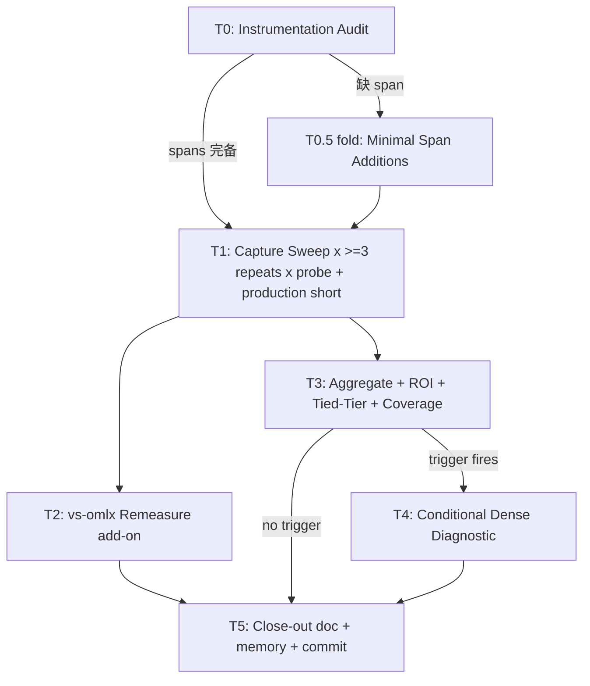

# P5i.c Phase 0 — Gap Decomposition: Design

**Status:** Ready for implementation-plan drafting after Codex review. NOT yet committed (per `[feedback_review_spec_before_commit]`).
**Date:** 2026-05-24.
**Branch:** `ironmlx-p5h+2-a-pp512-measurement` HEAD `6a593c4` (carries P5i.a T1+T2 + P5h+2.a closure).
**Predecessor close-outs:** `docs/p5i-a-close-out.md` (P5i.a Feasibility PASS) + P5h+2.a protocol commits `89ff3af` + `6a593c4`.
**Codex review input:** `reports/p5i-c-codex-review-questions.md` (gitignored; § 7 documents decisions).

---

## § 1 Background + motivation

P5i.a closed Feasibility PASS with PP=128 +6.9% canonical (T1+T2 landed) and PP=512 noise-bound result. T3 self-quant gather kernel deferred (`暂缓`), T4 Outcome C — current short-PP gap to omlx+10% target remains -17.1pp at PP=128 and noise-bound at PP=512.

Per Codex round-2 review (`reports/p5i-a-results-codex-review.md` § 7), P5i.c's next step is **gap decomposition**, NOT immediate single-module attack:

> Don't single-bet a module; do gap decomposition FIRST. First-round task: re-rank scheduler/chunking + KV cache layout + attention/fused_sdpa + MoE gather_qmm residual on the SAME current-HEAD profile to refresh post-P5i.a attribution priorities.

P5h+2.a (closed 2026-05-24) delivered the PP=512 measurement protocol fix needed to make ranking statistically reliable (RUNS=15 + monolithic 300s preheat + per-PP CI95 + envelope ≤ ±2%).

P5i.c Phase 0 = measurement-only re-ranking under the new protocol. Output drives P5i.c Phase 1 (separate spec/plan) candidate selection.

## § 2 Goals + non-goals

### Goals

1. Produce a refreshed short-PP candidate ranking on current HEAD `6a593c4` for PP=128 + PP=512 with statistically reliable CI95 per substep share.
2. Explicitly cover 4 candidate categories: scheduler/chunking, KV cache layout, attention/fused_sdpa, MoE gather_qmm residual (per Codex round-2).
3. Detect tied-tier candidates (CI overlap) and surface them honestly instead of forcing top-1.
4. Provide default Phase 1 selection rules + identify which rule the current ranking triggers.
5. Re-measure vs-omlx delta under the new P5h+2.a protocol so Phase 1 has a clean external-target baseline.

### Non-goals

1. **NOT optimizing source code in Phase 0** — no `perf` commits, no Phase 1 candidate landing. Phase 0 is measurement-only.
2. **NOT expanding to all 6 PPs** (Codex emphasized point #1) — PP ≥ 2048 stays in P5j scope; Phase 0 close gate does NOT include PP=2048+. PP=2048 may serve as a non-gate sentinel post-Phase 0 if scope expansion later needed.
3. **NOT writing the Phase 1 spec** — Phase 1 brainstorm + spec + plan happen after Boss decides Phase 1 form based on Phase 0 output.
4. **NOT discarding P5h+1 ranking infrastructure** — Phase 0 reuses the validated span schema, aggregator concepts, ROI ranking logic, and bootstrap helpers. It does **not** directly reuse the old `p5h_t5_attribution_capture` executable as-is because that harness is intentionally bound to P5h T5's six-PP/RUNS=7/probe-only workflow; Phase 0 adds a dedicated configurable capture harness and multi-repeat wrappers (§ 4.2).

## § 3 Scope hard constraints (Codex emphasized)

Three constraints MUST be enforced in plan + implementation. Codex called these out explicitly in the round-3 review:

### § 3.1 Do NOT expand to all 6 PPs

P5i.c Phase 0 close gate is **PP=128 + PP=512 ONLY**. Adding PP=2048+ would conflate Phase 0 (short-PP P5i.c decision precondition) with P5j (long-PP scope). PP=2048+ re-rank, if needed, happens in a separate P5j-prep task.

### § 3.2 scheduler/KV cache MUST have real comparable spans

If scheduler/chunking or KV cache layout categories lack comparable spans in current `core/p5h.rs` schema, Phase 0 MUST add minimal instrumentation BEFORE re-rank capture when one representative span is sufficient. Indirect proxies via existing top-6 spans are NOT equivalent to measured spans. Categories that remain unmeasured or proxy-only after audit MUST be marked explicitly in output — Phase 0 MUST NOT pretend comparison was made.

`proxy-only` may appear in the coverage table as a limitation, but it is not enough to nominate that category as a Phase 1 top-tier attack by itself. If a proxy-only category lands in the apparent top tier, Phase 0 output must recommend a proxy-refinement decision before Phase 1 candidate selection.

### § 3.3 Ranking output allows tied tier

When rank-i CI95 high boundary ≥ rank-j CI95 low boundary, both go into the same tier. Ranking output uses bracketed notation `[rank-1.tier1: candidateA, candidateB]` rather than forcing arbitrary tie-breaking. Phase 1 selection rules handle tied tiers explicitly (§ 9).

## § 4 Architecture



T2 sequenced after T1 ends (not parallel; serial-perf-experiments constraint per `[feedback_serial_perf_experiments]`). T2 runs OMLX-only spawn so it does not need to wait on T3's ironmlx aggregation; placing it after T1 in the diagram avoids GPU contention with ironmlx capture.

### § 4.1 Reused foundations

- Span schema constants: `ironmlx/src/core/p5h.rs` (Lane A strict helpers + Lane B `LANE_B_ALLOWED_TRY_SPAN_NAMES` 38 names)
- Server CLI flag: `--p5h-measurement-eval-probes` (already in `ironmlx serve` per P5h+1 commit `d57fbfb`)
- Generic aggregator base: `tools/p5h_aggregator/aggregator.py` (per-PP per-span medians from a single attribution CSV)
- Schema validator: `tools/p5h_aggregator/schema_validator.py`
- ROI ranking base: `tools/p5h_aggregator/roi_ranking.py` (rank_top3_bottlenecks + 4-tier verdict)
- Bootstrap CI: `tools/p5h_2a_se_analysis.py::bootstrap_median_ci`
- Test helper module pattern: `ironmlx/tests/p5h_common/mod.rs` (importable; const-based RUNS/WARMUP/cooldown)

### § 4.2 Extended / new components

Codex round-3 P1 findings flagged that current tools cannot satisfy Phase 0 requirements as-is. The following extensions / new files are REQUIRED — Phase 0 design cannot just say "reuse P5h+1 harness":

#### § 4.2.1 New: P5i.c-dedicated capture harness `ironmlx/tests/p5i_c_phase_0_capture.rs`

`p5h_t5_attribution_capture.rs` hardcodes 6-PP list + `RUNS=7` (via `p5h_common::RUNS`) + the legacy `PREHEAT_RUNS=3` helper preheat + server always launched with `--p5h-measurement-eval-probes`. None of those match Phase 0 requirements (PP=128+512 only, PP=512 RUNS=15, monolithic 300s preheat, probe AND production modes, ≥3 repeats per cell). Do NOT mutate `p5h_t5_attribution_capture.rs` — it is the validated P5h T5 baseline; Phase 0 needs its own harness.

New harness contract:
- env-var or test-arg driven: `P5I_C_PP_LIST` (default `128,512`), `P5I_C_RUNS_PER_PP` (default `128:7,512:15`), `P5I_C_PREHEAT_SECONDS` (default `300`), `P5I_C_REPEAT_INDEX` (1/2/3), `P5I_C_MODE` (`probe` | `production`), `P5I_C_MODEL` (default `qwen3.5-moe`), `P5I_C_MODEL_DIR` (default `IRONMLX_MOE_MODEL_DIR`)
- mode=probe: spawn ironmlx with `--p5h-measurement-eval-probes`; capture server tracing stderr + iron-bench CSV (warmup=0 + `--capture-server-request-id` per P5h T5 pattern)
- mode=production: spawn ironmlx WITHOUT `--p5h-measurement-eval-probes`; capture server tracing stderr (root span only is sufficient) + iron-bench CSV (warmup=1 acceptable; no request-id join needed because production-mode capture is for root_us + pp_tps denominator only, not substep attribution)
- output: `/tmp/p5i-c-phase-0-r${REPEAT}-pp${PP}-${MODE}/{server.log,bench.csv}` per cell
- preheat: monolithic via new helper `p5i_c_phase_0_preheat(port, seconds)` invoking iron-bench `--runs N --warmup 0` where N is empirically chosen to reach `seconds` wall (M5 Max calibration: N=1100 ≈ 395s)

May extract a thin helper module `ironmlx/tests/p5i_c_common/mod.rs` (mirroring `p5h_common` pattern) OR inline if the harness fits in one file ≤ 400 LOC. Implementer's call.

#### § 4.2.2 New: multi-repeat attribution aggregator wrapper

`tools/p5h_aggregator/aggregator.py` ingests ONE attribution CSV per invocation and produces per-PP medians on that single capture. It does not know about repeats. Phase 0 needs per-substep bootstrap CI across ≥3 repeats — requires a new wrapper.

New: `tools/p5h_aggregator/multi_repeat.py` (or extension within `aggregator.py`):
- function `aggregate_multi_repeat(repeat_csvs: list[Path], probe_or_production: str) -> dict[int, MultiRepeatAggregate]`
- delegates per-repeat work to existing `aggregator.py` then collects per-substep medians across repeats → bootstrap_median_ci per substep
- emits per-substep `{median_pct, ci95_low_pct, ci95_high_pct, between_sweep_half_range_pct}` for downstream tied-tier detection

#### § 4.2.3 New: multi-repeat pp_tps envelope wrapper

`tools/p5i_a_baseline_aggregate.py` accepts ONE ironmlx CSV + ONE omlx CSV with strict per-PP row count from `EXPECTED_RUNS_PER_PP` dict. It cannot ingest 3 repeats and emit between-sweep envelope; that capability belongs in a different wrapper.

New: `tools/p5i_c_pp_tps_envelope.py`:
- function `compute_pp_tps_envelope(repeat_csvs: list[Path], pp_set: list[int]) -> dict[int, PpTpsEnvelope]`
- function `compute_vs_omlx_delta(ironmlx_repeat_csvs: list[Path], omlx_repeat_csvs: list[Path], pp_set: list[int]) -> dict[int, DeltaEnvelope]`
- per repeat: extract per-PP pp_tps median (median over RUNS within sweep) — reuses bootstrap_median_ci on within-sweep distribution for within CI
- across repeats: compute between-sweep half-range = (max_repeat_median - min_repeat_median) / mean_repeat_median × 100 / 2
- emits `{within_sweep_ci95_max_pct, between_sweep_half_range_pct, final_envelope_pct = MAX(within, between)}` per PP (per P5h+2.a binding), plus ironmlx-vs-omlx `{delta_pct_median, delta_ci95_low_pct, delta_ci95_high_pct}` when both sides are provided

`tools/p5i_a_baseline_aggregate.py` stays unchanged; serves the prior single-sweep canonical use case.

#### § 4.2.4 Extended: ROI ranking + tied-tier detector

`tools/p5h_aggregator/roi_ranking.py` extensions:

- **Tied-tier detector** (NEW function): `identify_tied_tiers(ranking: list[Candidate], ci95_by_name: dict[str, tuple[float, float]]) -> list[list[str]]`. Greedy left-to-right merge per § 8. (CI95 inputs from § 4.2.2 wrapper above.)
- **4-category coverage status emitter** (NEW function): `emit_category_coverage(audit_result: dict, ranking: list[Candidate]) -> dict[str, Literal["measured", "unmeasured", "proxy-only"]]`
- **Default Phase 1 selection rule renderer** (NEW function): `emit_phase_1_default_rule(ranking_per_pp: dict[int, list[Candidate]], tiers_per_pp: dict[int, list[list[str]]], coverage: dict) -> dict` returning `{triggered_rule: "R1"|"R2"|"R3"|"mixed", suggested_phase_1_candidates: list[str], rationale: str}`
- **Production root denominator awareness** (NEW): `roi_ranking.py` accepts an optional `production_root_us_by_pp: dict[int, float]` arg; when provided, augments output with `production_share_pct` per substep (separate from probe-mode `probe_share_pct`). Per spec § 6.5 (P5h+1 binding) production_root_us is the denominator for target-feasibility math; probe-mode root is only used for substep relative ranking. If production root data is missing, the verdict MUST be `data_insufficient_for_production_share`, not silently fall back to probe root.

#### § 4.2.5 Conditional: minimal Lane A span additions in T0.5

T0.5 only fires if T0 audit finds an `unmeasured` category, or a `proxy-only` category that can be upgraded to `measured` with one representative span. Phase 0 measurement runs in Lane A (PP=128+512 both Lane A per § 6); Lane A uses the **strict span helper** (`open_p5h_span_at` / `close_p5h_span`), which accepts arbitrary span names unconditionally — there is no Lane A allow-list. So scheduler/KV cache spans, if added, are added as strict-helper call sites in the relevant Rust source file (e.g., `core/scheduler.rs` for scheduler spans, model cache files for KV cache layout spans).

`LANE_B_ALLOWED_TRY_SPAN_NAMES` is NOT extended in Phase 0 — that list gates the try-helper used inside `gs_chunk_N` (Lane B), and Phase 0 PPs do not exercise Lane B at all. Touching it would be off-scope.

What IS extended in T0.5 if needed:
- the Rust source file owning the new span call site (insert `open_p5h_span_at` / `close_p5h_span` around the spanned region)
- `tools/p5h_aggregator/schema_validator.py::LANE_A_REQUIRED_TREE` (NOT `LANE_B_*`) only if the new span must be present on every non-aborted Lane A target request. Lane A currently has no closed tree allow-list; do not add optional spans to required presence checks.
- `tools/p5h_aggregator/roi_ranking.py::KERNEL_BOUND_SPANS` if the new span represents a kernel-rewrite candidate
- cross-language allow-list pytest (if such a pytest exists for Lane A; currently only Lane B has it per P5h+1 T2 work — Phase 0 implementer verifies and adds Lane A pytest if missing)

## § 5 Tasks (6 tasks; respects `[feedback_task_breakdown_bounded]` ≤ 7)

### § 5.1 T0 — Instrumentation audit (~30 min; no GPU)

**Goal**: enumerate 4 candidate categories → existing span names + coverage status.

**Files to read**:
- `ironmlx/src/core/p5h.rs` Lane A strict helper semantics + Lane B `LANE_B_ALLOWED_TRY_SPAN_NAMES` (to avoid touching the wrong lane)
- `tools/p5h_aggregator/schema_validator.py::LANE_A_REQUIRED_TREE` and `LANE_B_REQUIRED_TREE`
- `ironmlx/src/core/scheduler.rs` (scheduler spans)
- `ironmlx/src/models/qwen3_5_moe/*` (MoE + GDN spans)
- `ironmlx/src/models/cache.rs` or equivalent (KV cache spans)
- `docs/p5h+1-ranking-snapshot.md` (P5h+1 top-6 + their span names)

**Outputs**:
- `reports/p5i-c-phase-0-audit.md` (gitignored): table mapping each category to existing spans + `measured / unmeasured / proxy-only` status
- Decision: T0.5 fold-in needed if any category is `unmeasured`, or if a `proxy-only` category can be made directly measurable with one representative span. Skip-to-T1 only when every category is `measured`, OR when remaining `proxy-only` categories cannot be resolved within the one-span Phase 0 budget and are explicitly accepted as limitations barred from direct Phase 1 nomination without proxy refinement.

**`proxy-only` definition**: category has an enclosing span (e.g., scheduler admission or a coarse cache wrapper) that is too coarse to attribute internal cost, but exists. Proxy-only data may explain scale and uncertainty; it does not count as a comparable direct span for Phase 1 selection.

### § 5.2 T0.5 — Minimal span additions (conditional; fold into T0; ~1-2 hr if needed)

**Trigger**: any of 4 categories is `unmeasured` after T0 audit, or is `proxy-only` and can be upgraded to `measured` with one representative span.

**Scope**: add ONE span per missing category covering the smallest representative subspan; do NOT do full decomposition (that's Phase 1+ work).

**Files to modify (conditional)**:
- The Rust source file owning the new span call site
- `tools/p5h_aggregator/schema_validator.py::LANE_A_REQUIRED_TREE` only for mandatory-per-request Lane A spans
- `tools/p5h_aggregator/roi_ranking.py` category mapping / kernel-bound span set if the new span should participate in P5i.c ranking
- `tools/p5h_aggregator/tests/test_*` (schema pytest; add Lane A fixture coverage if missing)

**Acceptance**:
- cross-language pytest passes
- smoke test `p5_qwen35_moe_smoke` pp_tps within ±2% feature-off vs feature-on flag-OFF (P5h+1 production-parity binding)
- Python tooling checks pass (`ruff check` + formatter/checks used by this repo)
- if Rust is modified, run the full repo-required Rust gate: `cargo fmt`; `cargo +nightly fmt --all -- --check`; `cargo +nightly clippy --all-features --workspace -- -D warnings`; `cargo build --release`

**No-go**: if any category needs >1 new span to be meaningful → escalate to Boss before adding more; Phase 0 stays minimal.

### § 5.3 T1 — Capture sweep PP=128 + PP=512 × ≥3 repeats × probe + production (~2 hr GPU; serial spawn)

**Per spec § 5 measurement protocol** (P5h+2.a calibration):
- preheat: monolithic `cargo run --release -p iron-bench -- --prompt-len 512 --runs 1100 --warmup 0` ≈ 395s wall on M5 Max (or empirically calibrated for other hardware)
- RUNS=15 per sweep at PP=512; RUNS=7 at PP=128 (P5i.a T0 canonical for PP=128 unchanged)
- ≥3 independent ironmlx spawn+sweep repeats per (PP, mode) cell
- 4 cells per repeat: (PP=128, probe), (PP=128, production), (PP=512, probe), (PP=512, production)
- Total: 3 repeats × 4 cells = 12 sweeps; serial; ~2 hr wall

**Per-cell capture**:
- probe mode: spawn ironmlx with `--p5h-measurement-eval-probes` ON; capture tracing JSON + iron-bench CSV
- production mode: spawn ironmlx with flag OFF (default); capture iron-bench CSV **and server root-span trace/log** so `production_root_us` is directly measured. CSV-only production sweeps are insufficient for `production_root_us`; they only provide `pp_tps`.

**Outputs**:
- `/tmp/p5i-c-phase-0-r{1,2,3}-pp{128,512}-{probe,production}/` containing bench CSV + server trace/log artifacts per cell
- bench log `reports/p5i-c-phase-0-bench-log.md` (gitignored) per-cell wall + pp_tps median + preheat verification

**Verification per cell**:
- preheat_wall ≥ 300s
- CSV row count matches expected (7 for PP=128 RUNS=7; 15 for PP=512 RUNS=15)
- tracing JSON parses + coverage_pct ≥ 95% (P5h+1 Close Gate #3)

### § 5.4 T2 — vs-omlx remeasure add-on (~30 min GPU; serial; per Q9=B)

**Goal**: re-measure omlx PP=128 + PP=512 under P5h+2.a protocol to upgrade scope (i) → (ii). NOT blocking T3 ranking close — runs after T1 to respect serial GPU experiment discipline, while CPU-only T3 aggregation can proceed independently once T1 artifacts exist.

**Protocol** (same as T1 + per `[feedback_omlx_cli_default]`):
- omlx CLI from `/Users/xin/workspace/iron-rivals/omlx` source
- preheat: monolithic ≥300s
- RUNS=7 at PP=128; RUNS=15 at PP=512
- ≥3 independent omlx spawn+sweep repeats per PP
- Total: 3 repeats × 2 PPs = 6 sweeps; serial

**Outputs**:
- `/tmp/p5i-c-phase-0-omlx-r{1,2,3}-pp{128,512}/` CSVs
- per-PP omlx median + within-sweep CI95 + between-sweep envelope emitted via `tools/p5i_c_pp_tps_envelope.py`
- ironmlx-vs-omlx delta per PP + CI95 (delta = (ironmlx_median / omlx_median - 1) × 100%)

**Acceptance**: omlx final pp_tps envelope ≤ ±2% per PP (P5h+2.a binding); if PP=512 omlx envelope > 2%, document in bench log as caveat — do NOT block close-out.

### § 5.5 T3 — Aggregate + ROI ranking + tied-tier + 4-category coverage (~30 min; no GPU)

**Inputs**: T1 captured artifacts (12 cells) + T0 audit + T2 vs-omlx CI.

**Step 3a — per-cell aggregation**: run `tools/p5h_aggregator/aggregator.py` per cell (12 invocations). Produces per-cell per-substep `exclusive_us` + `coverage_pct` + 4-tier `FeasibilityVerdict`.

**Step 3b — per-PP bootstrap CI95 across 3 repeats per substep share**:
- For each (PP, mode, substep) tuple: collect 3 repeat medians via `tools/p5h_aggregator/multi_repeat.py` → bootstrap 1000 iterations with `bootstrap_median_ci` (seed=42) → per-substep CI95 low/high/half-width.
- Across modes: compute `probe_share_pct = probe_exclusive_us / probe_root_us` and `production_share_pct = probe_exclusive_us / production_root_us` (P5h+1 § 6.5 denominator discipline). Production mode is not expected to emit probe substeps; it supplies the denominator.

**Step 3c — ROI ranking**: run `tools/p5h_aggregator/roi_ranking.py` per PP using probe-mode per-substep medians + production root denominator. If `production_root_us_by_pp` is missing for any target PP, stop with `data_insufficient_for_production_share`.

**Step 3d — tied-tier detection** (NEW; § 4.2 component): rank-i + rank-j CI95 overlap → same tier; emit tier-aware ranking like `[rank-1.tier1: gather_qmm_gate_up; rank-1.tier1: gather_qmm_down] [rank-2.tier2: gda_step_1a_in_proj_qkvz] ...`

**Step 3e — 4-category coverage** (NEW): given T0 audit + ranking, emit `{scheduler: ..., kv_cache: ..., attention: ..., moe: ...}` status with each `measured / unmeasured / proxy-only`. If any `unmeasured`, surface in Phase 0 close-out as known limitation.

**Step 3f — Phase 1 default rule trigger** (NEW): given ranking + tied-tier + coverage, evaluate which of § 9 default rules fires + emit suggested Phase 1 candidate set.

**Step 3g — Dense diagnostic trigger evaluation** (NEW; § 10): set `dense_diagnostic_triggered: bool` + reason in output JSON.

**Outputs**:
- `/tmp/p5i-c-phase-0-ranking.json` (full structured output)
- `reports/p5i-c-phase-0-ranking-summary.md` (gitignored; human-readable preview)

### § 5.6 T4 — Conditional Dense diagnostic (~0 or ~45 min GPU)

**Trigger** (per § 10): execute only if T3 output flags `dense_diagnostic_triggered: true`.

**Goal**: distinguish MoE-specific gap vs pipeline-wide gap by running same sweep against Dense Qwen variant.

**Scope IF triggered**:
- Dense Qwen model: T4 implementer enumerates `~/.ironmlx/models` (HF cache layout `models--<org>--<name>/snapshots/<sha>/`) for an available 4-bit Dense Qwen3 variant. If none available, T4 escalates to Boss before downloading — does NOT silently fetch. If multiple available, prefer the smallest Dense variant matching the MoE model size class for fair comparison.
- Same protocol as T1: PP=128 + PP=512 × ≥3 repeats × probe + production, using `P5I_C_MODEL` + `P5I_C_MODEL_DIR` override so the same harness can target the selected Dense model without changing MoE defaults
- ~45 min GPU additional wall

**Output (if triggered)**:
- `/tmp/p5i-c-phase-0-dense-r{1,2,3}-pp{128,512}-{probe,production}/` artifacts
- Dense-vs-MoE per-substep share comparison appended to `/tmp/p5i-c-phase-0-ranking.json`

### § 5.7 T5 — Close-out doc + memory + commit (~30 min)

**Files to create/modify**:
- `docs/p5i-c-phase-0-ranking-snapshot.md` (NEW; will be committed)
- `docs/p5i-c-phase-0-close-out.md` (NEW; will be committed; per `[feedback_no_empty_commits]` close-out doc pattern)
- `/Users/xin/.claude/projects/-Users-xin-workspace-ironmlx-backend/memory/project_p5i_c_phase_0_findings.md` (NEW; outside repo)
- `/Users/xin/.claude/projects/-Users-xin-workspace-ironmlx-backend/memory/MEMORY.md` (modified to add new entry)

**Commit**: single English commit message attaching ranking snapshot + close-out doc, per `[feedback_commit_message_english]` + `[feedback_no_empty_commits]`.

**Ranking snapshot doc contents** (mandatory sections):
- Per-PP top-N candidates with CI95 + tier label
- 4-category coverage status table
- Phase 1 default rule trigger + suggested candidate set
- Tied-tier explicit callouts
- vs-omlx delta + CI95 (scope (ii) clean baseline)
- (if T4 triggered) Dense-vs-MoE comparison
- Boss decision deferred sections: which Phase 1 shape to dispatch (single vs split)

## § 6 Measurement protocol

Inherits P5h+2.a binding (per `[project_p5h_2a_findings]`):

- **preheat**: MONOLITHIC `iron-bench --runs 1100 --warmup 0` ≈ 395s wall on M5 Max (calibrate empirically per hardware)
- **RUNS**: PP=128 RUNS=7; PP=512 RUNS=15
- **repeats**: ≥3 independent spawn+sweep per cell
- **cooldown**: ~3s inter-PP (iron-bench default)
- **warmup**: `--warmup 1` (incompatible with `--capture-server-request-id`; not used in T1 probe-mode capture which needs server request_id join → see exception below)

**Capture mode exception**: probe-mode capture uses `--capture-server-request-id` to join iron-bench CSV ↔ server tracing. This requires `--warmup 0`. The new P5i.c capture harness therefore uses warmup=0 in probe mode only. Production-mode sweeps use `--warmup 1` and capture server root trace/log separately; no request-id join is needed because production mode supplies `production_root_us` + `pp_tps`, not substep attribution. Both protocols accept this; the warmup-0 vs warmup-1 difference is amortized by ≥3 repeats + 300s monolithic preheat.

**Lane partition** (per `[project_p5h_t1_findings]` chat-template = 12 tokens binding):
- PP=128: server `prompt_tokens` = 140 < `prefill_chunk_size`=2048 → Lane A
- PP=512: server `prompt_tokens` = 524 < 2048 → Lane A

Both target PPs are Lane A. Lane B `gs_chunk_N` wrapper guard and `LANE_B_ALLOWED_TRY_SPAN_NAMES` do NOT apply to Phase 0 close gate. Phase 0 emits Lane A strict-helper substeps; any T0.5 span addition must target Lane A call sites and validation, not Lane B allow-listing.

## § 7 Acceptance criteria (acc-1 enhanced per Codex Q6)

Phase 0 close requires ALL of:

1. **Coverage**: `coverage_pct ≥ 0.95` per PP per repeat (P5h+1 Close Gate #3 replicated; binding spec § 7.2 #1).
2. **Wrapper non-dominance**: `first_token_sampling_materialize_and_sample` NOT in top-5 of any (PP, mode) cell (P5h+1 Close Gate #1 replicated).
3. **Verdict**: verdict is not in the `data_insufficient*` family for both PPs (P5h+1 Close Gate #4 replicated + production denominator extension).
4. **pp_tps repeatability** (P5h+2.a binding): final pp_tps envelope ≤ ±2% per target PP for ironmlx production sweeps, using `tools/p5i_c_pp_tps_envelope.py`. If PP=512 omlx envelope exceeds ±2%, record as external-baseline caveat per criterion #8.
5. **Substep uncertainty surfaced, not over-gated**: top-N substeps per PP include CI95 + between-sweep half-range from `tools/p5h_aggregator/multi_repeat.py`. High substep variance does not by itself fail Phase 0; it must widen CI/tied tiers or yield `data_insufficient` only when the uncertainty prevents any actionable tier assignment.
6. **Category coverage status** (NEW per Codex): 4 categories each have explicit `measured / unmeasured / proxy-only` status in ranking output.
7. **Tied-tier honesty** (NEW per Codex): output ranks emit `[rank-i.tierK: candidateA, candidateB]` when CI95 overlaps; no fabricated top-1.
8. **vs-omlx baseline**: T2 add-on completes with omlx final pp_tps envelope ≤ ±2% per PP OR documented caveat for PP=512.

**Optional NICE-to-have** (does NOT block close):
- Dense diagnostic if triggered per § 10
- Boss explicit Phase 1 shape decision (deferred to post-Phase-0 brainstorm)

## § 8 Tied-tier detection methodology

Algorithm (`tools/p5h_aggregator/roi_ranking.py` extension):

```
INPUT:
  ranking: list[(name, median_share)]  # sorted desc by median
  ci95: dict[name -> (low, high)]
OUTPUT:
  tiers: list[list[name]]  # tier-i is a list of candidate names

ALGORITHM:
  current_tier = [ranking[0].name]
  tiers = [current_tier]
  for i in 1..len(ranking):
    prev = ranking[i-1].name
    curr = ranking[i].name
    if ci95[prev].low <= ci95[curr].high:
      # CI95 of prev overlaps with curr → same tier
      current_tier.append(curr)
    else:
      current_tier = [curr]
      tiers.append(current_tier)
  return tiers
```

**Note**: this is an adjacent-overlap chain algorithm. If A overlaps B and B overlaps C, all three are kept in the same conservative tier even if A and C do not directly overlap. This intentionally avoids false precision in Phase 0; Phase 1 selection can still narrow a tied tier by ROI/risk/Boss decision (§ 9).

**Output format** in ranking snapshot doc:

```
PP=128 ranking:
  tier-1: [gather_qmm_gate_up (22.4%, ±3.1%), gather_qmm_down (20.1%, ±3.5%)]
  tier-2: [gda_step_1a_in_proj_qkvz (14.7%, ±2.0%)]
  tier-3: [fused_sdpa (8.2%, ±1.5%), gda_step_8_norm_proj (7.9%, ±1.8%)]
  ...
```

## § 9 Phase 1 default selection rules (Q7=D+)

Phase 0 output ALWAYS renders these 3 rules + which one current ranking triggers:

| Rule | Condition | Phase 1 default shape |
|---|---|---|
| **R1** | Cross-PP top-tier same candidate(s) AND tier is single-candidate | Single Phase 1 (e.g., P5i.c.1) attacks top-tier candidate at both PPs |
| **R2** | PP=128 tier-1 ≠ PP=512 tier-1 AND each tier-1 contains a single candidate (§ 8 algorithm did not merge with rank-2 → CI95 separation already verified) | Split Phase 1a (PP=128 target) + Phase 1b (PP=512 target); may run parallel if candidates non-conflicting |
| **R3** | Top-tier has multiple candidates (tied tier) | Rank tied candidates by composite (ROI estimate × success probability / risk); Boss picks 1-N for Phase 1; partial-tier coverage acceptable |

**Phase 0 output emits**:
- Triggered rule label (R1 / R2 / R3 / mixed)
- Suggested Phase 1 candidate set (data-driven; Boss may override)
- Explicit "Boss decision required" tag

**Boss decision authority**: Boss may override the default rule; Phase 0 only proposes. Boss decision happens AFTER Phase 0 close-out via separate brainstorm.

## § 10 Conditional Dense diagnostic trigger (Q8=C)

T4 executes IFF at least one fires:

| Trigger | Condition |
|---|---|
| **trigger-A** | Tier-1 contains a NON-MoE candidate (scheduler/KV/attention) AND tier-1 share ≥ 15% (meaningful magnitude) |
| **trigger-B** | Tier-1 contains BOTH MoE candidate AND non-MoE candidate (mixed tied tier) AND the choice between them materially affects Phase 1 shape |

**trigger-A magnitude threshold 15%**: derived from P5h+1 ranking — `gather_qmm_gate_up` 20-25% is current top; a non-MoE candidate displacing or rivaling it at ≥15% would be a notable finding deserving Dense vs MoE diagnostic.

**trigger-B "materially affects"**: defined as MoE candidate vs non-MoE candidate ROI estimates differ by ≥ 5pp OR risk profiles differ qualitatively (e.g., kernel-rewrite vs scheduler-refactor).

If neither trigger fires → SKIP T4. T3 output explicitly emits `dense_diagnostic_triggered: false` + reason.

## § 11 vs-omlx remeasure add-on (Q9=B)

Per § 5.4 T2.

**Why folded into Phase 0**: Phase 1 will need a clean vs-omlx delta for acceptance; deferring to a separate P5h+2.b task would block Phase 1 dispatch by ~30-60 min wall + bookkeeping overhead.

**Why not blocking ranking**: T3 ROI ranking is internal ironmlx attribution; does NOT depend on omlx number. T2 runs after T1 for GPU serialization, but T3's CPU-only aggregation can proceed as soon as T1 artifacts exist.

**Scope upgrade**: closes P5h+2.a scope (i) → scope (ii). Documented in T5 close-out + `[project_p5h_2a_findings]` memory update.

## § 12 Risks + mitigations

| Risk | Mitigation |
|---|---|
| scheduler/KV span addition triggers schema pytest failure | T0.5 synchronously updates Rust call site + Lane A required-presence schema only when the span is mandatory; Lane B allow-list is off-scope for PP=128/512; rejects merge if pytest fails |
| T1 wall > 2 hr forecast on M5 Max | Monitor wall per cell; if any cell repeats > 30 min, escalate to Boss before next cell (do NOT continue silently) |
| Dense diagnostic trigger judgment ambiguous | § 10 specifies hard numeric thresholds (15% magnitude + 5pp ROI diff); no judgment call needed |
| vs-omlx PP=512 noise ≥ ±2% even under P5h+2.a protocol | P5h+2.a T1 validated RUNS=15 envelope 1.94% on ironmlx; omlx may differ. If omlx envelope > 2%, document as Phase 0 caveat — does NOT block close-out; Phase 1 acceptance criteria handles this as known unknown |
| Ranking CI95 dominated by between-sweep variance (not within-sweep) | Phase 0 spec emits BOTH per-sweep within bootstrap CI AND between-sweep half-range; aggregator surfaces which is larger; output annotation clarifies |
| Codex round-3 (this spec) review finds spec gap | Per `[feedback_review_spec_before_commit]`: spec NOT committed yet; Boss → Codex → controller iterate → only then commit |
| T0 audit finds 2+ unmeasured categories | T0.5 fold scales linearly but stays ≤ 1 span per category; if any category needs >1 span → escalate to Boss before adding |

## § 13 References

- Codex review input: `reports/p5i-c-codex-review-questions.md` § 7 (gitignored)
- P5h+2.a protocol: `docs/p5h+2-a-pp512-protocol.md`
- P5h+2.a closure memory: `[project_p5h_2a_findings]`
- P5h+1 close-out + ranking: `docs/p5h+1-close-out.md` + `docs/p5h+1-ranking-snapshot.md` + `reports/p5h+1-ranking-snapshot.md` (gitignored full)
- P5h+1 spec/plan: `docs/superpowers/specs/2026-05-23-ironmlx-p5h+1-attribution-gap-closure-design.md` + matching plan
- P5i.a close-out: `docs/p5i-a-close-out.md`
- P5i.a results review: `reports/p5i-a-results-codex-review.md` § 7+§ 8 (gitignored; Codex round-2 P5i.c shape decisions)
- P5h close-out: `docs/p5h-t5-close-out.md`
- Memory keys:
  - `[project_p5h_findings]` — P5h overall + P5h+1 + P5i.a closure sections
  - `[project_p5h_2a_findings]` — P5h+2.a protocol fix + M5 Max calibration + scope (i)
  - `[project_p5h_t0b_findings]` — H1 thermal + H4 small-PP kernel-bound bindings
  - `[project_p5h_t1_findings]` — chat-template overhead 12 tokens (Qwen3 ChatML); Lane A/B boundary
  - `[project_p5h_t2_findings]` — GatedAttention 7-substep
  - `[project_p5h_t3_findings]` — MoE 8-substep
  - `[project_p5h_t4_findings]` — lm_head + cache + first_eval + mlx_eval_barrier INERT
  - `[project_p5g_findings]` — in_proj_qkvz op-level saturated
  - `[project_cross_device_tuning_deferred]` — M5 Max tile params not tuned
  - `[feedback_iron_bench_priority]` — iron-bench canonical perf tool
  - `[feedback_serial_perf_experiments]` — GPU experiments serial
  - `[feedback_omlx_cli_default]` — omlx source CLI
  - `[feedback_review_spec_before_commit]` — spec/plan docs reviewed before commit
  - `[feedback_no_empty_commits]` — close-out commits attach files
  - `[feedback_no_reports_commit]` — reports/ gitignored
  - `[feedback_commit_message_english]` — git commit subjects + bodies English
  - `[feedback_task_breakdown_bounded]` — single plan ≤ 7 tasks
  - `[feedback_self_review_before_handoff]` — 6-check before handoff
- Reusable Rust foundations: `ironmlx/src/core/p5h.rs` (Lane A strict helpers; Lane B `LANE_B_ALLOWED_TRY_SPAN_NAMES` 38 names; `--p5h-measurement-eval-probes` global atomic; `P5hChunkContextGuard` RAII)
- Reusable Python foundations: `tools/p5h_aggregator/{aggregator,schema_validator,roi_ranking}.py` + `tools/p5h_2a_se_analysis.py::bootstrap_median_ci`; `tools/p5i_a_baseline_aggregate.py` remains a prior single-sweep reference, not the Phase 0 multi-repeat envelope tool
- Existing capture patterns: `ironmlx/tests/p5h_t5_attribution_capture.rs` + `ironmlx/tests/p5h_common/mod.rs`; Phase 0 requires new `ironmlx/tests/p5i_c_phase_0_capture.rs`
