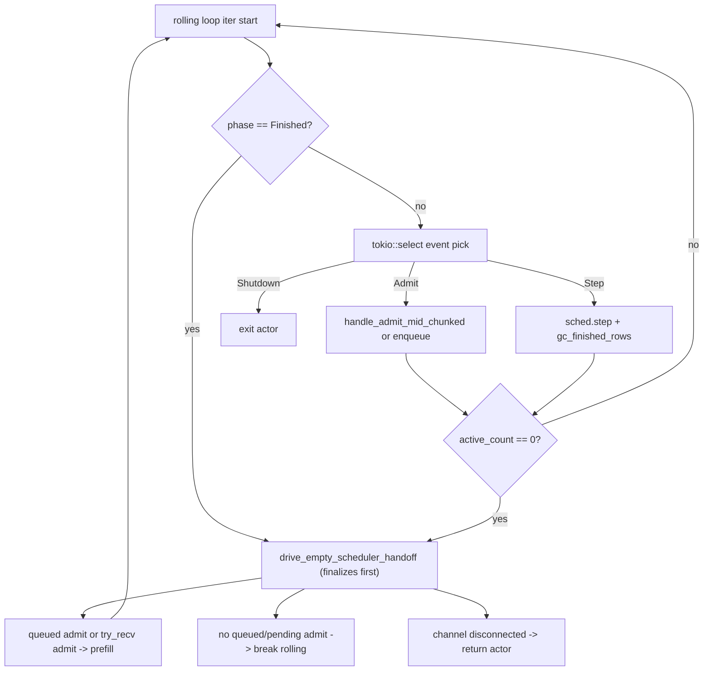

# P5h+2.c — Scheduler Finished-phase ERROR Fix: Design

**Status:** Draft for Codex review. NOT yet committed (per `[feedback-review-spec-before-commit]`).
**Date:** 2026-05-25.
**Branch:** `ironmlx-p5h+2-c-scheduler-finished-fix` HEAD `cecbb42` (forked from `ironmlx-p5h+2-a-pp512-measurement` after P5h+2.b T5F close).
**Predecessor close-out:** `docs/p5h+2-b-close-out.md` (P5h+2.b FAIL/DEFERRED — root cause identified as scheduler-actor `Finished`-phase ERROR cycle).
**Codex review input:** `reports/p5h-scheduler-bug-fix-codex-review.md` § 9 (gitignored; design decision).

---

## § 1 Background + motivation

P5h+2.b T5F close documented root cause: per-cell server.log emits 1116 ERROR lines of `[SchedulerActor] step error: step illegal in Finished phase: call prefill_admitted first` for `iron-bench --max-tokens 1` workloads. Count = exactly `1100 preheat + 1 warmup + 15 measured` requests per cell.

Trace (verified):
1. `prefill_admitted_inner` at `ironmlx/src/core/scheduler.rs:1241-1250` transitions `phase = Phase::Finished` when `any_unfinished == false` (which holds for every `max_tokens=1` request after prefill samples the first/last token).
2. `scheduler_actor.rs:337-352` rolling loop uses `tokio::select! { biased; ... ; _ = std::future::ready(()) => RollingEvent::Step }` — when cmd_rx empty, falls through to `RollingEvent::Step` without phase check.
3. `sched.step()` at `scheduler_actor.rs:386` invokes `step_inner` which raises `Err(step illegal in Finished phase ...)` at `scheduler.rs:1286-1290`.
4. Outer `step()` wrapper sets `poisoned = true` (`scheduler.rs:1279`). Actor catches, logs ERROR at `scheduler_actor.rs:405`, calls `sched.evict_all()` (which clears `poisoned`, resets `phase = Idle`), `continue 'outer`.
5. Cycle repeats per request.

**Effect**: per-request ERROR emission + scheduler poison/error recovery path adds non-deterministic overhead and pollutes acceptance logs. This likely contributes to the P5h+2.b envelope failure; the fix must land before treating the remaining PP=128/512 variance as a measurement-protocol or hardware/system issue.

**Why this matters now**: any P5x perf measurement using `iron-bench --max-tokens 1` (the standard prefill-only workload) hits this. Must be fixed before P5h+2.b re-attempt + before Phase 1 implementation acceptance is unblocked.

## § 2 Goals + non-goals

### Goals

1. Eliminate `[SchedulerActor] step error: step illegal in Finished phase ...` ERROR for `max_tokens=1` workloads (production scheduler-actor path).
2. Preserve `scheduler.rs` `step_inner` fail-fast guard at `scheduler.rs:1286` — `step(Phase::Finished)` MUST still return `Err`.
3. Add regression test ensuring future regressions on the bug surface are caught.
4. Add acceptance precondition guard to `tools/p5h_2b_protocol_experiment.py` driver — abort sweep + preserve artifacts if server.log contains scheduler phase-guard ERROR lines (Codex round-3 design question #3).
5. Unblock P5h+2.b re-attempt — re-running P5h+2.b T4 acceptance after this fix is OUT of scope here but enabled by this fix.

### Non-goals

1. **NOT changing `scheduler.rs` core semantics** — `step_inner` phase guard untouched (Codex Q1 explicit). No graceful empty Step on Finished. No `Phase::Finished` semantic redefinition.
2. **NOT changing `prefill_admitted_inner` post-condition** (Codex rejected Option D — blast radius too large).
3. **NOT re-running P5h+2.b T4 acceptance** — separate follow-up after this fix lands.
4. **NOT modifying iron-bench** — bug is server-side; iron-bench just exposes it via `--max-tokens 1`.
5. **NOT addressing other `step illegal in <Phase> phase` paths** — only `Finished` path triggered by `prefill_admitted` is in scope.

## § 3 Hard constraints (Codex Q6 + spec § 3.3 from P5h+2.b)

### § 3.1 Pre-event finalization (Codex Q6 critical risk)

`scheduler_actor.rs` rolling loop uses `tokio::select! { biased; ... }` — when batch is `Finished` AND a new admit cmd arrives, the biased select preferentially picks `RollingEvent::Admit` over `RollingEvent::Step`. If we only guard the Step branch (e.g. naive Option A), the actor could still call `admit_mid_begin()` while `phase == Finished`, triggering a different phase-guard error.

**Hard constraint**: Finished-batch finalization MUST happen BEFORE the rolling loop dispatches the next event (Step OR Admit). Pre-event finalization, NOT per-branch.

Finalization MUST NOT fall through directly to the always-ready Step branch. After `evict_all()` resets the scheduler to `Idle`, the actor must run the same empty-batch handoff logic used today for `active_count() == 0` (queued admits first, then `cmd_rx.try_recv()`, otherwise break to the outer blocking receive). Otherwise the fix would replace `step(Finished)` with `step(Idle)`.

### § 3.2 Three prefill paths must converge

Per Codex Q2: `prefill_admitted` is called from THREE actor sites — initial prefill after the admission window, queue-drain re-prefill at `scheduler_actor.rs:508`, and try_recv re-prefill at `scheduler_actor.rs:540+`. All three leave the scheduler in `Phase::Finished` for `max_tokens=1` workloads.

**Hard constraint**: extract a single helper that handles Finished finalization; invoke at rolling loop top so all three prefill sites benefit. NOT one-off per branch.

### § 3.3 Scheduler fail-fast preserved

`Scheduler::step(Phase::Finished)` MUST still return `Err`. Test must lock this semantic so future regressions on `scheduler.rs` are caught.

## § 4 Architecture



### § 4.1 Existing components

- `ironmlx/src/core/scheduler.rs` — Phase enum + step_inner phase guard + evict_all + prefill_admitted_inner: NO changes. Only test coverage added.
- `tools/p5h_2b_protocol_experiment.py` — extended with ERROR-count guard (acceptance precondition per Codex Q4 + round-3 question #3).
- `tools/p5h_2b_t0_outlier_source.py` + `tools/p5h_2b_thermal_overlay.py`: unchanged.
- `ironmlx/tests/p5i_c_phase_0_capture.rs`: unchanged.

### § 4.2 New / extended components

#### § 4.2.1 New helper: `finalize_finished_batch_if_any`

Location: `ironmlx/src/core/server/scheduler_actor.rs` (private fn).

Signature:
```rust
fn finalize_finished_batch_if_any<M: Model>(
    sched: &mut Scheduler<M>,
    event_txs: &mut HashMap<RequestId, mpsc::UnboundedSender<StepEvent>>,
) -> Result<bool>
```

Behavior:
- If `sched.phase() != Phase::Finished` → return `Ok(false)` (no-op)
- If `sched.phase() == Phase::Finished`:
  - Call `sched.evict_all()` (clears slots + releases budget + resets `phase = Idle` + clears `poisoned`)
  - On `evict_all` Err: log WARN, propagate Err (caller decides whether to `continue 'outer` or terminate actor based on context)
  - `event_txs.clear()` (close per-request event channels for completed requests)
  - Return `Ok(true)` (finalization happened)

Return value is behavioral: when it returns `Ok(true)`, caller MUST NOT continue to the normal event pick. Caller must immediately enter the empty-scheduler handoff path described in § 4.2.2.

Generic over `M: Model` because the helper only inspects phase and calls `evict_all`; callers already carry stronger bounds where prefill/step are needed.

#### § 4.2.2 New helper: `drive_empty_scheduler_handoff`

Location: `ironmlx/src/core/server/scheduler_actor.rs` (private fn or local closure if the signature becomes too noisy).

Purpose: extract the existing `if sched.active_count() == 0 { ... }` block so it can be reused from two places:
- after Finished-batch finalization at rolling-loop top
- after normal Step/GC or Admit handling leaves the scheduler empty

Return enum:
```rust
enum RollingControl {
    ContinueRolling,
    BreakRolling,
    ContinueOuter,
    ReturnActor,
}
```

Behavior:
1. First call `finalize_finished_batch_if_any(...)`. This is a no-op for `Idle`, and it resets `Finished` to `Idle` without creating a `step(Idle)` path.
2. If finalization returns Err, reject queued admits, clear `event_txs`, and return `ContinueOuter`.
3. Before starting any queued or freshly received batch, ensure the scheduler is `Idle`. If `sched.phase()` is still `Decoding` or `Finished` while `active_count() == 0`, apply the same reset semantics as the current empty-batch block; never call `handle_admit` + `prefill_admitted` from `Decoding`/`Finished`.
4. If `admission_queue` is non-empty, start the next batch from the queued head, drain additional queued/fresh admits using the existing logic, run `prefill_admitted`, then return `ContinueRolling`.
5. If queue is empty, call `cmd_rx.try_recv()` exactly as the current code does:
   - `Ok(cmd)` → start a fresh batch, drain window, run `prefill_admitted`, return `ContinueRolling`
   - `Empty` → return `BreakRolling`
   - `Disconnected` → clear `event_txs`, return `ReturnActor`

Important: this helper must not unconditionally call `evict_all()` when the scheduler is already `Idle`; `evict_all(Idle)` is itself an error. It must delegate phase reset to `finalize_finished_batch_if_any()` and otherwise preserve the current empty-batch transition behavior.

#### § 4.2.3 Rolling loop hook

Location: `ironmlx/src/core/server/scheduler_actor.rs:337` (top of `'rolling: loop`).

Modify:
```rust
'rolling: loop {
    // P5h+2.c: pre-event finalization. If previous iteration's
    // prefill_admitted/step left phase=Finished (e.g. max_tokens=1
    // workload), handle the completed batch before dispatching another
    // event. Per Codex Q6: biased select may pick Admit over Step, so
    // this must run before the event pick.
    if sched.phase() == Phase::Finished {
        match drive_empty_scheduler_handoff(/* existing state */) {
            RollingControl::ContinueRolling => continue 'rolling,
            RollingControl::BreakRolling => break 'rolling,
            RollingControl::ContinueOuter => continue 'outer,
            RollingControl::ReturnActor => return,
        }
    }

    let evt: RollingEvent = rt.block_on(async { ... });
    // ... existing match arms ...
}
```

Also replace the existing `if sched.active_count() == 0 { ... }` block after event handling with a call to `drive_empty_scheduler_handoff(...)`; do not keep two divergent copies of the empty-batch transition logic.

#### § 4.2.4 Outer-loop entry hook (defensive)

Location: `ironmlx/src/core/server/scheduler_actor.rs:269` (top of `'outer: loop`).

The outer loop block-waits on `cmd_rx.recv()` for first admit. If a prior `'outer` continuation left `sched.phase() == Phase::Finished` somehow (shouldn't happen given evict_all in every error path resets to Idle, but defensive), the finalize helper handles it before next batch admit.

Modify:
```rust
'outer: loop {
    // P5h+2.c defensive: ensure scheduler is in Idle before blocking on
    // next admit. Most error paths already call evict_all, but defensive
    // finalize covers any future code path that leaves phase=Finished.
    if sched.phase() == Phase::Finished {
        if let Err(e) = finalize_finished_batch_if_any(&mut sched, &mut event_txs) {
            tracing::error!(
                "[SchedulerActor] outer-loop finalize failed: {e:?}; \
                 actor cannot reset Finished batch safely"
            );
            // Cannot make progress safely if a Finished batch cannot be reset.
            event_txs.clear();
            return;
        }
    }

    let Some(first_cmd) = rt.block_on(cmd_rx.recv()) else { return; };
    // ... existing logic ...
}
```

#### § 4.2.5 Re-prefill site converge

Locations: `scheduler_actor.rs:508` (queue-drain re-prefill) + `scheduler_actor.rs:540+` (try_recv re-prefill).

Both sites call `sched.prefill_admitted(...)` after `evict_all`. After the prefill returns, before `continue 'rolling`, the rolling loop top (§ 4.2.3) handles any Finished state on the NEXT iteration. So no per-site finalization is needed unless implementation inspection finds a path that calls `sched.step()` before re-entering the rolling-loop top.

Exception: if the queue-drain re-prefill path has its own inner loop that calls step without re-entering rolling loop top, that inner loop needs the same guard. Implementer verifies via code reading + adds inner finalize if needed.

#### § 4.2.6 Protocol experiment driver guard

Location: `tools/p5h_2b_protocol_experiment.py` after `run_one_repeat` relocates each cell directory from `/tmp/p5i-c-phase-0-*` to `/tmp/p5h+2-b-*`. The Python driver does not see individual `iron-bench` invocations inside the Rust harness, so the guard must inspect each moved `server.log` before envelope computation.

Add post-cell check:
```python
def check_no_scheduler_errors(server_log_path: Path, allow_server_errors: bool) -> None:
    if allow_server_errors:
        return
    count = 0
    with server_log_path.open() as f:
        for line in f:
            if "step illegal in" in line and "phase" in line:
                count += 1
    if count > 0:
        raise SystemExit(
            f"{server_log_path}: {count} `step illegal in <phase>` ERROR lines detected. "
            "Acceptance precondition VIOLATED (Codex round-3 design question #3). "
            "Re-run with --allow-server-errors to override for diagnostic experiments."
        )
```

Hook into driver per-cell flow. Add `--allow-server-errors` CLI flag (default off → strict acceptance precondition).

## § 5 Tasks (4 tasks per `[feedback-task-breakdown-bounded]` ≤ 7)

### § 5.1 T0 — Implement actor finalization + empty-handoff helper + driver guard (~2 hr)

**Files**:
- MODIFY: `ironmlx/src/core/server/scheduler_actor.rs` (add `finalize_finished_batch_if_any`; extract/reuse empty-scheduler handoff; hook at rolling loop top + outer loop top)
- MODIFY: `tools/p5h_2b_protocol_experiment.py` (post-cell ERROR-count guard + `--allow-server-errors` flag)

**Steps**:
1. Add `finalize_finished_batch_if_any` private fn per § 4.2.1
2. Extract the existing empty-scheduler transition block into `drive_empty_scheduler_handoff` per § 4.2.2
3. Add rolling-loop-top hook per § 4.2.3; when `phase == Finished`, call `drive_empty_scheduler_handoff` before falling through to `tokio::select` because the helper performs finalization first
4. Add outer-loop-top defensive hook per § 4.2.4
5. Audit queue-drain re-prefill + try_recv re-prefill inner paths (§ 4.2.5); add per-site guard if any path bypasses rolling loop top
6. Add driver guard + `--allow-server-errors` flag per § 4.2.6
7. Verify full Rust build + ruff check

**No commit** (single-commit policy per Codex round-3 — final commit at T3).

### § 5.2 T1 — Scheduler unit test: lock fail-fast semantic (~30 min)

**Files**:
- MODIFY: `ironmlx/src/core/scheduler.rs::tests` (add 2-3 test cases)

**Steps**:
1. Add `test_max_new_tokens_1_transitions_to_finished_after_prefill` — admit 1 request with `max_new_tokens=1`, call `prefill_admitted`, assert `sched.phase() == Phase::Finished`.
2. Add `test_step_finished_phase_still_returns_err` — admit + prefill + assert `sched.step(model).is_err()` with error message containing `"step illegal in Finished phase"`.
3. Verify existing test `step_idle_phase_returns_err` (or equivalent) still PASSES after fix.

**No commit**.

### § 5.3 T2 — Actor integration test: cover bug surface (~1 hr)

**Files**:
- CREATE: `ironmlx/tests/p5h_2c_scheduler_finished_smoke.rs` (new integration test)

**Steps**:
1. Spawn `SchedulerActor` (use existing test harness pattern from `ironmlx/tests/`)
2. Send 3 sequential admit cmds each with `max_new_tokens=1`
3. After all 3 complete, assert NO `step illegal in Finished phase` ERROR was emitted
4. Verify each request gets its first token event + completion

The test must prove the ERROR branch was not hit, not merely that requests complete (the current buggy path still completes requests after logging ERROR + `evict_all`). Preferred proof is captured tracing/stderr. If tracing capture is not reliable in the existing test harness, add a narrow `#[cfg(feature = "p5h-profile")]` doc-hidden counter around the specific `step error` branch and assert it remains zero from the integration test. Do not use a `#[cfg(test)]`-only counter for this file-level integration test: `ironmlx/tests/*` compiles `ironmlx` as a dependency, so library `cfg(test)` items are not exported to the test target.

**Acceptance criterion**: 0 `step illegal in Finished phase` hits across the 3-request smoke, proven by captured tracing/stderr or by the narrow `p5h-profile` counter.

**No commit**.

### § 5.4 T3 — Rust gate + close-out + commit (~30 min)

**Files**:
- CREATE: `docs/p5h+2-c-close-out.md` (close-out)
- MODIFY: `/Users/xin/.claude/projects/-Users-xin-workspace-ironmlx-backend/memory/MEMORY.md` (add `project-p5h-2c-findings` entry)
- CREATE: `/Users/xin/.claude/projects/-Users-xin-workspace-ironmlx-backend/memory/project_p5h_2c_findings.md` (outside repo)
- (gitignored append): `reports/p5h+2-c-bench-log.md`

**Steps**:
1. Full Rust gate: `cargo fmt && cargo +nightly fmt --all -- --check && cargo +nightly clippy --all-features --workspace -- -D warnings && cargo build --release`
2. Full test suite: `cargo test --release -p ironmlx && cargo test --release -p iron-bench`
3. Python: `uv run --with ruff ruff check tools/p5h_2b_protocol_experiment.py && uv run --with pytest python -m pytest tools/p5h_aggregator/tests/ -v`
4. Write close-out doc per § 7 PASS template
5. Write memory file + MEMORY.md update
6. Single T3 commit attaching: scheduler_actor.rs + scheduler.rs::tests + new integration test + protocol_experiment.py + close-out doc (per Codex single-commit policy from P5h+2.b)

## § 6 Measurement protocol (regression smoke; not part of acceptance)

After T3 commit lands, implementer may optionally re-run a subset of P5h+2.b T2 `log_quiet` cells to spot-check ERROR count drops to 0. This is a smoke check, NOT a commitment to re-run full P5h+2.b acceptance (that's a separate follow-up phase).

## § 7 Acceptance criteria

P5h+2.c close requires ALL of:

1. **Bug surface eliminated**: integration test (T2) PASSES — 3 sequential `max_new_tokens=1` requests via SchedulerActor emit ZERO `step illegal in Finished phase` hits, proven by captured tracing/stderr or the narrow `p5h-profile` counter.
2. **Scheduler fail-fast preserved**: unit test (T1) PASSES — `Scheduler::step(Phase::Finished)` still returns `Err`.
3. **No regression**: full `cargo test --release` PASSES (existing 18+ iron-bench tests + ironmlx-suite scheduler tests).
4. **Rust gate**: `cargo fmt` + `cargo +nightly fmt --all -- --check` + `cargo +nightly clippy --all-features --workspace -- -D warnings` + `cargo build --release` ALL CLEAN.
5. **Python gate**: `ruff check` clean on modified protocol driver + `uv run --with pytest python -m pytest tools/p5h_aggregator/tests/` no regression (current 139 PASS).
6. **Driver guard active**: `tools/p5h_2b_protocol_experiment.py` runs ERROR check post-cell by default; `--allow-server-errors` opt-in for diagnostic experiments.
7. **Close-out doc + memory committed**: per `[feedback-no-empty-commits]` + `[feedback-commit-message-english]`.

## § 8 Risks + mitigations

| Risk | Mitigation |
|---|---|
| Pre-event finalize at rolling-loop-top breaks legitimate transition (e.g. `Phase::Decoding` → midway-finished but next event is queued Admit) | Helper checks ONLY `Phase::Finished`; Decoding state untouched; mid-Decoding admit goes through normal mid-batch admit path |
| Finalize resets scheduler to `Idle`, then always-ready Step branch fires and produces `step illegal in Idle phase` | Rolling loop MUST call `drive_empty_scheduler_handoff` before `tokio::select`; that helper finalizes first and immediately performs queued-admit / try_recv / break handoff |
| `evict_all` in finalize helper fails (rare) | Helper returns Err → caller logs ERROR + clears `event_txs`; rolling-loop caller rejects queued admits and continues outer, outer-loop defensive caller returns because retrying would spin |
| Queue-drain inner re-prefill path bypasses rolling-loop-top hook | T0 step 5 audit + add per-site guard if needed |
| Existing scheduler unit/integration tests break due to phase behavior shift | Scheduler core unchanged; phase semantics identical; tests should pass without modification |
| Protocol driver ERROR check false-positives on unrelated phase errors (e.g. `step illegal in Idle phase`) | Match regex narrowed to `"step illegal in.*phase"` — catches all phase-guard errors including unintended bugs (defensive); `--allow-server-errors` flag explicit opt-out |
| `Phase::Finished` reachable from non-prefill paths I haven't audited (e.g. evict_partial, mid-batch evict) | Helper is defensive — handles any path that lands in Finished; harmless if those paths already self-cleanup |

## § 9 References

- Codex review: `reports/p5h-scheduler-bug-fix-codex-review.md` § 9 (decision) + § 2 (root-cause trace)
- P5h+2.b T5F close-out: `docs/p5h+2-b-close-out.md` § 3 root cause + § 4 next design questions
- Scheduler source: `ironmlx/src/core/scheduler.rs`
  - Phase enum: line 228
  - prefill_admitted_inner phase decision: line 1241-1250
  - step_inner phase guard: line 1284-1290
  - evict_all (phase reset + unpoison): line 790-797
  - Tests mod: line 2200+
- Scheduler actor source: `ironmlx/src/core/server/scheduler_actor.rs`
  - Outer loop: line 269
  - Rolling loop: line 337
  - Step branch + ERROR path: line 381-426
  - Queue-drain re-prefill: line 506-538
  - try_recv re-prefill: line 540+
- Iron-bench harness for integration smoke: `ironmlx/tests/p5h_common/mod.rs`
- Existing scheduler-actor test patterns: `grep -rn "SchedulerActor" ironmlx/tests/`
- Memory keys:
  - `[project-p5h-2b-findings]` — P5h+2.b root cause + ERROR per-cell counts
  - `[project-p5i-c-phase-0-findings]` — Phase 0 γ-lite (waiting on this fix)
  - `[feedback-performance-stability-priority]` — fail-fast > silent fallback (informs Option choice)
  - `[feedback-task-breakdown-bounded]` — ≤ 7 tasks
  - `[feedback-review-spec-before-commit]` — Boss reviews spec + plan before commit
  - `[feedback-self-review-before-handoff]` — 6-check self-review
  - `[feedback-commit-message-english]` — commit messages English
  - `[feedback-no-empty-commits]` — close-out attaches files
  - `[feedback-no-reports-commit]` — reports/ gitignored
  - `[feedback-no-unnecessary-docs]` — single-purpose close-out OK; don't create reviewer-only docs separately
