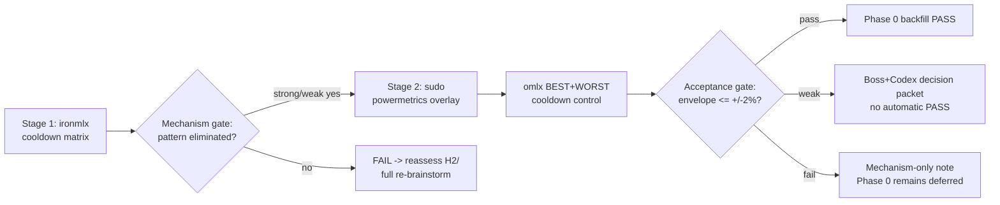

# P5h+2.d — Thermal / Residual-Variance Investigation: Design Spec

**Status:** Draft (Codex review integrated; awaiting Boss approval). DO NOT commit until Boss approves per `[feedback-review-spec-before-commit]`.
**Date:** 2026-05-25.
**Branch (to be created):** `ironmlx-p5h+2-d-thermal-investigation` off `ironmlx-p5h+2-c-scheduler-finished-fix` HEAD `9a4a487`.
**Predecessor close-outs:**
- `docs/p5h+2-b-close-out.md` § 9-10 — P5h+2.b re-attempt FAIL/DEFERRED + P5h+2.d phase design constraints
- `docs/p5h+2-c-close-out.md` — scheduler ERROR fix PASS
- `docs/p5i-c-phase-0-close-out.md` § 1 #4 — criterion #4 STILL FAIL/DEFERRED awaiting P5h+2.d

---

## § 0 Goal + scope

Investigate the residual within-sweep variance mechanism (top candidate H1 thermal/fan curve at sweep boundary; sub-hypotheses H1.a/b/c) exposed after P5h+2.c scheduler ERROR fix shipped. Outcome of this phase determines whether Phase 0 § 7 #4 production envelope ≤ ±2% gate can be backfilled PASS, unblocking Phase 1 implementation.

**This phase is MEASUREMENT and HYPOTHESIS validation, not a code-correctness fix.** No production model/runtime code changes; only:
- new `iron-bench` CLI flag for inter-run cooldown
- aggregator diagnostic-only extension
- new sweep driver wrapping existing P5h+2.b protocol driver
- powermetrics overlay reused from P5h+2.b T3 deferred infra

## § 1 Architecture + sequencing + two-gate framework

### § 1.1 Sequencing (Codex round-5 Q15 binding)



omlx control **MUST NOT** default-run alongside Stage 1; it triggers only after Stage 1 confirms positive ironmlx pattern. Stage 2 powermetrics is gated by Stage 1 Mechanism gate signal.

### § 1.2 Two-gate framework (Codex round-5 Q17 binding)

- **Mechanism gate** (Stage 1 exit): is the within-sweep `trailing_slowdown` / `fast_start_drop` pattern reproducibly eliminated by changing cooldown? Decides whether the H1 family of hypotheses is on the right track.
- **Acceptance gate** (post-Stage 2 + omlx control): under the best protocol identified, PP=128 + PP=512 envelope ≤ ±2% on ≥3 fresh-spawn repeats? Decides whether Phase 0 § 7 #4 backfills PASS.

These gates are evaluated separately. "Pattern eliminated" does not automatically imply "envelope passes"; "envelope passes" without pattern explanation is suspicious (likely measurement luck).

### § 1.3 Stage outputs map to Phase 0 backfill rules

| Outcome | Mechanism gate | Acceptance gate | Phase 0 § 7 #4 backfill action |
|---|---|---|---|
| Strong PASS | yes | yes | backfill PASS; update envelope numbers; unblock Phase 1 implementation |
| Weak evidence | yes | 2-3% envelope | decision packet only; no automatic backfill PASS and no widened envelope unless Boss + Codex explicitly approve |
| Mechanism-only | yes | > 3% envelope | additive note; chain not closed; investigate why mechanism removal didn't propagate to envelope |
| FAIL | no | n/a | additive failed-attempt note; close P5h+2 chain; full re-brainstorm (H2 / H4 / new) |

## § 2 Stage 1 — ironmlx cooldown matrix + hypothesis set

### § 2.1 Cooldown matrix (Codex round-5 Q1 + Q2 binding)

- **Varied dimension**: `inter-run cooldown ∈ {0s, 60s, 120s}` (3 levels; 30s deliberately omitted per Codex)
- **Fixed + recorded dimensions** (avoid interpretation confusion):
  - inter-cell cooldown: driver default (no extra wait beyond spawn shutdown)
  - inter-repeat cooldown: 30s post-shutdown drain (matches P5h+2.b)
  - inter-PP cooldown: governed by lifecycle = `same_spawn_per_pp` (existing mode — kill/respawn between PPs within a single repeat invocation). Cross-repeat fresh spawn comes automatically from the driver-level repeat loop firing separate harness invocations per repeat.
- × {PP=128, PP=512} × 3 fresh-spawn repeats = **18 cells**
- RUNS=15 + monolithic 1100-run preheat per `[project-p5h-2a-findings]` (re-use unchanged)
- Raw per-run timestamps preserved end-to-end (`--capture-run-timestamps` mandatory; Codex round-5 Q4 binding for retroactive H1/H2 analysis)
- Wall-note: the 120s level alone adds ~168 minutes of cooldown sleep to Stage 1; § 9.3 budget therefore uses a 12h GPU cap rather than the earlier 8h cap.

### § 2.2 Hypothesis set (Codex round-5 Q16 binding — H1 sub-divided)

| Code | Name | Stage 1 / Stage 2 signal |
|---|---|---|
| H1.a | GPU thermal soak (absolute temperature rise) | Stage 2 `gpu_temp` correlates with within-sweep pp_tps drop |
| H1.b | **Fan hysteresis / governor lag** (NEW) | Stage 2 fan/RPM fields, if present, lag pp_tps drop + Stage 1 cooldown removes pattern; otherwise H1.b remains indeterminate |
| H1.c | **Preheat topology mismatch** (NEW) — preheat brings PP=512 to steady state but PP=128 measured loop still in transient | Stage 1 cooldown removes pattern but only for PP=128 |
| H2 | MLX state-decay (allocator / JIT GC) | Stage 1 cooldown ineffective; would need fresh-spawn-per-run control (NOT in P5h+2.d scope) |

Stage 1 does NOT attempt H1/H2 disambiguation. Stage 2 powermetrics provides causal H1 evidence (temperature + optional fan/RPM time series, depending on local plist schema). If H1 family is rejected after Stage 2, escalate to re-brainstorm — no P5h+2.e is predeclared (Codex round-5 Q9).

### § 2.3 Stage 1 driver

Use a two-layer driver split; no implementer discretion at plan stage:
- Extend `tools/p5h_2b_protocol_experiment.py` with `--inter-run-cooldown-secs N` pass-through to `iron-bench`, plus server-log ERROR/WARN scanning described in § 7.
- Add thin orchestrator `tools/p5h_2d_thermal_experiment.py` that loops over cooldown levels, delegates per-cell to the existing P5h+2.b driver, and writes Stage 1 / Stage 2 / omlx-control manifests.
- Output dir naming includes cooldown: `/tmp/p5h+2-d-stage1-r${R}-pp${PP}-cd${N}s`.

### § 2.4 Stage 1 Mechanism gate

Computed offline from per-cell `bench.csv` + aggregator diagnostic fields (§ 4):

- Define `trailing_slowdown_abs_pct = max(0, -trailing_slowdown_pct)` and `fast_start_drop_pos_pct = max(0, fast_start_drop_pct)` for gate math.
- BEST cooldown is selected per PP as the cooldown level with the lowest PP-specific dominant residual; tie-breaker prefers the shorter cooldown. WORST cooldown for control comparisons is the `0s` baseline.
- **Strong yes**: BEST cooldown (60s OR 120s) satisfies both PP-specific residual checks:
  - PP=128: median `trailing_slowdown_abs_pct` reduced by ≥ 50% vs `0s` cell, AND BEST residual ≤ 10%.
  - PP=512: median `fast_start_drop_pos_pct` reduced by ≥ 50% vs `0s` cell, AND BEST residual ≤ 10%.
- **Weak yes**: exactly one PP-specific residual check passes, OR both checks reduce by ≥ 50% but one residual remains > 10%.
- **No**: neither PP-specific residual check shows ≥ 50% reduction at any cooldown level. If the `0s` baseline residual is already ≤ 10% for both PPs, classify Stage 1 as no/inconclusive rather than PASS, because the cooldown mechanism was not demonstrated.

Pre-declared thresholds locked at start of Stage 1; no post-hoc adjustment (Codex round-1 P5h+2.b binding pattern).

## § 3 iron-bench `--inter-run-cooldown-secs` flag

### § 3.1 CLI semantics (Codex round-5 Q3 binding — semantics precise)

```
--inter-run-cooldown-secs <N>
    Sleep N seconds between measured runs in sequential (v1) mode.
    Does NOT sleep during preheat or warmup.
    Does NOT sleep after the final measured run.
    Default: 0 (no behavior change).
```

### § 3.2 Implementation constraints

- Touch `iron-bench/src/main.rs` Args struct + `iron-bench/src/runner.rs` measured-run loop
- Reject non-zero value in concurrent (v2) mode (same pattern as `--capture-server-request-id` incompatibility checks at `iron-bench/src/main.rs:134`)
- Use async sleep in the sequential measured-run loop after each measured run except the final measured run.
- Keep the change local to `main.rs` validation/wiring and the measured-run loop; no production runtime/model code changes.
- Pass-through driver hook + tests: 1 iron-bench validation/timing test proving two measured runs with `N=1` include one cooldown interval; driver smoke pytest in `tools/p5h_aggregator/tests/test_p5h_2b_protocol_experiment.py`.

### § 3.3 Production-quality discipline (Codex round-5 Q12 binding)

This is a production-grade flag (matches `--capture-run-timestamps` precedent). It will be useful beyond P5h+2.d for any sweep where thermal isolation matters. Documentation in `--help` output explicit about scope.

## § 4 Aggregator diagnostic extensions (NO gate logic)

### § 4.1 New diagnostic fields in `tools/p5i_c_pp_tps_envelope.py` (Codex round-5 Q6 binding)

Per-cell additive output (NOT in envelope number computation):

- `trailing_slowdown_pct = (median of LAST 3 runs) / (median of FIRST 3 runs) - 1` (negative when slowdown)
- `fast_start_drop_pct = (max of FIRST 3 runs) / (median of LAST 3 runs) - 1` (positive when fast-start observed)
- `first_3_runs_median_pp_tps` + `last_3_runs_median_pp_tps` (raw inputs for downstream tools)

### § 4.2 Gate logic location

Mechanism gate logic lives in Stage 1 **analysis driver / close-out narrative**, NOT in envelope tool. Envelope tool stays pure: input cells → output envelope number + diagnostic fields.

### § 4.3 New pytests

Add 3 pytests:
- `trailing_slowdown_pct` known-input fixture (positive case)
- `fast_start_drop_pct` known-input fixture
- Field names present in JSON output even when N < 3 runs (degenerate-case guard)

## § 5 Stage 2 — sudo powermetrics overlay (gated)

### § 5.1 Pre-arrangement (Codex round-5 Q5 binding)

Boss adds sudo rule **NOW** (before Stage 1) so Stage 2 can launch instantly when triggered. Rule shape:

```
# /etc/sudoers.d/ironmlx-powermetrics (NEW)
xin ALL=(root) NOPASSWD: /usr/bin/powermetrics --samplers gpu_power,thermal --format plist -i 500 -o /tmp/p5h+2-d-*
```

Boss applies via `sudo visudo -f /etc/sudoers.d/ironmlx-powermetrics`. Read-only powermetrics command; low risk surface.

### § 5.2 Trigger gate

Stage 2 runs ONLY if Stage 1 Mechanism gate = strong/weak yes (per § 2.4). If Stage 1 = no → FAIL escalation; Stage 2 not executed.

### § 5.3 Protocol

For each {PP, PP-specific BEST cooldown} cell:
1. Launch powermetrics sidecar: `sudo /usr/bin/powermetrics --samplers gpu_power,thermal --format plist -i 500 -o /tmp/p5h+2-d-stage2-pm-r${R}-pp${PP}.plist &`
2. Spawn ironmlx server + warmup
3. Run measured sweep (RUNS=15 with cooldown applied)
4. Shut down ironmlx; stop powermetrics by captured PID and preserve partial plist on failure
5. Join via `tools/p5h_2b_thermal_overlay.py` (reuse existing overlay; extend parser for plist output if needed)
6. Repeat × 3 fresh-spawn repeats

= 2 PPs × 3 repeats = 6 cells.

### § 5.4 H1 sub-hypothesis evidence interpretation

| Sub-hypothesis | Stage 2 signal |
|---|---|
| H1.a thermal soak | within-sweep `gpu_temp` rises monotonically; cooldown-60s recovers temp by sweep start; pp_tps drop correlates with temp threshold |
| H1.b fan hysteresis | if local powermetrics plist exposes fan/RPM fields, within-sweep `fan_rpm` lags thermal rise by N seconds; if fan/RPM is absent, H1.b is recorded as indeterminate rather than failed |
| H1.c preheat topology | preheat `gpu_temp` plateau differs from measured PP=128 vs PP=512; cooldown effect asymmetric |

Pre-arranged sudo rule wording is in § 10 for Boss to apply before Stage 1 begins.

## § 6 omlx control protocol (gated)

### § 6.1 Trigger (Codex round-5 Q7 + Q15 binding)

omlx control runs ONLY after Stage 1 Mechanism gate = strong/weak yes. If Stage 1 = no, omlx is not run (no value without ironmlx baseline confirmed).

### § 6.2 Protocol

Reuse `iron-bench --target omlx-baseline` (already supported per `[reference-iron-rivals-baselines]` + `[feedback-omlx-cli-default]`):

- Cells: `{PP-specific BEST, WORST=0s} cooldown × {PP=128, PP=512} × 3 fresh-spawn repeats` = 12 cells
- omlx via `/Users/xin/workspace/iron-rivals/omlx` source CLI (NOT pip; NOT mlx_lm)
- Same RUNS=15 + monolithic 1100-run preheat (per `[project-p5h-2a-findings]`)
- Same `--inter-run-cooldown-secs` flag (production-grade; iron-bench is target-agnostic for the flag)

### § 6.3 Interpretation

- **Proportional shift** (omlx pp_tps also drops with no cooldown, recovers with cooldown): system-level thermal mechanism — corroborates H1
- **omlx flat across cooldowns**: ironmlx-specific mechanism — likely H1.c (preheat topology) or H2 (MLX state-decay in ironmlx-specific code paths)
- omlx envelope: informational only; not directly part of Acceptance gate (which is ironmlx-only)

## § 7 Predeclared exclusion rules (Codex round-5 Q13 binding)

Lock BEFORE Stage 1 starts; no post-hoc rule fitting (Codex round-1 P5h+2.b discipline pattern):

| Rule | Status | Application |
|---|---|---|
| **A** (RUNS bump) | n/a | RUNS=15 fixed; not used |
| **B** (drop first 1-2 cold-start runs) | KEPT | for envelope number trim only; pattern analyzer uses RAW series |
| ~~C (conditional drop last 2)~~ | **REMOVED** | P5h+2.d studies degradation; cannot exclude it |
| **D** (revised) | NEW | any server.log ERROR line → cell FAILS (driver hard-stop) unless explicitly allow-listed before the run; WARN → check allow-list; allow-listed pass; non-allow-listed WARN → mark cell for review (NOT auto-drop) |
| **E** (run order randomization) | n/a | sequential within-cell required; randomization deferred |

### § 7.1 Non-scheduler WARN allow-list (§ A6 + D)

Initial allow-list (extend in plan if Stage 1 reveals new benign WARN classes):

- `[tracing]` initialization warnings on first run
- KVCache buffer-resize warnings under PP=128 (known + benign per `[feedback-kv-buffer-width-gpu-floor]`)
- `mlx::eval` lazy-materialization log spam at `info` level (already filtered by `quiet_acceptance` logging mode)

Driver scans `server.log` for ERROR/WARN; emits per-cell counts, ERROR lines, and non-allow-listed WARN lines for human review.

## § 8 Acceptance criteria (gate evaluation)

### § 8.1 Mechanism gate (Stage 1 exit; mandatory)

| # | Criterion | Method |
|---|---|---|
| M1 | Stage 1 cooldown matrix completed (18 cells; server.log ERROR == 0; all non-allow-listed WARN reviewed before verdict) | driver hard-stops on ERROR; Boss reviews WARN flagged |
| M2 | `trailing_slowdown_pct` + `fast_start_drop_pct` diagnostic fields emitted per cell | aggregator output schema |
| M3 | BEST cooldown identified per PP via the strong/weak/no rule in § 2.4 | analysis driver |
| M4 | Stage 1 verdict written: strong yes / weak yes / no | close-out narrative |

### § 8.2 Acceptance gate (post-Stage 2 + omlx control; conditional)

Only evaluated if Mechanism gate strong or weak yes:

| # | Criterion | Method |
|---|---|---|
| A1 | At each PP's BEST cooldown, PP=128 + PP=512 ironmlx envelope ≤ ±2% on ≥3 fresh-spawn repeats | `tools/p5i_c_pp_tps_envelope.py` MAX(within-CI, between-half-range) |
| A2 | Stage 2 powermetrics overlay produced; H1 sub-hypothesis identified (a/b/c or "indeterminate") | `tools/p5h_2b_thermal_overlay.py` output |
| A3 | omlx control verdict: proportional shift / flat / mixed | analysis narrative |
| A4 | Phase 0 § 7 #4 backfill action chosen per § 1.3 outcome table | close-out narrative |

### § 8.3 FAIL/escalation path

If Mechanism gate = no:
- Stage 2 + omlx control NOT executed (no wall waste)
- Close P5h+2 chain at this phase
- Additive failed-attempt note on `docs/p5i-c-phase-0-close-out.md` § 1 #4 (criterion #4 STILL FAIL/DEFERRED)
- Full re-brainstorm: candidate hypotheses include H2 (MLX state decay; needs fresh-spawn-per-run control), H4 (cross-machine; needs 2nd M5 Max or M-series), or new

## § 9 Tasks + branch + budget + single commit

### § 9.1 Task split (Codex round-5 Q11 binding; `[feedback-task-breakdown-bounded]` ≤ 7)

| Task | Subject | Gated? |
|---|---|---|
| T0 | iron-bench `--inter-run-cooldown-secs` flag + driver pass-through + 2 tests | no |
| T1 | aggregator `trailing_slowdown_pct` + `fast_start_drop_pct` diagnostic fields + 3 pytests | no |
| T2 | Stage 1 sweep (18 cells) + Mechanism gate analysis | no (must run) |
| T3 | Stage 2 sudo powermetrics overlay + H1 sub-hypothesis analysis | yes — gated on T2 = strong/weak yes |
| T4 | omlx control sweep (12 cells) + interpretation | yes — gated on T2 = strong/weak yes |
| T5 | close-out single commit attaching all infra + tests + Phase 0 PASS backfill or deferred/failed-attempt note per verdict | no |

= 6 tasks; under cap.

### § 9.2 Branch (Codex round-5 Q14 binding)

- New branch `ironmlx-p5h+2-d-thermal-investigation` off `9a4a487` (current `ironmlx-p5h+2-c-scheduler-finished-fix` HEAD)
- Boss pushes current `ironmlx-p5h+2-c-scheduler-finished-fix` branch BEFORE forking (P5h+2.c fix `9da48f5` + re-attempt close-out `9a4a487` should land remote first)

### § 9.3 Budget split (Codex round-5 Q8 binding)

| Bucket | Cap |
|---|---|
| GPU wall (Stage 1 + Stage 2 + omlx control execution) | 12 hr |
| Docs/analysis wall (spec / plan / Codex iteration / close-out) | 4 hr |
| **Total** | **16 hr** |

Track separately in T5 close-out wall summary. Rationale: 120s cooldown can add ~4.2h to Stage 1 by itself and, if Stage 2 + omlx control are both triggered, worst-case cooldown sleep can approach ~9.8h before benchmark/preheat overhead.

### § 9.4 Single-commit policy (Codex round-5 Q10 binding)

T5 produces single commit attaching:
- iron-bench flag + tests (T0)
- aggregator extension + tests (T1)
- new Stage 1 driver (T2)
- powermetrics overlay invocation recipe (T3 — reuses existing tool; no new code unless gap discovered)
- omlx control recipe (T4 — no new code; documentation in close-out)
- close-out doc + Phase 0 PASS backfill or deferred/failed-attempt note per verdict (T5)

Matches P5h+2.b/c precedent.

## § 10 Sudo rule wording (for Boss to apply before Stage 1)

```
# /etc/sudoers.d/ironmlx-powermetrics
# Allows passwordless powermetrics for P5h+2.d Stage 2 sudo thermal probe (read-only).
xin ALL=(root) NOPASSWD: /usr/bin/powermetrics --samplers gpu_power,thermal --format plist -i 500 -o /tmp/p5h+2-d-*
```

Apply via `sudo visudo -f /etc/sudoers.d/ironmlx-powermetrics`. The command form is intentionally exact: Stage 2 must invoke powermetrics with the same argument order and write only to `/tmp/p5h+2-d-*`.

**Risk surface**: powermetrics is read-only; no state mutation. Limited to the single Stage 2 sampler command and `/tmp/p5h+2-d-*` output path.

Boss applies this once; remains in place for any future thermal investigation.

## § 11 Phase 1 brainstorm parallel boundaries (Codex round-5 Q18 binding)

Phase 1 brainstorm γ-lite parallel-start:
- **NOT NOW** — wait until this spec signed off (avoids muddying both designs)
- After P5h+2.d spec signed off → spawn Phase 1 brainstorm in parallel as design-only exploration of `gather_qmm_gate_up` candidate
- Phase 1 brainstorm SHALL NOT:
  - write any implementation code
  - run any performance benchmarks
  - propose acceptance criteria that depend on Phase 0 envelope status
- Phase 1 brainstorm OUTPUT: design doc only; implementation/+10% acceptance still blocked on this phase's Acceptance gate

## § 12 References

- Spec / plan / Codex consultation chain:
  - `reports/p5h+2-d-brainstorm-codex-questions.md` (P5h+2.d brainstorm consultation doc, gitignored)
  - `reports/p5h+2-b-rerun-codex-review.md` (Codex round-4 outcome decision, gitignored)
  - `docs/p5h+2-b-close-out.md` § 9-10 (P5h+2.b re-attempt close + P5h+2.d phase design constraints)
  - `docs/p5h+2-c-close-out.md`
  - `docs/p5i-c-phase-0-close-out.md` § 1 #4 (FAIL/DEFERRED awaiting this phase)
- Reusable infra:
  - `tools/p5h_2b_protocol_experiment.py` (extend for Stage 1)
  - `tools/p5h_2b_thermal_overlay.py` (Stage 2; existing pytests plus plist parser coverage)
  - `tools/p5i_c_pp_tps_envelope.py` (extend for diagnostic fields)
  - `iron-bench` Args + runner (add cooldown flag)
- Memory: `[project-p5h-2b-findings]` (re-attempt section; Stage 1 thermal hypothesis context), `[project-p5h-2c-findings]`, `[project-p5h-2a-findings]` (preheat protocol)
- Bindings: `[feedback-task-breakdown-bounded]`, `[feedback-review-spec-before-commit]`, `[feedback-self-review-before-handoff]`, `[feedback-serial-perf-experiments]`, `[feedback-omlx-cli-default]`, `[feedback-no-empty-commits]`, `[feedback-commit-message-english]`, `[feedback-no-reports-commit]`

## § 13 Codex review decisions resolved

- Mechanism gate uses PP-specific residual checks: PP=128 `trailing_slowdown_abs_pct`, PP=512 `fast_start_drop_pos_pct`, each requiring ≥ 50% reduction; Strong yes also requires BEST residual ≤ 10% for both PPs.
- Stage 2 powermetrics sampling interval is fixed at 500ms for this phase. A 100ms follow-up is only a future investigation option if the 500ms overlay is indeterminate.
- omlx control keeps both PP=128 and PP=512. Skipping PP=128 would weaken the cross-target interpretation of the envelope question.
- H1.b fan hysteresis and H1.c preheat topology remain distinct names because they imply different next actions if Stage 2 supports H1 but the Acceptance gate still fails.
