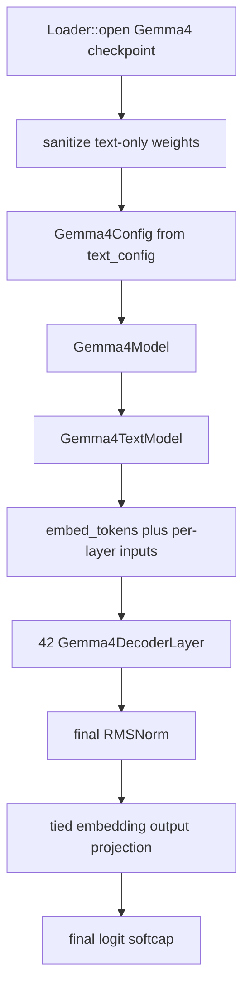
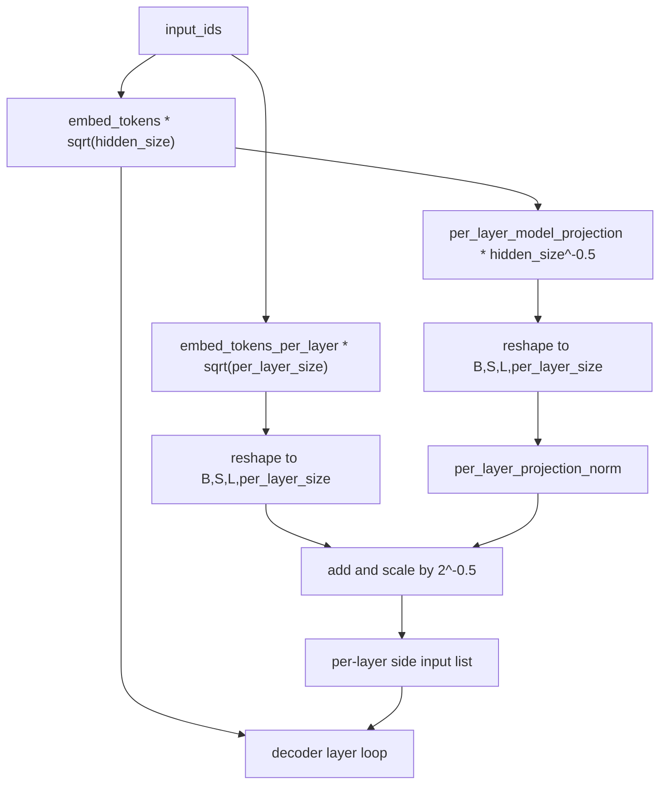
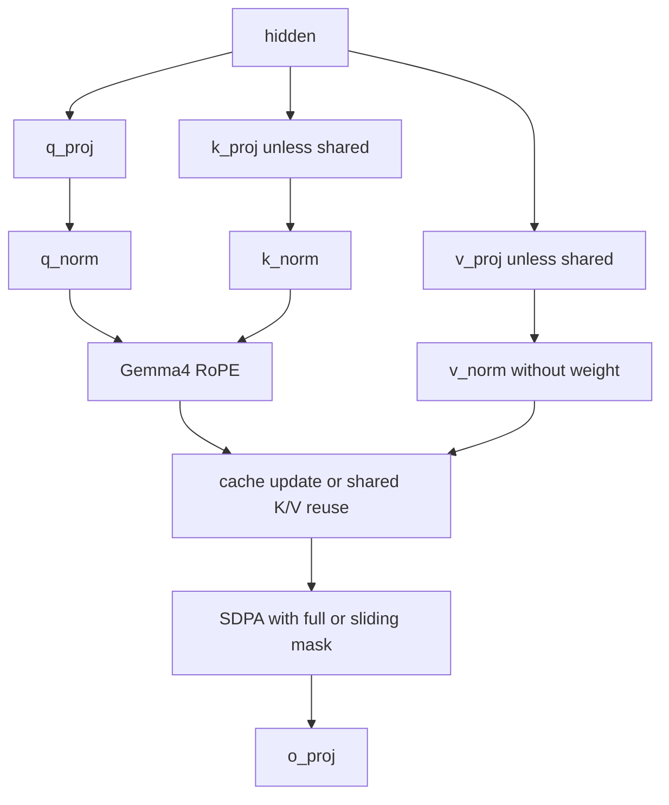
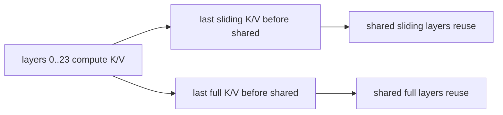

# ironmlx Gemma4 Dense Text-Only 设计

| 字段 | 值 |
|---|---|
| 日期 | 2026-05-27 |
| 状态 | Implemented and validated |
| 工作分支 | `codex/gemma-4-moe` |
| worktree | `/Volumes/Dev/cxx-mlx-gemma-4-moe` |
| 验证模型 | `~/.ironmlx/models/models--mlx-community--gemma-4-e4b-it-4bit/snapshots/cc3b666c01c20395e0dcebd53854504c7d9821f9` |
| 范围 | Gemma4 Dense language model text-only 推理路径 |
| 参考实现 | `/Volumes/Dev/mlx-vlm/mlx_vlm/models/gemma4` 仅作行为观察 |
| 显式 out-of-scope | MoE、vision/audio forward、多模态 token 替换、训练、兼容旧 Gemma 系列 |

## 1. 事实与范围

本地 `gemma-4-e4b-it-4bit` checkpoint 的顶层 `model_type` 是 `gemma4`，`text_config.enable_moe_block=false`，`num_experts=null`，因此本阶段不是 MoE 任务。checkpoint 同时包含 `vision_config`、`audio_config`、`vision_tower.*` 和 `audio_tower.*` 权重，所以它也不是 text-only checkpoint；本阶段只加载并执行 `language_model.*` 下的 dense text model。

关键 text config：

| 字段 | 值 |
|---|---|
| `hidden_size` | 2560 |
| `num_hidden_layers` | 42 |
| `num_attention_heads` | 8 |
| `num_key_value_heads` | 2 |
| `head_dim` | 256 |
| `global_head_dim` | 512 |
| `num_kv_shared_layers` | 18 |
| `hidden_size_per_layer_input` | 256 |
| `vocab_size` | 262144 |
| `tie_word_embeddings` | true |
| `final_logit_softcapping` | 30.0 |
| `sliding_window` | 512 |
| `layer_types` | 5 层 sliding 后 1 层 full，循环到 42 层 |

## 2. 第一性原则

1. **先保护语义正确性**：Gemma4 Dense 的 per-layer input、KV sharing、full/sliding RoPE、final logit softcap 都是架构语义，不是性能优化，必须作为一等路径实现。
2. **模型边界清晰**：Gemma4 不复用 Qwen3.5 的 layer 容器和 attention 逻辑。共享 `Loader`、`Embedding`、`Linear`、`RmsNorm`、`KVCache` 等基础组件，但模型特有控制流放在 `models/gemma4/`。
3. **不写兼容性分支**：只实现 `model_type=gemma4` 且 `text_config.enable_moe_block=false` 的 dense path。遇到 MoE 或缺失必要字段时直接报错。
4. **高性能来自数据流设计**：权重保持 resident；量化 embedding/linear 走现有 fused qmm；gate/up 在 GeGLU MLP 中融合加载；KV sharing 避免后 18 层重复投影 K/V；sliding attention 使用架构窗口约束。
5. **竞品只用于事实校验**：mlx-vlm 帮助确认张量命名、RoPE 形状和 KV sharing 规则；ironmlx 实现按本仓库 trait/cache/scheduler 形态重新设计。

## 3. 总体架构

`Gemma4Model` 实现 `core::Model`，可接入现有 CLI、GenerationStream、Scheduler 和 server。`DenseVlMethods` 仅提供 text-only stub，遇到 image/audio 输入直接返回明确错误，避免把多模态任务伪装成已支持。

## 4. Loader 清洗策略

Gemma4 checkpoint 是 multimodal 外壳加 language model。text-only `Loader::open` 必须在任何 conv/norm 检测前做模型感知清洗：

1. `keep_vision_tower=false` 时丢弃 `vision_tower.*`、`audio_tower.*`、`embed_vision.*`、`embed_audio.*`。
2. 去掉 `language_model.` 前缀，保留 `model.*`、`lm_head.*` 等 text keys。
3. `tie_word_embeddings=true` 时丢弃 `lm_head.{weight,scales,biases}`，输出投影使用 `embed_tokens.as_output_on`。
4. Qwen3.5 的 RMSNorm `+1.0` 规则不得由 Gemma4 的 `audio_tower.*.depthwise_conv1d.weight` 触发。norm-shift 只允许在 Qwen3.5 语义下发生。

这个顺序解决根因：现有清洗逻辑用 `conv1d.weight` 探测 Qwen offset-gamma，但 Gemma4 audio tower 也有 conv1d；如果先探测再丢弃 audio tower，会错误修改 Gemma4 text norm 权重。

## 5. Text Model 数据流

主 embedding 输出是 `[B,S,2560]`，per-layer input 是 `[B,S,42,256]`。每个 decoder layer 在 FFN 后接收自己的 side input：

1. `per_layer_input_gate(hidden)` 得到 `[B,S,256]`。
2. 对 gate 做 GELU 近似后与该层 side input 相乘。
3. 通过 `per_layer_projection` 投回 hidden size。
4. `post_per_layer_input_norm` 后 residual add。

## 6. Decoder Layer

每层执行：

1. `input_layernorm`
2. `Gemma4Attention`
3. residual add
4. `post_attention_layernorm`
5. `pre_feedforward_layernorm`
6. `Gemma4GeGluMlp`
7. residual add
8. `post_feedforward_layernorm`
9. per-layer input block
10. `layer_scalar` 乘法

FFN 是 GeGLU，不是 Qwen 的 SwiGLU：`down(gelu_approx(gate_proj(x)) * up_proj(x))`。实现上将 `gate_proj` 和 `up_proj` 按输出维拼成一个 `Linear`，一次 qmm 后 split，减少 kernel dispatch 和权重查找。

## 7. Attention、RoPE 与 Sliding Window

Gemma4 attention 的核心差异：

| 项 | sliding layer | full layer |
|---|---|---|
| Q head dim | 256 | 512 |
| K/V head dim | 256 | 512 |
| RoPE | default, base 10000 | proportional, base 1000000 |
| 可见历史 | 最近 512 token | 全历史 |
| K/V sharing | 后 18 层复用最近同类型 K/V | 后 18 层复用最近同类型 K/V |

Attention scale 固定为 `1.0`。Q/K 使用带权重 RMSNorm；V 使用无权重 RMSNorm。full attention 的 proportional RoPE 只旋转 head 左右两半中的前 `partial_rotary_factor` 部分，指数分母仍使用完整 head dim。

Sliding window 不是短 prompt hack。实现必须保证 sliding layer 在任意长度下只看 `[current_position - 511, current_position]`。第一阶段采用精确 additive mask 作为通用正确路径；单流 decode/prefill 可在 attention 内使用 cache offset 构造窗口，后续可将 sliding K/V tail view 作为无语义变化的性能优化。

## 8. KV Sharing

`first_kv_shared_layer_idx = num_hidden_layers - num_kv_shared_layers = 24`。第 0 到 23 层计算并写入自己的 K/V cache；第 24 到 41 层不再投影 K/V，而是按 layer type 复用最近的 pre-shared K/V：

这条路径同时提升性能和降低 cache 内存。`make_cache` 只为前 24 层创建 `LayerCache::Full(KVCache)`，模型 forward 内部按真实 layer index 映射 cache slot。

现有 `ModelMeta::num_hidden_layers` 在 memory budget 中实际表示 cache-bearing layer 数，而 `Model::num_hidden_layers()` 表示架构 decoder layer 数。Gemma4 的 `model_meta()` 因此必须用 24 作为 KV cache 预算层数，`num_hidden_layers()` 仍返回 42。这样不修改 scheduler 公共契约，也避免按 42 层高估 Gemma4 KV 内存。

## 9. 输出层

Gemma4 e4b `tie_word_embeddings=true`，没有独立 `lm_head`。输出只投影最后 token hidden：

1. slice `[B,1,H]`
2. `embed_tokens.as_output_on`
3. `logits = tanh(logits / final_logit_softcapping) * final_logit_softcapping`

softcap 放在采样前，保证 greedy、temperature 和 server 路径语义一致。

## 10. 验证策略

1. 单元测试：config 解析、loader sanitize、layer type/KV sharing 映射、RoPE 形状、sliding mask 边界、GeGLU split。
2. 集成测试：用真实 checkpoint 加载模型，执行短 prompt greedy smoke。
3. Rust 检查：`cargo fmt`、`cargo +nightly fmt --all -- --check`、`cargo +nightly clippy --all-features --workspace -- -D warnings`、`cargo build --release`。
4. 行为风险记录：本阶段 text-only；如果输入包含 image/audio token，不做多模态替换，直接报错。
