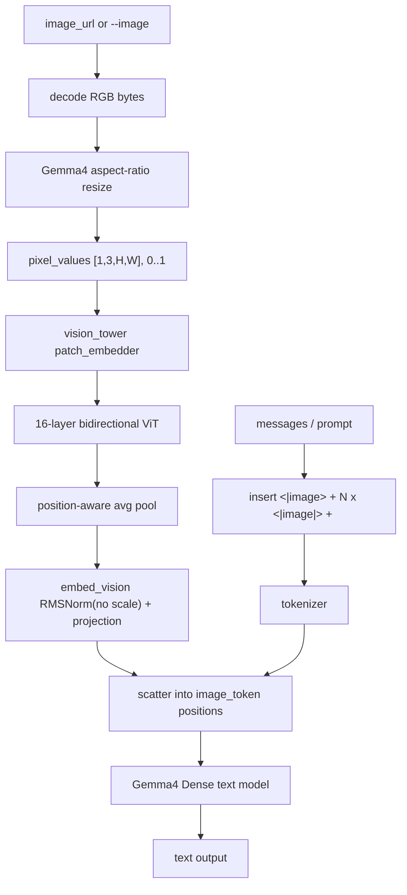
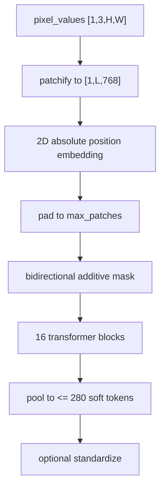
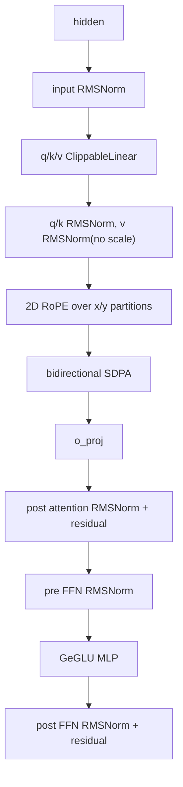

# ironmlx Gemma4 Vision 设计

| 字段 | 值 |
|---|---|
| 日期 | 2026-05-27 |
| 状态 | Completed |
| 工作分支 | `codex/gemma-4-vision` |
| worktree | `/Volumes/Dev/cxx-mlx-gemma-4-vision` |
| 基线提交 | `2071b11 feat: support Gemma4 dense text model` |
| 验证模型 | `~/.ironmlx/models/models--mlx-community--gemma-4-e4b-it-4bit/snapshots/cc3b666c01c20395e0dcebd53854504c7d9821f9` |
| 范围 | Gemma4 Dense image + text -> text，单 image |
| 参考实现 | `/Volumes/Dev/mlx-vlm/mlx_vlm/models/gemma4` 仅作行为观察 |
| 显式 out-of-scope | 多 image、audio、video、MoE、训练、远端模型下载 |

## 1. 事实与范围

本地 `gemma-4-e4b-it-4bit` checkpoint 不是 text-only checkpoint。它包含：

| 项 | 值 |
|---|---|
| `architectures` | `Gemma4ForConditionalGeneration` |
| `vision_config.model_type` | `gemma4_vision` |
| `image_token_id` | 258880 |
| `boi_token_id` | 255999 |
| `eoi_token_id` | 258882 |
| `vision_soft_tokens_per_image` | 280 |
| `vision_tower.*` 权重 | 存在 |
| `embed_vision.*` 权重 | 存在 |

本阶段只支持单张图片。CLI 接受一个 `--image`，OpenAI server 接受一个 `image_url` content part。多图请求返回明确错误，避免将多图 token 对齐风险混入第一版。

## 2. 第一性原则

1. **Gemma4 vision 不是 Qwen VL patch 输入**：Gemma4 image processor 输出 `[B,3,H,W]`，patchify、position embedding 和 pooling 在 `vision_tower` 内部完成。Qwen 的 `[N,T,C,16,16]` patch 输入不能复用。
2. **token 数由实际 resize 后网格决定**：prompt 中 `<|image|>` 重复次数必须等于 vision pooler 输出行数，不固定写死 280。`280` 是上限，正方形图片常见输出是 256。
3. **per-layer input 必须屏蔽多模态 token**：Gemma4 text side input 对 image token 位置使用 token id 0，而不是 image token id；否则 image soft token 与 text per-layer embedding 混合会偏离模型语义。
4. **线程边界提前 materialize**：server 在 async worker 解码和预处理图片，进入 blocking scheduler 前必须 eval 图中跨线程传递的 MLX array，避免默认 stream 跨线程错误。
5. **不写兼容性代码**：本轮不兼容 audio/video/MoE，也不伪造多图支持。遇到不在范围内的输入直接报错。

## 3. 数据流



## 4. Image Processor

Gemma4 processor preserves aspect ratio and constrains patch count:

1. Decode image and convert to RGB.
2. Compute `max_patches = vision_soft_tokens_per_image * pooling_kernel_size^2`.
3. Compute `target_px = max_patches * patch_size^2`.
4. Scale by `sqrt(target_px / (height * width))`.
5. Round down both sides to multiples of `pooling_kernel_size * patch_size`.
6. Resize with bicubic-equivalent filtering.
7. Rescale to `float32` in `[0,1]`, channel-first `[1,3,H,W]`.
8. Return `soft_tokens = (H / patch_size) * (W / patch_size) / pooling_kernel_size^2`.

Unlike Qwen, Gemma4 does not normalize by mean/std in this checkpoint path; the vision patch embedder applies `2 * (pixel - 0.5)` internally.

## 5. Vision Tower



Each vision block:



`use_clipped_linears=true` 时，linear 前后使用 checkpoint 的 `input_min/input_max/output_min/output_max` 做 clipping；这不是调试分支，而是权重语义的一部分。

## 6. Text 注入

Gemma4 prompt placeholder 是：

```text
<|image><|image|><|image|>...<image|>
```

其中 `<|image|>` 的数量等于本张图片的 soft token 数。`<|image>` 和 `<image|>` 是边界 token，不参与 vision scatter；只有 `image_token_id=258880` 的 token 位置被 vision embedding 替换。

Gemma4 text forward 的 VL 路径必须分三步：

1. `embed_tokens(input_ids) * sqrt(hidden_size)` 得到 text embedding。
2. 用 projected vision embeddings 替换 `input_ids == image_token_id` 的位置。
3. 计算 per-layer input 时，将 image token id 位置替换为 0，再用已经注入 vision 的 hidden 做 projection 分支。

## 7. Server 与 CLI 边界

CLI:

```text
ironmlx generate --model <path> --image <path> --prompt "Describe this image"
```

Server:

```json
{
  "messages": [{
    "role": "user",
    "content": [
      {"type": "text", "text": "Describe this image"},
      {"type": "image_url", "image_url": {"url": "data:image/jpeg;base64,..."}}
    ]
  }]
}
```

第一版只允许一个 image part。请求包含多个 image part 时返回 `400 Bad Request`，错误信息说明当前 Gemma4 vision 单图限制。

## 8. 验证策略

1. 单元测试：Gemma4 resize/token count、placeholder 展开、vision config 解析、per-layer input image id 屏蔽。
2. 模型加载 smoke：`Loader::open_multimodal` 保留 `vision_tower.*` 和 `embed_vision.*`，但丢弃 audio tower。
3. CLI smoke：真实图片 + 本地 Gemma4 checkpoint 生成至少 1 token。
4. Server smoke：OpenAI `image_url` 请求成功，连续请求不 poison scheduler。
5. Rust gate：`cargo fmt`、nightly fmt check、`clippy -D warnings`、`cargo build --release`。
