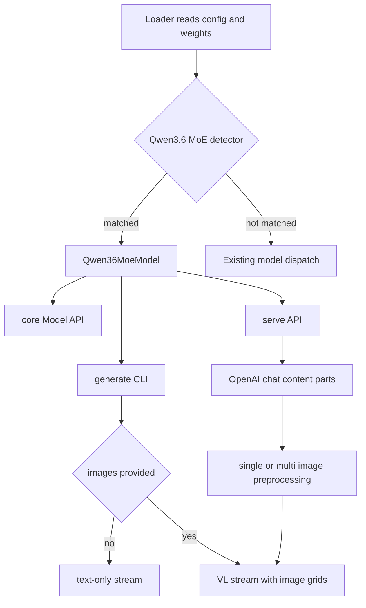

# Qwen3.6 MoE Product Architecture Design

## Objective

Provide first-class IronMLX support for the downloaded
`mlx-community/Qwen3.6-35B-A3B-4bit` checkpoint across all product entry points:

- core model API
- `ironmlx generate` CLI
- OpenAI-compatible `ironmlx serve` API

The support must cover text-only, single-image, and multi-image generation while
keeping the implementation explicit, testable, and performant.

## Source of Truth

The Qwen3.6 35B A3B 4-bit checkpoint declares:

- `model_type = "qwen3_5_moe"`
- `architectures = ["Qwen3_5MoeForConditionalGeneration"]`
- `text_config.num_experts = 256`
- `text_config.num_experts_per_tok = 8`
- top-level `vision_config` and image/video token ids
- per-module quantization overrides for MoE router gates and shared expert
  gates

The tensor key set and vision configuration match the existing Qwen3.5 MoE-VL
implementation. The product design therefore treats Qwen3.6 MoE as an explicit
architecture facade over the shared Qwen3.5 MoE execution kernel, with
Qwen3.6-specific validation and dispatch driven by checkpoint structure rather
than repository path guessing.

## Architecture Boundary

Add `ironmlx/src/models/qwen3_6_moe/` as the public architecture package. This
package owns:

- `Qwen36MoeConfig`
- `Qwen36MoeModel`
- Qwen3.6 checkpoint detection and validation
- public exports used by CLI, serve, and core model users

The package delegates the numeric execution path to the existing MoE-VL model
kernel because the checkpoint itself declares the same Hugging Face architecture
and tensor layout. The wrapper is not a loose compatibility fallback: it rejects
non-Qwen3.6-shaped configs and exposes Qwen3.6 as a named model family in the
IronMLX API.

## Entry-Point Flow

Mermaid syntax check: node labels with punctuation are quoted, branch labels are
quoted, and the diagram uses a valid `flowchart TD` grammar.

## Core Model API

`Qwen36MoeModel` must implement:

- `Model`
- `DenseVlMethods`

Core users can construct it directly with `Qwen36MoeModel::from_loader` or
`Qwen36MoeModel::from_loader_with_config`. The model supports:

- text forward and batched prefill
- single-image VL prefill/generation
- multi-image VL prefill/generation
- direct vision embedding computation through the same public method shape as
  other VL-capable IronMLX models

The loader must honor Qwen3.6 quantization overrides before global quantization
metadata. This prevents 8-bit router gate tensors from being loaded as 4-bit
matmul weights.

## CLI API

`ironmlx generate` keeps the text-only path lightweight. Without images it opens
the model through the text loader path and does not load the vision tower.

When images are provided, the CLI:

- accepts repeated `--image <PATH>` arguments
- opens the checkpoint through the multimodal loader
- preprocesses images with the same Qwen VL image pipeline used by the server
- inserts image placeholder tokens in the same order as the CLI arguments
- runs `GenerationStream::new` so image embeddings and VL position ids are used

The CLI image contract is local-file based. Remote and data-URL image input stay
in the serve API, where HTTP request validation and URL decoding already belong.

## Serve API

`ironmlx serve` must dispatch Qwen3.6 checkpoints to `Qwen36MoeModel`. The
existing OpenAI-compatible `/v1/chat/completions` endpoint remains the product
surface for image input:

- text-only messages
- one image content part
- multiple image content parts
- `data:` image URLs
- HTTP(S) image URLs

The Anthropic endpoint remains text-only until its request format has an image
contract implemented deliberately.

## Performance Principles

- Do not load vision weights for text-only CLI generation.
- Keep serve multimodal model state loaded once per process.
- Run the vision tower once per request, then splice embeddings during chunked
  prefill.
- Preserve per-prefix quantization metadata so router gates and shared expert
  gates use their checkpoint-declared bit width.
- Avoid copying the MoE kernel into a Qwen3.6 directory while the checkpoint
  architecture and tensor graph are identical.

## Error Handling

- `Qwen36MoeConfig` rejects configs without the expected MoE, vision, and
  Qwen3.6 quantization structure.
- CLI image preprocessing errors include the image path.
- VL generation errors surface missing image placeholder/token mismatches through
  the existing `GenerationStream` validation.

## Verification Requirements

Required Rust checks:

- `cargo fmt`
- `cargo +nightly fmt --all -- --check`
- `cargo +nightly clippy --all-features --workspace -- -D warnings`
- `cargo build --release`

Functional verification:

- loader unit tests for per-prefix quantization overrides
- config/detection tests for Qwen3.6 MoE
- core API compile/test coverage for `Model + DenseVlMethods`
- CLI text smoke with the real Qwen3.6 checkpoint
- CLI single-image smoke with the real Qwen3.6 checkpoint
- CLI multi-image smoke with the real Qwen3.6 checkpoint
- serve text smoke with the real Qwen3.6 checkpoint
- serve single-image smoke with the real Qwen3.6 checkpoint
- serve multi-image smoke with the real Qwen3.6 checkpoint
