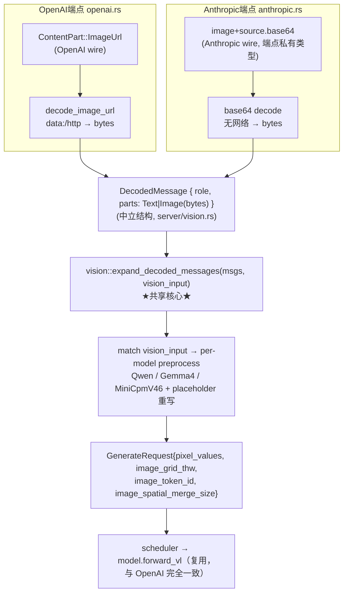

# Anthropic `/v1/messages` 图像支持设计

- 日期：2026-06-01
- 分支：`minicpmv46-text-support`（当前 HEAD）
- 状态：设计待 Boss 复审
- 关联：[`server/anthropic.rs`](../../../ironmlx/src/core/server/anthropic.rs)、[`server/openai.rs`](../../../ironmlx/src/core/server/openai.rs)、[`server/chat_format.rs`](../../../ironmlx/src/core/server/chat_format.rs)、[`cli/serve.rs`](../../../ironmlx/src/cli/serve.rs)

## 1. 目标

让 ironmlx 的 Anthropic `/v1/messages` 端点支持图像请求，覆盖当前全部 4 个真 VLM 架构（Qwen3.5-VL Dense / Qwen3.5-VL MoE / MiniCPM-V-4.6 / Gemma4）。图像来源**仅支持 Anthropic 原生 base64 source**（不含 URL source、不含视频）。

复用 OpenAI 端点已验证的图像 preprocess + `forward_vl` 后端；新代码只在「Anthropic wire 协议解析 + 归一化」一层。

## 2. 现状

### 2.1 路由对等、能力不对等

[`server/mod.rs`](../../../ironmlx/src/core/server/mod.rs) 对泛型 `AppState<M>` 统一挂载两条路由：`/v1/chat/completions`（OpenAI）与 `/v1/messages`（Anthropic）。两套 API 对全部 6 个架构一视同仁——但**仅文本**。

图像能力只在 OpenAI 端点落地：[`openai.rs`](../../../ironmlx/src/core/server/openai.rs) 有完整 vision wiring（`decode_image_url` → `expand_image_parts_in_messages` → `GenerateRequest`）。

### 2.2 Anthropic 端点的两个现状缺陷

`MessagesRequest` 复用了 OpenAI 的 `ChatMessage` / `Content` / `ContentPart`（`chat_format.rs:23-26`），其中图像变体是 OpenAI 形状 `ImageUrl { image_url: { url } }`。由此：

1. **真 Anthropic 客户端无法被解析**：Anthropic 原生图像 block 是 `{"type":"image","source":{...}}`。`ContentPart` 是 internally-tagged 枚举（`#[serde(tag="type")]`），遇到未知 tag `"image"` 直接反序列化失败，axum 返回 422——连友好的「请改用 OpenAI 端点」提示都给不出。
2. **拒绝逻辑张冠李戴**：`anthropic.rs:176-190` 那段「检测 `ImageUrl` 返回 400」只拦得住往 Anthropic 端点误发 **OpenAI 风格** `image_url` 的请求，对真 Anthropic 格式无效。

本设计同时修掉这两个缺陷。

### 2.3 ironmlx 真实 VLM 矩阵（已核实）

| 架构 (`model_type`) | VL 能力 | `VisionInputConfig` 变体 | 本地 checkpoint |
|---|---|---|---|
| Qwen3.5-Dense (`qwen3_5`) | 真 VLM（`vision: Option<VisionTower>`） | `Qwen` | Qwen3.5-4B-MLX-4bit（297 vision_tower 键）|
| Qwen3.5-MoE (`qwen3_5_moe`) | 真 VLM | `Qwen`（与 dense 共用） | Qwen3.5-35B-A3B-4bit（333 键）|
| MiniCPM-V-4.6 (`minicpmv4_6`) | 真 VLM | `MiniCpmV46` | MiniCPM-V-4.6-4bit（437 键）|
| Gemma4 (`gemma4`) | 真 VLM | `Gemma4` | gemma-4-e4b-it-4bit（661 vision 键，本任务已下载）|
| GLM-4.7-Flash (`glm4_moe_lite`) | 纯文本 stub（VL 方法 `Err`） | — | — |
| Llama / MiniCPM5 (`llama`) | 纯文本 stub（VL 方法 `Err`） | — | — |

要点：
- **真 VLM 是 4 个架构**，但 **preprocess 只有 3 个变体**（`VisionInputConfig::Qwen` 同时服务 Qwen3.5 dense 与 moe）。
- GLM / Llama 的 `DenseVlMethods` 是 errors-on-call stub（trait 名为历史遗留），发图像在 `forward_vl` 阶段报错。
- Qwen3.6 那两个本地 checkpoint 的 `model_type` 是 `qwen3_6*`，而 `from_model_type` 只认 `qwen3_5*`，当前 `serve` 加载不了，不在矩阵内。

## 3. 设计：归一化到「解码后字节」（方案 A）

### 3.1 数据流



核心原则：**wire 协议差异隔离在各端点；preprocess / 占位符 / per-model 派生完全共享；forward 后端零改动**。

### 3.2 新模块 `server/vision.rs`

承载与 wire 格式无关的归一化中立类型与共享核心。`chat_format.rs` 继续专注纯文本 render，`vision.rs` 专注图像（单一职责）。

**中立类型**：

```rust
/// 已从各端点 wire 格式解码后的单个内容部分（与协议无关）。
pub enum DecodedPart {
    Text(String),
    Image(Vec<u8>),   // 原始图像字节（已从 base64 / data-URL / http 解出）
}

/// 已解码的单条消息。
pub struct DecodedMessage {
    pub role: String,
    pub parts: Vec<DecodedPart>,
}
```

**共享核心**（从现有 `openai.rs::expand_image_parts_in_messages` 抽出 per-model preprocess + 占位符 + 重写逻辑，输入改为中立结构）：

```rust
/// 对每个 DecodedPart::Image 调用 vision_input 对应的 per-model preprocess，
/// 产出 pixel_values / grid_thw，并把消息重写为「占位符文本」。
/// 与 wire 格式、与端点无关。
pub fn expand_decoded_messages(
    messages: Vec<DecodedMessage>,
    vision_input: &VisionInputConfig,
) -> anyhow::Result<(
    Vec<ChatMessage>,          // flat 文本消息（喂入 render_and_encode）
    Option<Vec<mlx::Array>>,   // pixel_values（无图时 None；返回前已 eval 物化）
    Vec<(i32, i32, i32)>,      // image_grid_thw（每图一项；多切片每片一项）
)>;
```

per-model 分发逻辑（`match vision_input { Qwen | Gemma4 | MiniCpmV46 }`）、`qwen_placeholder` / `gemma4_placeholder`、MiniCPM-V 的 `preprocess_sliced_to_parts` 调用，以及返回前对 pixel_values 的 `mlx::transforms::eval` 物化（避免跨 `spawn_blocking` 线程的 MLX stream 失效），全部从 `openai.rs` 平移到 `vision.rs`，行为不变。

> 说明：现有 `expand_image_parts_in_messages` 已通过 `Content::Parts` 携带「图像出现位置」信息来决定占位符插入点。中立结构 `DecodedMessage.parts` 保留同样的顺序语义（`Text` / `Image` 按出现顺序排列），占位符在重写时按 `Image` 出现位置就地替换，与现有 `flatten_content_with_placeholders` 的语义一致。

### 3.3 OpenAI 端点重构（行为不变）

`openai.rs::expand_image_parts_in_messages` 拆为两段：

1. **wire→bytes**：遍历 `Vec<ChatMessage>`，对每个 `ContentPart::ImageUrl` 调 `decode_image_url`（保留 `data:` / `http(s)` 双路），构造 `Vec<DecodedMessage>`。`ContentPart::Text` 原样转 `DecodedPart::Text`。
2. **共享核心**：调 `vision::expand_decoded_messages`。

`decode_image_url` 仍留在 `openai.rs`（仅 OpenAI 用 URL fetch）。`image_token_id` / `spatial_merge_size` 的 per-model 派生（`openai.rs:414-440`）**移入 `vision.rs` 作共享 helper**——因为 Anthropic 端点装配 `GenerateRequest` 时同样需要 `image_token_id`，必须两端共享单一派生，避免逻辑分叉。

净效果：行为 byte-identical，由现有 OpenAI VL 测试 + 新增 byte-parity 测试双重守护。

### 3.4 Anthropic 端点改造

**端点私有 wire 类型**（`anthropic.rs`，不再复用 OpenAI 的 `ChatMessage` / `ContentPart`）：

```rust
// Anthropic 原生 content schema，仅 base64 source。
#[serde(tag = "type", rename_all = "snake_case")]
enum AnthropicContentPart {
    Text { text: String },
    Image { source: AnthropicImageSource },
}

#[serde(tag = "type", rename_all = "snake_case")]
enum AnthropicImageSource {
    Base64 { media_type: String, data: String },   // 仅 base64
}

// message.content：纯 string 或 array（untagged）
#[serde(untagged)]
enum AnthropicContent {
    Text(String),
    Parts(Vec<AnthropicContentPart>),
}
```

`MessagesRequest.messages` 改用上述私有 message 类型。

**处理流程**：
1. 遍历 messages，对每个 `Image { source: Base64 { data, .. } }`，`base64::decode(data)` → 字节（无网络），构造 `DecodedMessage`。`media_type` **不强校验**，仅信息性；实际格式由下游 image crate 解码时自识别。
2. 调 `vision::expand_decoded_messages` → flat 文本 + pixel_values + grid_thw。
3. `render_and_encode` → prompt_ids。
4. `GenerateRequest` 改为传**真值** `pixel_values` / `image_grid_thw` / `image_token_id` / `image_spatial_merge_size`（现状硬塞 `None` 的 `anthropic.rs:238-243` 删除），其余字段（含 `#[cfg(feature="p5h-profile")]` 的 `p5h_*`）保持现状。
5. 路由（`should_route_to_scheduler` + stream/unary 四分支）不变——图像在 prefill 阶段处理，与流式无关，故 streaming 与 unary 自动同时支持。

**副作用清理**：`anthropic.rs:176-190` 那段「检测 `ImageUrl` 返回 400」整段删除——私有类型本身不认 OpenAI `image_url`，误发会自然 serde 400（§4）。

## 4. 错误处理

| 情况 | 行为 |
|---|---|
| base64 解码失败 | 400，`image decode: <err>` |
| preprocess 坏图 / 尺寸非法 | 400，`image decode/preprocess: <err>`（复用现有 `expand_*` 错误转换）|
| 往 Anthropic 端点误发 OpenAI `image_url` | serde 反序列化失败 → 400（类型不认该 tag）|
| 纯文本模型（GLM / Llama）收到图像 | 复用现有路径：在 `forward_vl` 阶段 `Err("...text-only: VL methods unsupported")` → 经 `admit_err_to_response` → 400。与 OpenAI 端点现状一致，本设计不改善 |
| SchedulerActor 拒绝（队满 / 超 cap / 内存预算） | 复用现有 `admit_err_to_response`（503 / 413）|

## 5. Scope 边界

**纳入**：Anthropic 原生 `image` + `source.base64` 解析；4 真 VLM 架构图像支持；单图 + 多图 + 多切片（MiniCPM-V LLaVA-UHD）；streaming + unary；现状两个 serde 缺陷修复。

**排除**（保持现状，本任务不做）：Anthropic `source.url`（URL source）；Anthropic 顶层 `system` 字段；视频；GLM / Llama 等纯文本模型的图像「友好预拒绝」。

## 6. 测试策略（双重 parity）

| 层 | 覆盖 | 方法 |
|---|---|---|
| **byte-parity**（新代码核心） | 3 个 preprocess 变体（Qwen / Gemma4 / MiniCpmV46）| 同一图像，分别经 OpenAI `data:` base64 路径与 Anthropic `source.base64` 路径，断言 `expand_decoded_messages` 产出的 `pixel_values`（eval 后逐字节）、`image_grid_thw`、flat 文本消息（及其经 `render_and_encode` 后的 prompt_ids）、`image_token_id`、`spatial_merge_size` **逐位一致**。不需真模型 forward；Gemma4 变体用真 `vision_config`（已有 checkpoint）或 dummy |
| **端到端 mlx-vlm 双重 parity** | 4 真 VLM 架构 | Qwen3.5-VL Dense / MoE + MiniCPM-V + Gemma4，经 Anthropic 端点发单图（MiniCPM-V 另加多图 / 多切片），与 mlx-vlm ground-truth 对齐首 token argmax + top-k。baseline 工具走 `iron-rivals/mlx-vlm`（correctness 用 mlx-vlm，不混 omlx）|
| **serde 单测** | Anthropic schema | `image`+`source.base64` 反序列化；纯 string content；text+image 混合 array；误发 OpenAI `image_url` → 解析失败 |
| **回归** | OpenAI 端重构不变 | 现有 OpenAI VL 测试全绿 + 新 byte-parity 守护 |

> first-principles 说明：Anthropic 新代码（归一化）**架构无关**，仅产出图像字节；其后 preprocess 按 `vision_input` 分流、`forward_vl` 后端与 OpenAI **完全相同**且已被 OpenAI 端各架构接入时验证。故 byte-parity 层已充分覆盖新代码正确性；端到端 4 架构重跑是 Boss 选定的稳健冗余验证（验证同一 forward 后端），非新代码必需。

## 7. 验收标准

1. 4 真 VLM 架构经 Anthropic `/v1/messages` 单图请求，端到端与 mlx-vlm 首 token argmax + top-k 一致。
2. MiniCPM-V 多图 + 多切片经 Anthropic 端点与 mlx-vlm 对齐。
3. 3 个 preprocess 变体的 OpenAI↔Anthropic byte-parity 测试全绿。
4. OpenAI 端点重构后现有 VL 测试零回归。
5. 误发 OpenAI `image_url` 到 Anthropic 端点返回 400（非 422 panic）。
6. `cargo +nightly fmt --all -- --check`、`cargo +nightly clippy --all-features --workspace -- -D warnings`、`cargo build --release` 全过（CLAUDE.md 强制）。

## 8. 风险与缓解

| 风险 | 缓解 |
|---|---|
| OpenAI 端点重构引入行为漂移 | byte-parity 测试断言重构前后逐位一致；现有 OpenAI VL 测试守护 |
| pixel_values 跨 `spawn_blocking` 线程 MLX stream 失效 | 共享核心保留现有「返回前 `mlx::transforms::eval` 物化」逻辑 |
| Anthropic 私有类型与 OpenAI 类型重复 | 仅 wire 层重复（设计使然，隔离协议）；归一化后单一共享路径，无逻辑重复 |
| Gemma4 e4b 是 audio+vision 多模态，mlx-vlm 对齐口径 | 仅走 vision 路径；与 OpenAI 端 Gemma4 接入相同口径，沿用 `2026-05-27-ironmlx-gemma4-vision-design.md` 验证方法 |
