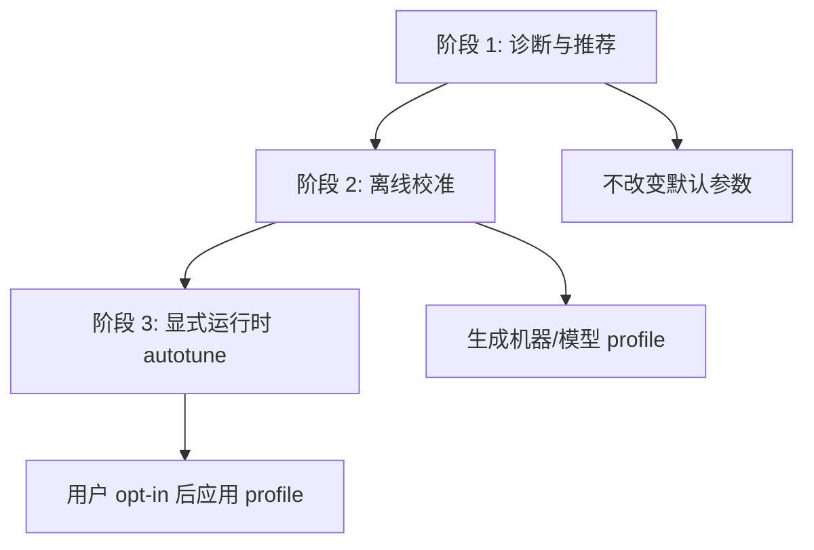

# Scheduler/Autotune 设计研究与轻量落地

状态：阶段 1 诊断报告与阶段 2 离线 profile 选择器已完成轻量落地。worktree `ironmlx-backend-scheduler-autotune`，branch `codex/scheduler-autotune`。

## 0. 结论摘要

本阶段不做自动改参，不改变默认运行行为。当前已落地两类能力：

- 显式 opt-in 的启动诊断能力：读取当前 CLI 参数、模型 `ModelMeta`、有效上下文上限、KV cache 预算和模型级 fresh-prefill batch limit，输出 scheduler/autotune 建议。
- 离线 profile 选择器：读取外部校准结果 JSON，按 agent 长 prompt 场景权重选择推荐 scheduler 参数组合，但只输出结果，不应用到运行时。

原因：

- 当前 scheduler 的性能主要受 `b_max`、`prefill_chunk_size`、`admission_deadline_ms`、`admission_queue_max`、`max_cache_cap`、模型级 `fresh_prefill_batch_limit` 和机器内存共同影响。
- 这些参数在不同硬件、不同模型、不同 agent 长 prompt 负载下没有单一静态最优值。
- 直接自动覆盖用户参数风险较高；先诊断再建议，可以积累真实机器与真实负载数据，避免把一次机器上的经验固化成全局默认。

## 1. 三阶段方向



### 阶段 1：诊断与推荐（本次轻量落地）

- 新增 `--scheduler-autotune-report`。
- 仅在启动时打印报告。
- 报告包含当前参数、KV 预算、模型 fresh-prefill 限制样本和建议。
- 不修改 `serve` 传入 scheduler 的任何参数。

### 阶段 2：离线校准（本次轻量落地）

- 新增 `ironmlx scheduler-autotune --input calibration.json --format text|json`。
- 输入是外部离线校准结果，不由 serve 热路径采样生成。
- 对同一模型/机器下的多个候选 scheduler 参数组合进行公平评分。
- 产出机器/模型 profile 选择结果，例如推荐 `b_max`、chunk 粒度、admission deadline。
- 不把结果写入配置文件，不改变默认参数。

### 阶段 3：显式运行时 autotune（后续）

- 用户传入 `--scheduler-autotune` 或指定 profile 后才应用。
- 应用前打印最终参数和理由。
- 保留手动参数优先级：用户显式指定的参数不被覆盖，除非 Boss 后续要求支持 override 模式。

## 2. 本次范围

本次实现阶段 1 与阶段 2 的轻量版本：

- 新建纯函数模块，便于单元测试和后续离线校准复用。
- CLI 新增 opt-in flag。
- `server::serve` 在模型 meta 解析后打印报告。
- CLI 新增 `scheduler-autotune` 子命令，用于离线 profile 选择。
- 新增 profile 选择数据结构、评分函数、拒绝原因和中文/JSON 输出。
- 新增中文研究文档和实施计划。

不做：

- 不自动调整 `b_max` / `prefill_chunk_size` / `admission_deadline_ms`。
- 不新增运行期动态控制回路。
- 不改变 `/healthz` JSON schema。
- 不把 GLM-4.7 的模型级经验硬编码为全模型默认。
- 不在本阶段实现 benchmark runner；校准数据由外部工具或人工汇总产生。

## 3. 诊断输入

| 输入 | 来源 | 用途 |
|---|---|---|
| `b_max` | CLI | 并发槽数、预算计算、fresh-prefill limit 对比 |
| `prefill_chunk_size` | CLI | 判断长 prompt 是否可 chunked rolling |
| `admission_deadline_ms` | CLI | 判断 admission window 是否可能增加 TTFT |
| `admission_queue_max` | CLI | 判断队列容量和队列禁用 |
| `max_cache_cap` | CLI | 用户请求的单请求 cap |
| `effective_cap_max` | `min(max_cache_cap, model_max_context)` | 实际调度 cap |
| `ModelMeta` | `model.model_meta()` | KV bytes/token、模型上下文、权重估算 |
| total RAM | `system_total_ram_bytes()` | 机器资源诊断 |
| fresh-prefill batch limit | `M::fresh_prefill_batch_limit(pp, b_max)` | 模型级 prefill 策略观测 |

## 4. 推荐策略

### 内存预算

- 计算 `kv_bytes_per_token`。
- 计算 `reserved_kv_bytes = b_max * effective_cap_max * kv_bytes_per_token`。
- 计算 `available_budget_bytes = total_ram - model_weight_bytes - safety_margin`。
- 若 `reserved_kv_bytes > available_budget_bytes`，输出 warning，建议降低 `b_max` 或 `max_cache_cap`。
- 若接近预算上限，输出 warning，提醒长 prompt/并发场景容易触发 runtime admission gate。

### 并发与 agent 长 prompt

- `b_max == 1`：说明当前是单请求优化模式；agent 并发请求会排队，TTFT 可能上升。
- `prefill_chunk_size == 0`：说明禁用 chunking；长 prompt 会形成整段 prefill，占用 decode cadence。
- chunk 很小：提示可能增加 chunk/eval overhead。
- chunk 很大：提示 queued 请求 TTFT 可能变差。

### admission

- `admission_queue_max == 0`：提示队列禁用，饱和时会直接拒绝。
- `admission_deadline_ms` 过大：提示 admission window 可能拉长首批请求 TTFT。

### 模型级 fresh-prefill 限制

报告固定采样 PP=512/1024/2048/8192 下的 `fresh_prefill_batch_limit`。如果某些 PP 下 limit 小于 `b_max`，说明模型已参与降低 fresh-batch prefill 并发，后续调优应把它视为性能路径的一部分。

## 5. 离线 profile 选择

### 输入 schema

离线选择器读取 JSON，顶层结构如下：

```json
{
  "schema_version": 1,
  "model_name": "GLM-4.7-flash-4bit",
  "hardware_label": "M-series host",
  "objective": {
    "ttft_p95_weight": 0.4,
    "itl_p95_weight": 0.35,
    "e2e_p95_weight": 0.2,
    "throughput_weight": 0.05
  },
  "measurements": [
    {
      "config": {
        "b_max": 2,
        "prefill_chunk_size": 1024,
        "admission_deadline_ms": 5,
        "admission_queue_max": 32,
        "max_cache_cap": 32768
      },
      "prompt_len": 2048,
      "max_new_tokens": 128,
      "concurrency": 2,
      "ttft_ms_p95": 125.0,
      "itl_ms_p95": 14.0,
      "e2e_s_p95": 3.1,
      "tokens_per_sec": 112.0,
      "memory_budget_ok": true,
      "cached_tokens_warning": false
    }
  ]
}
```

`objective` 可省略，默认使用 agent 场景权重：TTFT p95 0.40、ITL p95 0.35、E2E p95 0.20、吞吐 0.05。

### 评分策略

- 先按候选配置分组。
- 任一 row 报告 `memory_budget_ok=false` 的候选会被拒绝。
- 任一 row 报告 `cached_tokens_warning=true` 的候选会被拒绝，避免 prefix cache 污染 PP/TTFT 判断。
- 剩余候选必须覆盖相同的 `(prompt_len, max_new_tokens, concurrency)` 场景集合，否则拒绝为 `missing_scenario_coverage`。
- 对每个场景，按同场景最优值归一化：
  - TTFT p95、ITL p95、E2E p95 越低越好。
  - tokens/s 越高越好。
- 最终选择平均加权分数最低的候选。

### 覆盖提醒

- 如果输入没有 `prompt_len >= 1024`，输出 `no_long_prompt_coverage` warning。
- 如果输入没有 `concurrency > 1`，输出 `no_concurrent_coverage` warning。
- 如果只剩一个完整候选，输出 `single_candidate` warning，提示这是验证而不是比较。

## 6. 后续研究问题

- agent 常见长 prompt 下，TTFT 与 ITL 哪个应作为主优化目标，需要按产品场景定义权重。
- chunk 粒度应按模型、prompt 长度、机器内存和 decode cadence 综合决定，不能只用固定阈值。
- 离线 profile 的持久化位置、版本兼容和手动参数优先级需要单独设计。
- 如何从 `iron-bench` 自动生成 `measurements` schema 仍需后续衔接。
- 真正运行时 autotune 是否允许根据 `/healthz` 和队列状态动态调整策略，需要先证明不会引入抖动。
