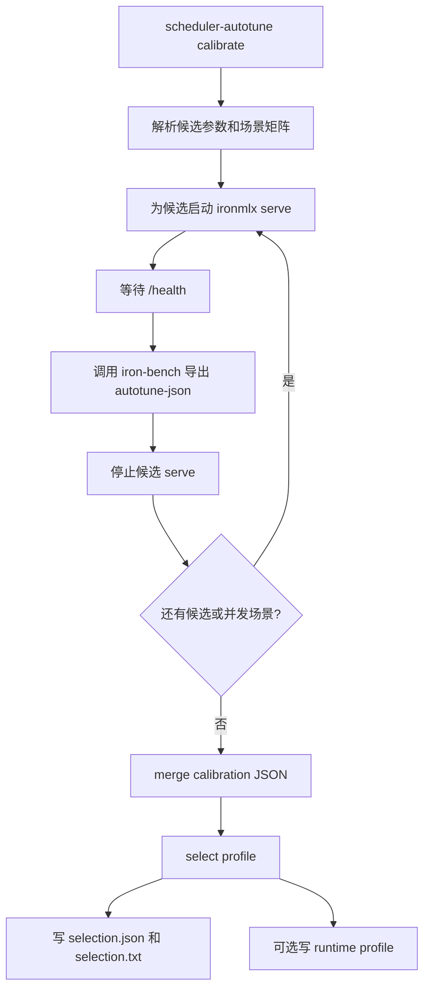

# Scheduler Autotune Calibrate 设计

状态：已轻量落地。目标分支 `codex/scheduler-autotune-calibrate`，基于 `codex/scheduler-autotune`。

## 1. 目标

新增显式 opt-in 的 `scheduler-autotune calibrate` 子命令，把当前已经落地的几段能力串成一条用户可执行的离线校准链路：

- 按候选 scheduler 参数逐个启动本地 `ironmlx serve`。
- 等待服务健康后，用 `iron-bench --format autotune-json` 跑顺序和并发场景。
- 合并候选 calibration JSON。
- 运行 selector，输出选择结果。
- 可选写出 runtime profile，供 `serve --scheduler-profile` 直接使用。

该命令服务于 agent 长 prompt 场景。默认不改变 `serve` 行为，不做运行期动态调参，不把某台机器的结果固化为全局默认。

## 2. 非目标

- 不实现 runtime feedback loop。
- 不在请求热路径中采样、改参或重启 scheduler。
- 不新增全局 profile 存储位置。
- 不改变 `iron-bench` 的 engine-neutral 定位。
- 不支持远端服务自动校准。本阶段只编排本机 `ironmlx serve` 子进程。
- 不自动推断无限候选空间。候选参数由用户显式传入，或由后续独立阶段设计默认候选模板。

## 3. 用户入口

推荐入口：

```bash
cargo run --release -p ironmlx -- \
  scheduler-autotune calibrate \
  --model /path/to/model \
  --model-name GLM-4.7-flash-4bit \
  --iron-bench-bin target/release/iron-bench \
  --output-dir reports/scheduler-autotune/glm47-m5max \
  --candidate b_max=1,prefill_chunk_size=2048,admission_deadline_ms=5,admission_queue_max=32,max_cache_cap=32768 \
  --candidate b_max=2,prefill_chunk_size=1024,admission_deadline_ms=5,admission_queue_max=32,max_cache_cap=32768 \
  --prompt-len 1024,2048,4096 \
  --max-tokens 128 \
  --concurrency 1,2 \
  --runs 5 \
  --warmup 1 \
  --duration 30 \
  --warmup-duration 5 \
  --write-profile reports/scheduler-autotune/glm47-m5max/scheduler-profile.json
```

关键规则：

- `--candidate` 可重复。每个候选必须完整包含 `b_max`、`prefill_chunk_size`、`admission_deadline_ms`、`admission_queue_max`、`max_cache_cap`。
- `--concurrency 1` 使用 iron-bench 顺序模式。
- `--concurrency N>1` 使用 iron-bench 并发模式。
- `--output-dir` 必填，所有中间 JSON、日志和最终结果都写入该目录。
- `--iron-bench-bin` 必填。本阶段不猜测 cargo workspace，也不隐式下载或构建 benchmark 工具。
- `--write-profile` 可选；未提供时只写 calibration 和 selection。该路径按用户传入值写入，推荐放在 `--output-dir` 下，便于和本次校准结果一起归档。
- `hardware_label` 是输出元数据，由 `iron-bench --format autotune-json` 基于本机 CPU 与内存容量自动生成；`scheduler-autotune calibrate` 不要求用户传入硬件标签。

## 4. 架构



实现边界：

- `ironmlx/src/cli/scheduler_autotune.rs` 继续负责 subcommand dispatch。
- 新增 `ironmlx/src/cli/scheduler_autotune_calibrate.rs`，只负责 calibrate 参数、候选解析、命令构造和子进程编排。
- 评分、merge、runtime profile 生成继续复用 `core::scheduler_autotune`。
- `iron-bench` 仍作为外部二进制运行，`ironmlx` 不依赖 `iron-bench` crate。

## 5. 数据流

每个候选与每个 concurrency 场景生成一个 candidate JSON 文件：

```text
output-dir/
  candidate-000-c1.json
  candidate-000-c2.json
  candidate-001-c1.json
  candidate-001-c2.json
  calibration.json
  selection.json
  selection.txt
  serve-candidate-000.log
  serve-candidate-001.log
  scheduler-profile.json  # 当 --write-profile 指向 output-dir 下时
```

命令完成后：

- `calibration.json` 是 merge 后的完整输入。
- `selection.json` 是机器可读选择结果。
- `selection.txt` 是人工可读选择结果。
- `scheduler-profile.json` 只在 `--write-profile` 存在时写出。

## 6. 子进程策略

每个候选顺序执行：

1. 使用当前 `ironmlx` 可执行文件启动 `serve`。
2. 传入候选 scheduler 参数、`--model`、`--host 127.0.0.1`、`--port <base_port>`。
3. 轮询 `http://127.0.0.1:<port>/health`，直到成功或超过 `--startup-timeout-sec`。
4. 对每个 concurrency 场景调用 `iron-bench`。
5. 无论 benchmark 成功或失败，都停止该 `serve` 子进程。

默认端口为 `18080`，可通过 `--port` 覆盖。候选串行运行，因此不需要多端口并行调度。

## 7. 错误处理

- candidate 解析失败：启动前直接报错，错误包含原始 candidate 字符串。
- 输出目录已存在：允许复用，但同名文件会被覆盖；命令启动时打印输出目录。
- serve 启动失败：保留 serve 日志，停止当前候选，命令失败。
- health 超时：停止 serve，命令失败。
- iron-bench 失败：保留 stdout/stderr 摘要和候选 JSON 路径，停止 serve，命令失败。
- merge 或 select 无可用候选：保留中间 candidate JSON，命令失败。

失败时不删除 artifacts，方便复盘。

## 8. 测试策略

单元测试优先覆盖纯逻辑，不依赖真实模型：

- CLI parser 能解析 `scheduler-autotune calibrate`。
- candidate 字符串解析为 `SchedulerAutotuneProfileConfig`。
- concurrency=1 构造顺序 iron-bench 参数。
- concurrency>1 构造并发 iron-bench 参数。
- serve 命令包含候选 scheduler 参数。
- output path 生成稳定且不碰撞。

不在自动测试中加载真实模型或启动真实 MLX 服务。真实 benchmark 作为手工验证项，在报告中记录命令与结果。

## 9. 验收标准

- 用户可以用一个 `scheduler-autotune calibrate` 命令生成 `calibration.json`、`selection.json`、`selection.txt` 和可选 `scheduler-profile.json`。
- 生成的 `scheduler-profile.json` 可直接用于 `serve --scheduler-profile`。
- 默认 `serve` 行为不变。
- 原有 `scheduler-autotune select/merge` 行为不变。
- Rust 验证通过：`cargo fmt`、nightly fmt check、workspace clippy、release build。
