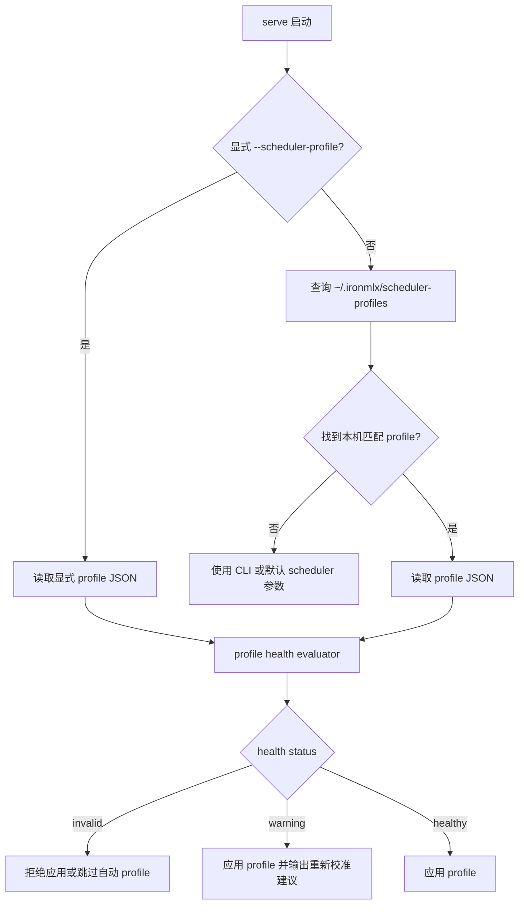

# Scheduler Autotune V2 Profile Health 设计

状态：准备落地。目标分支 `codex/scheduler-autotune-v2`，基于 `codex/scheduler-decode-cadence-protection`。

## 1. 背景

当前 autotune v1 已经具备以下能力：

- `scheduler-autotune calibrate` 可以在本机自动启动候选 `ironmlx serve`，调用 `iron-bench`，合并校准结果并选择 runtime profile。
- 生成的 runtime profile 会写入 `~/.ironmlx/scheduler-profiles`。
- `ironmlx serve` 未显式传入 `--scheduler-profile` 时，会按本机硬件标签与模型路径或模型名自动加载匹配 profile。
- 用户显式传入 scheduler CLI 参数时，CLI 参数优先覆盖 profile。

因此 v2 不再重复实现一键校准或一键应用，而是补齐 profile 是否可信、是否覆盖 agent 长 prompt 场景、是否需要重新校准的判断能力。

## 2. 目标

- 在 runtime profile 中记录校准选择元数据，包括生成时间、ironmlx 版本、选择策略、objective、覆盖场景、候选数量、拒绝数量、selection warning。
- 在 core 层提供纯函数 profile health evaluator，判断 profile 是否健康、需要 warning，或不可使用。
- `serve` 自动加载 profile 后输出 health 诊断；健康 warning 不阻止启动，硬错误才拒绝使用。
- `scheduler-autotune profile doctor --model <path>` 支持用户主动检查本机当前模型 profile 的健康状态。
- 修正旧文档中已经过时的“未传 profile 时默认行为不变 / 只能显式应用 profile”描述。

## 3. 非目标

- 不在请求运行过程中自动修改 `b_max`、`max_cache_cap`、`admission_deadline_ms`、`admission_queue_max`。
- 不实现热更新 profile。
- 不实现远端服务 profile 管理。
- 不兼容旧 schema 的 runtime profile；v2 会提升 schema，旧 profile 需要重新校准或重新导入。
- 不把某个模型或某台机器的 profile 固化为全局默认。

## 4. 设计边界

profile health 分为三类：

| 状态 | 含义 | serve 行为 |
|---|---|---|
| `healthy` | 没有 warning 或 error | 应用 profile，并输出简短日志 |
| `warning` | profile 可用，但存在过期、版本变化、覆盖不足、selection warning 等风险 | 继续应用 profile，并输出重新校准建议 |
| `invalid` | schema 或 hardware 明确不匹配 | 拒绝应用 profile |

模型名不一致只作为 warning，不作为硬错误。原因是当前 profile store 支持通过精确 `model_path` 匹配；某些 profile 的 `model_name` 可能来自校准命令参数，不一定等于本地目录名。真正的自动加载匹配仍由 store 的 `model_path/model_name + hardware + schema` 查询承担。

## 5. Runtime Profile Schema

v2 profile 在现有字段基础上新增 `metadata`：

```json
{
  "schema_version": 4,
  "model_name": "GLM-4.7-flash-4bit",
  "hardware_label": "apple-m5-max-128gb",
  "config": {
    "b_max": 1,
    "prefill_chunk_size": 2048,
    "admission_deadline_ms": 5,
    "admission_queue_max": 32,
    "max_cache_cap": 32768,
    "decode_cadence_mid_chunk_cap": 256
  },
  "rules": [],
  "metadata": {
    "created_at_unix_ms": 1811606400000,
    "ironmlx_version": "0.1.0",
    "selection_profile": "agent-long-prompt",
    "objective": {
      "ttft_p95_weight": 0.4,
      "itl_p95_weight": 0.35,
      "e2e_p95_weight": 0.2,
      "throughput_weight": 0.05
    },
    "scenario_coverage": [
      { "prompt_len": 1024, "max_new_tokens": 128, "concurrency": 1 },
      { "prompt_len": 4096, "max_new_tokens": 128, "concurrency": 2 }
    ],
    "selected_score": 1.0,
    "candidate_count": 4,
    "rejected_count": 0,
    "selection_warnings": []
  }
}
```

## 6. Health 检查规则

| 检查项 | 级别 | 说明 |
|---|---|---|
| `schema_version != SCHEDULER_AUTOTUNE_SCHEMA_VERSION` | error | profile schema 不匹配，不应用 |
| `hardware_label != 本机 hardware_label` | error | 机器资源不同，不应用 |
| `model_name != 当前模型目录名` | warning | 可能是自定义模型名；继续应用 |
| `metadata.ironmlx_version != 当前 ironmlx 版本` | warning | 版本变化后建议重新校准 |
| `created_at_unix_ms` 超过默认 30 天 | warning | profile 可能过期 |
| `scenario_coverage` 为空 | warning | 无法判断覆盖质量 |
| 无 `prompt_len >= 1024` | warning | 不覆盖 agent 长 prompt 常规场景 |
| 无 `concurrency > 1` | warning | 不覆盖并发排队 TTFT |
| selection 原本带 warning | warning | 透传 selector 风险信息 |

## 7. 运行流程



## 8. 用户入口

主动检查当前本机 profile：

```bash
cargo run --release -p ironmlx -- \
  scheduler-autotune profile doctor \
  --model /path/to/model
```

输出应包含：

- store 路径。
- profile 路径。
- health status。
- 每条 warning/error 的 code 和 message。
- 重新校准建议命令。

`serve` 仍保持自动加载：

```bash
cargo run --release -p ironmlx -- serve \
  --model /path/to/model
```

如果没有可用 profile，服务仍正常启动，继续使用 CLI 或默认 scheduler 参数。

## 9. 后续方向

v2 完成后，下一阶段可以进入自适应/长期自治型 autotune：

- 持久化运行时 workload 摘要，而不是逐请求详细日志。
- 记录 profile 命中场景与实际请求 PP/TG/C 分布。
- 当真实 workload 长期落在未覆盖区域时，提示重新校准。
- 仍需在证明稳定性前避免运行时自动改危险参数。
