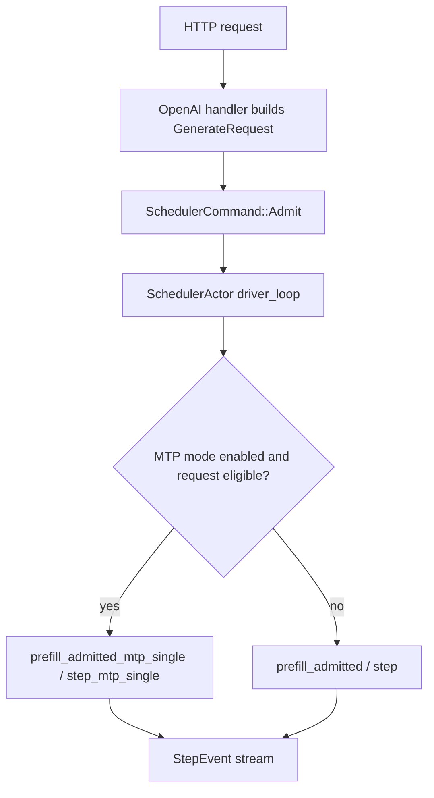

# Scheduler Actor MTP Gating Design

**目标：** 在 Phase 1 的 scheduler-internal MTP 基础上，将 MTP 接入 `ironmlx serve` 的 SchedulerActor 路径。范围仍限定为 `b_max=1`、text-only、Qwen dense/MoE、greedy sampler；VL、多 row、非 Qwen 和非 greedy 请求继续走现有 scheduler 路径。

---

## 1. 背景

Phase 1 已经完成：

- Qwen dense/MoE MTP head 加载与兼容性校验。
- `Scheduler::prefill_admitted_mtp_single` / `Scheduler::step_mtp_single`。
- offsets-only rollback primitives。
- `ironmlx-core-bench --mode scheduler-text --b-max 1 --mtp-model-dir ...` 真实走 scheduler internal MTP。

Phase 2 要把这条路径从 bench 推进到 HTTP 服务层，使 `ironmlx serve` 可以在单请求 text workload 中使用 MTP。

---

## 2. Scope

### In Scope

- `ironmlx serve` 新增 `--mtp-model-dir` 与 `--mtp-draft-tokens`。
- 启动期加载 MTP head，并让 SchedulerActor 持有它。
- SchedulerActor 在每个 batch 内按请求条件选择 MTP 或普通 scheduler。
- 只允许启动期 `b_max == 1` 时启用 MTP。
- 只允许 Qwen dense/MoE 模型启用 MTP。
- 请求级 gating：text-only 且 greedy sampler 时走 MTP；VL 或非 greedy 请求走普通 scheduler。
- 增加 doc-hidden counters，便于单元测试验证 actor 确实走过 MTP prefill/step。
- 真实 serve smoke 使用 Qwen3.5 base + MTP。

### Out Of Scope

- multi-row MTP。
- mid-admit MTP。
- VL MTP。
- 非 Qwen MTP。
- 修改 OpenAI/Anthropic response schema。
- 改变现有普通 scheduler 行为。
- 自动推断 MTP repo 或远程下载。

---

## 3. 启动期配置

`ServeArgs` 增加：

```rust
#[arg(long = "mtp-model-dir")]
pub mtp_model_dir: Option<PathBuf>,

#[arg(long = "mtp-draft-tokens", default_value_t = 1)]
pub mtp_draft_tokens: usize,
```

启动期解析规则：

- 未设置 `--mtp-model-dir`：保持现有服务行为。
- 设置 `--mtp-model-dir`：
  - 目录必须存在。
  - `--b-max` 解析后的值必须为 `1`。
  - 模型 architecture 必须为 `Qwen35Dense` 或 `Qwen35Moe`。
  - `mtp_draft_tokens` 必须大于 0。
  - 使用 `Loader::open_mtp` 和 `model.load_mtp_head` 加载 head。

Qwen3.6 dense/MoE checkpoint 如果继续声明为 `qwen3_5` / `qwen3_5_moe`，会复用现有 Qwen35 graph 和 MTP trait impl。

---

## 4. Actor 架构

现有 `spawn_scheduler_actor<M>` 对所有模型保持不变。新增 MTP 版本：

```rust
pub fn spawn_scheduler_actor_with_mtp<M>(
    model: Arc<Mutex<M>>,
    mtp: M::MtpHead,
    mtp_draft_tokens: usize,
    ...
) -> Result<SchedulerActorHandle, MemoryBudgetError>
where
    M: Model + DenseVlMethods + MtpSpeculativeModel + Send + 'static;
```

内部共享同一套 `driver_loop`，通过 actor MTP mode 选择 prefill/step：



理由：

- 不把所有 served models 都绑定到 `MtpSpeculativeModel`。
- 非 MTP 服务仍使用原函数和原泛型边界。
- MTP actor 只在 Qwen 分支创建。
- driver hot path 只多一次私有 mode 分支。

---

## 5. 请求级 Gating

新增 scheduler eligibility helper：

```rust
pub(crate) fn mtp_single_active_text_greedy_eligible(&self) -> bool;
```

返回 true 的条件：

- `b_max == 1`。
- 当前只有一个 active request。
- request 是 text-only：`pixel_values.is_none()` 且 `image_grid_thw.is_none()`。
- sampler 可 pipeline：`request.sampler.is_pipelinable()`。

MTP mode 只在 helper 为 true 时调用 Phase 1 MTP 方法。否则调用普通 scheduler 方法。

这不是兼容性分支，而是 Phase 2 的安全边界：MTP feature 只对已验证请求生效，其他请求保持原 scheduler 合同。

---

## 6. Counters

`SchedulerActorHandle` 新增 doc-hidden counters：

```rust
pub mtp_prefill_count: Arc<AtomicU64>,
pub mtp_step_count: Arc<AtomicU64>,
```

计数语义：

- 每次 actor 实际调用 `prefill_admitted_mtp_single`，`mtp_prefill_count += 1`。
- 每次 actor 实际调用 `step_mtp_single`，`mtp_step_count += 1`。
- 普通 scheduler path 不递增。

这些 counters 只用于测试和 smoke 诊断，不进入 public HTTP API。

---

## 7. 错误处理

- 启动期 MTP 配置错误直接返回 CLI error。
- MTP path 内部错误沿用 Phase 1 scheduler poison / evict recovery 语义。
- 对 request 不符合 MTP eligibility 的情况不报错，直接走普通 scheduler。
- 如果 text-only greedy request 进入 MTP path 后出错，actor 按现有 prefill/step error 分支清理 event channels 和 queued admits。

---

## 8. 验证

单元测试：

- serve config 解析默认关闭 MTP。
- `--mtp-model-dir` 只允许 Qwen + `b_max=1`。
- 缺失目录、非 Qwen、`b_max>1`、`mtp_draft_tokens=0` 被拒绝。
- actor MTP mode 对 text-only greedy 单请求递增 MTP counters。
- VL 或非 greedy request 不递增 MTP counters。

真实 smoke：

- 启动 `ironmlx serve`：
  - base: `Qwen3.5-4B-MLX-4bit`
  - MTP: `Qwen3.5-4B-MTP-4bit`
  - `--b-max 1`
  - `--mtp-model-dir ...`
- 发送 OpenAI `/v1/chat/completions` unary text 请求，确认返回 200。
- 发送 streaming text 请求，确认 SSE 有 content 或 finish chunk。
- 发送 `--b-max 2 + --mtp-model-dir` 启动命令，确认启动失败。

---

## 9. 后续阶段

Phase 3 才处理 multi-row MTP。它需要重新设计 per-row pending queue、ragged verify、MTP cache compact layout、mid-admit 与 active decode 的交错策略，本阶段不触碰。
