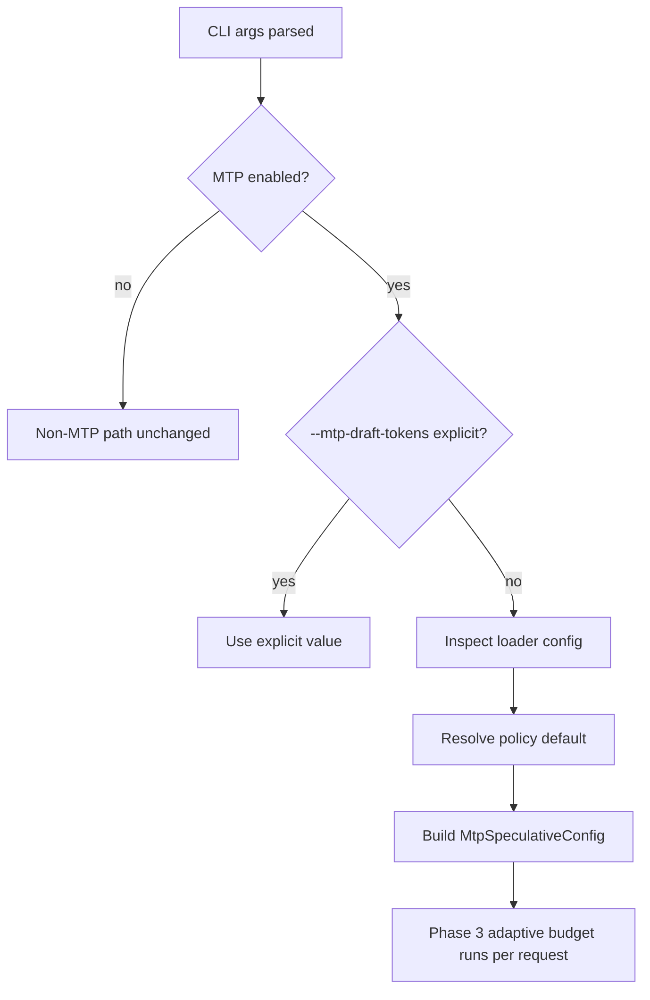

# MTP Phase 4 Policy Design

## Goal

Turn the Phase 3 benchmark result into a safe default runtime policy for MTP draft depth, so users who provide an MTP model do not need to manually guess `--mtp-draft-tokens`.

## Context

Phase 3 measured the scheduler MTP path with a fixed greedy prompt:

- Qwen3.5-4B: best at `mtp_d1`, 1.136x over non-MTP baseline.
- Qwen3.6-27B: best at `mtp_d2`, 1.591x over non-MTP baseline.
- Qwen3.6-35B-A3B: best at `mtp_d2`, 1.098x over non-MTP baseline.

Phase 3 also keeps per-request adaptive draft budgeting. Phase 4 should preserve that runtime adaptation and only change the initial/default maximum draft depth.

## Requirements

1. If the user explicitly passes `--mtp-draft-tokens`, ironmlx must use that value unchanged.
2. If the user enables MTP with `--mtp-model-dir` but does not explicitly pass `--mtp-draft-tokens`, ironmlx should select a model-aware default:
   - Qwen3.5 dense 4B: `1`
   - Qwen3.6 27B: `2`
   - Qwen3.6 35B-A3B: `2`
   - unknown supported Qwen MTP model: `1`
3. The policy must be shared by `generate`, `serve`, and `ironmlx-core-bench`.
4. Non-MTP execution must remain unchanged.
5. Unsupported architectures and non-greedy samplers keep the existing rejection behavior.
6. Phase 4 must not add startup benchmark runs or online cross-request exploration.

## Architecture

Add a small policy helper in the core MTP module:

- `MtpDraftTokensArg` records whether a CLI value was explicit or omitted.
- `resolve_mtp_draft_tokens` returns the explicit value when present, otherwise uses model config metadata.
- `default_mtp_draft_tokens_for_config` maps known Qwen model configs to conservative defaults.

The CLI layers will change their `mtp_draft_tokens` argument from a plain `usize` default to `Option<usize>`. This preserves the distinction between "user chose 1" and "user omitted the flag".

## Model Detection

The policy should use existing loader config values rather than filesystem path parsing. Qwen3.6 configs already carry enough structural metadata to distinguish the 27B dense model from the 35B-A3B MoE model. Qwen3.5 dense defaults to `1`.

If config-based detection cannot identify a known Phase 3 benchmarked model, the policy defaults to `1`. This avoids applying `d2` to an unknown model family without evidence.

## Data Flow

## Testing

Add focused tests for:

- Qwen3.5 dense config resolves to `1`.
- Qwen3.6 27B config resolves to `2`.
- Qwen3.6 35B-A3B config resolves to `2`.
- Explicit `--mtp-draft-tokens 1` overrides a Qwen3.6 default of `2`.
- `serve`, `generate`, and `ironmlx-core-bench` parse omitted `--mtp-draft-tokens` as `None`.
- Existing zero-value rejection still applies when the user explicitly passes `0`.

## Out Of Scope

- No startup micro-benchmark autotune.
- No online multi-depth exploration.
- No compatibility aliases for old CLI behavior.
- No change to Phase 3 cache reuse, rollback, or adaptive budget semantics.

## Self Review

- No placeholder requirements remain.
- Explicit and omitted CLI values are disambiguated.
- Policy is conservative for unknown supported models.
- The design keeps Phase 4 independent from future Phase 5 dynamic exploration.
