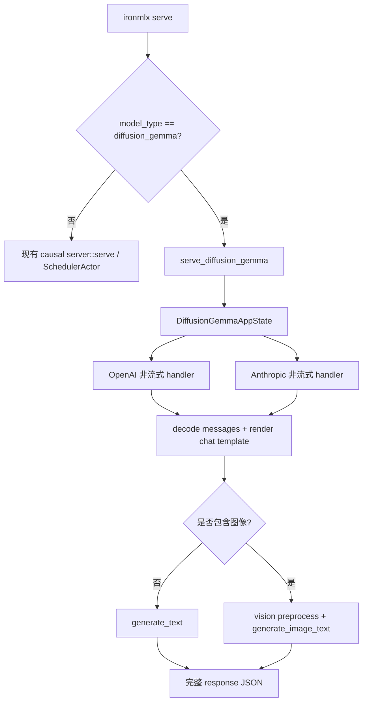

# DiffusionGemma Server Serial Lane 设计

- 日期：2026-06-16
- 分支：`codex/diffusiongemma-server-scheduler`
- 状态：设计待 Boss 复审
- 关联：[`ironmlx/src/cli/serve.rs`](../../../ironmlx/src/cli/serve.rs)、[`ironmlx/src/core/server/mod.rs`](../../../ironmlx/src/core/server/mod.rs)、[`ironmlx/src/core/server/openai.rs`](../../../ironmlx/src/core/server/openai.rs)、[`ironmlx/src/core/server/anthropic.rs`](../../../ironmlx/src/core/server/anthropic.rs)、[`ironmlx/src/models/diffusion_gemma/generation.rs`](../../../ironmlx/src/models/diffusion_gemma/generation.rs)

## 1. 背景

DiffusionGemma 已在 CLI `generate` 路径支持 text-only 与 image-text-to-text。当前 `ironmlx serve` 启动期仍显式拒绝 `ModelArchitecture::DiffusionGemma`，原因是现有 server runtime 围绕 causal LM 架构设计：

- `AppState<M>` 要求 `M: Model + DenseVlMethods + Send + 'static`。
- `SchedulerActor` 调度的是 causal KV-cache prefill/decode。
- OpenAI/Anthropic streaming 路径依赖 token-by-token 的 `GenerationStream` 或 scheduler `StepEvent`。

DiffusionGemma 的生成方式是 block diffusion。它使用 `DiffusionGemmaCache` 与自有的 `generate_text` / `generate_image_text`，不是 causal KV-cache 解码模型。因此，server 支持不能通过伪造 `DenseVlMethods` 或强接现有 `SchedulerActor` 完成。

## 2. 目标

本阶段目标是让 `ironmlx serve` 能正确加载并服务 DiffusionGemma 架构模型，范围限定为：

- OpenAI `/v1/chat/completions` 非流式请求。
- Anthropic `/v1/messages` 非流式请求。
- text-only 请求。
- image-text-to-text 请求。
- 单模型实例上的请求串行执行，HTTP 层可接收多个请求，但推理一次只运行一个。
- `stream: true` 请求返回明确错误，不伪装为实时 token streaming。

## 3. 非目标

本阶段不做：

- 接入现有 causal `SchedulerActor`。
- 实现 DiffusionGemma 真实 batch scheduler。
- 实现 token-level 或 step-level SSE streaming。
- 为了复用 server 泛型而给 DiffusionGemma 写假的 `DenseVlMethods`。
- 多模型副本并行推理。
- 修改 OpenAI/Anthropic response schema。

## 4. 方案对比

推荐方案是新增 DiffusionGemma 专用 serial block-diffusion lane：

- `serve` 识别 `ModelArchitecture::DiffusionGemma` 后进入独立启动函数。
- 该启动函数加载 `DiffusionGemmaModel`、tokenizer、generation config 与 vision config。
- 请求处理复用已有 OpenAI/Anthropic message 解析、chat template、vision preprocess。
- 推理阶段调用 DiffusionGemma 自有 `generate_text` / `generate_image_text`。
- 并发请求通过模型互斥串行执行。

备选方案一是把 DiffusionGemma 强行塞进现有 `AppState<M>` / `SchedulerActor`。这个方案需要伪造 causal VL forward 和 KV-cache 语义，不可靠，也违反“不写兼容性代码”的要求。

备选方案二是直接实现完整 block-diffusion batch scheduler。这个方向最终更强，但需要重新设计请求状态、mask 更新、diffusion step 对齐、图像 embedding 复用、不同长度 batch padding 和取消语义，适合后续单独阶段。

## 5. 架构设计

新增一个 DiffusionGemma server runtime，与现有 causal server 并列，而不是嵌入原泛型状态：



### 5.1 启动入口

`ironmlx/src/cli/serve.rs` 中移除 DiffusionGemma 的启动期硬拒绝。`match architecture` 的 DiffusionGemma 分支调用专用启动函数，例如：

```rust
serve_diffusion_gemma(args, model_dir, tokenizer, loader, runtime)
```

该函数不使用 `serve_with_model<M>`，因为后者的泛型边界属于 causal server。

### 5.2 状态结构

新增 DiffusionGemma 专用状态，例如：

```rust
pub struct DiffusionGemmaAppState {
    pub model: Arc<Mutex<DiffusionGemmaModel>>,
    pub tokenizer: Tokenizer,
    pub generation_config: DiffusionGemmaGenerationConfig,
    pub model_id: String,
    pub vision_input: VisionInputConfig,
    pub max_new_tokens_cap: usize,
}
```

模型互斥锁是 serial lane 的核心：同一进程内单个 DiffusionGemma 模型实例一次只执行一个生成任务。锁内只包住模型推理，不把 HTTP 解析、图片解码、chat template 渲染放进临界区。

### 5.3 OpenAI / Anthropic handler

DiffusionGemma handler 与现有 OpenAI/Anthropic handler 共享 wire 层解析能力，但不复用现有 `GenerateRequest`：

- OpenAI：复用 `decode_openai_messages` 与 `expand_decoded_messages`。
- Anthropic：复用 `decode_anthropic_messages` 与 `expand_decoded_messages`。
- text-only：得到 `prompt_ids` 后调用 `generate_text`。
- image-text-to-text：得到 `pixel_values`、`image_grid_thw`、`image_token_id` 后调用 `generate_image_text`。

handler 返回与现有 API 兼容的非流式 JSON：

- OpenAI 返回 `chat.completion` 风格 response。
- Anthropic 返回 `message` 风格 response。

### 5.4 Streaming 行为

`stream: true` 请求直接返回明确错误，例如 HTTP 400：

```json
{
  "error": {
    "message": "DiffusionGemma server lane does not support streaming; send stream=false",
    "type": "unsupported_feature"
  }
}
```

不采用“先生成完整结果再拆成 SSE chunk”的方案，因为这会让客户端误以为模型在实时解码。DiffusionGemma 后续若支持 streaming，需要基于 block-diffusion step 设计真实事件语义。

### 5.5 并发与调度

本阶段的“scheduler support”含义是提供正确的 server admission lane，而不是复用现有 causal scheduler：

- HTTP server 可以同时接收多个请求。
- 每个请求在进入推理前等待模型互斥锁。
- 拿到锁后完整执行一次 `generate_text` 或 `generate_image_text`。
- 后续请求按锁竞争顺序串行执行。

这不是真实并发推理。真实并发后续有两条路线：

- 多模型副本：实现简单，但 `diffusiongemma-26B-A4B-it-4bit` 内存压力很高。
- block-diffusion batch scheduler：正确方向，但需要独立设计和验证，不能复用 causal KV scheduler。

## 6. 数据流

text-only：

1. 解析 OpenAI/Anthropic 请求。
2. 拒绝 `stream: true`。
3. 解码 message content 为 text parts。
4. 应用 chat template，得到 `prompt_ids`。
5. 获取模型锁。
6. 调用 `generate_text`。
7. 汇总事件文本，返回非流式 response。

image-text-to-text：

1. 解析 OpenAI/Anthropic 请求。
2. 拒绝 `stream: true`。
3. 解码 text + image content。
4. 使用 DiffusionGemma/Gemma4 兼容的 image placeholder 与 vision preprocess。
5. 应用 chat template，得到 `prompt_ids`。
6. 获取模型锁。
7. 调用 `generate_image_text`。
8. 汇总事件文本，返回非流式 response。

## 7. 错误处理

| 场景 | 行为 |
|---|---|
| `stream: true` | HTTP 400，明确说明 DiffusionGemma server lane 当前不支持 streaming |
| 图像解码失败 | HTTP 400，返回 decode/preprocess 错误 |
| 请求图像但模型 checkpoint 缺失 vision 权重 | HTTP 400 或 500，按加载/推理阶段真实错误返回，不静默降级 |
| `max_tokens == 0` | 返回空 content，与现有 DiffusionGemma generation 行为一致 |
| 推理内部错误 | HTTP 500，包含简短错误信息 |
| 服务启动期缺失必要 config | CLI error，拒绝启动 |

## 8. 测试策略

单元测试：

- DiffusionGemma architecture 不再被 `serve` 启动期拒绝。
- `stream: true` 在 OpenAI 与 Anthropic DiffusionGemma handler 中返回明确错误。
- text-only handler 能把生成事件汇总为 OpenAI/Anthropic 非流式 response。
- image-text handler 能正确传递 `pixel_values`、`image_grid_thw`、`image_token_id`。
- 并发测试验证两个请求不会同时进入模型生成临界区。

集成验证：

- 使用本地 `/Users/xin/.ironmlx/models/mlx-community/diffusiongemma-26B-A4B-it-4bit` 启动 `ironmlx serve`。
- OpenAI text-only 请求返回 200 且内容非空。
- Anthropic text-only 请求返回 200 且内容非空。
- OpenAI image-text-to-text 请求返回 200。
- Anthropic image-text-to-text 请求返回 200。
- OpenAI/Anthropic `stream: true` 请求返回明确错误。

Rust 检查：

- `cargo fmt`
- `cargo +nightly fmt --all -- --check`
- `cargo +nightly clippy --all-features --workspace -- -D warnings`
- `cargo build --release`

## 9. 验收标准

1. `ironmlx serve --model /Users/xin/.ironmlx/models/mlx-community/diffusiongemma-26B-A4B-it-4bit` 能成功启动。
2. OpenAI 与 Anthropic 非流式 text-only 请求可通过 HTTP CLI 验证。
3. OpenAI 与 Anthropic 非流式 image-text-to-text 请求可通过 HTTP CLI 验证。
4. `stream: true` 请求不会挂起或假流式输出，而是返回明确错误。
5. DiffusionGemma 不接入现有 causal `SchedulerActor`，现有 causal 模型 server 行为不回归。
6. 必要 Rust 检查通过；若遇到仓库既有失败，需要记录根因和复现证据。

## 10. 后续阶段

后续可以单独设计 DiffusionGemma block-diffusion scheduler。该阶段需要回答：

- 多请求 diffusion step 如何对齐。
- 不同 prompt 长度和 max token 如何 padding。
- image embedding 是否能在 batch 内复用。
- 取消请求时如何回收中间 state。
- 如何定义真实 streaming 事件，是按 diffusion step、block 收敛，还是最终 token commit。

这些问题不进入本阶段实现范围。
