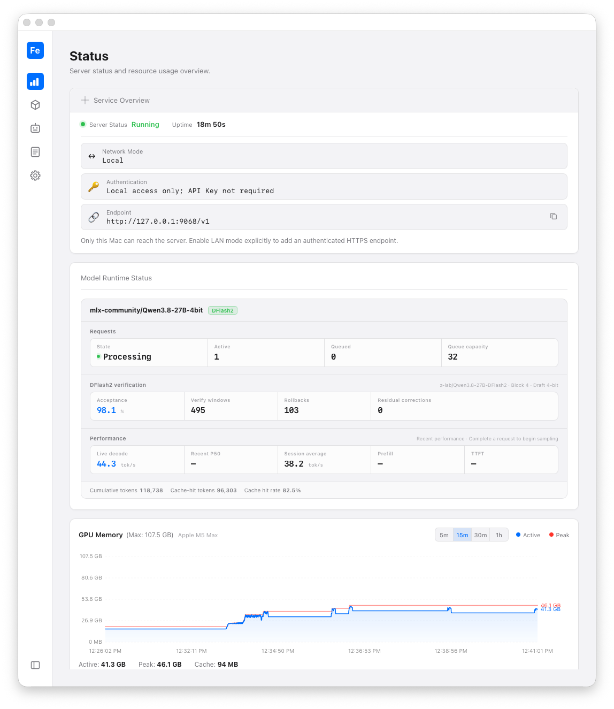

# IronMLX User Guide

[简体中文](zh-CN/user-guide.md)

This guide organizes the user path for the current `0.1.0-rc.1` release
candidate. It links to focused reference pages instead of repeating their
details.



The status page shows a running local endpoint, the loaded
`mlx-community/Qwen3.8-27B-4bit` model, and its matching DFlash2 draft.

## Install and start

1. Download the Apple Silicon DMG or ZIP from the
   [IronMLX v0.1.0-rc.1 GitHub Release](https://github.com/apepkuss/ironmlx/releases/tag/v0.1.0-rc.1).
2. Optionally verify the downloaded archive with the `RELEASE-SHA256SUMS`
   file published on the same Release page.
3. If you downloaded the DMG, open it, drag `IronMLX.app` onto the
   `Applications` folder shortcut, and wait for the copy to finish. Close the
   DMG window and eject the disk image.
4. If you downloaded the ZIP, extract it to a local folder.
5. In Finder's Applications folder, find and double-click IronMLX (or open the
   extracted App when using the ZIP).
6. Use the Dashboard to search Hugging Face or ModelScope, download, or load a
   compatible model.
7. Check the service at `http://127.0.0.1:9068/healthz`.

See [supported models](supported-models.md) before downloading a model. Model
architecture support does not guarantee that a particular revision fits your
device memory or satisfies its upstream license terms. Model weights are not
included in the installer and remain subject to the upstream model repository's
license and access terms.

If the health check fails, see [Troubleshooting](troubleshooting.md).

## First API request

With `mlx-community/Qwen3.8-27B-4bit` loaded, verify a complete local
Responses request:

```bash
curl -fsS http://127.0.0.1:9068/v1/responses \
  -H 'Content-Type: application/json' \
  -d '{"model":"mlx-community/Qwen3.8-27B-4bit","input":"Reply with exactly IRONMLX_OK.","store":false,"max_output_tokens":16,"temperature":0,"stream":false}'
```

The completed response should contain `IRONMLX_OK`. Replace the model ID with
the exact ID shown by `GET /v1/models` when using another loaded model. The
current RC validation also exposes DFlash2 for this model with the matching
`z-lab/Qwen3.8-27B-DFlash2` draft; acceleration details and limitations are in
the [supported model matrix](supported-models.md).

## Choose a task

- [Model support matrix](supported-models.md) — architectures, validated
  versions, quantization, memory, and feature limits.
- [HTTP API quick start](api.md) — first requests for Chat Completions,
  Responses, and Anthropic Messages.
- [API compatibility matrix](api-compatibility-matrix.md) — request fields,
  streaming, structured outputs, reasoning, images, and errors.
- [Hermes Agent integration](hermes-agent.md) — configure Hermes to use the
  local Responses endpoint.
- [oh-my-pi integration](oh-my-pi.md) — configure a local OpenAI-compatible
  provider and verify the tool-call round trip.

## Privacy, security, and local data

- [Privacy and network boundary](privacy.md)
- [Security boundary](security-boundary.md)
- [Data locations and uninstall](storage-and-uninstall.md)
- [Diagnostic export](diagnostic-bundle.md)
- [Automatic updates](automatic-updates.md)
- [Model rights boundary](model-license-boundary.md)

## Advanced serving paths

- [DFlash2 server and CLI](dflash2-server-api.md)
- [MTP server API](mtp-server-api.md)
- [Engine pool](engine-pool.md)
- [Scheduler profile](scheduler-profile-v5.md)

## Troubleshooting and release context

- [Troubleshooting](troubleshooting.md)
- [Known issues](known-issues.md)
- [0.1.0 release notes](release-notes/0.1.0.md)

For source builds, tests, contributions, and release engineering, start with
[Building from source](building-from-source.md) and [Contributing](../CONTRIBUTING.md).
