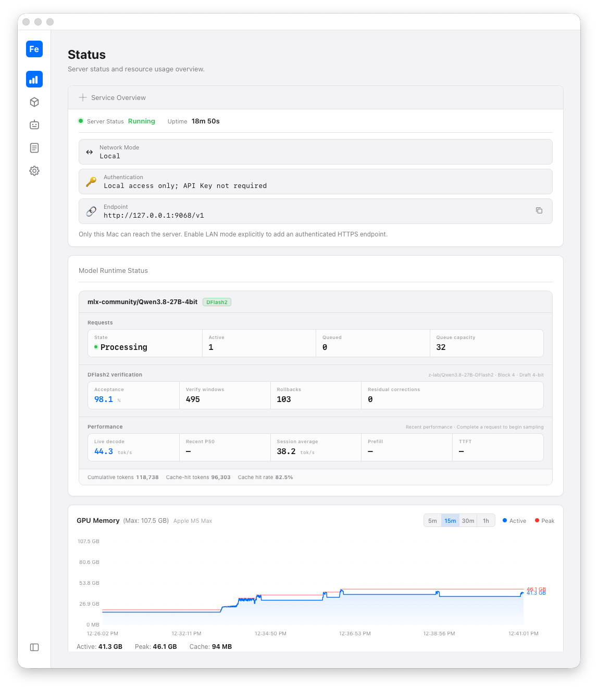

# IronMLX User Guide

[简体中文](zh-CN/user-guide.md)

This guide organizes the user path for the latest public release. It links to
focused reference pages instead of repeating their details.



The status page shows a running local endpoint, the loaded
`mlx-community/Qwen3.8-27B-4bit` model, and its matching DFlash2 draft.

## Install and start

1. Download the latest Apple Silicon DMG or ZIP from the
   [IronMLX GitHub Releases page](https://github.com/apepkuss/ironmlx/releases/latest).
2. Optionally verify the downloaded archive with the `RELEASE-SHA256SUMS`
   file published on the same Release page.
3. If you downloaded the DMG, open it, drag `IronMLX.app` onto the
   `Applications` folder shortcut, and wait for the copy to finish. Close the
   DMG window and eject the disk image.
4. If you downloaded the ZIP, extract it to a local folder.
5. In Finder's Applications folder, find and double-click IronMLX (or open the
   extracted App when using the ZIP).
6. Use the Dashboard to search Hugging Face or ModelScope, download, or load a
   compatible model.
7. Check the service at `http://127.0.0.1:9068/healthz`.

See [supported models](supported-models.md) before downloading a model. Model
architecture support does not guarantee that a particular revision fits your
device memory or satisfies its upstream license terms. Model weights are not
included in the installer and remain subject to the upstream model repository's
license and access terms.

If the health check fails, see [Troubleshooting](troubleshooting.md).

## Download and update models

In **Models → Model Download → Supported models**, browse by type, select a quantization variant, then choose **HuggingFace**. Variants of the same model share a row. Options show format and bit width; selecting one reveals its repository, approximate size, memory hint, and validation status.

The catalogue downloads public repositories without an HF token. ModelScope buttons stay hidden until repository availability and mirror contents are verified. Use the separate HuggingFace / ModelScope tabs for other repositories or credentials.

Installed variants show **Downloaded · Check for updates**. Checking only compares repository revisions; **Download update** queues the checked revision after you choose it. IndexTTS keeps the revision pinned by its verified resource profile.

In **Download tasks**, **Pause** retains downloaded data and remains paused after restarting the App. **Resume** uses the recorded snapshot and retained files. Credential-protected tasks may require the token again; tokens are not saved to disk. **Delete** removes unfinished tasks and partial files after confirmation. **Clear** on a completed task keeps the installed model.

## Import a model already on this Mac

In Dashboard, open **Models → Model Manager** and select **Import local model**
at the upper right. Choose the model directory containing `config.json`, weights,
and a tokenizer. For a Hugging Face cache, choose the `snapshots/<commit>`
directory rather than its parent cache directory. Review the source, destination,
and copy size before starting. IronMLX copies and verifies the snapshot, then adds
it to the model list. The original directory remains untouched.

Snapshots with a valid IronMLX manifest retain their repository identity. Other
local folders are stored under `~/.ironmlx/models/standalone/`. Importing needs
enough free space for a complete copy. After import, use the ID shown in the model
list to load and manage it. Some model families also need additional runtime
resources prepared before loading.

## Weight format labels

In the App's **Model Management** list, quantized checkpoints display their
detected quantization format or bit width. Unquantized checkpoints display the
detected weight data type, such as `FP16` or `BF16`; the tooltip identifies the
checkpoint as unquantized and includes the normalized `dtype`. If neither model
metadata nor safetensors headers provide a usable value, the column displays
**Unknown**. These labels describe stored weights, not runtime compute precision.

## First API request

With `mlx-community/Qwen3.8-27B-4bit` loaded, verify a complete local
Responses request:

```bash
curl -fsS http://127.0.0.1:9068/v1/responses \
  -H 'Content-Type: application/json' \
  -d '{"model":"mlx-community/Qwen3.8-27B-4bit","input":"Reply with exactly IRONMLX_OK.","store":false,"max_output_tokens":16,"temperature":0,"stream":false}'
```

The completed response should contain `IRONMLX_OK`. Replace the model ID with
the exact ID shown by `GET /v1/models` when using another loaded model. The
current RC validation also exposes DFlash2 for this model with the matching
`z-lab/Qwen3.8-27B-DFlash2` draft; acceleration details and limitations are in
the [supported models](supported-models.md).

## Agent configuration

Use IronMLX as an Agent's local inference backend and choose the configuration guide for your application.

| Agent | Configuration |
| --- | --- |
| [Hermes Agent](hermes-agent.md) | Local Responses service |
| [oh-my-pi](oh-my-pi.md) | Local OpenAI-compatible service |
| [DeepSeek Harness (DSH)](dsh.md) | [Desktop App](dsh.md#dsh-desktop-app-configuration) or [CLI](dsh.md#dsh-cli-configuration) |

## Speech synthesis

### Voices

With a speech model loaded, open Dashboard **Voices**, import reference audio,
and assign a stable voice ID. Use that ID in the `voice` field when calling the
[speech API](audio-speech-api.md); alternatively, supply reference audio directly
through `ref_audio` in a request. OpenAI-compatible clients can discover enabled
voices through `GET /v1/audio/voices`.

The Dashboard previews the reference recording saved in a voice profile.
Synthesized audio is played by the caller or the
[standalone example client](../examples/speech-client.swift). Voice profiles are
saved under `~/.ironmlx/audio/voices/`; changing the display name preserves the
voice ID. Request fields and WAV/PCM examples are in the [speech API](audio-speech-api.md).

### Resource readiness

The App prepares speech resources automatically. If the model list reports that
resources are missing, choose **Prepare resources**. Retry after an interruption;
verified model files and cached resources are reused. Initial preparation needs
network access; once the complete resources are ready, synthesis can run offline.
The App saves the resource configuration and restores previously loaded or pinned
models after restart.

### Model settings

In **Model Management**, select the gear button for the speech model. Basic model
information is read-only; configuration-backed fields appear only when the model
files provide valid values.

The same window provides six editable runtime policies. Use the defaults and
allowed ranges shown in the settings window.

| Setting | Default | Allowed range and behavior |
| --- | --- | --- |
| Queue timeout | 60 seconds | Positive, at most 24 hours; limits waiting for an execution permit |
| First audio timeout | 120 seconds | Positive, at most 24 hours; starts after the request obtains an execution permit |
| Execution timeout | 900 seconds | Positive, at most 24 hours; starts after the request obtains an execution permit |
| Slow consumer timeout | 30 seconds | Positive, at most 24 hours; limits how long output can remain blocked by the consumer |
| Max output duration | 600 seconds | Positive, up to the runtime profile maximum; includes silence between segments |
| Segment tokens | 120 | Integer from 6 through 120; token budget for each synthesis segment |

If the execution profile is unavailable, these controls and the save action stay
disabled. Saving stores the policies for that model. If the model is loaded, the
App applies them by reloading it after active work becomes idle; the saved values
are also used for later loads and restart recovery. These settings are service
policies, not model limits or latency guarantees. See the [speech API](audio-speech-api.md)
for the corresponding `audio.execution` fields and scheduling semantics.

## Choose a task

- [Embedding API](text-embeddings.md) — EmbeddingGemma 2 BF16/affine4 input formats, limits and Dashboard vector metrics.
- [Laya decision API](laya-systemone-api.md) — load Laya in the App and connect external TypeSafe clients.
- [Supported models](supported-models.md) — model names, types, weight formats,
  capabilities, and acceleration options.
- [Developer guide](developer-guide.md) — API quick start, CLI configuration,
  source development, and contribution resources.
- [Text and vision API](text-vision-api.md) — request fields,
  streaming, structured outputs, reasoning, images, and errors.

## Privacy, security, and local data

- [Privacy and network boundary](privacy.md)
- [Security boundary](security-boundary.md)
- [Data locations and uninstall](storage-and-uninstall.md)
- [Diagnostic export](diagnostic-bundle.md)
- [Automatic updates](automatic-updates.md)
- [Model rights boundary](model-license-boundary.md)

## CLI and advanced configuration

- [DFlash2 configuration and usage](dflash2-server-api.md)
- [Qwen MTP configuration and usage](mtp-server-api.md)
- [CLI multi-model serving (EnginePool)](engine-pool.md)
- [Scheduler performance calibration](scheduler-profile-v5.md)

## Troubleshooting and release context

- [Troubleshooting](troubleshooting.md)
- [Known issues](known-issues.md)
- [0.2.0 release notes](release-notes/0.2.0.md)
- [0.1.0 release notes](release-notes/0.1.0.md)

For source builds, tests, contributions, and release engineering, start with
[Building from source](building-from-source.md) and [Contributing](../CONTRIBUTING.md).
