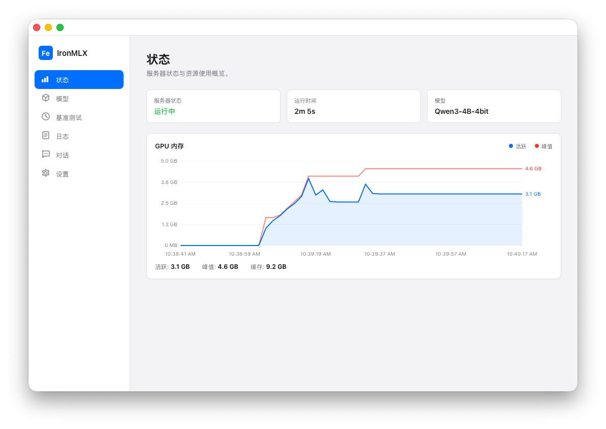
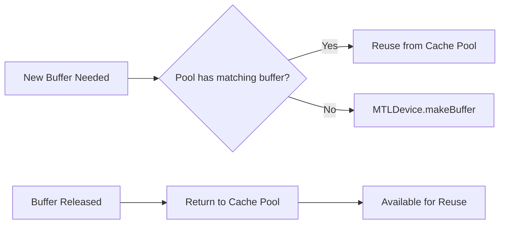
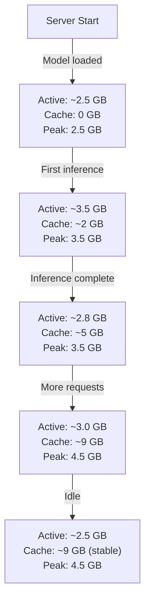

# GPU Memory Metrics Explained

## Overview

The ironmlx Dashboard Status page displays a real-time GPU memory chart with three key metrics. This page explains what each metric means, how they relate to the underlying Metal GPU memory management, and what to expect during normal operation.



The chart shows:

- **Blue line** — Active memory (real-time usage)
- **Orange line** — Peak memory (historical maximum)
- **Bottom-left labels** — Current values for Active, Peak, and Cache

## Metrics

| Metric | Color | Source API | Description |
|--------|-------|-----------|-------------|
| **Active** | Blue line | `mlx_get_active_memory()` | GPU memory currently in use |
| **Peak** | Orange line | `mlx_get_peak_memory()` | Historical maximum of Active |
| **Cache** | Text label | `mlx_get_cache_memory()` | Metal buffer pool (released but retained) |

### Active Memory

Active memory represents the GPU memory **currently allocated and in use** by the inference engine. This includes:

- **Model weights** — The loaded model parameters (e.g., ~2.5 GB for a 4-bit quantized 4B model)
- **KV Cache** — Key/Value cache for attention layers during inference
- **Intermediate tensors** — Temporary computation buffers during forward pass

Active memory increases during inference and may decrease slightly after completion as intermediate buffers are released.

### Peak Memory

Peak memory tracks the **highest Active memory value** since the server started. It is useful for:

- Understanding the maximum GPU memory demand of your workload
- Capacity planning when deciding how many models to load simultaneously
- Detecting memory spikes that might cause issues on devices with limited memory

The Peak value only resets when the server restarts.

### Cache Memory

Cache memory represents Metal GPU buffers that have been **released by MLX but retained in a buffer pool** for fast reuse. This is **not** the same as SSD Cache (KV Cache disk persistence).



**Why does Cache exist?**

MLX's Metal memory allocator uses a **buffer pooling strategy**:

1. When a GPU computation completes, the Metal buffer is **not immediately returned to the OS**
2. Instead, it is kept in a cache pool managed by MLX
3. When a new buffer of the same size is needed, it is **reused from the pool** instantly
4. This avoids the overhead of frequent `MTLDevice.makeBuffer()` calls, which are expensive

**What to expect:**

- Cache grows during the first few inference requests as new buffer sizes are allocated
- Cache stabilizes after the workload pattern becomes steady
- Under memory pressure, MLX automatically **evicts cached buffers** to free memory
- A large Cache value (e.g., 9 GB) does **not** indicate a memory leak — it is normal pooling behavior
- Cache memory can be reclaimed by the system when needed

## Example: Typical Memory Behavior



### Key observations:

1. **Active < Peak** — Always true. Active fluctuates; Peak only increases.
2. **Cache > Active** — Common. The buffer pool accumulates released buffers.
3. **Cache appears large** — Normal. These buffers are available for reuse and can be reclaimed by the system.

## SSD Cache vs Metal Cache

These are two completely different caching mechanisms:

| | Metal Buffer Cache | SSD Cache |
|--|-------------------|-----------|
| **What** | GPU memory buffer pool | KV Cache persisted to disk |
| **Where** | GPU unified memory | `~/.ironmlx/cache/kv_cache/` |
| **Purpose** | Avoid expensive GPU buffer allocation | Reuse KV Cache across sessions |
| **Managed by** | MLX / Metal framework | ironmlx CacheManager |
| **Shown in chart** | Yes (Cache label) | No |

## API Reference

The `/health` endpoint returns all three metrics:

```json
{
  "status": "ok",
  "model": "mlx-community/Qwen3-4B-4bit",
  "memory": {
    "active_mb": 3128.4,
    "cache_mb": 9469.3,
    "peak_mb": 4662.6
  },
  "started_at": 1774229892
}
```

All values are in **megabytes (MB)**.
