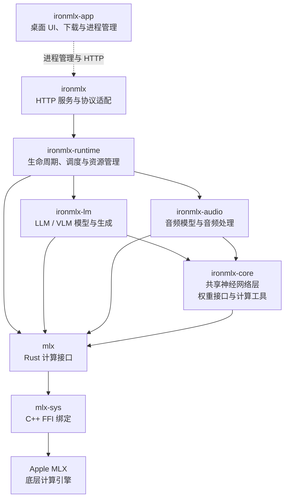

# IronMLX 目标架构与模块职责

本文记录 IronMLX 的目标模块划分、依赖方向与实施边界，供新增功能和后续拆分时参考。它描述目标架构，不代表图中所有 crate 已经存在或所有模型能力已经实现。

## 架构与依赖方向

实线箭头表示代码依赖，方向为调用方指向被依赖方；虚线表示 App 对后端的进程管理和 HTTP 通信。`ironmlx-app` 是 Swift App，Apple MLX 是上游计算引擎，两者不是本项目中的 Rust crate。

两个模型库彼此独立，不反向依赖 runtime 或 server。它们可以直接使用 `mlx`，不必把所有计算包装进 `ironmlx-core`。runtime 直接使用 `mlx` 的设备、执行流与内存观测能力。

本图聚焦应用、服务、推理与模型库的主要分层，未逐一列出基准工具、专用优化库和所有第三方依赖。crate 拆分是代码边界，不意味着每个 crate 都运行在独立进程，也不会自动隔离 GPU 或内存。

## 各模块职责

### ironmlx-app

- 提供桌面交互、Dashboard、设置、模型列表、下载进度与运行状态展示。
- 管理模型下载、完整性校验、快照发布和本地资源目录；通过后端接口了解实际运行支持情况。
- 启停后端进程，传递配置，通过 HTTP 查询状态和调用管理能力。

App 不承担模型前向计算和推理调度。模型文件完整不等于模型可推理，UI 应分别呈现下载完整性和运行 readiness。

### ironmlx

- 作为服务入口，组合 runtime，提供 HTTP 路由及对外协议。
- 解析、校验协议 DTO，处理鉴权、请求体限制、错误映射和响应编码。
- 把客户端请求转换成 runtime 任务，把结果或增量事件封装为 JSON、SSE 或音频响应。
- 将连接中断、超时和客户端消费速度传递给 runtime。

HTTP 字段名、Base64 和 SSE 等协议细节在这一层处理。模型生命周期与全局资源策略归 runtime，具体神经网络计算归模型库。

### ironmlx-runtime

- 统一管理模型注册、加载、卸载、驻留状态和运行能力。
- 执行请求准入、排队与调度，协调设备、执行流、全局内存预算和过载处理。
- 管理任务生命周期、取消、超时、背压及运行指标。
- 根据模型能力选择执行策略，例如 LLM 连续批处理和 TTS 多阶段生成。

runtime 决定何时执行、执行哪个任务及其资源额度；模型库决定一步计算的具体语义。不同模型无需强行共用一个调度器。模型内部状态由模型库定义和维护，runtime 控制任务生命周期及其持有、释放时机。

### ironmlx-lm

- 实现 LLM/VLM 架构、配置解析、权重映射、前向计算与模型能力描述。
- 提供分词、聊天模板、多模态输入处理和生成计算所需的模型侧逻辑。
- 维护 KV 等模型内部状态，提供 runtime 可调用的生成操作与结果。

这一层不包含 HTTP 服务或全局请求调度。对外协议的消息结构先由 server 转换为内部表示，再交给模型库处理。

### ironmlx-audio

- 实现 TTS、语音识别（STT/ASR）、语音转换与增强等音频任务的模型配置、组件加载、权重映射和推理。
- 提供音频解码、重采样、声学特征提取及音频编码等前后处理能力。
- 维护参考特征、生成缓存、随机状态及增量解码状态，产生带采样率、声道等信息的音频块或其他任务结果。
- 提供可取消、可增量消费的计算边界，供 runtime 协调执行。

音频库负责请求内音频数据与派生特征的生命周期，提供完整结果和增量结果，支持模型权重驻留复用。HTTP、用户声音注册和用户文件目录管理由应用或服务层承担。

### ironmlx-core

- 提供经 LLM/VLM 与音频模型实际复用的神经网络基础层，例如 Linear、Embedding、归一化与卷积。
- 提供通用权重张量访问接口、量化描述，以及确有共享需要的采样等计算工具。
- 依赖 `mlx` 完成计算，不依赖具体模型库、runtime 或 server。

权重加载分为两层：core 提供张量访问等基础能力，模型库解释具体文件布局、配置和组件映射。基础层接收权重张量或独立的权重访问接口。

HTTP、全局调度、模型注册、音频专用处理和具体模型实现由各自对应的模块负责。

### mlx

提供面向 Rust 的 MLX 张量与运算接口，包括设备、执行流、求值、随机数、量化、权重 IO 及通用计算操作。隐藏底层 FFI 细节，维护明确的类型、错误和所有权边界。

这里不包含模型目录约定、聊天模板、TTS 业务流程或 HTTP。音频模型需要的通用运算可以按需补充绑定；STFT/mel 等音频算法的组织仍属于音频层。

### mlx-sys

通过 C++ FFI 和 shim 桥接 Apple MLX，负责原生类型与句柄、参数转换、底层错误传递以及构建链接。它提供构建 Rust 计算接口所需的底层能力，不承担模型逻辑。

### Apple MLX

作为上游计算引擎，提供张量执行、计算图求值以及 CPU/Metal 等后端能力。IronMLX 通过 `mlx-sys` 和 `mlx` 使用它；本项目的服务协议、模型生命周期与音频业务契约不属于 Apple MLX。

## 跨层边界

| 事项 | 责任划分 |
| --- | --- |
| 文件与模型加载 | App 管理下载和快照；runtime 决定加载时机；模型库验证并组装组件；core/MLX 提供张量读取能力 |
| 推理与调度 | 模型库提供计算和状态；runtime 决定任务执行顺序、预算与生命周期 |
| 流式 | 模型库产生真实增量结果；runtime 协调背压和取消；server 封装传输；客户端缓冲播放 |
| 取消 | server 感知断连；runtime 发出取消；模型库在计算检查点响应并释放任务状态，不承诺立即抢占正在执行的 GPU kernel |
| 内存 | 模型库提供占用信息并控制内部临时状态；runtime 统一进行进程级预算与准入 |
| 能力声明 | 模型库说明支持范围，runtime 汇总实际可用能力，server/App 对外呈现；不因 crate 存在便宣称所有任务已支持 |

完整响应与流式响应应复用模型计算组件和任务控制，但不要求增量解码与整段解码产生逐样本一致的波形。将完整生成后的结果切成网络块，不等于模型增量生成。
