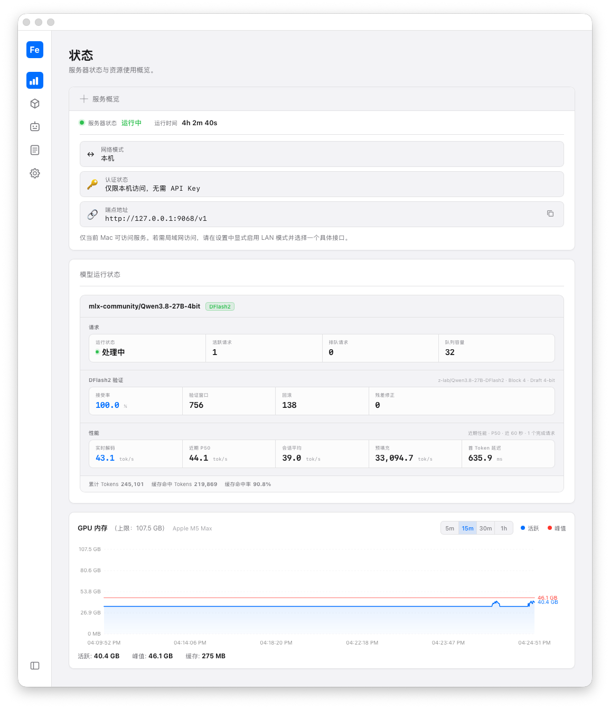

# IronMLX 用户指南

[English](../user-guide.md)

本指南围绕最新公开版本组织用户使用路径。各章节链接到现有专题文档，不重复复制详细内容。



状态页展示了运行中的本机 endpoint、已加载的 `mlx-community/Qwen3.8-27B-4bit` 模型及其匹配的 DFlash2 draft。

## 安装与启动

1. 从 [IronMLX GitHub Releases 页面](https://github.com/apepkuss/ironmlx/releases/latest)
   下载最新的 Apple Silicon 版 DMG 或 ZIP；
2. 可选：使用同一 Release 页面提供的 `RELEASE-SHA256SUMS` 校验下载的归档文件；
3. 如果下载的是 DMG：打开 DMG，将 `IronMLX.app` 拖到 `Applications` 文件夹图标，
   等待复制完成；关闭 DMG 窗口并推出磁盘映像；
4. 如果下载的是 ZIP：将其解压到本地文件夹；
5. 使用 DMG 时，在 Finder 的“应用程序”中找到并双击 IronMLX；使用 ZIP 时，打开
   解压出的 App；
6. 使用 Dashboard 从 Hugging Face 或 ModelScope 搜索、下载或加载兼容模型；
7. 访问 `http://127.0.0.1:9068/healthz` 检查服务状态。

下载模型前请先阅读[支持模型矩阵](supported-models.md)。架构受支持不代表某个具体快照一定
适合当前设备内存，也不代表其上游许可证条款允许你的使用方式。安装包不包含模型权重，模型仍受
上游模型仓库的许可证和访问条件约束。

如果健康检查失败，请参阅[故障排查](troubleshooting.md)。

## 首个 API 请求

加载 `mlx-community/Qwen3.8-27B-4bit` 后，可使用以下命令验证完整的本地 Responses 请求：

```bash
curl -fsS http://127.0.0.1:9068/v1/responses \
  -H 'Content-Type: application/json' \
  -d '{"model":"mlx-community/Qwen3.8-27B-4bit","input":"Reply with exactly IRONMLX_OK.","store":false,"max_output_tokens":16,"temperature":0,"stream":false}'
```

完成的响应中应包含 `IRONMLX_OK`。使用其他已加载模型时，将 model ID 替换为
`GET /v1/models` 返回的精确值。当前 RC 对该模型还显示 DFlash2，使用匹配的
`z-lab/Qwen3.8-27B-DFlash2` draft；加速细节和限制见[支持模型矩阵](supported-models.md)。

## 按任务选择文档

- [支持模型矩阵](supported-models.md)：架构、已验证版本、量化、内存和功能限制；
- [HTTP API 快速开始](api.md)：Chat Completions、Responses 和 Anthropic Messages 的首个请求；
- [API 兼容矩阵](api-compatibility-matrix.md)：请求字段、流式输出、结构化输出、推理、图片和错误；
- [Hermes Agent 集成](hermes-agent.md)：配置 Hermes 使用本地 Responses 接口；
- [oh-my-pi 集成](oh-my-pi.md)：配置本地 OpenAI 兼容 provider，并验证工具调用闭环。

## 隐私、安全与本地数据

- [隐私与网络边界](privacy.md)
- [安全边界](security-boundary.md)
- [数据位置与卸载](storage-and-uninstall.md)
- [诊断信息导出](diagnostic-bundle.md)
- [自动更新](automatic-updates.md)
- [模型权利边界](model-license-boundary.md)

## 高级服务路径

- [DFlash2 服务端与 CLI](dflash2-server-api.md)
- [MTP 服务端 API](mtp-server-api.md)
- [Engine Pool（引擎池）](engine-pool.md)
- [Scheduler Profile（调度器配置）](scheduler-profile-v5.md)

## 故障排查与版本信息

- [故障排查](troubleshooting.md)
- [Known Issues](known-issues.md)
- [0.1.0 候选发布说明](release-notes/0.1.0.md)

源码构建、测试、贡献和发布工程请从[从源码构建](building-from-source.md)及[参与开发](contributing.md)开始。
