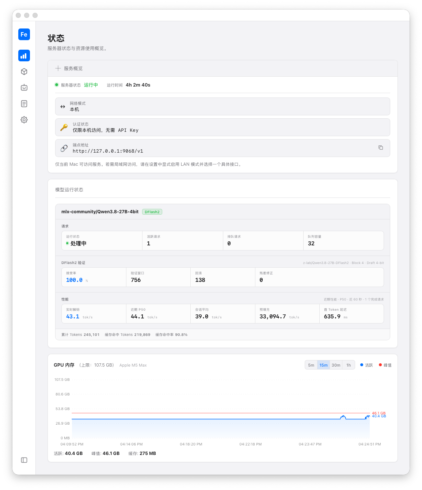

# IronMLX 用户指南

[English](../user-guide.md)

本指南围绕最新公开版本组织用户使用路径。各章节链接到现有专题文档，不重复复制详细内容。



状态页展示了运行中的本机 endpoint、已加载的 `mlx-community/Qwen3.8-27B-4bit` 模型及其匹配的 DFlash2 draft。

## 安装与启动

1. 从 [IronMLX GitHub Releases 页面](https://github.com/apepkuss/ironmlx/releases/latest)
   下载最新的 Apple Silicon 版 DMG 或 ZIP；
2. 可选：使用同一 Release 页面提供的 `RELEASE-SHA256SUMS` 校验下载的归档文件；
3. 如果下载的是 DMG：打开 DMG，将 `IronMLX.app` 拖到 `Applications` 文件夹图标，
   等待复制完成；关闭 DMG 窗口并推出磁盘映像；
4. 如果下载的是 ZIP：将其解压到本地文件夹；
5. 使用 DMG 时，在 Finder 的“应用程序”中找到并双击 IronMLX；使用 ZIP 时，打开
   解压出的 App；
6. 使用 Dashboard 从 Hugging Face 或 ModelScope 搜索、下载或加载兼容模型；
7. 访问 `http://127.0.0.1:9068/healthz` 检查服务状态。

下载模型前请先阅读[支持的模型](supported-models.md)。架构受支持不代表某个具体快照一定
适合当前设备内存，也不代表其上游许可证条款允许你的使用方式。安装包不包含模型权重，模型仍受
上游模型仓库的许可证和访问条件约束。

如果健康检查失败，请参阅[故障排查](troubleshooting.md)。

## 下载与更新模型

在 **模型 → 模型下载 → 支持的模型** 中按类型浏览，先选择量化版本，再点击 **HuggingFace** 下载。同一模型的量化版本合并展示；选项包含格式和位数，选择后会显示仓库、预计大小、内存提示与验证状态。

支持的模型目录下载公开仓库，不使用 HF Token。ModelScope 按钮在仓库与镜像内容完成验证前隐藏；需要自行指定仓库或凭据时，使用单独的 HuggingFace / ModelScope Tab。

已安装版本显示 **已下载 · 检查更新**。检查只比较仓库版本；发现更新后，点击 **下载更新** 才会加入下载队列。IndexTTS 使用已验证资源配置固定的版本。

在 **下载任务** 中，**暂停** 保留已下载数据，重启后仍保持暂停；**继续下载** 使用记录的快照与保留文件。需要凭据的任务可能要求重新输入 Token，Token 不保存到磁盘。**删除任务** 会在确认后删除未完成任务及临时文件；已完成任务的 **清除记录** 保留已安装模型。

## 导入已有模型

如果模型已在这台 Mac 上下载，进入 Dashboard 的**模型 → 模型管理**，点击右上角
**导入本地模型**。选择含有 `config.json`、权重和 tokenizer 的模型目录；使用 Hugging
Face 缓存时，应选择 `snapshots/<commit>` 目录，而不是缓存仓库的上层目录。确认页会
显示来源、目标位置和复制大小。IronMLX 会复制文件、校验快照，再将模型加入管理列表；
原目录不会被删除。

有可验证 IronMLX 清单的快照会保留原仓库身份。其他本地目录进入 IronMLX 管理的
`~/.ironmlx/models/standalone/`。导入需要足够空间存放完整副本；成功后，列表中的
模型可按其显示的 ID 加载和管理。特殊模型可能还需要准备额外运行资源。

## 权重格式标签

在 App 的“模型管理”列表中，量化检查点显示检测到的量化格式或位数；未量化检查点
显示检测到的权重数据类型，例如 `FP16` 或 `BF16`，Tooltip 会说明“未量化”并给出
规范化后的 `dtype`。如果模型元数据和 safetensors 头都无法提供有效值，则显示
“未知”。这些标签描述的是存储权重，不是运行时计算精度。

## 首个 API 请求

加载 `mlx-community/Qwen3.8-27B-4bit` 后，可使用以下命令验证完整的本地 Responses 请求：

```bash
curl -fsS http://127.0.0.1:9068/v1/responses \
  -H 'Content-Type: application/json' \
  -d '{"model":"mlx-community/Qwen3.8-27B-4bit","input":"Reply with exactly IRONMLX_OK.","store":false,"max_output_tokens":16,"temperature":0,"stream":false}'
```

完成的响应中应包含 `IRONMLX_OK`。使用其他已加载模型时，将 model ID 替换为
`GET /v1/models` 返回的精确值。当前 RC 对该模型还显示 DFlash2，使用匹配的
`z-lab/Qwen3.8-27B-DFlash2` draft；加速细节和限制见[支持的模型](supported-models.md)。

## Agent 配置

将 IronMLX 作为 Agent 的本地推理后端，按应用选择配置指南。

| Agent | 配置方式 |
| --- | --- |
| [Hermes Agent](hermes-agent.md) | 本地 Responses 服务 |
| [oh-my-pi](oh-my-pi.md) | 本地 OpenAI 兼容服务 |
| [DeepSeek Harness（DSH）](dsh.md) | [Desktop App](dsh.md#dsh-desktop-app-配置) 或 [CLI](dsh.md#dsh-cli-配置) |

## 语音合成

### 声音配置

加载语音模型后，打开 Dashboard 的“声音”页面，导入参考音频并分配稳定的声音 ID。
调用[语音 API](audio-speech-api.md)时使用 `voice` 指定该 ID，也可以在请求中通过
`ref_audio` 直接提供参考音频。OpenAI-compatible 客户端可通过
`GET /v1/audio/voices` 获取已启用的声音。

Dashboard 试听的是声音配置中保存的参考录音。合成音频由调用方或
[独立示例客户端](../../examples/speech-client.swift)播放。声音配置保存在
`~/.ironmlx/audio/voices/`；修改显示名称不会改变声音 ID。
请求参数及 WAV/PCM 示例见[语音 API](audio-speech-api.md)。

### 资源就绪

App 自动准备语音资源。如果模型列表提示资源缺失，点击“准备语音资源”。
中断后可以重试，已验证的模型文件和资源缓存会复用。首次准备需要联网；
完整资源就绪后可以离线合成。App 保存资源配置，并在重启时恢复此前加载或固定的模型。

### 模型设置

在“模型管理”中点击语音模型对应的齿轮按钮。模型基础信息为只读；
只有模型文件提供有效值时，才显示对应的配置字段。

同一窗口还提供六项可编辑的运行策略，默认值和允许范围以设置窗口显示为准。

| 设置项 | 默认值 | 允许范围与作用 |
| --- | --- | --- |
| 队列超时 | 60 秒 | 正数，最长 24 小时；限制请求等待执行许可的时间 |
| 首段音频超时 | 120 秒 | 正数，最长 24 小时；从请求获得执行许可后开始计时 |
| 执行超时 | 900 秒 | 正数，最长 24 小时；从请求获得执行许可后开始计时 |
| 慢速消费者超时 | 30 秒 | 正数，最长 24 小时；限制输出被消费方阻塞的时间 |
| 最大输出时长 | 600 秒 | 正数，不超过运行时配置上限；包含分段之间的静音 |
| 分段 Token 数 | 120 | 6–120 的整数；每个语音合成分段的 Token 预算 |

如果执行配置不可用，上述控件和保存按钮保持禁用。保存后，策略按模型持久化；
如果模型已加载，App 会在当前任务空闲后重载模型以应用新值，后续加载和重启恢复
也会继续使用这些设置。这些是服务运行策略，不是模型硬限制或延迟保证。对应的
`audio.execution` 字段和调度语义见[语音 API](audio-speech-api.md)。

## 按任务选择文档

- [文本、图片与音频向量 API](text-embeddings.md)：EmbeddingGemma 2 BF16／affine4 的输入格式、限制与 Dashboard 向量指标。
- [Laya 决策 API](laya-systemone-api.md)：在 App 中加载 Laya，并供外部应用调用。
- [支持的模型](supported-models.md)：具体模型、类型、权重格式、支持能力与加速类型；
- [开发者指南](developer-guide.md)：API 快速开始、CLI 配置、源码开发与贡献入口；
- [文本与视觉 API](text-vision-api.md)：请求字段、流式输出、结构化输出、推理、图片和错误；

## 隐私、安全与本地数据

- [隐私与网络边界](privacy.md)
- [安全边界](security-boundary.md)
- [数据位置与卸载](storage-and-uninstall.md)
- [诊断信息导出](diagnostic-bundle.md)
- [自动更新](automatic-updates.md)
- [模型权利边界](model-license-boundary.md)

## CLI 与高级配置

- [DFlash2 配置与使用](dflash2-server-api.md)
- [Qwen MTP 配置与使用](mtp-server-api.md)
- [CLI 多模型服务（EnginePool）](engine-pool.md)
- [调度性能校准](scheduler-profile-v5.md)

## 故障排查与版本信息

- [故障排查](troubleshooting.md)
- [Known Issues](known-issues.md)
- [0.2.0 发布说明](release-notes/0.2.0.md)
- [0.1.0 发布说明](release-notes/0.1.0.md)

源码构建、测试、贡献和发布工程请从[从源码构建](building-from-source.md)及[参与开发](contributing.md)开始。
