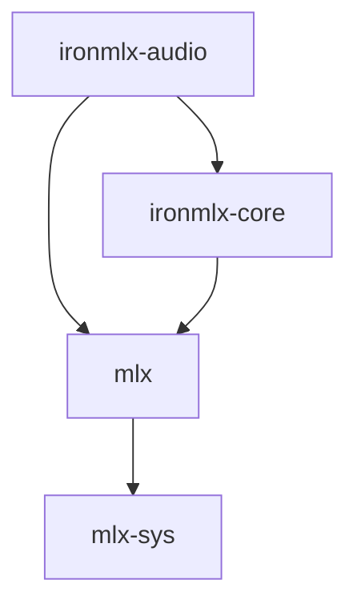

# ironmlx-audio

Native audio model infrastructure for IronMLX. The crate owns PCM values,
audio decoding/encoding, reference waveform preparation, text preparation,
component weight loading and native IndexTTS 2.5 speech synthesis.



Production dependencies exclude the HTTP server, inference runtime, LLM/VLM
library, Python and automatic resource downloads. Scheduling, model leases,
process memory reservations and transport cancellation belong to the runtime.

For server registration, WAV responses and PCM streaming, see the
[speech API contract](../docs/audio-speech-api.md).

## Public interfaces

| Interface | Responsibility |
| --- | --- |
| `PcmFormat`, `PcmBuffer`, `PcmChunk` | Owned interleaved finite f32 audio; chunk positions count frames. Validate at boundaries. |
| `AudioIo`, `io::NativeAudioIo` | Decode bounded audio files identified by bytes; encode PCM s16le and RIFF WAV. |
| `signal::prepare_reference` | Validate the entire reference, average stereo channels, crop its first 15 seconds and derive 16 kHz / 22050 Hz mono waveforms. |
| `text::IndexTts25TextFrontend` | Resolve language, normalize, apply pronunciation annotations, segment and produce both frontend and canonical GPT token sequences. |
| `resources::{ComponentSpec, inspect_component, load_component}` | Verify digest, exact keys, offsets, shapes and dtypes; load into core's `WeightMap`. Loading also rejects non-finite weights. |
| `features::{reference_mel, speaker_fbank, semantic_features}` | Fixed reference mel, Kaldi fbank and SeamlessM4T features with padding masks. |
| `indextts25::{IndexTts25ReferenceEncoder, ReferenceConditioning}` | Verified worker-local reference encoding and opaque evaluated conditioning tensors. |
| `resources::derived` | Verify and load immutable offline auxiliary artifacts. |
| `TtsModel`, `TtsSession`, `SessionControl` | Exclusive worker-local model/session ownership, finite computation advances, cancellation/deadline checks and ordered audio/terminal results. |
| `indextts25::{IndexTts25Loader, IndexTts25}` | Inspect all required resources and construct the native worker-local synthesizer. |
| `TtsLoader`, `ResolvedModelResources` | Construct models from explicit local snapshot, auxiliary artifact and resource-lock paths. |

The native synthesis path includes GPT autoregressive generation, EnhancedCodecV25,
S2Mel length regulation and 25-step flow matching, and BigVGAN V2. HTTP routes,
scheduling and process-wide admission remain responsibilities of their callers.
A component inspection covers only that component; the concrete loader inspects
the complete synthesis resource set.

## Fixed IndexTTS 2.5 profile

Resource revisions, hashes, conversion mapping and external asset identities
are recorded in `resources/indextts25/sources.json`; tensor schemas are stored
alongside it. Main weights use the published fp16 checkpoint, with the w2v-BERT
component retaining its original f32 weights. Auxiliary tensor conversion is
performed offline. Immutable snapshots are never rewritten by this library.

The text frontend uses the published 60509-token vocabulary and its exact
special-token ordering. The vocabulary's empty-byte entry at rank 48474 is
retained. GPT canonicalization removes existing IDs 0/1 before adding one
BOS/EOS pair; the 60510-row embedding is not cropped to vocabulary size.

Languages are Chinese, English, Japanese, Spanish and Arabic. WeText 0.1.2
FSTs and UniDic-lite 1.0.8 files are verified before loading. English/Chinese
follow the upstream wrapper, including its limited `'s` expansion; WeText's
optional general contractions expansion is disabled. Japanese uses native
MeCab surface segmentation, with `g2p_ratio=0`. Spanish uses the fixed basic
normalization profile without NeMo. Auto language selection is a script
heuristic; plain Latin text reports ambiguity and Arabic/CJK mixtures require
an explicit language.

Text defaults: 65536 input bytes, 262144 normalized bytes, 120 tokens per
segment (including language prefix), 602 canonical positions per segment,
16384 total canonical tokens and 256 segments. Protected pronunciation
annotations stay whole and fail if they exceed position capacity. FST work
is bounded to 262144 states, 1048576 arcs and 4194304 relaxations, with
cancellation checks during traversal. Shortest-path relaxation compares exact
f32 values to preserve WeText preferences smaller than rustfst's KDELTA.

The IO profile accepts RIFF WAV PCM 16/24/32 and IEEE float32, FLAC and MPEG
Layer III audio. Input Base64 uses the standard alphabet with canonical padding.
WAV structure, complete MP3 frame envelopes and FLAC decoded frame counts/checksums
are checked; unsupported codecs are rejected. MP3 free-format bitrate is unsupported.
Default file and decoded PCM limits are 16 MiB and 48 MiB. Reference preparation
accepts 1–60 seconds, 8–96 kHz and mono/stereo, and derives both target rates
from the same cropped waveform. Resampling uses the torchaudio default Hann
sinc kernel, width 6 and rolloff 0.99, with ceil output length.

PCM output quantizes `sample * 32768`, rounds half values away from zero and
saturates to signed 16-bit little-endian. WAV and raw PCM share the same encoder.
`write_wav` / `write_pcm_s16le` accept a caller-owned `Write` sink so storage
limits and ownership can be supplied by the runtime.

## Loading and synthesis

`IndexTts25Loader::new(wetext_fsts, unidic_dir)` takes explicit directories for
`wetext/fsts` and `unidic_lite/dicdir`. `ResolvedModelResources` supplies the
immutable main snapshot, the verified auxiliary artifact directory, and a copy
of `resources/indextts25/sources.json`. The resource lock must match the embedded
profile; it cannot override model hashes or tensor schemas. `inspect` reports
missing or mismatched resources. `load_model` additionally constructs the text
frontend and checks finite weights. GPT/S2Mel arrays shared with the reference
encoder retain the same storage rather than loading duplicate copies.

Set `MLX_ENABLE_TF32=0` **before any MLX initialization in the process**. The
library requires this setting and never changes the process-wide MLX mode.
A successful resource inspection does not verify that startup condition.

`TtsModel::start` creates an exclusive session without synthesizing the request.
`advance` prepares reference/text, advances one GPT token or CFM Euler step, or
runs a bounded codec/vocoder phase. Model layer loops also check `SessionControl`.
Callers pull the next advance only when they can accept its result; the library
creates no threads or unbounded output channel. A single GPU dispatch is not
preemptible, so cancellation takes effect at the next computation checkpoint.
`Finished` and every error are terminal, and dropping the session releases its
exclusive model borrow.

The fixed profile uses temperature 0.8, top-k 30, top-p 0.8, repetition penalty
10, at most 1500 GPT generation steps per segment, 25 CFM steps, guidance 0.7,
duration factor 1 and speed 1. Each request owns its PRNG key; seeded sampling
uses explicit Gumbel-max so MLX's categorical implementation changes cannot
silently change the sampler. Reproducibility still requires fixed model,
software and hardware. Sampling ends at EOS; exhausting the step budget is an
error. After EOS, if more than 30 silence tokens (ID 52) occurred, each silence
run is limited to 10 tokens, following the fixed reference.

Both output policies use the same generation and postprocessing path. Segments
are peak-normalized if needed, clipped to [-0.99, 0.99], and separated by 4410
zero samples (200 ms). Output is finite f32, 22050 Hz mono. Empty or non-finite
waveforms fail. `Chunks` emits each completed segment before starting the next;
`Collect` buffers the request until generation completes. Both return nonempty
`Audio` blocks of at most 8192 frames with continuous `start_frame` offsets.
The default output limit is 600 seconds, including inter-segment silence;
`with_limits` configures text and output policies. Output overflow returns
`GenerationLimitExceeded`, never a successful truncated result.

Streaming granularity is **Segment**. The current path completes codec decoding
and non-causal flow matching for the whole segment before vocoding. Cutting a completed segment
into transport blocks does not provide token-by-token waveform generation.
The library does not advertise `IncrementalWaveform`.

### Memory ownership

`ResourceReport::static_tensor_bytes` counts verified checkpoint tensor payloads
once per component, including unused checkpoint tensors retained by the loader.
It excludes CPU text resources, MLX allocator caches, temporary computation
buffers and output. It is not a process memory estimate or an admission decision.
Reference conditioning exposes its evaluated logical tensor payload size.

Sessions retain one reference-conditioning set and one segment's generation
state. GPT KV caches grow with the text prefix and semantic sequence; flow
matching includes the reference mel and generated mel frames (bounded to 6452
combined frames). Attention workspace grows quadratically with this length.
The vocoder accepts at most 5160 generated mel frames. `Chunks` retains only
the current segment's PCM; `Collect` additionally retains at most the configured
whole-request f32 output (52,920,000 sample bytes at the default limit).
Collection reserves capacity explicitly before appending. Returned chunks are
owned by the caller and are no longer session buffers.

The runtime must budget CPU resources, reference and request buffers, transient
MLX workspace, allocator cache and consumer-owned audio in its shared governor.
`mlx::memory::snapshot()` exposes process-wide MLX allocator counters; logical
tensor sizes alone cannot account for shared storage, views or temporary kernels.
This crate does not create a second process-level governor.

## Verification

Run the regular library tests with the repository's MLX build environment:

```sh
cargo test -p ironmlx-audio
cargo test -p mlx --test audio_ops
cargo clippy -p ironmlx-audio --all-targets -- -D warnings
```

Numerical fixtures cover WAV/FLAC/MP3 decoding, seven torchaudio resampling
ratios, and multilingual text/segmentation/token parity. Resource tests cover
hash/schema/missing-file failures and non-finite weights. MLX tests compare
convolution against scalar reference calculations and FFT against a direct DFT.

The explicit real-resource tests require these environment variables:

- `IRONMLX_INDEXTTS25_SNAPSHOT`: pinned main snapshot directory.
- `IRONMLX_WETEXT_FSTS`: extracted `wetext/fsts` directory.
- `IRONMLX_UNIDIC_DIR`: extracted `unidic_lite/dicdir` directory.

```sh
cargo test -p ironmlx-audio --test text_reference -- --ignored
cargo test -p ironmlx-audio --test resources real_component_loading -- --ignored
```

These tests execute native Rust/C++ paths. Python packages are used only to
generate reference fixtures, not by the tests or library. Large external
resources are not bundled with source. See `NOTICE.md` for provenance.
Fixture regeneration and pinned Python verification dependencies are documented
in `tests/fixtures/README.md`.

## Reference encoding

`IndexTts25ReferenceEncoder::inspect(snapshot, derived)` reports missing or
mismatched reference resources. `load` verifies all required tensors before
constructing the encoder. `encode` accepts decoded PCM and a `SessionControl`,
then derives reference mel, normalized w2v-BERT `hidden_states[17]`, CAMPPlus
style, emotion, GPT conditioning and S2Mel length-regulator `prompt_condition`.
`ReferenceConditioning` keeps model tensors private and exposes frame counts
and evaluated tensor payload bytes for accounting. It is not synthesized audio.
Execution is exclusive to its owning worker; cancellation is checked during
feature frames and between evaluated network layers. A single MLX kernel is
not preemptible. Source references use the existing 1–60 second validation and
first-15-second crop; network inputs remain bounded to that crop.

Reference encoding requires `MLX_ENABLE_TF32=0` **before process MLX
initialization**. The loader rejects a missing/different environment value.
MLX caches this setting, so changing the environment after initialization does
not establish the required precision. The caller owns process configuration;
this library does not mutate it. This is the numerically verified profile for
float32 reference encoders on hardware supporting TF32.

See [offline tools](tools/README.md) for conversion and baseline regeneration.
For explicit full-chain parity tests, supply the pinned snapshot plus:

- `IRONMLX_INDEXTTS25_DERIVED`: verified converted auxiliary directory.
- `IRONMLX_REFERENCE_FEATURES`: real speech feature baseline file.
- `IRONMLX_REFERENCE_DIRECTORY`: directory containing all three encoder baselines.
- `IRONMLX_REFERENCE_ENCODERS`: one encoder baseline for isolated network tests.

```sh
MLX_ENABLE_TF32=0 cargo test --locked -p ironmlx-audio real_reference_pipeline_parity -- --ignored --nocapture
cargo test --locked -p ironmlx-audio --test derived_resources -- --include-ignored
cargo test --locked -p ironmlx-audio --test features -- --include-ignored --nocapture
```

Regular tests include a synthetic spectral baseline without external resources.
Real-resource tests are opt-in and must be run explicitly before claiming
numerical reference-encoder acceptance.

### Synthesis numerical and session tests

The offline `tools/reference_gpt.py`, `tools/reference_acoustic.py` and
`tools/reference_synthesis.py` scripts use the fixed upstream revision and
explicit random keys. Acoustic/full-generation baselines require Python MLX
0.32.2 to match the native backend's FP16 kernel selection. Generated model
outputs and real audio belong outside the source tree's tracked fixtures.

In addition to the resource variables above, set:

- `IRONMLX_INDEXTTS25_DERIVED`: verified auxiliary artifact directory.
- `IRONMLX_REFERENCE_GPT`: GPT prefill/cache/sampling safetensors baseline.
- `IRONMLX_REFERENCE_ACOUSTIC`: codec, length regulator, flow and vocoder baseline.
- `IRONMLX_REFERENCE_SYNTHESIS`: complete sampled sequences and waveform baseline.
- `IRONMLX_REFERENCE_FEATURES`: feature baseline containing `speech_1s.wave16`.

```sh
cargo test -p ironmlx-audio --lib real_complete_generation_parity -- --ignored --nocapture
cargo test -p ironmlx-audio --lib real_session_error_boundaries -- --ignored --nocapture
cargo test -p ironmlx-audio --test synthesis -- --ignored --nocapture
```

The complete-generation test checks Chinese/English sampled sequences through
EOS and component/waveform numerical agreement. Session tests check multisegment
output, identical seeded collect/chunk samples, continuous block offsets,
cancellation during model computation, terminal reuse and output limits. Set
`IRONMLX_SYNTHESIS_OUTPUT` to an untracked directory to save test WAV files.
These tests do not establish HTTP behavior, subjective voice quality or an
end-to-end latency SLA.
