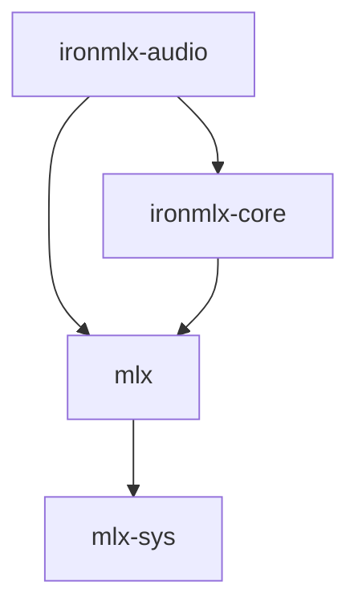

# ironmlx-audio 开发参考

[English](README.md)

IronMLX 的原生音频模型基础库。该 crate 负责 PCM 数据、音频解码与编码、
参考波形准备、文本准备、组件权重加载，以及原生 IndexTTS 2.5 语音合成。



生产依赖不包含 HTTP 服务端、推理运行时、LLM/VLM 库、Python 或自动资源下载。
调度、模型租约、进程内存预留和传输取消由运行时负责。

服务端资源注册、WAV 响应和 PCM 流式传输，见[语音 API 契约](../docs/zh-CN/audio-speech-api.md)。

## 公共接口

| 接口 | 职责 |
| --- | --- |
| `PcmFormat`, `PcmBuffer`, `PcmChunk` | 持有交错排列、数值有限的 f32 音频；音频块位置以帧计数。在接口边界执行校验。 |
| `AudioIo`, `io::NativeAudioIo` | 根据文件字节识别并解码受大小限制的音频文件；编码 PCM s16le 和 RIFF WAV。 |
| `signal::prepare_reference` | 校验完整参考音频，对立体声通道取平均，截取前 15 秒，并生成 16 kHz / 22050 Hz 单声道波形。 |
| `text::IndexTts25TextFrontend` | 确定语言、规范化文本、应用发音标注、分段，并生成前端及规范化后的 GPT token 序列。 |
| `resources::{ComponentSpec, inspect_component, load_component}` | 校验摘要、精确的键集合、偏移、形状和数据类型；加载到 core 的 `WeightMap`。加载时也会拒绝非有限权重。 |
| `features::{reference_mel, speaker_fbank, semantic_features}` | 按固定配置生成参考 mel、Kaldi fbank 和 SeamlessM4T 特征及填充掩码。 |
| `indextts25::{IndexTts25ReferenceEncoder, ReferenceConditioning}` | 经验证、仅由所属 worker 使用的参考编码，以及已求值且内部不透明的条件张量。 |
| `resources::derived` | 校验并加载不可变的离线辅助产物。 |
| `TtsModel`, `TtsSession`, `SessionControl` | 模型与会话由所属 worker 独占；执行有界计算推进、取消与截止时间检查，并按顺序返回音频及终止结果。 |
| `indextts25::{IndexTts25Loader, IndexTts25}` | 检查全部必需资源，构建仅由所属 worker 使用的原生合成器。 |
| `TtsLoader`, `ResolvedModelResources` | 根据显式指定的本地快照、辅助产物和资源锁文件路径构建模型。 |

原生合成路径包括 GPT 自回归生成、EnhancedCodecV25、S2Mel 长度调节和
25 步流匹配，以及 BigVGAN V2。HTTP 路由、调度和进程级准入仍由调用方负责。
单个组件检查仅覆盖该组件；具体加载器会检查完整的合成资源集合。

## 固定的 IndexTTS 2.5 配置

资源版本、哈希、转换映射和外部资产标识记录在
`resources/indextts25/sources.json` 中，张量 schema 保存在同一目录。
主权重使用已发布的 fp16 检查点，其中 w2v-BERT 组件保留原始 f32 权重。
辅助张量在离线环境中转换。本库不会改写不可变快照。

文本前端使用已发布的 60509-token 词表，并严格保留特殊 token 的顺序。
词表中 rank 48474 的空字节条目会保留。GPT 规范化会先移除已有的 ID 0/1，
再添加一对 BOS/EOS；60510 行的 embedding 不会按词表大小裁剪。

支持中文、英文、日文、西班牙文和阿拉伯文。WeText 0.1.2 FST 和
UniDic-lite 1.0.8 文件在加载前经过校验。英文和中文遵循上游封装的行为，
包括有限的 `'s` 展开；WeText 可选的通用缩写展开功能关闭。日文使用原生
MeCab 表层分词，`g2p_ratio=0`。西班牙文使用固定的基础规范化配置，
不依赖 NeMo。自动语言选择采用基于文字系统的启发式规则；纯拉丁字母文本
会报告语言歧义，混合阿拉伯文与 CJK 的文本需要显式指定语言。

文本默认限制：输入 65536 字节、规范化后 262144 字节、每段 120 token
（含语言前缀）、每段 602 个规范化位置、总计 16384 个规范化 token，
以及 256 段。受保护的发音标注保持完整，超过位置容量时失败。
FST 工作量限制为 262144 个状态、1048576 条弧和 4194304 次松弛，
遍历期间检查取消信号。最短路径松弛直接比较精确的 f32 值，以保留
WeText 中小于 rustfst 的 KDELTA 的偏好差异。

IO 配置接受 RIFF WAV PCM 16/24/32、IEEE float32、FLAC 和 MPEG Layer III
音频。输入 Base64 使用标准字符表和规范填充。校验 WAV 结构、完整的 MP3
帧封装，以及 FLAC 解码后的帧数和校验和；不支持的编码格式会被拒绝。
不支持 MP3 free-format 比特率。文件和解码后 PCM 的默认大小上限分别为
16 MiB 和 48 MiB。参考音频准备接受 1–60 秒、8–96 kHz 的单声道或立体声音频，
两个目标采样率均从同一段裁剪后的波形生成。重采样使用 torchaudio 默认的
Hann sinc 核，width 为 6、rolloff 为 0.99，输出长度向上取整。

PCM 输出对 `sample * 32768` 量化，恰好处于一半位置的值向远离零的方向舍入，
并饱和到有符号 16 位小端整数。WAV 和原始 PCM 共用同一个编码器。
`write_wav` / `write_pcm_s16le` 接受调用方持有的 `Write` 输出端，
由运行时提供存储限制与所有权管理。

## 加载与合成

`IndexTts25Loader::new(wetext_fsts, unidic_dir)` 接受显式指定的
`wetext/fsts` 和 `unidic_lite/dicdir` 目录。`ResolvedModelResources` 提供
不可变的主快照、经校验的辅助产物目录，以及一份
`resources/indextts25/sources.json`。资源锁文件必须匹配内嵌配置，不能覆盖
模型哈希或张量 schema。`inspect` 报告缺失或不匹配的资源。`load_model`
还会构建文本前端并检查权重是否为有限值。与参考编码器共享的 GPT/S2Mel
数组使用同一份存储，不重复加载。

必须在**进程中任何 MLX 初始化之前**设置 `MLX_ENABLE_TF32=0`。
本库要求此设置，但不会修改进程级 MLX 模式。资源检查成功并不代表
这一启动条件已经满足。

`TtsModel::start` 创建独占会话，但不会立即合成请求。`advance` 准备参考音频
与文本，推进一个 GPT token 或 CFM Euler 步骤，或执行有界的 codec/vocoder
阶段。模型层循环也会检查 `SessionControl`。调用方仅在能够接收结果时
请求下一次推进；本库不创建线程或无界输出通道。单次 GPU 调度不能被抢占，
因此取消信号在下一个计算检查点生效。`Finished` 和所有错误都是终止结果；
释放会话会解除对模型的独占借用。

固定配置使用 temperature 0.8、top-k 30、top-p 0.8、repetition penalty 10，
每段最多 1500 个 GPT 生成步骤、25 个 CFM 步骤、guidance 0.7、
duration factor 1 和 speed 1。每个请求持有自己的 PRNG key；带种子的采样
显式使用 Gumbel-max，避免 MLX 的 categorical 实现变化在无提示的情况下
改变采样器。可复现性仍要求固定模型、软件与硬件。采样在 EOS 处结束；
耗尽步骤预算会返回错误。EOS 之后，若此前出现的静音 token（ID 52）超过
30 个，则按固定参考实现将每段连续静音限制为 10 个 token。

两种输出策略使用相同的生成与后处理路径。每段在需要时进行峰值归一化，
裁剪到 [-0.99, 0.99]，段间插入 4410 个零样本（200 ms）。输出为数值有限的
f32、22050 Hz 单声道音频。空波形或含非有限值的波形会失败。`Chunks` 在
开始下一段之前输出每个已完成的段；`Collect` 缓存整个请求，直到生成完成。
两者都返回非空的 `Audio` 块，每块最多 8192 帧，`start_frame` 偏移连续。
默认输出上限为 600 秒，包括段间静音；`with_limits` 配置文本和输出策略。
输出超限返回 `GenerationLimitExceeded`，不会将截断结果作为成功结果返回。

流式粒度为 **Segment**。当前路径先完成整段的 codec 解码和非因果流匹配，
再执行声码器。将已完成的段切分为传输块，不等于逐 token 生成波形。
本库不声明支持 `IncrementalWaveform`。

### 内存所有权

`ResourceReport::static_tensor_bytes` 按组件对经校验的检查点张量载荷计数一次，
包括加载器保留但未使用的检查点张量。不包含 CPU 文本资源、MLX 分配器缓存、
临时计算缓冲区或输出。它不是进程内存估算，也不是准入决定。
参考条件数据会提供已求值张量的逻辑载荷大小。

会话保留一组参考条件数据，以及一个段的生成状态。GPT KV 缓存随文本前缀
和语义序列增长；流匹配包含参考 mel 和生成的 mel 帧，合计上限为 6452 帧。
注意力工作区随该长度的平方增长。声码器最多接受 5160 个生成的 mel 帧。
`Chunks` 仅保留当前段的 PCM；`Collect` 还保留配置允许的整个请求的 f32
输出，默认上限对应 52,920,000 字节的样本数据。收集输出时会在追加前
显式预留容量。返回的音频块归调用方所有，不再属于会话缓冲区。

运行时必须在共享的内存管理器中计入 CPU 资源、参考音频和请求缓冲区、
临时 MLX 工作区、分配器缓存，以及消费者持有的音频。
`mlx::memory::snapshot()` 提供进程级 MLX 分配器计数；仅凭逻辑张量大小
无法统计共享存储、视图或临时内核。本 crate 不创建第二个进程级内存管理器。

## 验证

使用仓库的 MLX 构建环境运行常规库测试：

```sh
cargo test -p ironmlx-audio
cargo test -p mlx --test audio_ops
cargo clippy -p ironmlx-audio --all-targets -- -D warnings
```

数值测试数据覆盖 WAV/FLAC/MP3 解码、七种 torchaudio 重采样比例，
以及多语言文本、分段和 token 的一致性。资源测试覆盖哈希、schema、
文件缺失及非有限权重等失败情况。MLX 测试将卷积与标量参考计算比较，
将 FFT 与直接 DFT 比较。

显式运行真实资源测试需要以下环境变量：

- `IRONMLX_INDEXTTS25_SNAPSHOT`：固定版本的主快照目录。
- `IRONMLX_WETEXT_FSTS`：解压后的 `wetext/fsts` 目录。
- `IRONMLX_UNIDIC_DIR`：解压后的 `unidic_lite/dicdir` 目录。

```sh
cargo test -p ironmlx-audio --test text_reference -- --ignored
cargo test -p ironmlx-audio --test resources real_component_loading -- --ignored
```

这些测试执行原生 Rust/C++ 路径。Python 包仅用于生成参考测试数据，
测试和库本身都不使用它们。大型外部资源不随源码分发。资源来源见 `NOTICE.md`。
测试数据重新生成方式，以及固定版本的 Python 验证依赖，见
`tests/fixtures/README.md`。

## 参考编码

`IndexTts25ReferenceEncoder::inspect(snapshot, derived)` 报告缺失或不匹配的
参考资源。`load` 在构建编码器之前校验全部必需张量。`encode` 接受已解码的
PCM 和 `SessionControl`，生成参考 mel、归一化后的 w2v-BERT
`hidden_states[17]`、CAMPPlus 风格、情绪、GPT 条件数据，以及 S2Mel
长度调节器的 `prompt_condition`。`ReferenceConditioning` 不公开内部模型张量，
只提供帧数和已求值张量载荷字节数用于统计。它不是合成后的音频。
编码只能由所属 worker 独占执行；在特征帧处理期间，以及已求值的网络层之间
检查取消信号。单个 MLX 内核不能被抢占。源参考音频遵循现有的 1–60 秒校验
和前 15 秒裁剪规则；网络输入始终限制在裁剪后的范围内。

参考编码要求在**进程 MLX 初始化之前**设置 `MLX_ENABLE_TF32=0`。
环境变量缺失或值不符时，加载器会拒绝加载。MLX 会缓存这一设置，
因此初始化后再修改环境变量不能建立所需的精度条件。进程配置由调用方负责，
本库不修改它。这是在支持 TF32 的硬件上，对 float32 参考编码器完成数值验证
所采用的配置。

转换与基线重新生成方式见[离线工具](tools/README.md)。显式运行完整链路
一致性测试时，除固定版本的快照外，还需提供：

- `IRONMLX_INDEXTTS25_DERIVED`：经校验、转换后的辅助目录。
- `IRONMLX_REFERENCE_FEATURES`：真实语音特征基线文件。
- `IRONMLX_REFERENCE_DIRECTORY`：包含全部三种编码器基线的目录。
- `IRONMLX_REFERENCE_ENCODERS`：用于独立网络测试的单个编码器基线。

```sh
MLX_ENABLE_TF32=0 cargo test --locked -p ironmlx-audio real_reference_pipeline_parity -- --ignored --nocapture
cargo test --locked -p ironmlx-audio --test derived_resources -- --include-ignored
cargo test --locked -p ironmlx-audio --test features -- --include-ignored --nocapture
```

常规测试包含不依赖外部资源的合成频谱基线。真实资源测试需要显式启用；
只有明确运行这些测试后，才能声称参考编码器已通过数值验收。

### 合成数值与会话测试

离线脚本 `tools/reference_gpt.py`、`tools/reference_acoustic.py` 和
`tools/reference_synthesis.py` 使用固定的上游版本和显式随机 key。
声学与完整生成基线要求 Python MLX 0.32.2，以匹配原生后端的 FP16 内核选择。
生成的模型输出和真实音频应保存在源码树中受版本控制的测试数据之外。

除上述资源变量外，还需设置：

- `IRONMLX_INDEXTTS25_DERIVED`：经校验的辅助产物目录。
- `IRONMLX_REFERENCE_GPT`：GPT prefill、缓存和采样的 safetensors 基线。
- `IRONMLX_REFERENCE_ACOUSTIC`：codec、长度调节器、流匹配和声码器基线。
- `IRONMLX_REFERENCE_SYNTHESIS`：完整采样序列和波形基线。
- `IRONMLX_REFERENCE_FEATURES`：包含 `speech_1s.wave16` 的特征基线。

```sh
cargo test -p ironmlx-audio --lib real_complete_generation_parity -- --ignored --nocapture
cargo test -p ironmlx-audio --lib real_session_error_boundaries -- --ignored --nocapture
cargo test -p ironmlx-audio --test synthesis -- --ignored --nocapture
```

完整生成测试检查中文和英文采样序列直至 EOS，以及组件和波形的数值一致性。
会话测试检查多段输出、相同种子下 collect/chunk 样本的一致性、连续的块偏移、
模型计算期间的取消、终止后的再次使用，以及输出限制。
将 `IRONMLX_SYNTHESIS_OUTPUT` 设置为未跟踪目录，可保存测试 WAV 文件。
这些测试不证明 HTTP 行为、主观音质或端到端延迟 SLA。

## App 资源集成

资源准备和下载校验由 App 编排，不属于音频 crate 的生产依赖。
声音配置和模型设置等用户操作见[用户指南](../docs/zh-CN/user-guide.md#语音合成)。

### 仓库契约

以 [mlx-community/IndexTTS-2.5-fp16](https://huggingface.co/mlx-community/IndexTTS-2.5-fp16/tree/65644cd70da15309ffeb74aa03f3686bb04e3eb1) 为参考：

| 文件 | 用途 |
| --- | --- |
| `config.json`, `config.yaml` | 模型配置 |
| `model_manifest.json`, `conversion_report.json` | 组件清单及转换记录 |
| `gpt.safetensors` | UnifiedVoice GPT |
| `codec.safetensors` | 语音 codec |
| `s2mel.safetensors` | S2Mel |
| `bigvgan.safetensors` | 声码器 |
| `model.safetensors` | w2v-BERT 语音前端，不是 GPT 主权重 |
| `multilingual_zh_ja_yue_char_del.tiktoken` | tiktoken 词表，无 `tokenizer.json` |
| `feat1.pt`, `feat2.pt`, `wav2vec2bert_stats.pt` | 音色、情绪矩阵及特征统计；由固定存储映射提取，不执行 pickle |
| `README.md`, `LICENSE*` | 仓库说明及许可证 |

识别依据为 manifest 的 `model_family=IndexTTS`、`model_version=2.5`、`format_version=1`，并交叉检查 config 版本和词表路径。四个组件的文件名由 manifest 读取，其大小须与固定 revision 的远端清单一致。缺组件、词表或辅助文件时，在下载权重前拒绝，不发布不完整 snapshot。

复用 App 的固定 commit、SHA-256 / Git blob 校验、断点续传、磁盘预留、下载队列、journal 和原子发布流程。文件保存到：

```text
~/.ironmlx/models/huggingface/<owner>--<repo>/snapshots/<commit>/
```

### 自动资源准备

`.ironmlx-snapshot.json` 记录 `model_type=indextts2_5`、`artifact_role=tts` 和完整下载清单。推理资源配置按内置版本和 SHA-256 校验，包括：

- 主模型中的五个 safetensors 组件、配置与词表。
- CAMPPlus 辅助权重及 w2v-BERT 配置；复用主模型已有的 w2v-BERT 权重。
- 原生重建的音色、情绪、统计与 CAMPPlus safetensors。
- WeText 0.1.2 FST 与 UniDic-lite 1.0.8 字典，以及来源说明和许可证。

辅助下载缓存与准备好的资源保存到 `~/.ironmlx/audio/indextts25/`。应用校验固定输入和输出，先在临时目录准备，再发布完整目录；不会改写模型 snapshot，也不会执行下载包中的 Python 或 pickle。断点续传缓存保留供重试，取消或失败时不会发布就绪状态。

模型文件完整性和运行资源就绪状态分别检查。资源缺失或变动时显示未就绪；准备成功后可加载。原生加载器在使用资源时再次校验。

### App 集成验证

普通回归无需模型文件：

```sh
swift test -c release --package-path ironmlx-app
node scripts/tests/test-dashboard-tts.mjs
```

真实下载验收显式指定隔离的数据目录和 Release 下载 helper：

```sh
IRONMLX_TEST_DOWNLOAD_INDEXTTS=1 \
IRONMLX_TEST_DOWNLOAD_ROOT=/absolute/path/to/isolated-data \
IRONMLX_TEST_DOWNLOAD_BACKEND=/absolute/path/to/IronMLX.app/Contents/Helpers/ironmlx \
swift test -c release --package-path ironmlx-app --filter indexTTSLiveDownloadUsingAppService
```

随后使用同一隔离目录验证应用配置保存、模型加载、后端重启恢复和 WAV/PCM 接口：

```sh
IRONMLX_TEST_DOWNLOAD_ROOT=/absolute/path/to/isolated-data \
IRONMLX_AUDIO_APP_BUNDLE=/absolute/path/to/IronMLX.app \
IRONMLX_AUDIO_APP_REFERENCE=/absolute/path/to/reference.wav \
swift test -c release --package-path ironmlx-app --filter audioAppLoadsAndRestoresFromSavedConfigurationWithBundle
```
